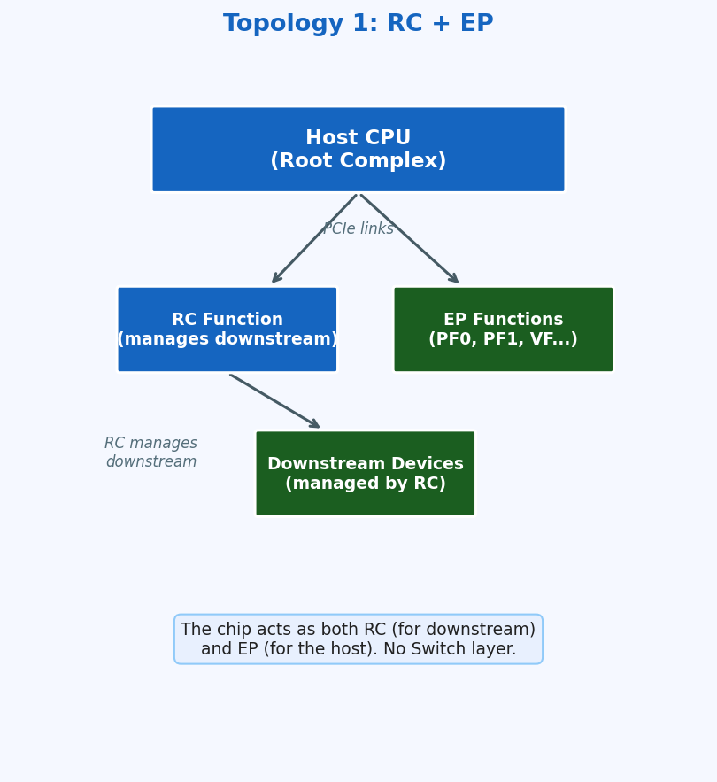
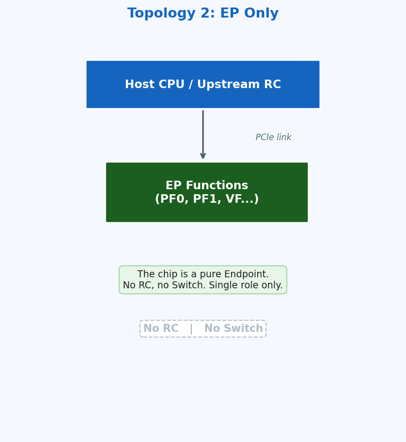
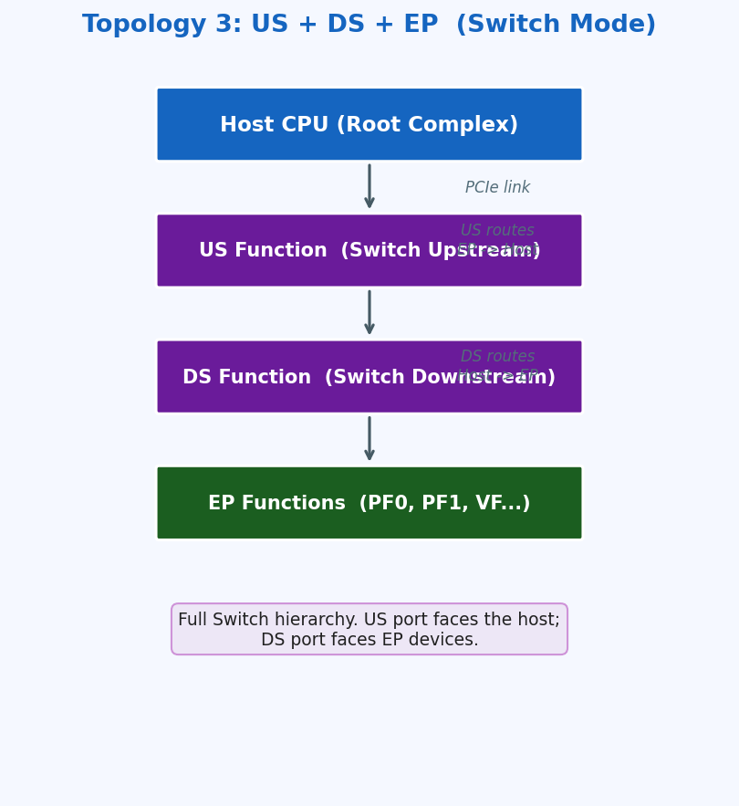
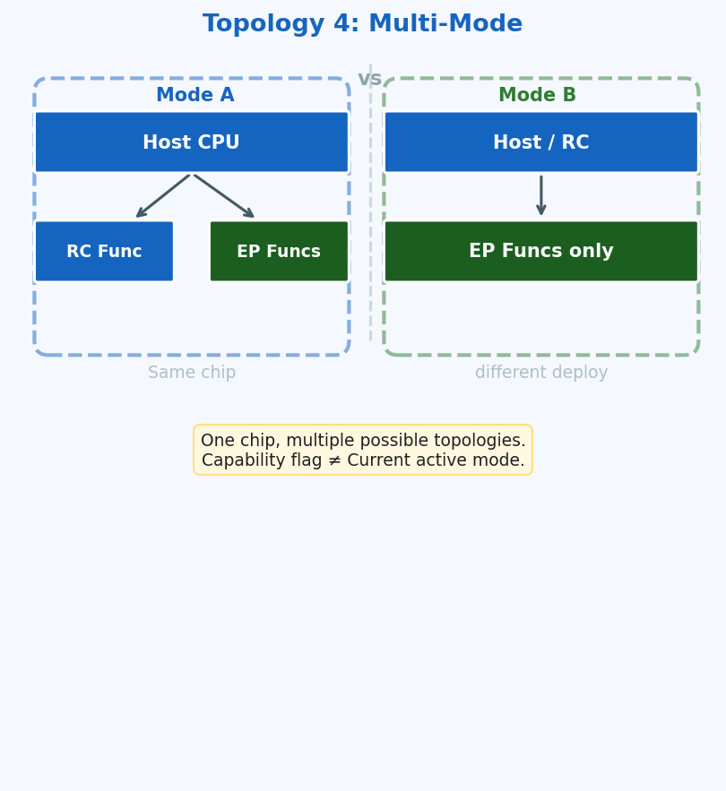

# PCIe 设备拓扑结构详解

## 四种形态、各自的职责与验证关注点

*芯片验证 · PCIe · 设备拓扑*

---

**摘要**：同一颗芯片在不同的系统部署场景下，其 PCIe 拓扑结构可能完全不同。有的场景里芯片只充当终端设备，有的场景里它还要扮演交换节点，有的场景里它甚至同时承担主控和设备两个角色。拓扑形态决定了事务如何路由、哪些功能单元存在、验证需要覆盖哪些路径。本文系统梳理四种典型拓扑，并说明硬件能力声明与运行时状态之间的本质区别。

---

## 一、RC+EP 拓扑

这是集成设计的典型形态。芯片在同一块硅上同时承担两个角色：一方面以 Endpoint 身份向上游主机暴露功能，另一方面又具备 Root Complex 能力，负责管理挂在它下游的其他 PCIe 设备。

从主机的角度看，它只看到一个普通的 Endpoint 设备。从芯片内部看，RC 侧负责枚举和管理下游设备的地址空间、中断、链路状态；EP 侧响应来自上游主机的读写请求，暴露功能寄存器和 BAR 空间。

两个方向的事务互不干扰是这种拓扑的核心验证挑战。来自主机的请求应该进入 EP 功能处理，不能误走到 RC 侧；RC 发出的对下游设备的管理请求，不能反向漏到主机方向。

**验证关注点**：EP 配置空间完整性、RC 下游枚举流程、双向事务路由的隔离性、RC 和 EP 两套中断路径各自独立。

---

## 二、EP Only 拓扑

最简洁的形态。芯片只有 Endpoint 功能，不具备 Root Complex 能力，也没有任何 Switch 层级。它是一个纯粹的终端节点，只负责响应上游发来的请求。

这种形态常见于纯计算加速器的部署场景：芯片插入服务器，上游 RC 负责枚举，芯片只需要正确暴露配置空间、BAR、中断向量，处理好来自主机的读写和 DMA 请求即可。

与 RC+EP 拓扑相比，两者在 Strap 配置上可能看起来相似，但 RC 能力是否使能决定了本质区别。判断当前是否为纯 EP 模式，需要查询运行时的拓扑状态，而不能只看硬件能力标志位。

**验证关注点**：EP 功能完整覆盖（BAR、配置空间、MSI/MSI-X）、SR-IOV 或 MF-IOV 行为、各类错误响应（UR、CA、复杂度超时）、DMA 读写的正确性。

---

## 三、US+DS+EP 拓扑（Switch 模式）

独立 GPU 卡的典型形态。芯片内部有完整的 PCIe Switch 结构，包含一个上游口（US）、一个或多个下游口（DS），以及实际工作的 EP 功能单元。

上游口面向主机，负责将来自主机的事务分发到正确的 EP，同时将 EP 返回的响应汇聚后转发给主机。下游口面向 EP，维护一段地址窗口（BASE/LIMIT），凡是目的地址落在窗口内的事务都被路由到对应的 EP。

这种三层结构使得主机在逻辑上感知不到 Switch 的存在——它只看到若干个 EP Function，而 Switch 的路由工作完全在芯片内部完成。

事务的完整路径是：主机发出请求，US 口接收并根据地址范围判断路由目标，DS 口将请求转发给 EP，EP 处理后返回响应，响应再沿原路通过 DS 和 US 回到主机。任何一个环节的地址窗口配置错误都会导致事务丢失或路由错误。

**验证关注点**：US 和 DS 地址窗口（BASE/LIMIT）的正确性、Switch 事务转发的完整性、ACS（访问控制服务）配置、DS 口的链路管理、多个 EP 并发访问时的仲裁行为、US 和 EP 两套中断路径。

---

## 四、多模式拓扑

同一颗芯片根据系统部署场景的不同，可以工作在不同的拓扑模式下。例如在集成系统中以 RC+EP 模式运行，在服务器加速器场景中切换为纯 EP 模式。

这里有一个容易混淆的概念边界：**芯片支持多模式** 和 **当前工作在哪种模式** 是两回事。

硬件能力标志说的是"这颗芯片设计上支持哪些拓扑形态"，它在所有部署场景下都是固定的，由 Strap 在上电时决定。运行时拓扑状态说的是"当前这次启动，芯片实际工作在哪种拓扑下"，它随部署场景变化。

一个常见的错误是：看到某个能力标志为真，就认为当前就工作在对应的模式下。对于多模式项目，能力标志为真只说明这种模式存在，不代表当前已激活。判断当前拓扑形态，必须查询运行时状态——有没有 RC、有没有 Switch 上游口、是不是纯 EP——而不是直接读能力标志。

这个区分在验证代码的接口设计上尤为重要。负责判断"当前拓扑是什么"的接口，应该读取运行时状态；负责判断"这个项目能跑什么"的接口，才应该读取项目能力声明。把两类接口混用，就会在多模式项目的某些配置下得到错误的判断结果。

**验证关注点**：每种激活模式分别完整覆盖、模式切换边界的寄存器状态、不同模式下的复位值差异、能力标志和运行时状态的一致性检查。

---

## 五、能力声明与运行时状态

把上面四种拓扑放在一起，可以看到两类信息的本质区别：

**能力声明**是芯片在硅设计层面固化的属性，说明该芯片在物理上支持哪些拓扑形态。它在任何上电配置下都不变，由 Strap 或特性文件记录。

**运行时状态**是当前这次上电后实际激活的拓扑形态。对于单模式项目，它与能力声明一致；对于多模式项目，它只是能力声明的一个子集，取决于当次启动的配置。

验证代码在编写拓扑判断逻辑时，必须先明确这段逻辑关心的是哪一层：如果关心的是"当前跑的是什么"，就应该查询运行时状态；如果关心的是"这个项目理论上能跑什么"，才应该查询能力声明。将两者混用，是多模式项目验证中最常见的隐患来源之一。

---

## 六、总结

四种拓扑各有分工：

RC+EP 是集成设计的折中，一个芯片承担两个方向的连接职责。EP Only 是最简单的终端形态，角色单一，验证边界清晰。Switch 模式在主机和 EP 之间插入了路由层，三层结构的地址窗口配置是核心验证点。多模式让一颗芯片在不同场景下呈现不同的面貌，但能力声明和运行时状态的分离是理解和验证这类芯片的关键前提。
