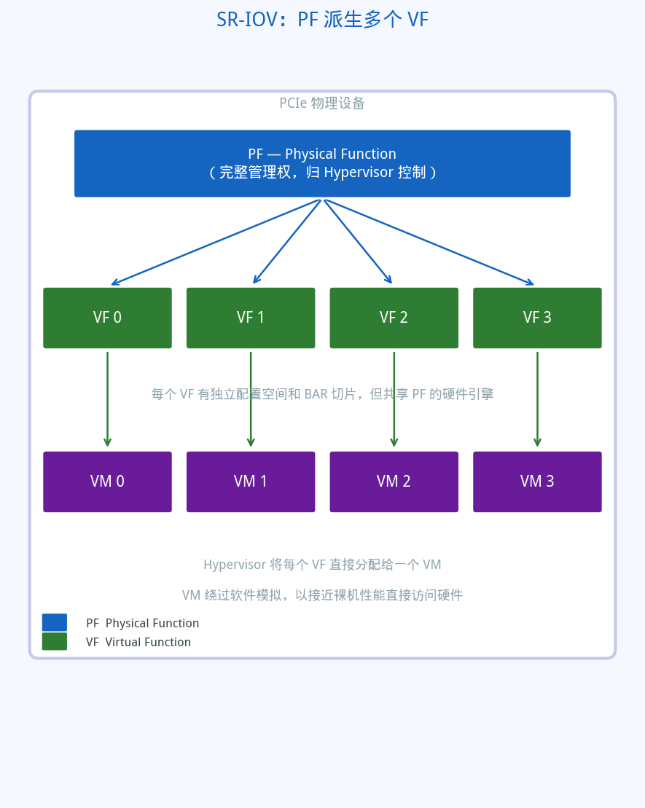
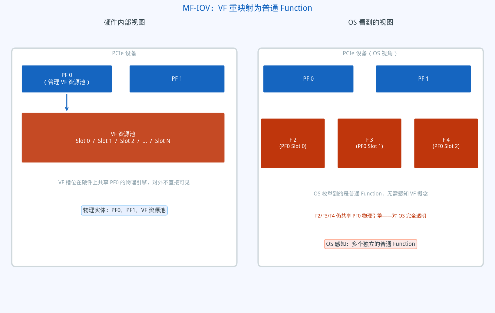
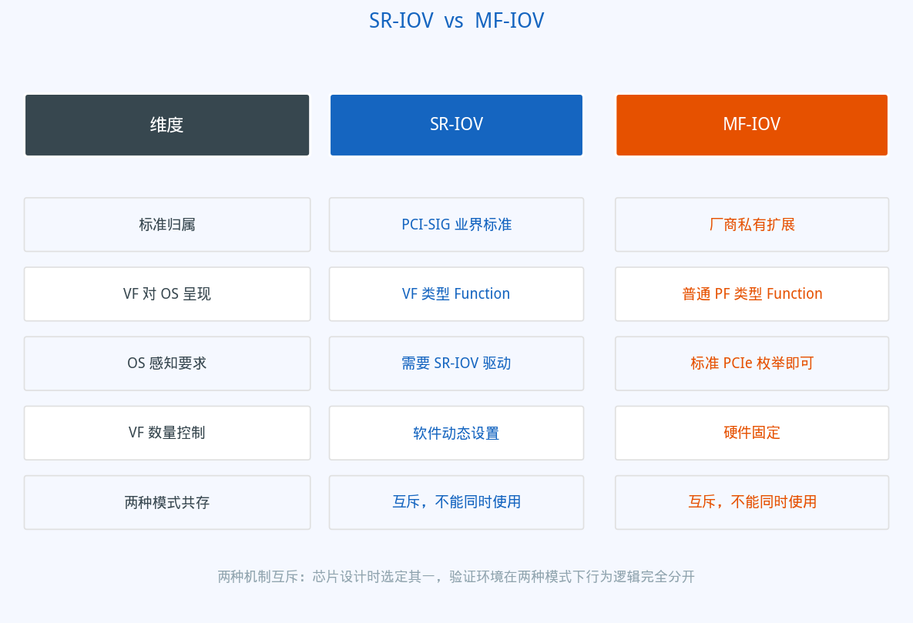

# PCIe Function 层级详解

## PF 与 VF 的关系、SR-IOV 与 MF-IOV 的异同

*芯片验证 · PCIe · 虚拟化*

---

今天被同事问到一个问题：为什么 PCIe 里会有 VF，PF 和 VF 究竟是什么关系？我愣了一下，发现自己虽然天天和这些概念打交道，却没办法从头到尾讲清楚。于是去翻了翻资料，整理成这篇文章。

---

> **前置概念速查**
>
> - **PCIe EP**（Endpoint）：挂在 PCIe 链路末端的设备，如 GPU、网卡、NVMe 控制器
> - **BDF**：Bus:Device:Function，PCIe 的三级寻址，唯一标识总线上的一个 Function
> - **Config Space**：每个 Function 独立拥有的配置空间，软件通过 BDF 访问
> - **Hypervisor / VM**：虚拟化场景下的宿主软件与虚拟机

---

**读完本文，你将理解**：

- PCIe 里 Function 是什么，为什么它是软件交互的最小粒度
- PF 和 VF 各自的职责，以及它们之间的从属关系
- SR-IOV 的标准工作流程
- MF-IOV 与 SR-IOV 的核心区别：重映射 vs 原生 VF
- 验证工程师在这套层级中需要关注什么

---

**摘要**：在 PCIe 设备虚拟化领域，PF 和 VF 是绕不开的两个概念。PF 是真实存在于硬件上的功能单元，而 VF 是由 PF 派生出的轻量级虚拟功能——它有独立的配置空间和 BAR，但共享 PF 的物理资源。实现这一派生关系的机制有两种：业界标准的 SR-IOV，以及更激进的 MF-IOV。理解它们的设计逻辑，是理解现代多功能 PCIe 设备行为的基础。

---

## 零、起源：为什么需要 PF 和 VF

故事要从服务器虚拟化说起。

2000 年代中期，VMware、Xen 等 Hypervisor 开始流行，一台物理服务器可以跑几十个虚拟机。CPU 和内存的虚拟化问题很快被解决了，但 I/O 设备——尤其是网卡——成了新的瓶颈。

**最早的做法是软件模拟**：Hypervisor 拦截虚拟机的每一次网卡读写，用软件模拟硬件行为，再转发给真实网卡。这能跑，但性能极差——每次数据包都要经过 Hypervisor 的多次上下文切换，吞吐量只有裸机的几分之一。

**第二种尝试是 Pass-through（直通）**：把整块物理网卡直接分配给某一个虚拟机，绕过 Hypervisor，性能接近裸机。但问题随之而来——一块网卡只能给一个 VM，其他 VM 怎么办？买更多网卡？机箱里的 PCIe 插槽有限，成本也高。

**真正的问题变成了**：能不能让一块物理网卡同时被多个虚拟机以接近裸机的性能独占访问，同时彼此完全隔离、互不干扰？

这个问题在 2007 年前后推动 PCI-SIG 制定了 SR-IOV 规范，给出了答案：**在硬件层面把一块物理设备切成多个独立的逻辑功能单元**，每个 VM 拿到一个，直接访问，不经过软件模拟。

于是就有了两种角色：

- **PF（Physical Function）**：那块完整的硬件，负责管理和资源分配，归 Hypervisor 控制
- **VF（Virtual Function）**：从 PF 切出来的轻量级切片，每个 VM 独占一个，有完整的数据面访问能力，但无法越权管理设备

这不是凭空设计出来的抽象，而是数据中心实际痛点倒逼出来的工程解答。理解了这个背景，PF 和 VF 的设计取舍就很自然了。

---

## 一、从一个设备说起：Function 是什么

PCIe 用 **BDF（Bus:Device:Function）** 三元组唯一标识总线上的一个逻辑单元。Function 是软件实际交互的最小粒度——每个 Function 有独立的配置空间、BAR（Base Address Register）、中断向量，以及独立的读写权限控制。

一个物理 PCIe 设备可以暴露多个 Function，操作系统看到的是这些 Function，而不是"物理卡"本身。这种抽象让一张物理网卡可以同时被多个虚拟机独占使用。软件通过 BDF 寻址，感知不到"它们其实共用一块硅"。

---

## 二、PF（Physical Function）

PF 是设备上真正具备完整硬件资源的功能单元，是一切虚拟化的起点。

PF 拥有完整的配置空间，包含 SR-IOV Extended Capability，通过写寄存器控制 VF 的创建数量和使能状态。PF 负责设备的初始化、资源分配、驱动加载和复位控制。驱动运行在 Host 或 Hypervisor 层，对整个设备有完整控制权。

PF 通过 SR-IOV Capability 中的几个字段来管理 VF：一个使能开关控制 VF 是否对外可见，一个数量字段设置当前实际创建的 VF 数量（不超过硬件上限），一个首 VF 偏移量记录第一个 VF 相对于 PF 的路由 ID 偏移，一个步长记录相邻 VF 之间的路由 ID 间距，还有一个内存访问使能位控制该 Function 的 BAR 空间是否允许被访问。这些字段共同构成了 Hypervisor 控制 VF 生命周期的完整接口。

---

## 三、VF（Virtual Function）

VF 是由 PF 派生出的轻量级功能单元。它有独立的配置空间和 BAR，但**不拥有独立的物理资源**——所有 VF 共享同一 PF 的硬件引擎，只是在寻址和权限上被隔离开来。

VF 的本质是资源隔离，而非资源复制。VF 的配置空间极简，只包含必要的 Capabilities。VF 的 BAR 是 PF BAR 空间的一个分片，每个 VF 拿到固定大小的切片，互相不重叠。这种设计让一块物理 GPU 的 framebuffer 可以被切成多份，分别映射给不同的虚拟机。

VF 没有独立的 Device Number，它的 Routing ID 由 PF 的路由信息加上偏移量计算得来。PF 的配置空间中记录了首 VF 偏移和步长两个值：第一个 VF 的 Routing ID 等于 PF 的 Routing ID 加上首 VF 偏移，后续每个 VF 在前一个基础上再加一个步长。在 ARI 模式下，Function Number 扩展为 8 位，可容纳更多 VF。

VF 的可见性受两个条件联合控制：PF 的 SR-IOV 使能位已置起，且该 VF 的序号在当前配置的 VF 数量范围之内。驱动可以通过调整数量字段来动态扩缩可见的 VF 数目，无需改变硬件配置。

---

## 四、SR-IOV：标准的单根虚拟化

SR-IOV（Single Root I/O Virtualization）是 PCI-SIG 定义的标准规范，允许一个 PCIe 设备的单个 PF 派生出多个 VF，每个 VF 可以独立分配给一个虚拟机。

VF 有独立的配置空间和 BAR 切片，PF 保留完整管理权，VF 只有数据面访问权。Hypervisor 将每个 VF 的 Routing ID 分配给指定 VM，VM 通过 VF 直接访问硬件，完全绕过软件模拟层。

SR-IOV 的工作流程分四步：首先 OS/Hypervisor 发现 PF，读取 SR-IOV Extended Capability 获知 VF 的数量上限和 BAR 布局；然后为所有 VF 的 BAR 空间分配物理内存地址；接着配置 VF 数量字段并置起使能位，VF 开始对外可见；最后将每个 VF 分配给指定 VM，VM 通过 VF 独占访问硬件。

SR-IOV 标准要求 VF 的数量和 BAR 大小在硬件设计时就固定，不能动态改变。这也是 Resize BAR 等机制存在的原因——在固定框架内提供有限的灵活性。

---

## 五、MF-IOV：重映射的虚拟功能

MF-IOV（Multi-Function I/O Virtualization）是一种不同的虚拟化路径。它的核心思想是：**不把 VF 暴露为 VF，而是把它们重映射（remap）为普通的 PCIe Function**，让 OS 看起来像是有多个独立的 PF。

SR-IOV 的 VF 需要操作系统/Hypervisor 有 SR-IOV 感知能力。MF-IOV 把 VF 重新包装成普通 Function，操作系统用标准 PCIe 枚举流程就能发现它们，无需额外的 SR-IOV 驱动支持。

硬件内部，设备有若干 PF 和一个 VF 资源池，每个 VF 槽位在物理上仍共享 PF 的引擎。OS 看到的视图里，这些 VF 槽位被重映射成了普通 Function，枚举流程和访问方式与普通 PF 完全一样。硬件内部需要额外的地址翻译层，将这些重映射 Function 的访问路由到正确的 VF 资源。

MF-IOV 模式下，标准 SR-IOV VF 的数量为 0，两种机制不共存。重映射 Function 有独立的 BAR 和配置空间，但物理资源仍来自原 PF 的资源池。BAR 大小调整的控制路径与 SR-IOV VF 共用同一套机制。

每个重映射 Function 都携带两个关键信息：它逻辑上归属于哪个 PF 的资源池，以及它占用的是资源池中的第几个槽位。这两个信息在 MF-IOV 模式的地址路由和资源管理中至关重要。

---

## 六、SR-IOV 与 MF-IOV 的本质区别

两者的根本分歧在于 VF 如何对外呈现。SR-IOV 选择把 VF 如实暴露给 OS，代价是需要 OS 有感知能力；MF-IOV 选择把 VF 包装成普通 Function，代价是硬件需要额外的地址翻译逻辑。两种机制互斥，芯片设计时选定其一，整个验证环境在两种模式下的行为逻辑完全分开。

---

## 七、验证视角：关注什么

**Function 的正确性**：每个 Function 的 BDF 是否唯一，Config Space 是否按规格正确初始化，BAR 空间是否与地址分配一致，内存访问使能状态是否符合预期。

**VF 的可见性边界**：VF 的可见性由使能位和数量字段联合控制。需要验证边界条件——刚好可见的最后一个 VF、使能位清零后 VF 消失、数量字段变化后的即时响应。

**Routing ID 的正确性**：VF 的 Routing ID 由首偏移和步长计算得来，需要验证每个 VF 的 BDF 与计算结果一致，ARI 模式和非 ARI 模式下的计算路径分别正确。

**SR-IOV 与 MF-IOV 的模式路径**：两种模式互斥，需要分别在两种配置下跑完各自的功能路径。进入 MF-IOV 模式后标准 VF 数量确实为 0，重映射 Function 的归属关系与配置一致。

**BAR 空间分配**：PF 的 BAR、VF 的 BAR 切片、重映射 Function 的 BAR 之间不能有重叠，Resize BAR 操作后地址空间重新布局仍然正确。

---

## 八、总结

**PF 是根，VF 是叶。** PF 持有完整的管理权限和物理资源，VF 是由 PF 派生的隔离视图。没有 PF 就没有 VF——PF 控制 VF 的生命周期、数量和可见性。

**SR-IOV 是标准路径。** VF 以 VF 身份暴露给 OS，需要 SR-IOV 感知的软件栈。VF 的 Routing ID 由 PF 加上偏移和步长计算，由使能位与数量字段联合控制可见性。

**MF-IOV 是重映射路径。** VF 被重映射为普通 PCIe Function，对 OS 完全透明。两种模式互斥，整个验证环境在两种配置下的行为逻辑完全分开。

**验证的核心**：BDF 唯一性、可见性边界、Routing ID 计算正确性、两种虚拟化模式互斥且各自路径完整，以及 BAR 空间布局无重叠。
