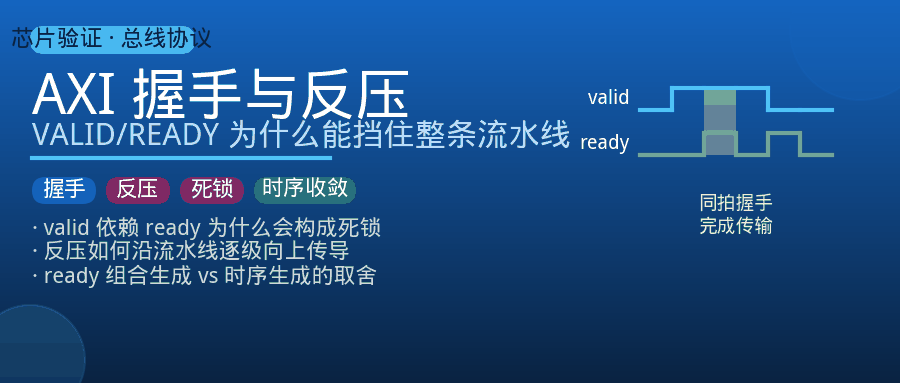
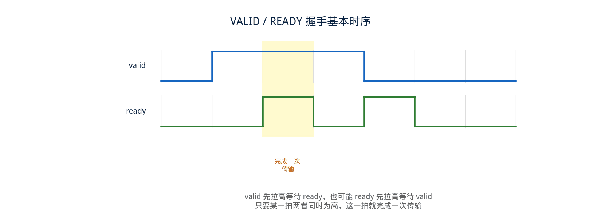
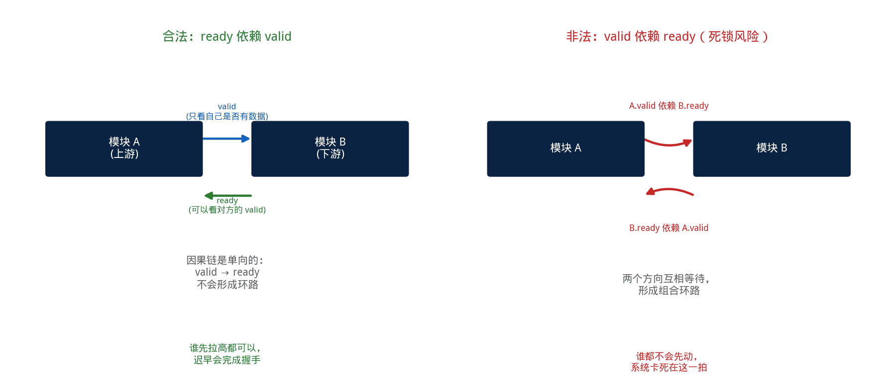
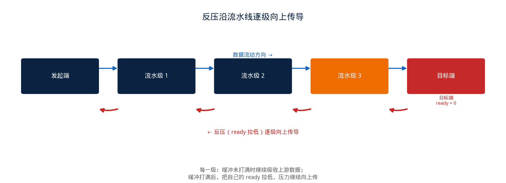
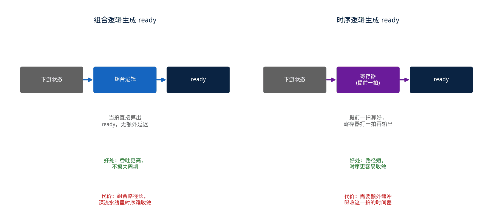

## [AXI] 握手与反压：一个 VALID/READY 信号，为什么能挡住整条流水线



---

### 导读

调试一次总线卡死的问题，最后定位到的原因出乎意料地简单：某一级的 `ready` 信号，被写成了依赖对方 `valid` 的组合逻辑，两级模块互相等对方先发信号，谁都不肯先动。

现象是流水线彻底停摆，波形上看起来像是"卡住了"；本质其实是一条握手规则被打破了。这篇文章想把 AXI 握手机制这条规则讲透——不只是讲"是什么"，更想讲清楚"为什么必须这样"，以及反压这个现象到底是怎么一级一级传导开的。

---

### 一、握手的基本规则：两个独立方向的信号



AXI 的每一个通道（写地址、写数据、写响应、读地址、读数据）都用一对信号完成握手：`valid` 由发送方驱动，表示"这一拍我这里有合法数据"；`ready` 由接收方驱动，表示"这一拍我能收"。传输真正发生的时刻，是两个信号同一时钟沿都为高的那一拍。

这套机制最关键的设计是：**`valid` 和 `ready` 是两个完全独立的信号，谁都不需要等对方先出现才能拉高**。发送方可以先拉高 `valid` 等接收方，接收方也可以先拉高 `ready` 等发送方，谁先谁后不影响握手的正确性——只要两者在某一拍同时为高，这一拍就算完成一次传输。

---

### 二、一条不能违反的规则：VALID 不能等 READY



规则听起来简单，但真正决定整个系统会不会死锁的，是下面这条约束：**`valid` 一旦拉高，就不允许因为对方还没拉高 `ready` 而被撤回或者延迟；`ready` 则允许依赖对方当前的 `valid`**。反过来是被禁止的——`valid` 绝不能被写成依赖对方 `ready` 的逻辑。

为什么方向不能反过来？设想一下两个模块 A 和 B 互相连接，如果 A 的 `valid` 要等 B 的 `ready` 先出现，同时 B 的 `ready` 又要等 A 的 `valid` 先出现，两边都在等对方先动，谁都不会先动，系统永远停在那一拍——这就是一个用组合逻辑兜出来的死锁圈。

用伪代码把这条错误的写法和正确的写法对比一下：

```
// 错误：valid 依赖对方的 ready，构成组合环路风险
assign upstream_valid = has_data && downstream_ready;

// 正确：valid 只依赖自己是否真的有数据要发
assign upstream_valid = has_data;

// ready 依赖对方当前的 valid，这个方向是被允许的
assign downstream_ready = can_accept && upstream_valid;
```

正确写法里，`upstream_valid` 完全不看对方的 `ready`，它只表达"我这里确实有数据"这一个事实；`downstream_ready` 可以放心地看对方的 `valid`，因为这个方向的依赖不会形成环路。这条规则不是编码风格上的偏好，而是避免组合逻辑死锁的硬性要求。

---

### 三、反压是怎么一级一级传导的



理解了握手规则，"反压"这个现象就很容易解释：当流水线最末端某一级因为某种原因暂时不能收数据，它把自己的 `ready` 拉低；上一级发现下游 `ready` 为低，即使自己想发，也无法完成握手，数据只能滞留在当前这一级；如果当前级本身有缓冲能力，它会继续接受上游的数据直到缓冲打满，缓冲一旦打满，它自己的 `ready` 也会被拉低，把"收不下"这个状态继续往上一级传导。

这个过程逐级发生，最终从流水线末端一路传导回最开始发起请求的那一级——**反压的传导方向，永远和数据流动的方向相反**。这也是为什么排查"上游突然发不出数据"这类问题时，第一反应不该是看上游本身的逻辑，而是应该顺着数据流向下游追，找到那个第一次把 `ready` 拉低的源头。

用伪代码描述带缓冲的一级如何把反压状态往上传：

```
// 本级缓冲未满时，可以继续接收上游数据
assign my_ready = !buffer_full;

// 本级向下游发送时，valid 只取决于缓冲里是否有数据
assign my_valid_to_downstream = !buffer_empty;

// 缓冲打满，本级的 ready 被拉低，反压继续向上传导
// buffer_full 由本级出队速度跟不上入队速度导致
```

---

### 四、READY 的两种生成方式：组合逻辑与时序逻辑的取舍



`ready` 可以用组合逻辑生成（当拍根据当前状态直接算出来），也可以用时序逻辑生成（提前一拍算好，寄存器打一拍再输出）。这不是随便选一种就行，两种方式各自有明确的代价。

组合逻辑生成的 `ready` 能够对下游状态做出当拍响应，理论上能拿到更高的吞吐——不会因为多打一拍寄存器而白白损失一个可以传输的周期。但代价是这条组合路径通常会拉得很长：从下游的状态一路反向组合到上游的 `ready`，如果模块之间层级深、扇出大，时序收敛会很吃力，深度流水线里这种"反向组合链"往往是时序报告里出现的关键违例路径。

时序逻辑生成的 `ready` 把这条组合链切断，用寄存器提前一拍算好下一拍的 `ready` 值，时序上更容易收敛，但代价是必须提前预留出这一拍的缓冲空间——用于容纳"我已经告诉上游可以发，但其实要再等一拍才能真正处理"这段时间差里可能进来的数据，否则会丢数据或者不得不在其后再插入一次反压。

```
// 组合方式：路径短则快，路径长则难收敛
assign ready_comb = downstream_can_accept;

// 时序方式：提前一拍算好，需要额外缓冲吸收时间差
always_ff @(posedge clk)
    ready_reg <= downstream_can_accept_next_cycle;
```

两种方式的选择，本质上是在"吞吐/延迟"和"时序收敛难度/缓冲开销"之间做取舍，没有绝对更优的一方，取决于具体的流水线深度和目标频率。

---

### 五、验证中值得关注的几个维度

**握手方向性的静态检查**：确认 `valid` 的产生逻辑里，不存在对同方向 `ready` 的组合依赖，这条规则理论上可以通过工具做静态扫描，但跨模块的间接依赖（`valid` 依赖某个中间信号，而这个中间信号又间接依赖了 `ready`）容易漏过工具检查，需要人工重点复核。

**反压传导链的完整性**：构造下游持续拉低 `ready` 的场景，确认反压能够正确地逐级向上传导，而不是在某一级被"吞掉"——如果某一级在下游不能收的情况下依然错误地把数据发了出去，或者错误地把自己的 `ready` 保持为高，都会导致数据丢失或者覆盖。

**极限拉满与极限打空的边界**：分别构造下游 `ready` 常年为低（反压拉满）、上游 `valid` 长期为低（数据源枯竭）两种极端场景，确认流水线在这两种边界条件下既不会死锁，也不会丢数据。

**缓冲深度与反压时机的匹配**：如果某一级用时序逻辑提前生成 `ready`，需要确认这一级预留的缓冲深度，足够吸收"提前放行"到"下游真正处理"之间这段时间差里可能到达的数据量，缓冲不够会导致偶发丢数据，这类问题往往只在特定背靠背时序下才会触发，属于比较隐蔽的一类 corner case。

**握手信号的稳定性**：`valid` 一旦拉高，在被接收（对应拍 `ready` 也为高）之前，数据内容和 `valid` 本身都不允许发生变化——验证时需要覆盖"`valid` 拉高但 `ready` 一直不来，中途尝试改变数据"这类违规场景，确认设计没有依赖这种不稳定的行为。

---

### 六、总结

AXI 握手机制表面上只是两个信号的简单配合，但背后压着一条不能违反的因果律：**`valid` 只能由"我有数据"决定，`ready` 才可以由"对方有数据"决定，这个方向反过来就会构成死锁**。反压现象是这条规则在系统层面的自然延伸——下游收不下，逐级向上传导，直到追溯到最初发起请求的那一端。

`ready` 用组合逻辑还是时序逻辑生成，是吞吐和时序收敛之间的工程取舍，没有标准答案。理解了这几层因果关系，遇到流水线卡死、数据丢失、时序收敛困难这几类看似不相关的问题时，往往能更快判断问题出在哪一层——是握手方向写反了，是反压没有正确传导，还是提前生成的 `ready` 和实际缓冲深度没对上。

---

*本文基于 AMBA AXI 协议规范中握手机制相关章节，结合流水线设计与验证实践整理。*
