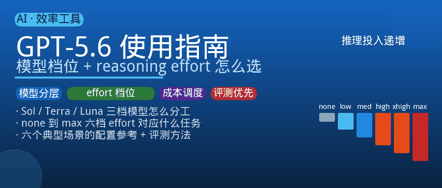
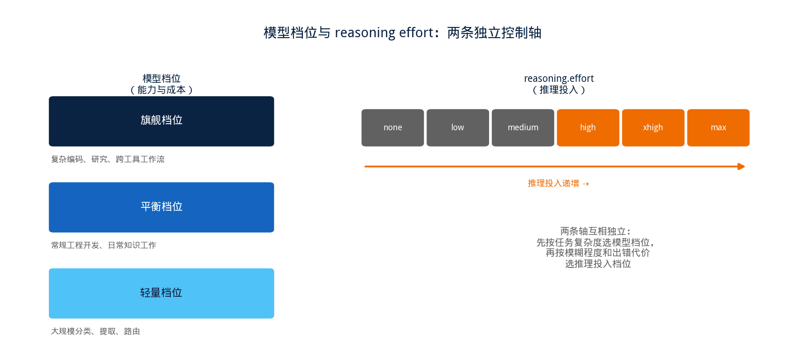
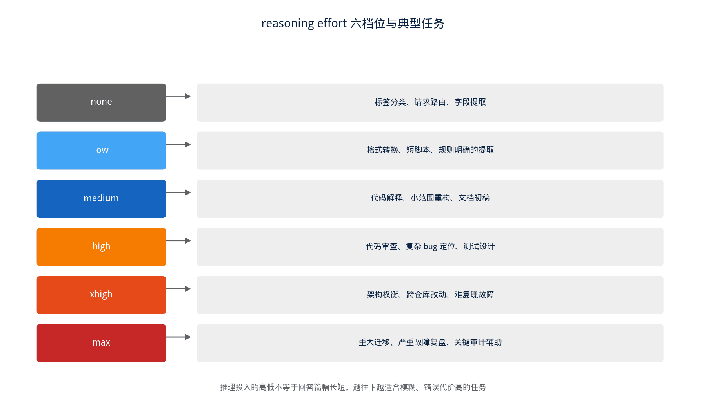
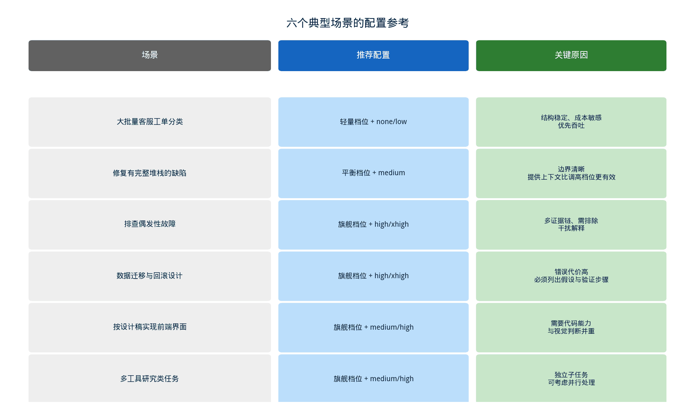

## [AI] GPT-5.6 怎么用：从"选模型"到"按任务分层调度"

---

### 导读

前几天调试一个智能体流程，发现同一套 prompt 换个模型档位，效果和花费差了一大截，才意识到自己一直在犯一个挺常见的错——不管任务难易，习惯性地把所有请求都开到最高档。

翻了翻官方资料才发现，GPT-5.6 真正想解决的问题，不是"哪个模型更聪明"，而是提供了一套更细的工程调度能力：用不同档位的模型匹配任务复杂度，用推理投入档位匹配任务的模糊程度和出错代价。这篇文章把这套调度逻辑整理清楚，最后给几个具体场景做参考。

这里核心的一条原则是：**选择刚好能稳定达到质量目标的最低成本配置，而不是默认把所有请求都开到最高档**。

---

### 一、两条独立的选择轴：模型档位与推理投入

GPT-5.6 提供三档模型，分别对应不同的能力和成本定位。

旗舰档位面向复杂编码、研究、跨工具工作流这类高难度任务；平衡档位承担常规工程开发和日常知识工作；轻量档位专注大规模分类、提取、路由这类简单子任务。三档的输入输出单价差异明显，旗舰档位的成本是轻量档位的好几倍，所以模型选择本身首先是一个业务调度问题，不应该把所有请求都交给最贵的那一档。

`reasoning.effort` 是另一条完全独立的控制轴，作用在同一个模型上。它不是"回答字数"开关，也不是"正确率保证"——低档位优先考虑速度和更少的 token 消耗，高档位允许模型花更多计算做规划、比较、检查和验证。这两条轴要分开理解：先按任务复杂度选模型档位，再按任务的模糊程度和出错代价选推理投入档位。

---

### 二、为什么"端到端工作流"比"单点问答"更能体现模型价值

复杂工程任务通常不是一问一答就能解决的，而是包含读取上下文、收集证据、建立并检验假设、调用工具修改代码、验证结果、交付可执行结论这一整条链路。

举个例子做对比：解释一条异常堆栈，通常是局部问答，模型给出解释就结束了；但如果要求"分析过去若干次持续集成失败的日志，定位一个偶发问题，改代码并补回归测试"，这就是一条完整的工作流——要求模型处理多条证据链，排除掉不成立的解释，并且把结论落到真正可执行的工程动作上。

模型在后一类任务上的价值差异会体现得更明显，这也是为什么"任务分层"比"无脑上最高配置"更值得投入精力去做。

---

### 三、reasoning effort 的六个档位，分别对应什么样的任务

推理投入从低到高大致是这样一条链路：最低档位面向几乎不需要推理的任务，比如标签分类、请求路由、字段提取，这类任务边界非常清晰，模型不需要做多步骨架推理；中间档位面向常规工程任务的起点，比如代码解释、小范围重构、文档初稿；越往上走，越适合多步骤、需要审查、存在歧义、或者错误代价很高的任务，比如复杂 bug 定位、跨仓库改动、重大迁移方案设计。

一个容易被忽略的事实是：**推理投入的高低，不等同于回答篇幅的长短**。

对比两个任务能看得很清楚——把几百条客服工单按固定格式分类输出，真正需要的是结构稳定、成本低、吞吐高，低档位通常比最高档位更合适；反过来，分析一个偶发的系统故障，即便最终结论只有几百字，也可能需要相当高的推理投入去完成证据串联、排除干扰因素、评估风险，这个过程发生在"回答之前"，不会直接体现在字数上。

---

### 四、最高档位不是免费的保险栓

推理投入拉到最高，能增加的是模型做规划、检查、验证的机会，但它弥补不了两类根本性的缺口。

一是缺失的事实和数据本身——如果输入信息不完整或者引用的资料本身不可靠，再高的推理投入也只是在不完整的信息基础上做更精细的猜测；二是需要外部权限和验证的高风险操作——这类场景仍然需要人工审批、独立验证这些机制兜底，模型的方案不能替代真实环境里的评审和演练。

把"回答变长"当成"推理质量变高"的信号，也是一个容易踩的误区。更可靠的信号是模型有没有明确给出证据、有没有主动标注哪些地方还不确定、有没有提出可以真正拿去验证的具体步骤——这些和篇幅长短没有必然关系。

---

### 五、几个典型场景的配置参考

处理大批量、规则明确的分类提取任务（比如给客服工单打标签），优先用轻量档位模型配合最低的推理投入，先用一批有代表性的样本验证够不够用，出现稳定的复杂误判之后再逐步上调，而不是一开始就假设需要更贵的配置。

修复一个已经有完整堆栈和现有测试作参考的后端缺陷，属于边界比较清晰的场景，平衡档位模型配合中等推理投入往往就够用；把完整的堆栈、相关函数、期望行为和已有测试提供给模型，比直接拉满推理投入更能提升结果质量。

排查一个偶发性问题（比如持续集成流程里时好时坏的失败），本质上是"提出假设、收集证据、排除干扰解释、设计验证方案"这样一条链路，证据越分散、越容易相互矛盾，就越需要更高的推理投入去把这些线索完整地串起来。

涉及数据结构迁移、需要保证不停机和可回滚这类错误代价很高的场景，配置上要往高档位走，而且最终方案里必须显式列出假设、可能的失败模式和验证步骤——模型给出的方案依然不能替代真实的预发布演练和人工评审。

根据设计稿和需求实现一个带交互状态的前端界面，需要模型同时具备代码实现能力和视觉判断能力，这类任务比较适合把推理投入设在中等到较高的区间。

涉及多个独立工具调用的研究类任务（比如检索资料、调用统计接口、整理历史问题、生成带证据的报告），如果每一步调用顺序相对固定，可以考虑用编程方式驱动工具调用；如果任务能明确拆成几个互相独立的子部分，也可以考虑把子任务分发给多个代理并行处理，但如果各部分本身耦合很紧，硬拆开反而会增加协调成本，得不偿失。

---

### 六、一个实用的接口调用起点

对于需要推理能力的工作流，从中等档位起步是一个稳妥的默认选择：

**`client.responses.create(model="gpt-5.6", reasoning={"effort": "medium"}, input="...")`**

比起简单地要求模型"找出问题原因"，更有效的做法是在提示词里明确要求模型把输出拆成几个独立部分，例如结论、支持结论的证据、尚未验证的假设、最小修复建议、需要新增的回归测试。这种结构性的要求，会迫使模型把"已知事实"和"推测"分开表达，降低模型在信息不完整时表现得"看起来很有把握"、但实际上是在拼凑答案的风险。

---

### 七、不要凭感觉调档位，建立一个小型评测集

比起凭直觉调整档位，更可靠的做法是为每个实际业务场景准备几十到上百个有代表性的任务样本，覆盖简单成功案例、信息不足需要主动澄清的案例、容易被误导的异常案例、需要工具调用的案例、以及高风险必须说明不确定性的案例这几类。

在几个中间档位之间做基线对比，只有确认任务真的需要更高投入时，再引入更高的档位。评测过程中值得记录的维度包括：任务是否真的完成了正确可用的结果、人工需要花多少时间去修正或者补充输出、常规请求和长尾请求各自的实际响应体验、每完成一个成功任务所消耗的实际成本、工具调用是否选对了工具并且正确处理了失败情况，以及具体的错误类型（比如凭空编造、遗漏关键信息、格式错误、权限越界）。

最终要找的不是"评分最高的配置"，而是**在满足质量门槛的前提下，总成本最低的那个配置**——这里的总成本不只是模型本身的价格，还包括实际消耗的 token、响应延迟带来的体验损失、工具调用失败的代价，以及人工返工的时间成本，把这些都算进去，才是一个负责任的选型决策。

---

### 八、总结

GPT-5.6 带来的核心变化，是把"选一个模型"这件事，变成了"按任务复杂度和出错代价做分层调度"这件事。模型档位负责匹配任务本身的复杂程度和成本预算，推理投入档位负责匹配任务的模糊程度和一旦出错的代价，工具调用、缓存、多代理这些能力则用来处理更长的工作流程，而最终决定要不要升档或者降档的，应该是基于真实任务的评测结果，而不是凭一次演示里的观感。

简单、边界清晰的任务，较低的推理投入往往已经足够，而且更快、更省；复杂、含糊、需要跨工具协作、出错代价高的任务，较高的推理投入才真正能换来价值。选择刚好够用的配置，而不是默认拉满，这才是这套调度体系真正想传达的东西。

---

*本文基于 OpenAI 官方模型与推理能力相关文档整理，具体价格、档位名称和能力细节以官方最新发布为准。*
