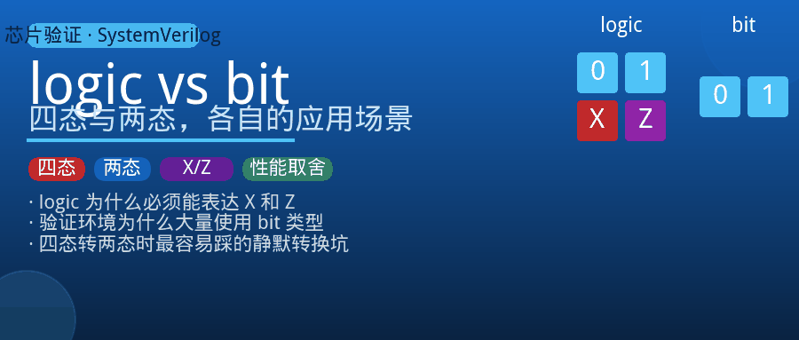
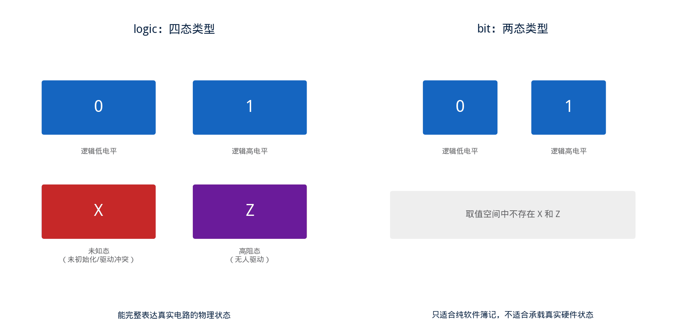
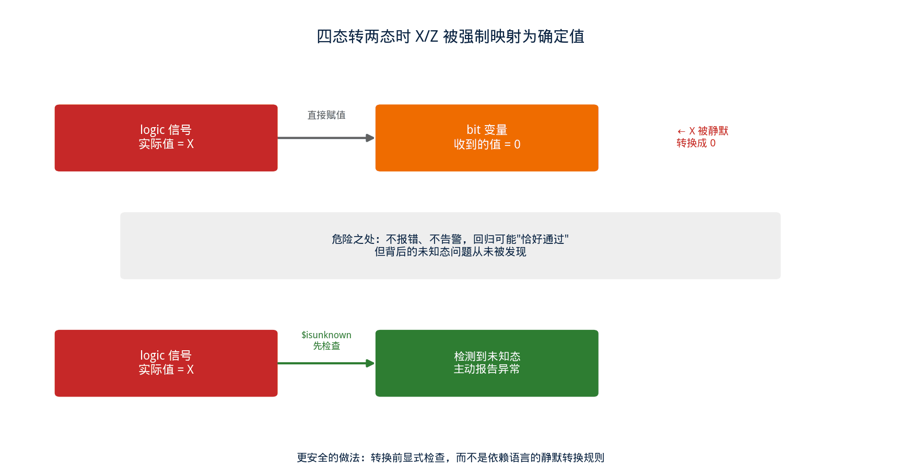

## [SV] logic 与 bit：四态与两态，各自在验证世界里的应用场景



---

### 导读

带新人的时候，被问到一个很基础但很少有人认真讲清楚的问题："为什么写 RTL 用 `logic`，写测试代码里的一些变量却看到用 `bit`？两个不都是装 0 和 1 的吗？"

这个问题背后其实是 SystemVerilog 里一个很关键的设计选择：同样是"一位信号"，语言层面提供了两套完全不同的状态模型。选错了类型，轻则波形上看着别扭，重则一个真实的硬件缺陷被悄悄吃掉，回归跑绿了但电路本身是错的。这篇文章把这两种类型的本质区别，以及在验证环境里该怎么选，讲清楚。

---

### 一、两套状态模型：四态和两态



`logic` 是四态类型，每一位可以取四个值：逻辑 0、逻辑 1、未知态 X、高阻态 Z。`bit` 是两态类型，每一位只能取 0 或 1 这两个值，不存在 X 和 Z。

这个差异不是语法糖，而是直接对应了真实数字电路的物理现实。一块芯片上电的瞬间，触发器的初始状态在硬件上确实是不确定的——设计者不知道它会稳定在 0 还是 1，这种"不确定"用 X 来精确建模；一根总线被多个驱动源共享、但当前没有人在驱动它，物理上呈现的是高阻状态，用 Z 来精确建模。两态类型天生没有能力表达这两种物理状态，因为它的取值空间里根本不存在 X 和 Z 这两个符号。

---

### 二、为什么 RTL 设计要用四态类型

RTL 代码几乎清一色使用 `logic`（或者它的老前辈 `reg`/`wire`），原因很直接：**RTL 描述的是要综合成真实电路的逻辑，四态里的 X 和 Z 是电路仿真阶段最重要的两个诊断信号。**

X 最常见的用途是暴露"读到了尚未被写入的存储"或者"多路选择的条件本身就不确定"这类问题。如果一个寄存器在被赋值之前就被下游逻辑读取，四态仿真里这个值会呈现为 X，一旦这个 X 顺着组合逻辑网络扩散开，往往会在多个下游信号上同时出现异常，这是仿真阶段抓不完整初始化、抓非法状态转移最直接的手段。两态类型不具备这个能力——同样的逻辑漏洞，在两态仿真里可能会被"默认成 0"这种行为悄悄掩盖过去，波形看起来一切正常，实际上电路存在设计缺陷。

Z 则专门用来对应真实存在的高阻场景，比如多个驱动源共享同一条总线、通过使能信号轮流驱动的结构。四态类型能让仿真真实还原"当前没有人在驱动这根线"这个物理状态，两态类型做不到，因为它的取值空间里没有"无人驱动"这个概念，只能被迫表达成某个确定的 0 或 1，这本身就是对真实电路行为的失真。

---

### 三、为什么验证代码里大量使用两态类型


验证环境（尤其是各类面向对象的验证类库）里，大量的内部变量、计数器、状态机变量都用 `bit` 声明，而不是 `logic`。这不是偷懒，而是几个实实在在的工程考量叠加的结果。

**性能**是第一个原因。四态类型每一位需要额外的编码空间去表达 X 和 Z 这两种状态，仿真器在存储和运算这些变量时，开销天然比两态类型更大。验证环境里存在大量纯软件性质的簿记变量——事务计数器、随机种子、队列索引、循环变量——这些变量从来不会真正出现 X 或 Z，用四态类型纯粹是浪费仿真性能，尤其是在大规模回归里，这个开销会被成倍放大。

**语义清晰**是第二个原因。当一个变量被声明成两态类型时，等于是在代码层面明确表达"这个变量的取值空间里不会出现未知态或者高阻态"，阅读代码的人可以直接排除掉这种可能性，不需要再去确认"这里会不会因为某种边界条件变成 X"。这对于纯粹的软件逻辑（比如验证环境里的算法、数据结构）是一种有价值的约束。

**与外部工具和语言的互操作性**是第三个原因。两态类型在语义上更接近传统编程语言里的整数类型，在做位运算、算术运算、与外部脚本或者编程语言接口交互的时候，两态类型的行为更容易预测，不需要在每一步都考虑"如果某个操作数是 X，运算结果应该是什么"这类四态语义规则。

---

### 四、logic 在验证环境里具体出现在哪些位置

说验证代码"大量使用两态类型"，并不等于验证环境里就不需要 `logic` 了。恰恰相反，验证环境里有几个关键位置，`logic` 是不可替代的，理解这几个位置，比记住一条抽象原则更有实际意义。

**接口（interface）里直接对接被测设计端口的信号**是第一个位置。这类信号通常用 `input`/`output`/`inout` 声明，很多时候甚至不需要显式写出类型关键字——SystemVerilog 里，端口声明缺省类型时默认就是四态的 `wire`，这本身就是语言在替开发者做出"这里必须能表达未知态"的选择。如果开发者手动把这类端口改成两态类型，等于主动关掉了仿真器观察被测设计异常输出的能力，这是接口设计里一个容易被忽视、却后果不小的细节。

**寄存器模型里用来镜像硬件状态的变量**是第二个位置。验证框架里的寄存器抽象层，本质上是在软件里维护一份"硬件当前值是什么"的镜像，这份镜像的可信度取决于它能不能如实反映硬件侧的真实状态——包括硬件还没被驱动到确定值、或者出现读写冲突这些异常场景。如果这份镜像变量用两态类型实现，遇到硬件侧输出未知态时，镜像会悄悄退化成一个确定值，验证环境接下来所有基于这份镜像做的预测和比对，都会建立在一个错误的前提上。

**monitor / driver 通过虚接口采样到的瞬时信号**是第三个位置。这类组件的职责是把物理接口上的信号原封不动地捕捉下来，捕捉这一步发生的时候，组件本身并不知道这个信号在物理上到底稳不稳定、有没有冲突，所以采样点上的变量必须先用四态类型如实接收，等确认信号已经稳定、不会再是 X/Z 之后，才适合把值传递给后续做统计、计分这类用途的两态变量。这也是文章后面会讲到的"接口边界"这一层，几乎是四态类型在验证环境里最集中出现的地方。

**时钟和复位信号本身**是第四个位置，而且往往是最容易被忽略的一个。复位释放前后的一小段时间，很多寄存器处于尚未被驱动到确定值的状态，如果验证环境对这段时间的信号采样用的是两态类型，观察到的永远是一个确定的 0，而不是真实存在的未知态，等于主动放弃了对"复位时序是否正确"这类问题的观测能力。

把这四个位置归纳一下，会发现一条共同的逻辑：**只要变量的取值来自于、或者需要如实反映真实硬件的行为，就应该用 `logic`；只有当变量彻底脱离了硬件行为、纯粹是验证环境自己维护的软件状态时，才适合换成 `bit`。** 这条逻辑也解释了为什么同一个验证环境里，`logic` 和 `bit` 从来不是二选一的关系，而是按信号"是否直接来自硬件"分层共存的。

---

### 五、混用两种类型时最容易踩的坑



四态类型和两态类型可以互相赋值，但这条转换路径并不是无损的，尤其是从四态转两态的方向。

把一个四态变量的值赋给两态变量时，语言规则规定 X 和 Z 会被强制转换成 0。这意味着，如果一个原本呈现为 X 的信号（说明电路里存在未初始化或者未知状态的问题）被赋值给了一个两态变量，这个"未知"的警示信息会被直接抹掉，两态变量看到的只是一个确定的 0，仿佛什么问题都没有发生。

```
// 四态信号，实际值为 X（尚未被驱动或存在冲突）
logic [7:0] dut_output;

// 错误示范：直接赋值给两态变量，X 被静默转换成 0
bit [7:0] captured_value;
captured_value = dut_output;  // X 在这里被吃掉了，看起来像正常的 0
```

这类问题最隐蔽的地方在于，它不会报错、不会告警，程序继续正常运行，回归测试可能因为"captured_value 恰好等于预期值 0"而顺利通过，但背后真正的问题——被测电路输出了一个未知态——从始至终都没有被检测出来。这也是为什么在验证环境里，**接收被测设计直接输出信号的那一层变量，几乎必须使用四态类型**，只有在确认信号已经稳定、不会再出现 X/Z 之后，才适合把值传递给内部的两态簿记变量。

一个相对安全的做法，是在做这类转换之前，先显式检查是否存在未知态，而不是依赖语言的静默转换规则：

```
// 转换前先做未知态检测，而不是让语言默默转换
if ($isunknown(dut_output)) begin
    // 记录异常、报告错误，而不是让 X 被悄悄吞掉
end else begin
    captured_value = dut_output;
end
```

---

### 六、一条实用的选型原则

把前面几节的分析归纳成一条可以直接套用的原则：**任何变量只要有可能承载来自真实硬件、或者需要表达"未初始化/未驱动"这类物理语义的值，就用四态类型；纯粹属于验证环境内部簿记、不会也不应该出现未知态的变量，用两态类型换取更好的仿真性能和更清晰的语义。**

具体到几类常见变量：直接连接到被测设计端口的信号、寄存器模型里镜像硬件状态的变量，应该用四态类型，因为它们的取值本质上跟随真实电路，需要能表达 X/Z；事务计数器、随机化种子、内部状态机的枚举变量、算法内部的临时计算变量，用两态类型更合适，因为这些变量从设计上就不应该、也不会出现未知态。

---

### 七、验证中值得关注的几个点

**接口边界的类型选择要审查**：任何直接绑定到被测设计端口的信号，检查其类型声明是否为四态，如果被错误地声明成两态类型，一旦被测设计输出 X，这个信号会静默吞掉未知态，后续基于这个信号的判断逻辑会得到错误但看起来"正常"的结果。

**四态转两态的赋值路径要重点排查**：搜索代码里所有从四态变量向两态变量赋值的位置，确认赋值之前是否已经过滤掉了未知态，尤其是采样被测设计输出、构造预期比较值这类关键路径。

**未初始化场景要主动验证，而不是依赖仿真器默认行为**：四态类型的默认初始值是 X，这本身是一种有价值的保护机制——上电复位之前如果某个寄存器被意外读取，波形上会直接呈现为 X，提示存在时序或者复位逻辑问题；如果测试平台图省事而普遍使用两态类型来接被测设计的输出，这类问题就会被默认值 0 悄悄掩盖，建议专门构造复位前采样、跨时钟域采样等场景，确认相关信号的四态特性没有被破坏。

**$isunknown 等系统函数要用在关键校验点**：在采样被测设计输出、生成回归判定结果之前，主动检查一次是否存在未知态，比事后从一堆"看似正常通过"的回归结果里排查为什么某个缺陷没被抓到，成本要低得多。

---

### 八、总结

`logic` 和 `bit` 的区别，表面上是"能不能表达 X 和 Z"这一条语法规则，但背后对应的是两个完全不同的建模目标：四态类型服务于"真实还原硬件的物理不确定性"，两态类型服务于"高效、清晰地描述纯软件逻辑"。

RTL 代码几乎总是需要四态类型，因为电路本身就存在未初始化和高阻这些真实状态；验证环境里的内部簿记变量大量使用两态类型，是为了性能和语义清晰度做出的合理取舍。真正容易出问题的是两者的交界处——从四态向两态赋值时 X/Z 被静默转换成 0 这条规则，如果不加防范，会让一整类硬件缺陷从仿真波形里彻底消失。理解了这层设计逻辑，遇到"回归全绿但电路其实有问题"这类诡异现象时，类型选择往往是第一个值得检查的地方。

---

*本文基于 SystemVerilog 语言标准中四态与两态数据类型相关章节，结合验证实践整理。*
