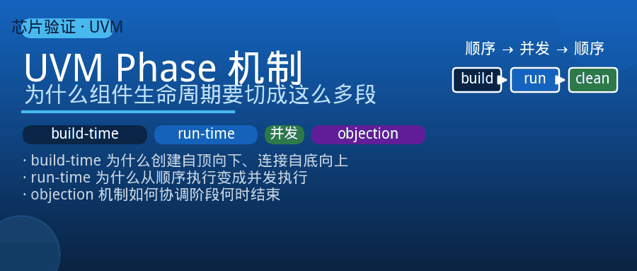
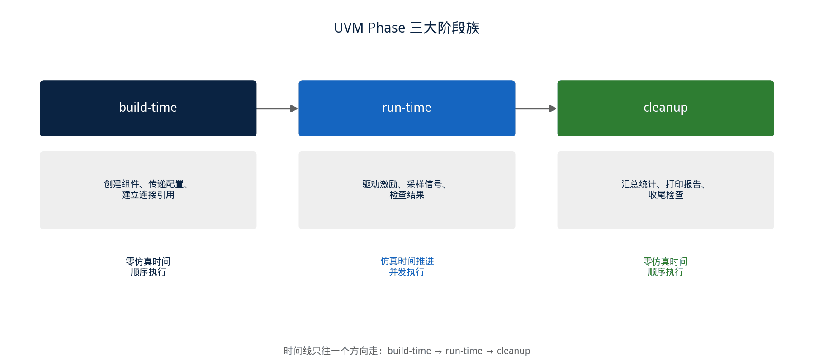
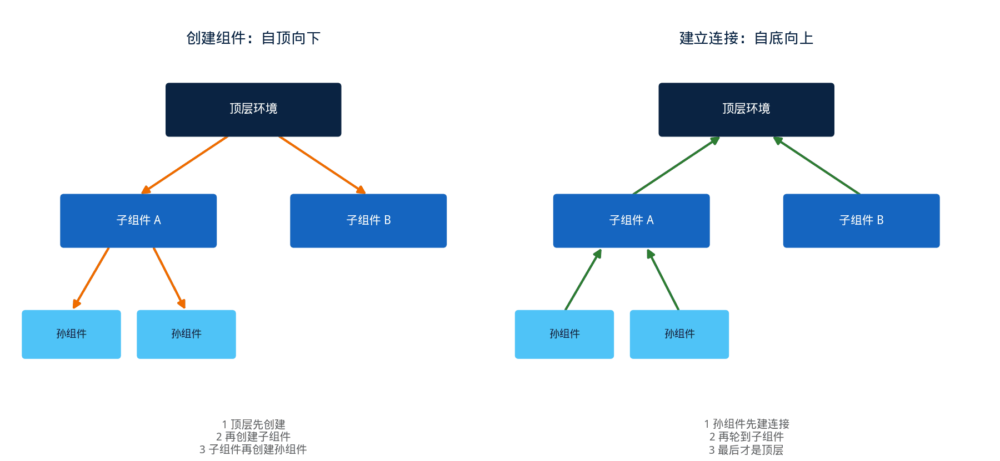
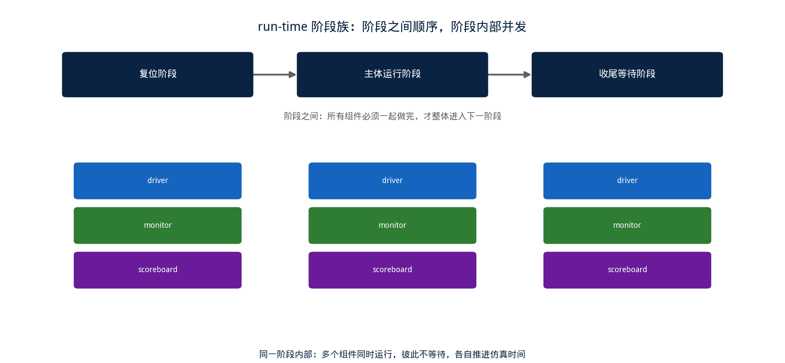

## [UVM] Phase 机制详解：为什么组件的生命周期要切成这么多段

---

### 导读

有次调试一个环境启动顺序的问题，同事问了一句："为什么不能就在构造函数里把所有东西都建好、连好，非要分成 build、connect、run 好几个阶段，多绕一圈？"

这个问题问到了 UVM 框架一个很核心的设计动机。如果不理解 phase 机制解决的是什么问题，写起验证环境来，很容易在"这段逻辑该放哪个阶段"这件事上凭直觉瞎蒙，蒙对了万事大吉，蒙错了就会遇到一些看起来很诡异、其实是时序问题的 bug。这篇文章把 phase 机制的设计逻辑理清楚。

---

### 一、为什么需要把生命周期切成阶段

一个验证环境里有很多组件：driver、monitor、scoreboard、各种 agent，它们之间存在复杂的依赖关系——某个组件需要先拿到父组件传下来的配置才能决定要不要创建子组件，某个组件需要先确认所有其他组件都已经创建完毕，才能安全地建立起相互之间的连接引用。

如果所有这些工作都堆在构造函数里做，会立刻撞上一个根本性的时序问题：**构造和配置在语言层面是两个先后发生的动作，构造函数执行的时候，外部还没来得及把配置传进来**。如果构造函数里还想着"顺便把连接关系也建好"，会遇到同样的问题——你没法保证在自己构造的那一刻，环境里其他组件也都已经构造完毕、可以被引用了。

phase 机制的本质，就是把"验证环境从无到有、再到运行、再到收尾"这个完整过程，拆分成若干个先后顺序严格确定的阶段，规定每个阶段该做什么、不该做什么，用这种分阶段的方式解决组件之间错综复杂的依赖顺序问题。

---

### 二、三大阶段族：build-time、run-time、cleanup

UVM 把整个仿真生命周期划分成三个大类，每个大类里又包含若干个具体阶段。

**build-time 阶段族**负责搭建验证环境的静态结构：创建组件、把配置传递下去、建立组件之间的连接引用、做一些一次性的检查。这个阶段族的显著特点是**零仿真时间**——这里发生的所有事情，都发生在仿真时钟的第 0 个时刻之前，不存在"等待"这个概念，一个组件的这个阶段做完，才会轮到下一个组件做同样的阶段。

**run-time 阶段族**是真正跑仿真的地方，驱动激励、采样信号、检查结果都发生在这里。和 build-time 阶段族最大的不同是，run-time 阶段族里的各个组件是**并发执行**的，彼此之间不存在"谁先做完谁再做"的顺序关系，而是大家同时开始跑、各自按自己的节奏往前推进仿真时间。

**cleanup 阶段族**负责收尾：确认所有该检查的都检查完了、统计信息该汇总的都汇总了、报告该打印的都打印出来。这个阶段族又变回了和 build-time 类似的零仿真时间、顺序执行的模式。

---

### 三、build-time 内部的执行顺序：为什么是自顶向下，又是自底向上

build-time 阶段族内部还分成好几个具体阶段，每个阶段的遍历方向并不一样，这个方向恰好是根据每个阶段要解决的问题反推出来的。

**创建组件的阶段是自顶向下执行的**：先是最外层的顶层环境执行这个阶段、创建自己的直接子组件，然后依次往下，子组件再创建自己的子组件，一层一层往下铺开。这个顺序的道理很直接——父组件必须先存在，才谈得上创建子组件；配置信息也是父组件往下传，子组件在创建自己、乃至创建更下一层子组件之前，需要能拿到父组件已经准备好的配置。

**建立连接引用的阶段则是自底向上执行的**：最底层的叶子组件最先执行这个阶段，然后逐层往上，最后才轮到顶层环境。这个顺序也有清楚的道理——建立连接引用这件事，前提是"对方已经存在"，如果自顶向下做连接，父组件想去引用子组件的时候，子组件可能还没创建出来；反过来自底向上，等轮到某一层做连接的时候，比它更深的所有子组件都已经在创建阶段里构造完毕，引用关系自然是安全的。

这两个方向合在一起看，其实是同一条设计原则的两种体现：**每个阶段的遍历方向，都服务于"这一步真正需要依赖的东西，此刻是否已经就绪"这个约束**。

---

### 四、run-time 阶段族：从"谁先谁后"到"大家一起跑"

进入 run-time 阶段族之后，执行模型发生了根本性的转变。build-time 阶段族里"一个组件做完才轮到下一个"的顺序关系彻底消失，取而代之的是：**所有组件的 run 阶段几乎同时启动，各自独立地往前推进仿真时间，互不等待**。

这个设计对应的现实很直观：真实的硬件系统里，各个模块本来就是同时在运行的，某个模块的时钟沿到来，不会因为另一个模块还没处理完上一个事务就被迫停下来等待。如果 run 阶段还沿用 build-time 那种"排队执行"的模式，就没办法真实模拟这种并发行为——driver 在驱动激励的同时，monitor 需要同步在观察信号，两者如果变成先后关系，根本没法反映真实场景。

run-time 阶段族内部其实还细分成好几个子阶段（比如复位阶段、主体运行阶段、收尾等待阶段），这些子阶段之间保留了顺序关系——所有组件必须一起做完复位阶段，才会一起进入主体运行阶段——但**同一个子阶段内部，各个组件之间依然是并发的**。这种"阶段之间顺序、阶段内部并发"的设计，让环境既能在关键时间点上做到步调一致（比如所有组件同时知道复位已经结束），又不会牺牲仿真该有的并发真实性。

---

### 五、组件如何声明"我的 run 阶段还没结束"

run-time 阶段族并发执行带来一个新问题：**框架怎么知道什么时候可以结束当前这个阶段、进入下一个阶段？** 如果没有一种机制来协调，某个组件可能自己的事务还没做完，阶段就被提前结束了。

UVM 提供了一种"举手"机制来解决这个问题：任何组件都可以声明"我要objection（反对）当前阶段结束"，声明之后框架会等待，直到所有声明过的组件都撤回自己的反对，才会真正推进到下一个阶段。这个机制本质上是一种基于计数的同步原语——反对的数量从零变成正数，阶段就会被阻塞；数量重新归零，阶段才会继续往前走。

这也是为什么在实践中，"忘记声明反对"和"声明了反对却忘记撤回"是两类最常见、又截然相反的问题：前者会导致某个组件的激励还没发完，仿真就已经进入下一个阶段甚至直接结束；后者会导致仿真永远停在当前阶段，看起来像是"卡死了"，实际上是有一个反对一直没有被撤回。

---

### 六、验证中值得关注的几个点

**不要在构造函数里做依赖父组件配置的判断**：这是最常见的一类时序问题，构造函数执行时配置还没被传递下来，任何需要读取父组件配置才能决定的逻辑，都应该挪到 build-time 阶段族里执行，而不是塞进构造函数。

**连接引用类的代码要放在正确的阶段，而不是提前**：如果在创建组件的阶段就尝试引用兄弟组件或者子组件的引用，大概率会拿到一个空引用，因为对方可能还没有被创建出来，这类代码应该放在连接阶段，此时创建阶段已经全部完成。

**跨组件同步不要依赖运气**：run-time 阶段族里各组件默认是并发的，如果两个组件之间存在时序上的先后依赖（比如一个组件要等另一个组件完成某个动作才能继续），不能假设"它们碰巧会按预期的顺序执行"，必须用显式的同步机制去协调。

**反对机制要配对检查**：审查代码时，每一处声明反对的地方，都要能找到对应的撤回路径，尤其是存在多个分支、异常退出路径的场景，容易出现某条路径下反对被声明了、却没有被撤回，这类问题会导致仿真在某些场景下才卡死，回归里不一定每次都能复现。

**排查启动顺序问题时，先确认组件当前处于哪个阶段**：很多"看起来诡异"的初始化 bug，本质上是代码被放在了错误的阶段——排查这类问题的第一步，不是急着看变量值对不对，而是先确认当前执行到的是哪个阶段、这个阶段理论上应该已经具备了哪些前提条件。

---

### 七、总结

phase 机制解决的核心问题只有一个：**验证环境里的组件存在复杂的相互依赖关系，需要一套严格定义的顺序，来保证每一步执行的时候，它所依赖的前提条件确实已经就绪。**

build-time 阶段族用顺序执行、方向明确的遍历（创建自顶向下、连接自底向上）来搭建静态结构；run-time 阶段族转向并发执行，真实反映硬件系统里各模块同时运行的现实，再用反对机制来协调"什么时候可以结束当前阶段"这个问题；cleanup 阶段族收尾，重新变回顺序执行。理解了每个阶段族存在的原因、以及它们各自的执行顺序服务于什么约束，遇到"这段代码到底该放哪个阶段"这类问题时，就有了一个可以推导的依据，而不必凭经验硬记。

---

*本文基于 UVM 方法学中 phase 机制相关章节，结合验证实践整理。*
