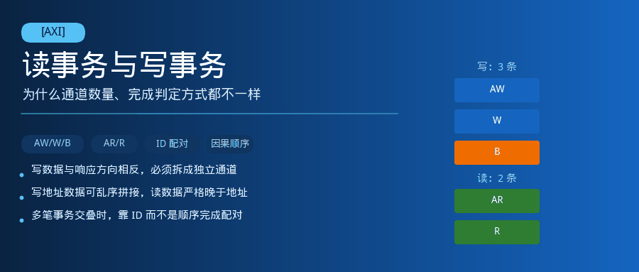
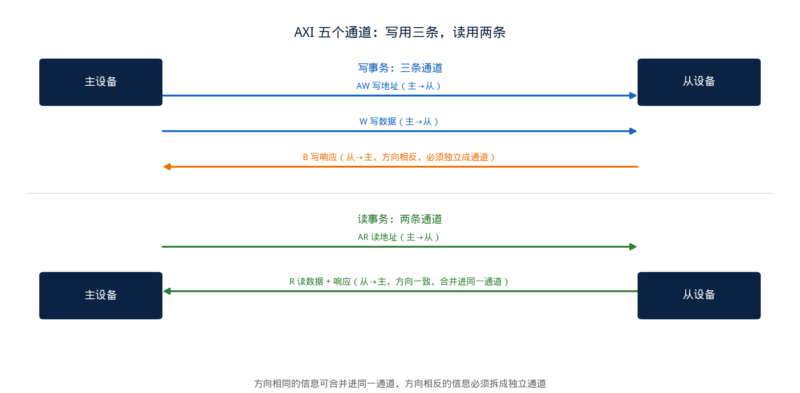
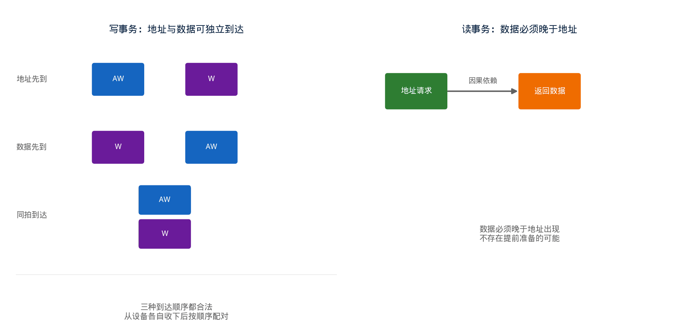

## [AXI] 读事务与写事务：为什么通道数量、完成判定方式都不一样



---

### 导读

早些年查过一个写数据错位的问题：两笔写事务几乎同时发起，最后落地的数据却对不上号——第一笔的地址，配上了第二笔的数据。排查了很久才定位到，是 ID 分配逻辑在两个通道之间没有保持一致，导致地址和数据被错误地配成了对。

这类问题的根子，往往出在对读写两类事务结构性差异的理解不够深。AXI 的读和写，看起来只是方向不同，实际通道数量不一样，完成判定的方式也完全不同。这篇文章想把这层差异讲清楚，再结合真实调试经验，说说容易踩坑的地方。

---

### 一、通道数量的不对称：写要三条通道，读只要两条



AXI 总共定义了五个独立通道：写地址（AW）、写数据（W）、写响应（B）、读地址（AR）、读数据（R）。写事务用了前三条，读事务用了后两条，数量并不对称。

这个不对称不是随意设计的，而是由数据流动的方向决定的。写数据是主设备发给从设备，方向是"主→从"；从设备收完数据之后，必须有一种方式把"写成功了"这个结果告诉主设备，而这个结果的方向是"从→主"，和写数据通道的方向正好相反。一条通道的信号线在协议里是单向的，无法在同一条通道上既传数据、又传回方向相反的响应，所以写事务必须再单独开一条方向相反的响应通道，这就是 B 通道存在的原因。

读事务不需要这个额外通道，原因也在方向上：读数据本身就是从设备返回给主设备的，方向是"从→主"，跟"读成功还是失败"这个响应信息的方向天然一致。于是 AXI 干脆把响应字段直接塞进读数据通道里，每一拍读数据都带着自己的响应状态，不必再单独开一条通道去传方向相同的信息。

**方向相同的信息可以合并进同一条通道，方向不同的信息必须拆成独立通道**——这是理解 AXI 通道数量差异的关键，也是很多协议里"响应"和"数据"到底要不要合并的通用判断依据。

---

### 二、时序关系的不对称：写可以乱序拼接，读必须先请求后应答



把镜头拉到时序层面，读写两类事务在"谁先谁后"这件事上的约束也不一样。

写事务里，地址（AW）和数据（W）允许各自独立地出现，谁先谁后没有强制顺序——主设备既可以先发地址再发数据，也可以先把数据准备好放在总线上等地址通道就绪，甚至可以让两者同一拍同时出现。从设备内部会分别收下地址和数据，再按照各自到达的顺序做匹配，而不是死等"必须先看到地址才能收数据"。

读事务就没有这个自由度。读数据在语义上就是"对某次读地址请求的应答"，因果关系是单向且强制的：从设备必须先收到一笔读地址请求，才可能产生对应的读数据；不存在"先把数据准备好，等地址请求来了再对上"这种玩法，因为在请求出现之前，从设备根本不知道要读哪个位置的数据，也就无从谈起提前准备。

这个差异背后的本质是：**写数据的内容由主设备自己决定，不依赖从设备的任何信息，所以可以和地址并行准备；读数据的内容由从设备根据地址查出来，天然依赖地址已经到达这个前提，因果链锁死了先后顺序**。

---

### 三、身份证机制：多笔事务交叠时，靠 ID 而不是靠顺序来配对

当总线上同时有多笔读或者多笔写事务在飞行、彼此可能乱序完成的时候，光靠"先来后到"已经不足以正确配对请求和响应了，这时候 ID 字段就成了唯一可靠的配对依据。

写事务的配对逻辑相对复杂：地址通道和数据通道虽然可以独立到达，但同一笔事务的地址和数据，仍然要靠隐含的到达顺序（先进先出）关联起来，而最终的写响应，要靠 ID 去匹配到底是哪一笔（或者哪一组共享同一个 ID 的）写事务完成了。如果 ID 的生成逻辑在地址通道和后续状态机之间没有保持完全一致的分配规则，就会出现开头提到的那种问题——地址和数据错配，或者响应发给了错误的发起方。

读事务的配对逻辑相对干净：每一拍读数据自带 ID，直接标明自己属于哪一笔读请求，不需要依赖到达顺序做隐式推断。这也是为什么调试读通道乱序问题时，重点通常在"ID 分配是否唯一、是否被意外复用"；而调试写通道错配问题时，除了 ID 本身，还要额外确认地址和数据两个独立通道之间的相对到达顺序有没有被违反假设。

用伪代码表达两者完成判定逻辑的差异：

```
// 写事务完成判定：地址与数据分别到达，凑齐后才能产生响应
on aw_valid_and_ready:
    push(aw_id, addr_queue)
on w_valid_and_ready and w_last:
    matched_id = pop(addr_queue)   // 按到达顺序隐式配对
    issue_response(matched_id)

// 读事务完成判定：地址到达后直接返回带 ID 的数据，无需额外配对
on ar_valid_and_ready:
    schedule_read(ar_id, ar_addr)
on read_data_ready:
    send(read_id, read_data, read_resp)   // ID 直接标明归属，不依赖顺序
```

写事务这段伪代码里最容易出问题的地方，就是 `addr_queue` 的先进先出假设——一旦某个环节因为超前处理、乱序转发等原因打破了这个假设，地址和数据的配对就会错位。读事务因为每拍数据自带 ID，即使处理顺序被打乱，也不影响正确配对，这是结构上更健壮的地方。

---

### 四、验证中值得关注的几个维度

**写地址与写数据的相对到达顺序覆盖**：验证时要分别构造"地址先到""数据先到""同拍到达"三种场景，确认从设备在所有顺序下都能正确配对，不能只测试一种默认顺序。

**多 ID 交叠时的响应匹配**：同时发起多笔使用不同 ID 的写事务，确认每笔事务收到的 B 响应，ID 与自己发起时的 AW ID 完全一致，重点覆盖"响应顺序和请求顺序不一致"的乱序完成场景。

**读数据的 RLAST 与 ID 一致性**：一次读事务通常由多拍数据组成，验证需要确认所有拍的 ID 保持一致，且只有最后一拍带有 RLAST 标志，中途不会提前或者遗漏这个标志。

**同 ID 复用时机的边界**：AXI 允许同一个 ID 值被不同事务复用，前提是前一笔用这个 ID 的事务已经完全完成；验证需要覆盖"前一笔事务响应还未返回，就复用同一个 ID 发起新事务"这种违规场景下设计的实际行为。

**写响应产生时机与最后一拍数据的对齐**：确认 B 响应一定是在对应事务的最后一拍写数据被接收之后才产生，不允许数据还没收完就提前应答，这类时序错位在功能测试里往往不会直接报错，而是表现为数据丢失或者响应内容与实际写入结果不一致。

---

### 五、总结

读写两类事务在 AXI 里走的不是同一套逻辑：写事务需要三条通道，是因为数据和响应方向相反，无法合并；读事务只要两条通道，是因为数据和响应方向一致，天然可以合并。写事务里地址和数据可以独立到达、乱序拼接，靠隐式顺序或者显式 ID 完成配对；读事务里数据是对地址请求的直接应答，因果关系锁死了先后顺序，配对完全靠 ID，不依赖到达顺序。

理解这层结构性差异，再遇到读写通道相关的 bug 时，能更快判断问题出在哪一类因果关系上——是方向相反的信息被错误合并了，还是本该独立到达的两路信号被错误地假设了顺序，还是 ID 分配逻辑在多个通道之间没有保持一致。

---

*本文基于 AMBA AXI 协议规范中读写通道相关章节，结合验证实践中的信号分析整理。*
