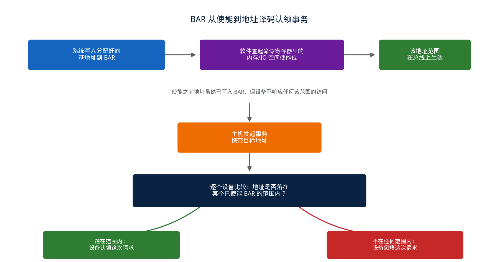
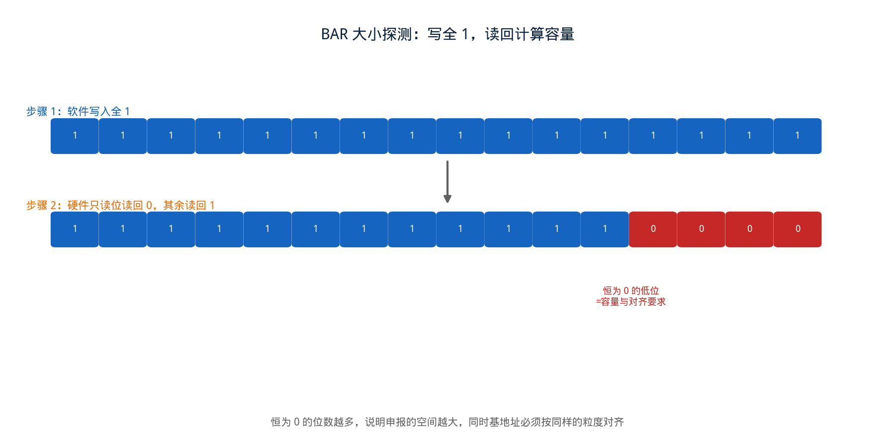
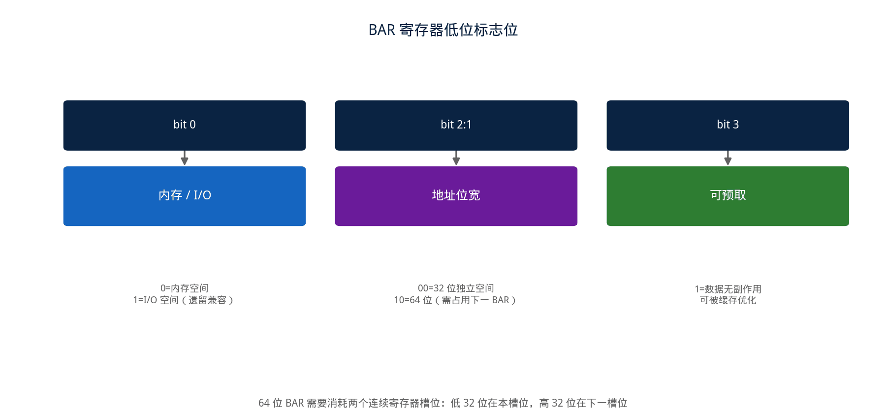
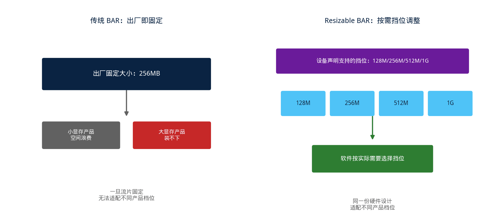

## [PCIE] BAR 基本概念详解：地址空间是怎么被"要"到、又是怎么被"用"起来的


---

### 导读

早些年调 BAR 相关问题的时候，最容易被绕进去的一点是：BAR 明明只是设备配置空间里几个普普通通的寄存器，为什么牵扯的东西这么多——地址怎么分配、大小怎么申报、64 位怎么拼、预取属性有什么用，一环套一环。后来把 PCIe 规范里 BAR 这部分从头看了一遍，才发现这些细节并不是随意堆砌的规则，而是"设备怎么找地方安家"这一件事，在演进过程中不断被打磨出来的解法。这篇文章想把 BAR 的基本概念、以及背后的设计动机讲清楚。

---

### 一、为什么需要 BAR

现代计算机上，内存地址空间只有一份，由整个系统统一管理，不是每台外设各自划一块地盘出来。CPU 和操作系统不允许 PCI 设备自作主张地占用某段地址——如果每个设备都按自己的意愿去挑地址，两个设备撞在同一段地址上几乎是必然的事，所以地址必须由系统统一规划、统一分配。

但同时，PCI 设备本身又确实需要一块内存空间，用来存放和自己功能相关的数据，比如寄存器、状态信息、配置参数。不同设备、不同功能，需要的这块空间大小天然不一样：一个简单的控制器可能只需要几十 KB，一块显卡的显存窗口动辄需要几个 GB。这就产生了一个"量身定制"的需求——系统需要知道每台设备到底要多大空间，才能按需分配，而不是给所有设备统一分一样大的地址块。

**BAR（Base Address Register，基地址寄存器）** 就是用来解决这个量身定制问题的机制。每块 PCI/PCIe 设备的配置空间里最多有 6 个 BAR 寄存器，设备可以只启用其中一部分，也可以全部启用，具体用几个、每个申报多大，由设备自身的功能需求决定。

一旦某个 BAR 被启用、系统把分配好的地址写入其中，这个 BAR 就和一段系统内存地址建立起了对应关系。此后主机每次访问这段地址范围，实际上访问的就是这台设备；设备这一侧只要发现某笔事务的地址落在自己某个 BAR 的范围内，就会认领这次请求，因为它知道自己正是这次访问的目标。

---

### 二、如何使用 BAR 寄存器



BAR 从"申报到手"变成"能被访问"，中间还差一步关键的开关。

系统完成地址分配、把基地址写进 BAR 之后，这个地址暂时还不会生效。要让这段空间真正在总线上生效，软件还需要单独去 PCI 命令寄存器（Command Register）里，置起对应的空间使能位——内存空间使能位或者 I/O 空间使能位，具体置哪一位取决于这个 BAR 申报的是内存空间还是 I/O 空间。

"配置地址"和"允许访问"被拆成两个独立的开关，不是多此一举。系统启动阶段往往要给很多设备依次分配地址，如果地址一写进 BAR 就立刻生效，先分配完的设备会立刻开始响应总线上的访问，而这时候后面的设备可能还没分配完，整个系统的地址空间还处于不完整、可能冲突的中间状态。先让所有设备保持沉默，等全部规划完成后再统一放行，才能避免这种过渡期里的误访问。

使能之后，主机每发起一次内存事务，实际执行的是一次地址匹配：把事务携带的目标地址，和系统里每一台已使能设备的 BAR 地址范围做比较，落在哪个范围内，这次事务就转发给对应的设备。用伪代码表达这个过程大致是：

```
for each incoming transaction:
    for each enabled BAR of target device:
        if BAR.base <= txn.addr < BAR.base + BAR.size:
            claim transaction as mine
            return
    ignore transaction  # 地址不在本设备任何 BAR 范围内
```

这也是为什么设备自己不需要知道"我在系统里排第几个""前面还有哪些设备"——它只需要记住自己被分配到的地址范围，剩下的匹配、路由工作交给地址译码逻辑去做。设备侧的逻辑始终是同一句判断：这笔请求的地址，落在不落在我的地盘里。

---

### 三、申报的窍门：用硬件电路本身来表达"我要多大"



这里有一个很巧妙的设计问题：BAR 本身是一个寄存器，能装的信息有限，怎么才能既装下"最终分配到的基地址"，又能表达"我申报的大小是多少"这两件不同的事？

PCIe 规范给出的答案是：**用同一个寄存器的低位比特本身的硬件行为，来编码需求的大小，不需要额外的字段。** 具体做法是，BAR 寄存器里对应"申报空间大小"的那些低位比特，在硬件上被设计成永远只能读出 0，无法被写入 1——这些位在电路里根本没有接触发器，写操作对它们不起作用。软件按照规范规定的探测流程，向整个 BAR 寄存器写入全 1，再读回来，哪些位读回来是 1、哪些位读回来是 0，就直接反映了这个设备的地址空间到底需要多大：读回 0 的那些低位，意味着"这些位置我说了不算，必须始终为 0"，间接表达了对齐要求和空间大小。

这个设计非常值得玩味的地方在于：**申报大小这件事，不是靠某个专门的"大小寄存器"来表达的，而是直接体现为寻址范围本身的物理约束。** 一块申报了 16MB 空间的 BAR，它天然要求自己的基地址必须按 16MB 对齐——这不是规范额外强加的一条规则，而是"用哪些位能写、哪些位不能写"这套探测机制自然导出的数学结果。地址空间越大，需要保持恒零的低位就越多，天生就要求更严格的对齐，两者是同一件事的两种表述。

---

### 四、BAR 里的几个标志位：内存还是 I/O，32 位还是 64 位



除了拿来表达对齐和大小的那些位，BAR 寄存器最低的几位还承担着描述"这块空间的性质"的职责，这几位是可以被软件读出真实含义的。

**最低一位**区分这个 BAR 申报的是内存空间还是 I/O 空间——现代 PCIe 设备几乎都用内存空间，I/O 空间是更早期 PCI 时代遗留下来的寻址方式，PCIe 保留了它主要是为了兼容。**紧接着的两位**在内存空间模式下，用来表明这个 BAR 到底是一个独立的 32 位地址空间，还是需要和紧邻的下一个 BAR 拼接起来，组成一个 64 位地址空间——这也是为什么使用 64 位 BAR 时，规范要求消耗两个连续的 BAR 寄存器槽位，第二个槽位专门用来承载高 32 位地址，本身不能再申报别的空间。**再往上一位**是可预取（prefetchable）标志，它告诉系统"这块空间里的数据具备一致性，即使被提前读取、缓存，也不会因为读取顺序或者读取次数的变化而产生副作用"，系统据此决定要不要对这块地址做缓存优化；带副作用的寄存器空间（比如读一次就清零状态的寄存器）绝不能标记为可预取，否则缓存机制会让软件读到过期或者被吞掉的状态。

一台设备为什么常常需要 64 位 BAR——这也是"申报大小"这件事的自然延伸：一块现代 GPU 的显存动辄几十 GB，这个体量的地址空间，32 位地址线（最多能表达 4GB）根本装不下，必须借助 64 位寻址才能完整暴露出来。

---

### 五、深入一层：BAR 只是入口，真正的空间划分发生在设备内部

把视角从"一个 BAR 寄存器"挪到"一整块 BAR 空间内部"，会发现申报到手的这一整块地址空间，很少是被当成铁板一块使用的。以图形类设备为例，一块被申报出来的 BAR 空间，内部通常还要再切分成好几个功能区——一部分映射寄存器堆，用来控制芯片内部各个模块的行为；一部分映射真正的帧缓冲或者显存窗口；还可能划出一小块专门给"门铃"（doorbell）机制使用，用于软件通知硬件"有新任务了"这种轻量级信令。

这一层内部划分，PCIe 规范本身并不关心——规范只负责保证"申报出去的这块地址空间是排他的、不会和别的设备冲突"，具体这块空间内部怎么切、切多大，完全是设备自己的实现细节，软件驱动需要提前知道这份内部布局（通常通过设备文档或者某种自描述机制），才能正确地在这块地址空间里定位到自己想访问的具体功能。

理解了这一层，就能理解为什么"BAR 大小"和"设备功能复杂度"经常成正比——功能越丰富、需要独立寻址的子模块越多，内部划分需要的地址空间就越大，反映到外部，就是申报的 BAR 也越大。

---

### 六、前线的移动：从静态申报到动态可调



传统的 BAR 机制有一个隐含假设：**设备申报多大，就永远是这么大，一旦系统启动、地址分配完成，这个大小在整个设备生命周期内不会再变。** 这个假设在很长一段时间里没有问题——大多数设备的地址空间需求本来就是固定的。

但当显存、内存这类资源本身可以按需配置的设备出现之后，固定大小的 BAR 开始显得不够用了：如果 BAR 大小按最大可能的显存配置来固定申报，那配置了小显存的产品也要浪费同样大的地址空间；如果按最小配置申报，配置了大显存的产品又装不下。这背后的矛盾，倒逼出了 **Resizable BAR（可调整大小的 BAR）** 这样的扩展能力——设备在配置空间里额外声明自己支持哪些大小挡位，软件在系统初始化阶段，可以根据实际需要，从这些挡位里选择一个，重新配置 BAR 的大小，而不必被出厂时定死的单一数值捆住。

这个演进路径很有代表性：一开始的设计只解决"怎么申报固定大小"这个基础问题；当现实场景出现"同一份硬件设计，不同产品需要不同大小"这个新诉求时，才在原有机制上叠加一层可协商的挡位机制，而不是推倒重来。这也是为什么理解 Resizable BAR 之前，必须先理解最基础的申报-分配协议——它是在原有地基上做的扩展，不是另起炉灶。

---

### 七、验证中值得关注的几个点

**大小探测的位模式要覆盖边界**：验证 BAR 大小时，不能只测一个典型值，需要覆盖最小合法空间到最大支持空间的边界，确认低位恒零的位数与申报大小精确对应，尤其是恰好在某个 2 的幂次边界附近的取值。

**64 位 BAR 的高低位拼接要作为一个整体验证**：64 位 BAR 占用两个连续槽位，验证时需要确认高 32 位寄存器本身不会被误当成一个独立的 32 位 BAR 使用，同时基地址跨越 4GB 边界的场景要专门覆盖，这类场景最容易暴露地址拼接逻辑里的隐藏 bug。

**可预取属性与实际访问行为要交叉检查**：如果某块空间被错误地标记为可预取，而它内部实际存在读取副作用的寄存器，需要验证系统在这种配置下的行为——这类问题往往不会在功能测试里直接报错，而是表现为某个状态位偶发性地读不到预期值。

**内存访问使能位与 BAR 生效时机的先后关系**：软件先配置 BAR 地址、再置起内存访问使能位是标准流程，验证里需要覆盖乱序场景——使能位置起但 BAR 地址尚未配置完成时，设备不应该响应任何该地址空间的访问。

**Resizable BAR 场景下的地址一致性**：BAR 大小被重新配置后，验证需要确认旧的地址映射不会继续生效，新的地址范围内所有原本可访问的功能点都能正确访问，新旧配置切换的过渡时刻不会出现地址悬空或者重叠的窗口。

---

### 八、总结

BAR 机制解决的核心问题只有一个：**在设备完全不知道自己会被放在系统地址空间哪个位置的前提下，让设备准确表达自己需要多大空间，再由软件统一分配、避免冲突。** 用低位比特的硬件只读特性来编码大小需求，把"大小"和"对齐"这两件事统一成同一套探测机制的自然结果，是这套设计里最精巧的一笔。

从最基础的固定大小申报，到应对显存等资源可配置场景而出现的 Resizable BAR，BAR 机制的演进路径也提供了一个很有代表性的样本：先解决最基础的分配问题，再针对现实中出现的新需求，在已有框架上做兼容性的扩展。理解了这条主线，再遇到与 BAR 相关的具体特性时，大多能顺着"这解决的是申报-分配协议里的哪个环节"这条思路，找到设计动机所在。

---

*本文基于 PCIe Base Specification 中 BAR 相关章节整理，结合验证实践分析。*
