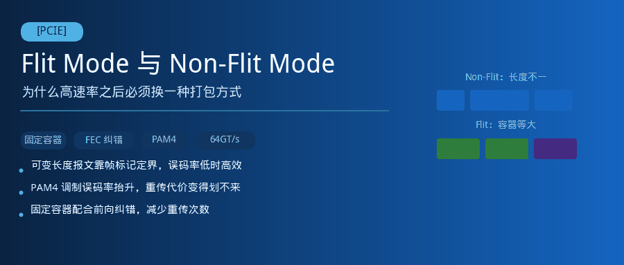
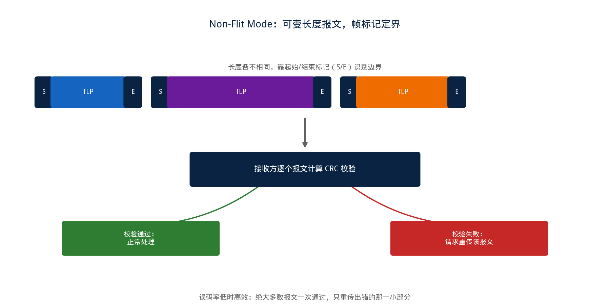
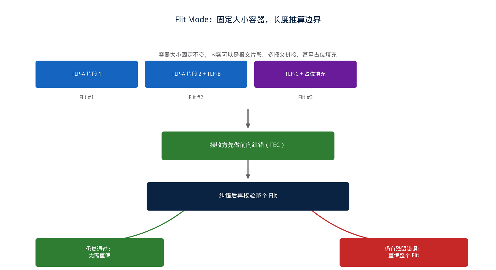

## [PCIE] Flit Mode 与 Non-Flit Mode：为什么高速率之后必须换一种打包方式



---

### 导读

前几天被问到一个问题：同样是 PCIe，为什么讲到 64GT/s 这一代，突然冒出一个"Flit Mode"的新概念，好像之前几代协议里从来没听过。查了一圈资料才发现，这不是一个孤立的新特性，而是信号速率提高到某个临界点之后，原来那套打包方式撑不住了，不得不换一套新的容器结构。这篇文章想把 Flit Mode 和 Non-Flit Mode 的本质区别讲清楚，尤其是"为什么必须换"这一层原因。

---

### 一、Non-Flit Mode：可变长度的包，靠标记符号定边界



在 64GT/s 这一代之前，PCIe 的链路层一直用的是一种"可变长度打包"的方式：一个 TLP（事务层报文）想多长就多长，具体长度由报文本身携带的长度字段决定；报文的起始和结束，靠专门的帧标记符号来界定——发送方在报文开头插入一个起始标记，结尾插入一个结束标记，接收方靠识别这两个标记，从连续的比特流里把一个个报文正确地切出来。

这种方式的可靠性保障，是以"每个报文独立校验、独立重传"为单位的：每个 TLP 都带有自己的循环冗余校验（CRC），接收方算出来的校验结果和报文里携带的不一致，就判定这个报文出错，通过应答报文告知发送方"这一个报文要重发"，发送方从自己的重传缓冲区里把对应的报文重新发一遍。**可变长度 + 帧标记定界 + 逐包校验重传**，这三件事绑在一起，构成了 Non-Flit Mode 的核心逻辑。

这套方式在信号速率不那么高的时候运转得很好，原因很直接：**原始误码率足够低**。链路上因为噪声、抖动等因素偶然翻转一个比特的概率很小，绝大多数报文一路平安到达，逐包校验、有错才重传的模式，平时几乎不产生额外开销，只有真正出错的那一小撮报文才需要重新发送一次，整体效率很高。

---

### 二、速率提高之后，原来的假设不成立了

把信号速率推到 64GT/s 这一档，链路层不得不面对一个新问题：调制方式从原来的二电平（NRZ）换成了四电平（PAM4）。同样的物理噪声水平下，四电平调制要在更接近的几个电压区间之间做判决，天然比二电平调制更容易判断错，原始误码率会有数量级上的抬升。

误码率一旦显著变高，Non-Flit Mode 那套"平时几乎不出错，出错了再重传"的逻辑就开始吃力：错误变得频繁，意味着重传变得频繁，而重传本身是有代价的——不仅要重新占用链路带宽重发数据，还要等一整个来回时延才能确认某个报文确实需要重传，链路速率越高，这个时延相对损失的带宽就越可观。**光靠事后重传去对抗一个高得多的原始误码率，代价已经划不来了。**

更麻烦的是帧标记定界这件事本身：可变长度报文靠一两个特殊标记符号来界定边界，一旦这个标记符号本身在传输中被错误翻转，接收方可能会彻底找错报文的起止位置，导致后面一连串数据全部错位解析——标记本身出错的破坏性，比数据内容出错要严重得多。误码率变高之后，这种"定界标记出错导致连锁错位"的风险也随之上升。

这两个问题合在一起，倒逼出了 Flit Mode 这样一套新的打包方式。

---

### 三、Flit Mode 的解法：固定大小容器 + 前向纠错



Flit（Flow Control Unit，流控单元）是 Flit Mode 里传输的基本单位，它和 Non-Flit Mode 里的 TLP 最大的不同是：**大小固定，不再是可变长度**。链路上所有的 Flit 都是同样大小的容器，一个个连续排列，接收方永远知道下一个 Flit 从哪里开始、到哪里结束，完全不需要再依赖某个特殊标记符号去定位边界——边界信息直接由固定长度这个规则本身给出，不会因为某一位翻转而找错位置。

一个 Flit 容器内部，可能装着一个较大 TLP 的一部分，也可能装着好几个较小的 TLP 拼在一起，具体怎么切分由发送方按当前有哪些数据要发来决定；如果暂时没有足够的有效数据填满这个容器，就用占位数据补齐，容器大小始终不变。这种"内容可以变，容器大小不变"的设计，把"定位边界"和"内容本身"这两件事彻底解耦了。

固定大小容器还带来另一个关键能力：**前向纠错（FEC）**。因为每个 Flit 大小固定、结构规整，可以按照固定的规则在容器里周期性地嵌入一些冗余校验信息，接收方拿到这些冗余信息后，很多情况下能够直接在本地把发生翻转的比特纠正回来，根本不需要触发重传。这是应对高误码率最直接的办法——**与其等错误发生了再花一次往返时延去重传，不如让接收方自己就有能力把大多数错误纠正掉**。整个 Flit 结束时还会附带一个针对整个容器的校验字段，用来判断经过前向纠错之后，这个 Flit 是否还残留着无法修复的错误，只有这种情况才会真正触发重传。

---

### 四、重传粒度的变化：从报文级变成容器级

Non-Flit Mode 里，重传的单位是一个个独立的 TLP，每个报文各自校验、各自决定要不要重传。Flit Mode 里，重传的单位变成了 Flit 本身——不管这个 Flit 里装的是一个大报文的片段，还是好几个小报文的拼接，一旦这个容器经过纠错后仍然判定有错，就要把整个 Flit 重新发一遍，而不是去追究里面具体是哪个报文的哪一部分出了问题。

这个变化背后的逻辑是：固定大小的容器本身就是最小的可寻址、可编号单位，重传的粒度天然就跟着容器走，而不是跟着容器里装的报文内容走。用伪代码表达两种模式判定"要不要重传"的思路差异：

```
// Non-Flit Mode：以报文为单位判定
on tlp_received:
    if crc_check(tlp) fails:
        request_retransmit(tlp.sequence_id)

// Flit Mode：以固定容器为单位判定，先纠错再判定
on flit_received:
    corrected = apply_fec(flit)
    if crc_check(corrected) fails:
        request_retransmit(flit.sequence_id)
    // 纠错成功的情况下，即使原始比特有翻转，也不会触发重传
```

对验证和调试来说，这个粒度变化意味着排查思路也要跟着变：Non-Flit Mode 下"哪个报文丢了、错了"是一个直接能问的问题；Flit Mode 下先要确认是哪个 Flit 序号出了问题，再去看这个 Flit 里恰好装了哪几个报文的哪些片段，报文和容器之间不再是一一对应的关系。

---

### 五、代价：小报文场景下的容器利用率

固定大小容器不是没有代价的。如果实际要传输的数据远小于一个 Flit 的容量，容器里大部分位置都要用占位数据填充，这部分带宽实质上被浪费掉了——这是用可预测的边界、更强的纠错能力，换来的开销。

这也是为什么 Non-Flit Mode 至今仍然保留在协议里，没有被 Flit Mode 完全取代：在信号速率不高、原始误码率本来就低的场景下，Non-Flit Mode 可变长度打包的效率优势依然成立，没有必要为了应对一个并不存在的高误码率问题，去承受固定容器带来的填充开销。**两种模式的取舍，本质上是"按需变长、事后补救"和"固定容器、事前防护"之间，随着原始信道质量变化而变化的一次权衡。**

这也解释了为什么 Flit Mode 在协议里是从 64GT/s 这一档开始成为强制要求，而不是从一开始就通用——只有当原始误码率真的高到让事后重传的代价难以接受时，固定容器加前向纠错的方案才划算。

---

### 六、验证中值得关注的几个点

**边界推算的一致性**：验证 Flit Mode 时，需要确认接收方对 Flit 边界的推算完全基于固定长度规则，构造压力场景（比如背靠背连续多个 Flit）确认边界推算不会因为内容巧合而出现误判。

**纠错与重传的边界条件**：需要覆盖"错误数量恰好在纠错能力边界上"的场景——比纠错能力少一位的错误应该被正确纠正且不触发重传，超出纠错能力的错误应该被正确识别并触发重传，这个边界最容易暴露纠错逻辑实现上的偏差。

**跨容器报文重组**：一个较大 TLP 跨越多个 Flit 传输时，需要验证接收方在其中一个 Flit 触发重传的情况下，能否正确地把重传回来的内容和已经收到的其他片段重新拼接成完整报文，不会因为重传打乱了原有的顺序假设。

**多报文合并封装的正确拆分**：多个小 TLP 拼进同一个 Flit 的场景，需要验证接收方能够正确地从一个 Flit 里拆出多个独立报文，不会把拼接边界和报文本身的内容混淆。

**模式协商与混合链路场景**：链路两端在建链阶段需要协商是否使用 Flit Mode，验证需要覆盖协商失败或者两端能力不一致时的回退行为，确认链路能够正确降级到双方都支持的模式，而不是维持在一个不一致的状态下继续传输。

---

### 七、总结

Flit Mode 和 Non-Flit Mode 的核心差异，可以归结成一句话：**Non-Flit Mode 用可变长度换取效率，靠帧标记定界、逐包校验重传来应对低误码率环境；Flit Mode 用固定大小容器换取确定性，靠前向纠错减少重传次数，来应对高误码率环境。** 两者不是新旧替代关系，而是分别适配了不同信道质量下的最优策略。

理解了这层"信道质量变了，打包策略也要跟着变"的因果关系，再遇到 Flit Mode 相关的具体规则（容器多大、纠错能力多强、什么时候强制启用）时，大多能顺着"这解决的是原始误码率升高之后的哪个具体麻烦"这条思路，找到设计动机所在。

---

*本文基于 PCIe Base Specification 中 Flit Mode 相关章节整理，结合验证实践分析。*
