## [SystemVerilog] task 与 function：别只背区别，要先看时间

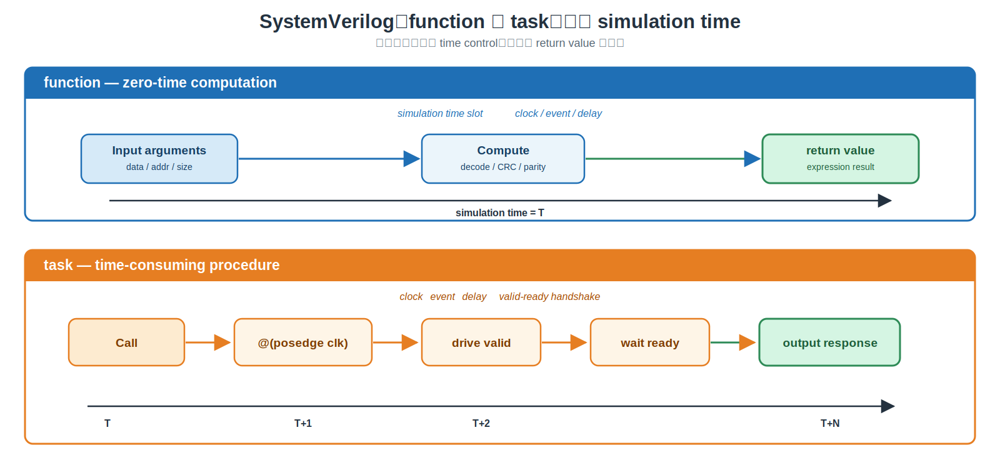

---

### 导读

写 testbench 时，很多人先背一句：`function` 有 return value，`task` 没有。

这句话不算错，但它解释不了最关键的问题：**为什么 driver 的 `send_write()` 必须写成 `task`，而 scoreboard 的 address decode 更适合写成 `function`？**

真正的第一判断条件不是“能不能返回值”，而是：**代码是否需要消耗 simulation time。**

> `function`：当前仿真时刻完成的 `zero-time computation`。
>
> `task`：可以等待 clock、event、delay 或 handshake 的 `time-consuming procedure`。

---

### 一、先看时间：同一时刻算完，还是跨多个 cycle

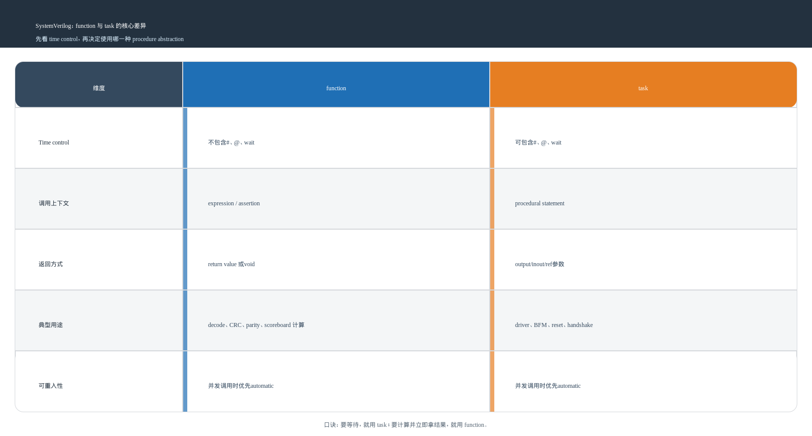

如果一个过程需要“等到下一个 `posedge clk`”，它已经不可能是 `function`。

如果一个过程只根据输入位做计算，并且结果想直接放进 assignment、condition 或 assertion，它就是 `function` 的主场。

---

### 二、场景 1：纯计算，用 function

先看一个最常见的 parity 计算。没有时钟，没有 delay，没有等待任何外部事件。

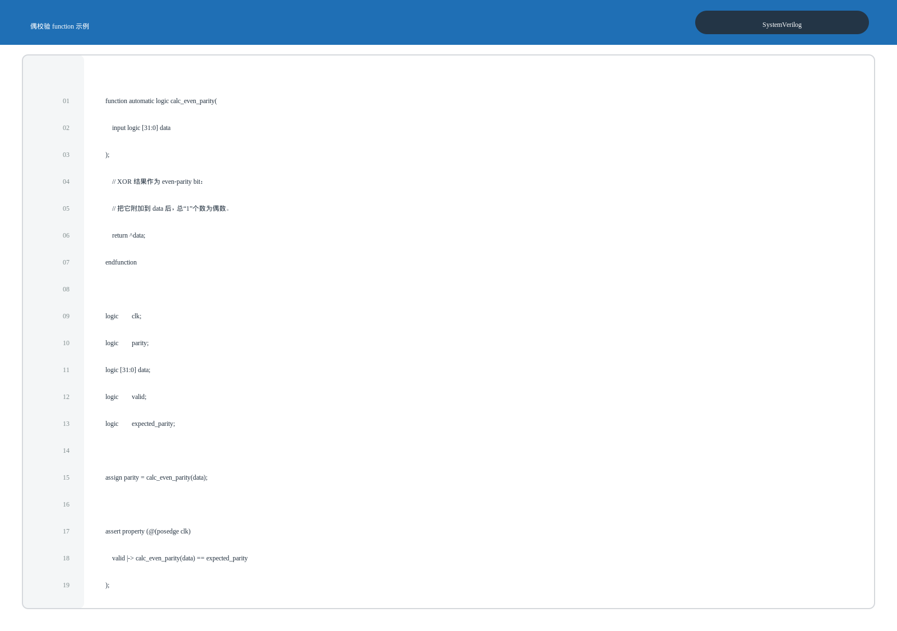

`calc_even_parity()` 在调用点立即完成，仿真时间不会前进。它因此可以出现在 `assign`、`if (...)`、ternary expression 和 SVA property 中。

再看一个 byte-enable mask 例子。它仍然只是一个 data transform。

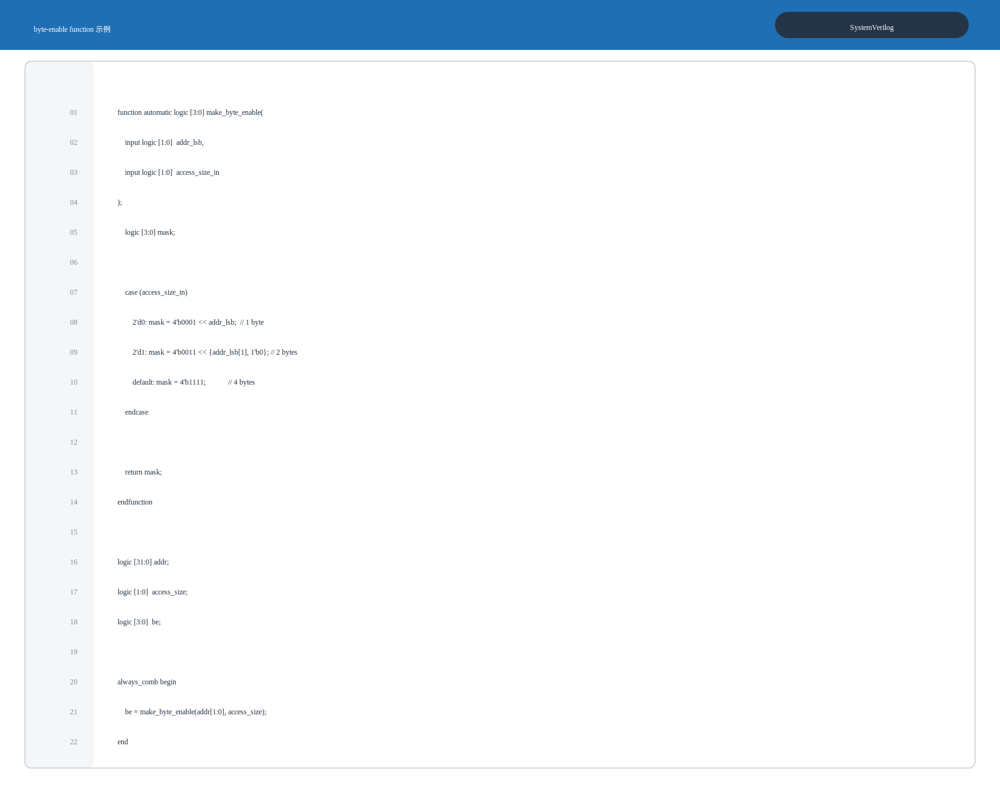

这里的 `function` 把 bit manipulation 收进一个有名字的单元。调用方只关心“给地址低位和访问大小，拿到 byte enable”。

---

### 三、场景 2：跨周期 handshake，用 task

写一个 valid-ready transaction，至少要等待 clock edge 和 `ready`。这不是“立即计算”，而是一段跨 cycle 的 protocol procedure。

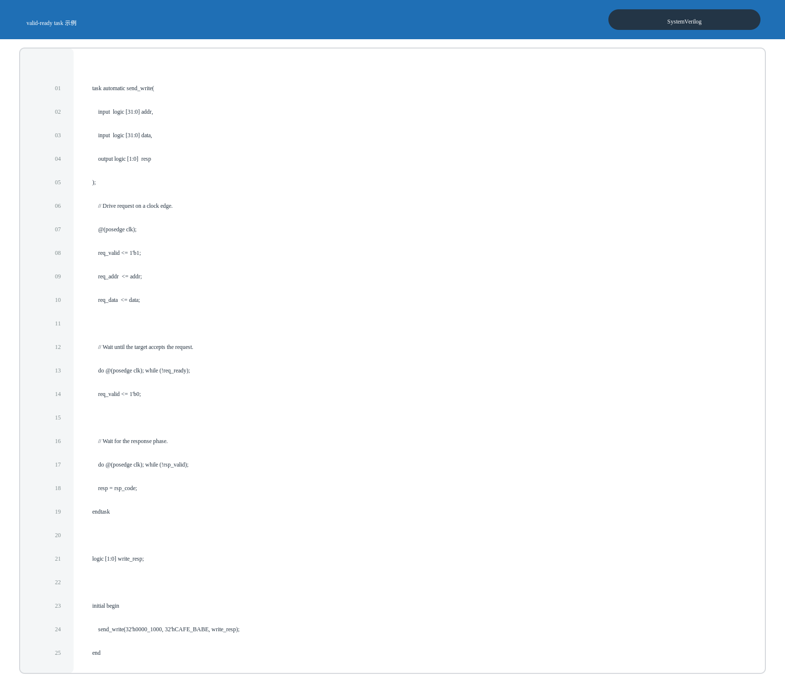

`@(posedge clk)` 和两个 handshake loop 都会消耗 simulation time。因此 `send_write()` 必须是 `task`。

注意：`task` 没有 function-style return value，但并不代表它不能把结果交还调用者。上面的 `output logic [1:0] resp` 就返回了 write response。

---

### 四、返回一个结果，还是返回一组结果

#### 1. function 返回一个值；这个值可以是 struct

`function` 只返回一个 return value，但把相关字段封装成 `struct` 后，表达能力并不弱。

#### 2. task 用 output 返回多个结果

这个例子本身不需要时间，所以也能写成返回 `struct` 的 `function`。这里故意展示 `task` 的 `output` 能力：它可以天然带回多个独立结果。

#### 3. ref 是原位修改，不是普通输入

`input` 是 caller value 的副本；`ref` 是 caller variable 的 alias。`ref` 很方便，但也意味着函数会直接改写调用方状态，接口语义要写清楚。

---

### 五、automatic：并发调用时别共享局部变量

`task` 和 `function` 默认 lifetime 可能是 static。多条 process 并发调用时，局部变量若被共享，就会发生难查的 data corruption。

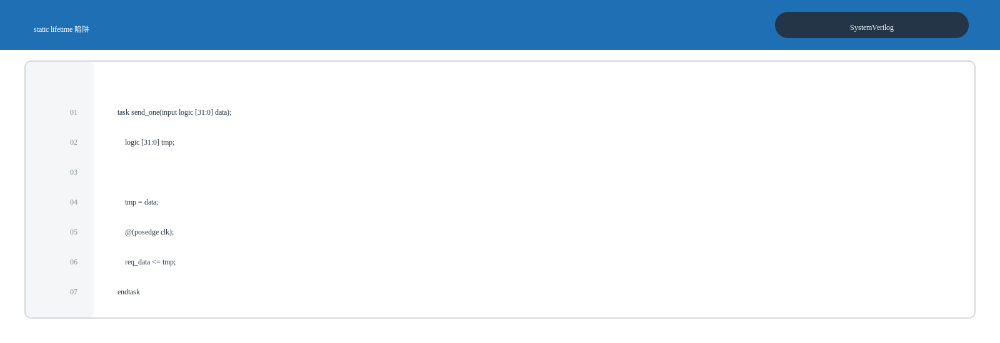

上面这个 `task` 若被两个 parallel thread 同时调用，第二次调用可能在第一个调用等待 clock 时覆盖 `tmp`。

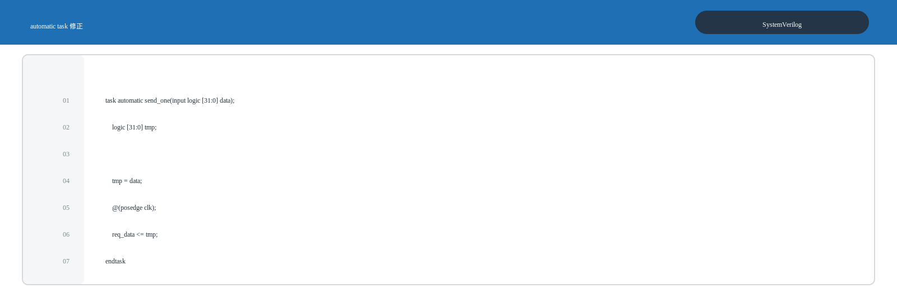

加上 `automatic` 后，每一次 invocation 都拥有独立的 storage。对可重入的 helper function、driver transaction 和 sequence helper，默认优先写 `automatic`。

---

### 六、4 个高频坑

#### 坑 1：在 function 里等待 clock 或 delay

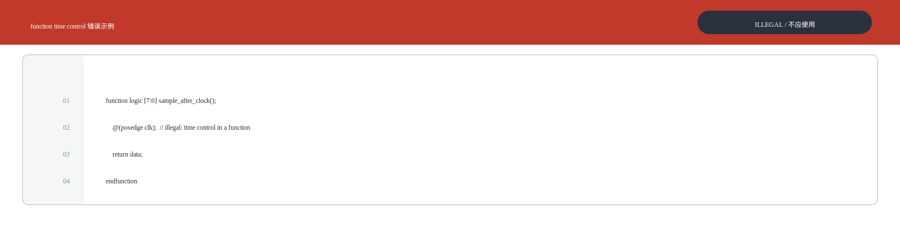

**为什么错：** `@`、`#` 和 `wait` 都会让仿真时间前进；`function` 必须在当前仿真时刻返回。

**正确选择：** 改成 `task automatic`，由 procedural code 调用并等待结果。

#### 坑 2：把 task 当作 expression 的一部分

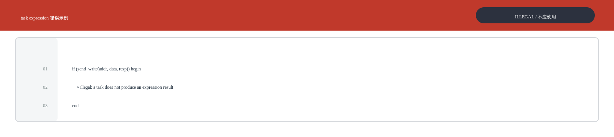

**为什么错：** `task` 在 procedural statement 中独立调用，不能嵌入 `if` condition、assignment 或 continuous assignment。

**正确选择：**

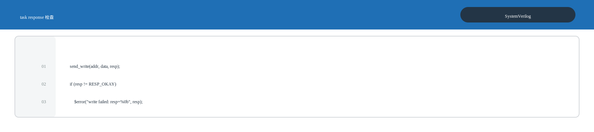

#### 坑 3：把有时序语义的 BFM 写成 function

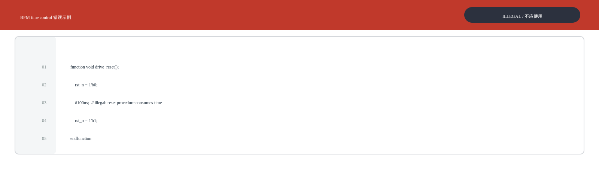

**为什么错：** reset pulse、AXI transfer、PCIe LTSSM wait 都是 time-consuming procedure。

**正确选择：** 使用 `task automatic drive_reset();`，把 `#100ns` 或 event wait 放进 task。

#### 坑 4：认为 task 不能返回结果

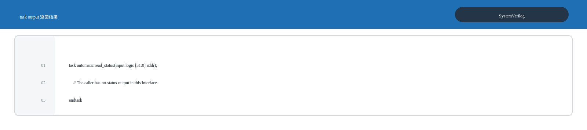

**为什么错：** `task` 不返回 expression value，但它可以通过 `output`、`inout` 或 `ref` 返回一个或多个结果。

**正确选择：**

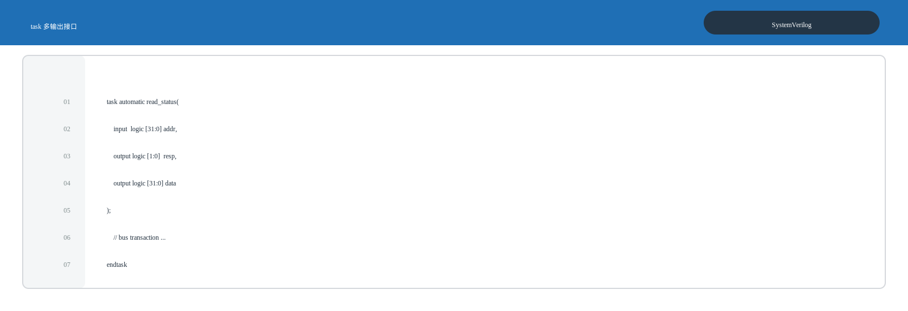

---

### 七、RTL / DV 中怎么选

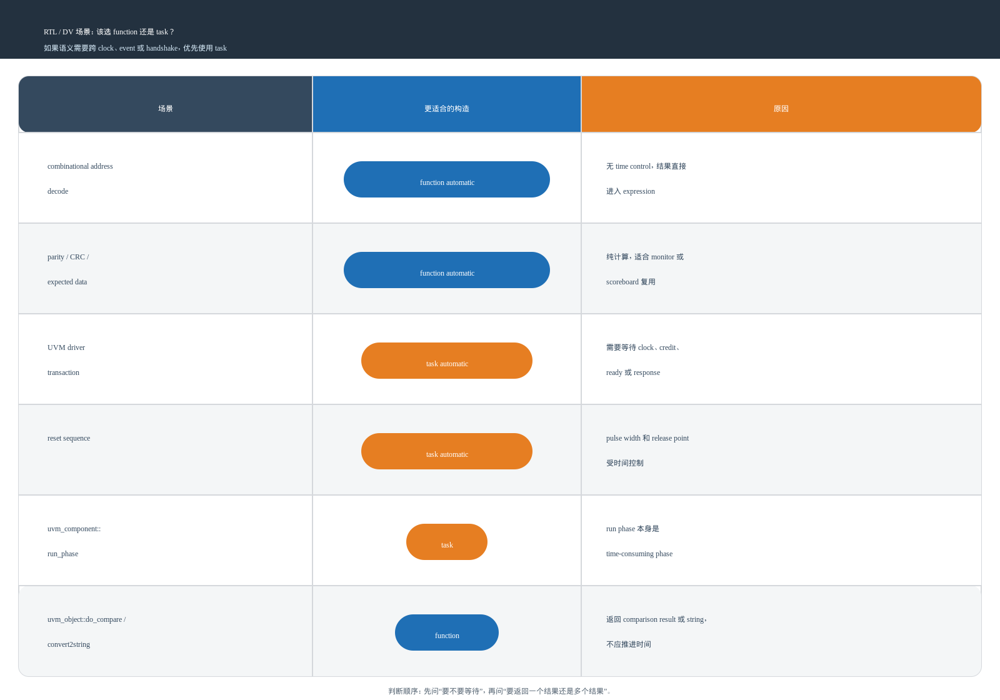

一个很实用的判断顺序：

1. 这段代码要不要等待 `clock`、`event`、`delay` 或 `handshake`？
   - 要：选 `task`。
2. 结果要不要直接进入 expression、assertion 或 assignment？
   - 要：选 `function`。
3. 只是封装一个无返回值的小操作？
   - 可以用 `void function`，但仍然不能含 time control。

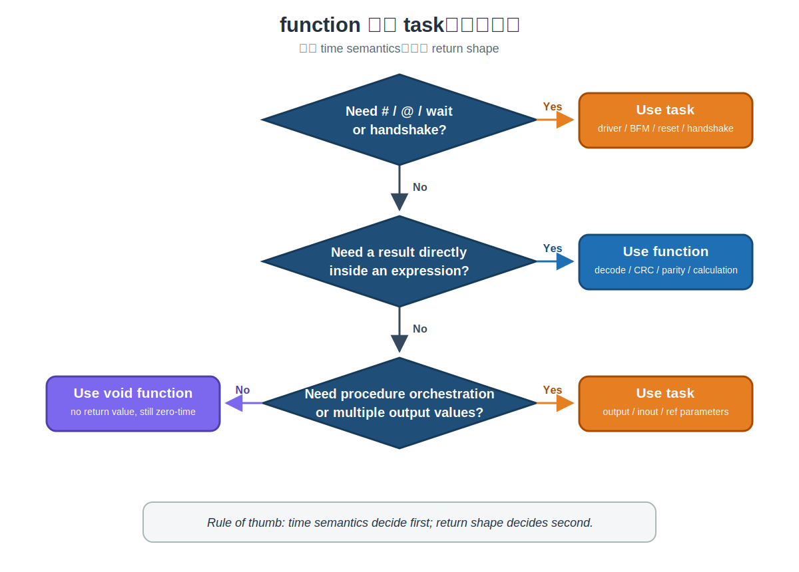

---

### 八、总结

不要先问“这个过程要不要返回值”，先问“它要不要等待”。

`function` 的边界是 **zero-time computation**；`task` 的边界是 **time-consuming procedure**。返回结果的形状只是下一层设计选择：`function` 可以 return `struct`，`task` 可以使用多个 `output` 参数。

> **选型口诀：要等待，就用 `task`；要计算并立即拿结果，就用 `function`。**

---

*本文基于 IEEE SystemVerilog 语言语义和 RTL/DV testbench 实践整理。*
