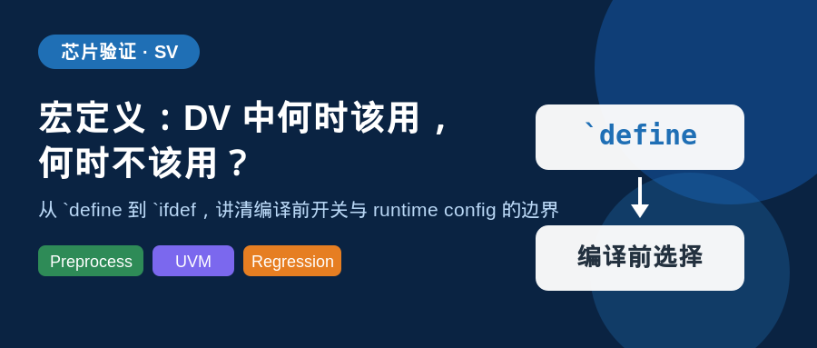
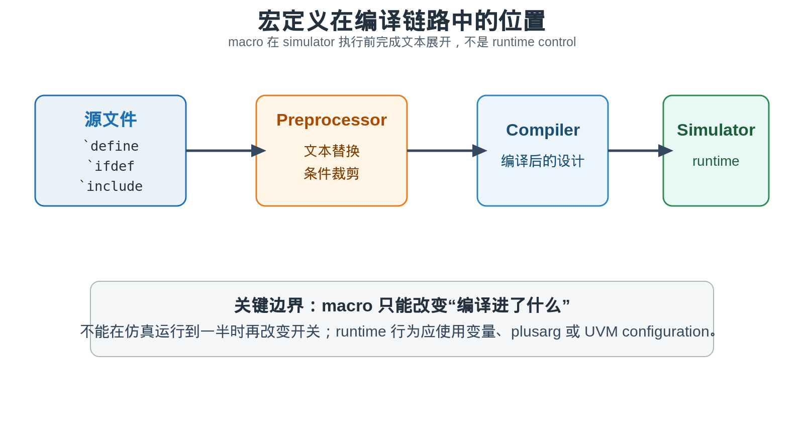
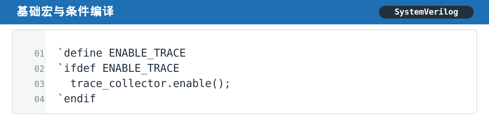
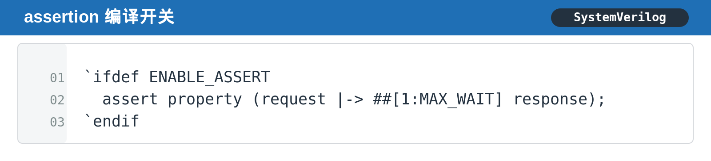
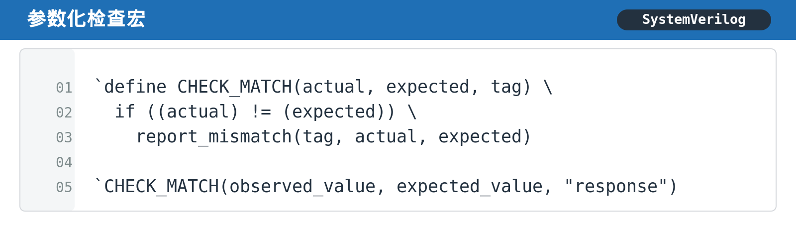
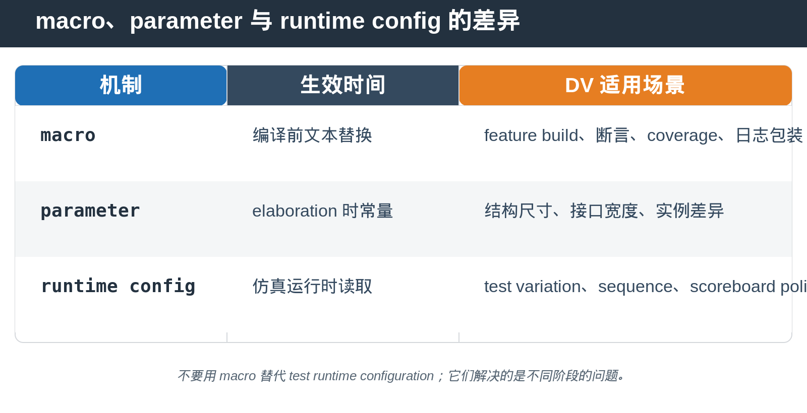
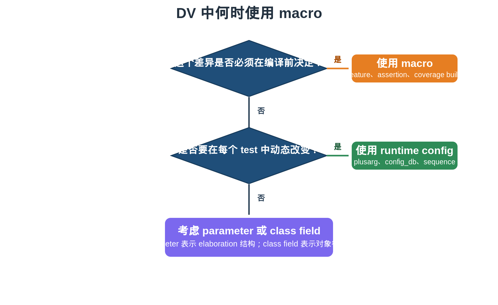
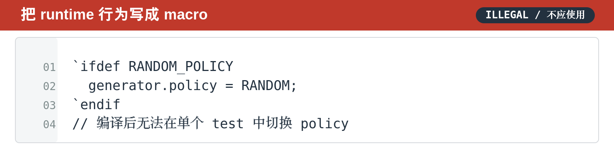

## [SV] 宏定义：DV 中何时该用，何时不该用？

---

### 导读

今天被问到一个很典型的问题：为什么同样是“开关”，有的地方用 `` `ifdef ``，有的地方却要用 plusarg、class field 或 UVM configuration？

根子不在语法，而在生效阶段。宏定义属于 preprocessor，它在 simulator 开始编译前就已经完成工作。理解这一点，很多“宏怎么没有在 test 里生效”的困惑就能立刻消失。

---

### 前置概念速查

SystemVerilog 的宏定义以 `` `define `` 开始。它不是 function，不保存状态，也不会在 runtime 被调用。preprocessor 只是扫描文本，执行替换、展开参数、决定 `` `ifdef `` 分支是否保留，然后把结果交给 compiler。

因此，macro 最擅长解决的是“这次 build 到底编进哪些内容”。它不适合解决“同一个 build 下，不同 test 应该采取什么行为”。

---

### 一、`` `define `` 到底做了什么

最简单的宏可以看作一段可复用文本。下面的 trace 开关在编译时决定采集逻辑是否存在。

如果编译命令没有定义 `ENABLE_TRACE`，`` `ifdef `` 中的文本会在 preprocessor 阶段被裁剪。后面的 compiler 与 simulator 根本看不到那段采集逻辑。

这正是宏适合 feature build 的原因。它可以减少不需要的 assertion、coverage 或 debug logic 的编译规模，避免每次仿真都承担无关开销。

---

### 二、DV 中最常见的五类宏用法

第一类是 **feature switch**。例如某些环境只在特定 regression bucket 中编译额外 coverage，或者只为特定协议版本编进 checker。

第二类是 **assertion switch**。大型环境中的 assertion 往往很多。把 assertion 以编译开关方式组织，可以让 smoke run、debug run 与 signoff run 使用不同的 build policy。

第三类是 **日志与检查包装**。参数化宏可以把重复的检查模式收进一个统一入口，减少不同 component 对 error format 的分歧。

第四类是 **include 选择**。当 interface 定义、checker 集合或平台适配文件必须在编译前选择时，macro 可以避免把所有变体同时编进来。

第五类是 **regression compile option**。同一套 test list 可以通过不同的 compile define 产生不同 build artifact。这里关键是把 build 差异记录在 regression configuration 中，不能依赖人工记忆。

---

### 三、macro、parameter 与 runtime config，不是同一种开关

很多验证环境的问题，是把三个不同阶段的机制混在一起使用。

`parameter` 更接近 elaboration 的结构选择。例如组件数量、位宽或 interface 连接关系需要在实例化时固定。

runtime config 则用于 test variation。例如 sequence 的行为、scoreboard policy、timeout strategy 或 stimulus mode，需要在每个 test 中动态变化。它们应通过 plusarg、config_db 或 object field 控制。

一句话记忆：**编译前决定，用 macro。elaboration 决定，用 parameter。runtime 决定，用 config。**

---

### 四、参数化宏好用，但要注意“展开”而不是“调用”

参数化宏表面上像 function，实际仍然只是文本拼接。下面的 `CHECK_MATCH` 在调用点展开为完整的比较逻辑。

它的好处是统一 checker 的输出格式，让 waveform、log 与 regression report 更容易关联。

但它也有边界：不要把带副作用的 expression 直接塞进宏参数。因为参数可能在宏体中出现多次，展开后就可能被求值多次。对需要计算一次的复杂对象，先放到临时变量，再传给宏更安全。

---

### 五、最容易踩的坑：用 macro 做 runtime policy

下面的写法看起来像“随机策略开关”，实际上它只能决定这段赋值是否被编译进去。

如果一个 regression 想在同一个 compiled image 中运行多种 generator policy，这种 macro 写法就没有帮助。编译结束后，`RANDOM_POLICY` 已经不能再切换。

正确的思路是把 policy 作为 runtime configuration。这样不同 test 可以共享同一 build，只改变启动参数或 UVM configuration，回归资源利用率也更高。

---

### 六、验证中应覆盖什么

**编译组合覆盖。** 对每个 feature macro，至少确认定义与未定义两种 build 都能完成 compile 与 elaboration。只验证定义分支，很容易漏掉裁剪分支里的 include 或 declaration 问题。

**行为一致性。** 当某个 checker 或 coverage 被 macro 控制时，要确认开关只影响预期逻辑，不意外改变 transaction flow、reset sequence 或 scoreboard 判定。

**日志可追溯性。** regression report 应记录本次 build 生效的 defines。否则同一个 test failure 很难判断是 DUT 行为差异，还是编译开关差异。

**runtime 边界。** 对本该在 runtime 改变的 policy，验证 test 能在不重新 compile 的前提下切换。若必须重新 build 才能切换，说明 macro 与 configuration 的职责可能混淆了。

---

### 七、总结

宏定义不是“更短的代码”，而是编译前的结构选择工具。

在 DV 中，`` `define ``、`` `ifdef `` 与参数化宏最适合 feature build、assertion、coverage、统一日志和编译期选择。需要 test 级变化时，应把控制权交给 runtime configuration。

> **判断口诀：要不要重新 compile？要，就考虑 macro。不要，就优先 runtime config。**

---

*本文以通用 SystemVerilog 与 DV 环境为例整理，不依赖特定项目实现。*
