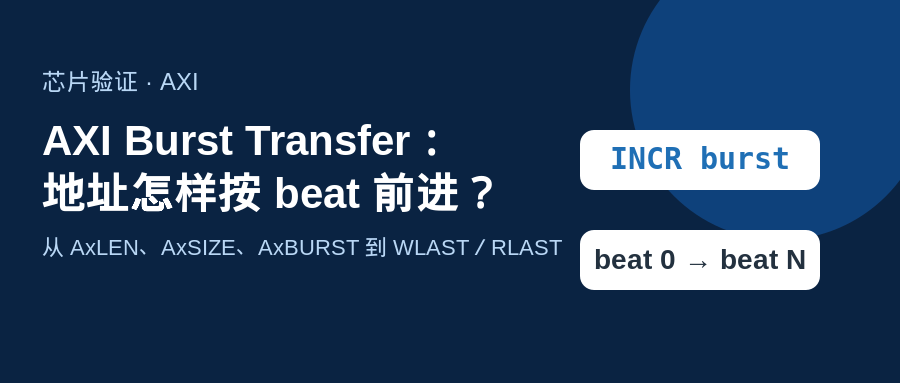
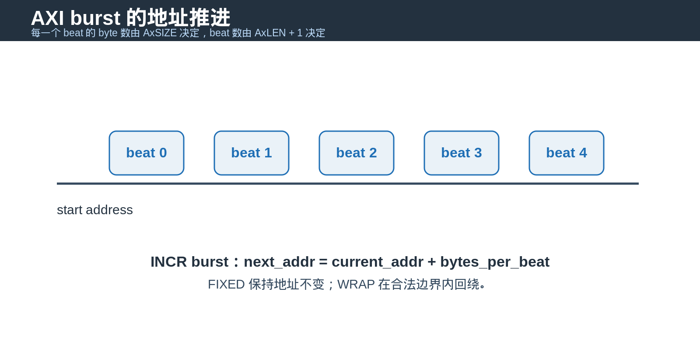
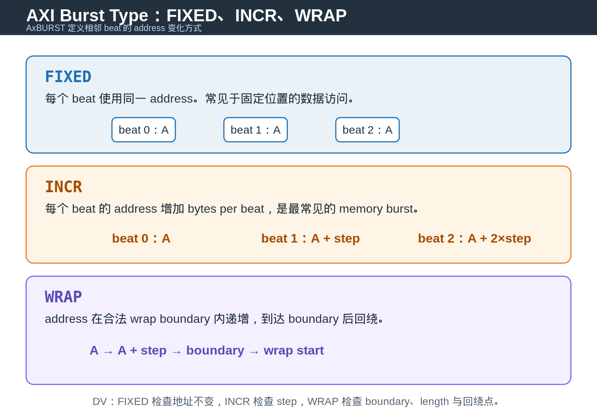
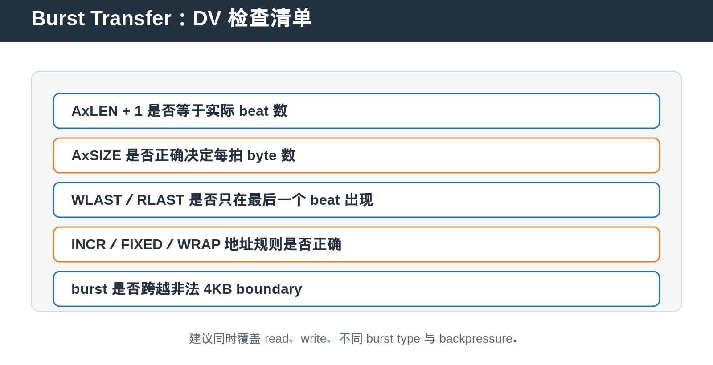

## [AXI] Burst Transfer：地址怎样按 beat 前进？

---

### 导读

AXI burst 最容易被误解成“地址连续传几拍数据”。真正决定一笔 burst 形状的，是 `AxLEN`、`AxSIZE` 与 `AxBURST` 三个字段。

它们分别回答三个问题：一共有多少个 beat，每个 beat 有多少 byte，地址在相邻 beat 之间怎样变化。

---

### 一、先记住：AxLEN 不是总 beat 数

`AxLEN` 表示 burst length 减一。因此实际 beat 数等于 `AxLEN + 1`。

这样定义能让 single-beat transfer 使用零长度编码，同时保留连续的字段取值。DV checker 不应把 `AxLEN` 直接当成 data beat 数，否则 `WLAST` 或 `RLAST` 的位置会整体提前一拍。

---

### 二、AxSIZE 决定每拍推进多少 byte

`AxSIZE` 表示每个 beat 的 byte 数的对数。它不描述 bus 宽度，而是描述本次 transfer 实际使用的粒度。

例如一个宽 bus 可以承载较小 size 的访问。此时 byte lane、`WSTRB`、地址低位与实际有效数据范围必须保持一致。

对 INCR burst，下一拍地址按照 bytes per beat 增加。对 FIXED burst，所有 beat 使用同一个地址。对 WRAP burst，地址到达 wrap boundary 后回绕。

### 三、Burst Type：FIXED、INCR、WRAP

`AxBURST` 定义 burst 中 address 的推进规则。AXI 支持 FIXED、INCR、WRAP 三种主要 burst type。

**FIXED burst** 中，所有 beat 使用同一个 bus address。它常用于 FIFO 或 peripheral data port：bus address 不变，但 target 内部可以通过 write pointer 把数据推进到不同 storage location。

**INCR burst** 中，address 每拍增加 bytes per beat。大多数连续 memory access 都使用这一类型。每一笔 burst 的实际 beat 数由 `AxLEN + 1` 明确决定，address increment 则由 `AxSIZE` 决定。

**WRAP burst** 中，address 先像 INCR 一样递增，到达 aligned wrap boundary 后回到该 boundary 的起点继续访问。它常用于 cache line access，因为 master 可以从当前需要的 word 开始取得数据，再补齐整个 cache line。

DV 不能只检查第一拍 address。FIXED 要确认所有 beat 地址保持一致。INCR 要确认每拍 increment 与 `AxSIZE` 一致。WRAP 要确认 wrap boundary、burst length、address progression 与回绕点同时满足协议约束。

---

### 四、WLAST 与 RLAST 是 burst 完成边界

write path 的 `WLAST` 标记最后一个 write data beat。read path 的 `RLAST` 标记最后一个 read data beat。

对于 request tracker，write transaction 不能在收到第一拍 WDATA 时 retire。它必须等待完整 data burst 被接收，并在后续 `BVALID/BREADY` handshake 后完成。

read transaction 同样不能在第一拍 RDATA 时 retire。最终释放点是 `RVALID`、`RREADY` 与 `RLAST` 同时成立。

---

### 五、为什么 4KB boundary 是 DV 必测项

AXI burst 不应跨越 4KB address boundary。这个限制让下游 decode、translation 与 target routing 可以在较小边界内处理一笔 burst。

DV 中应从接近 boundary 的 address 发起不同 `AxLEN`、`AxSIZE` 组合，确认合法 burst 正常推进，非法组合被拒绝或返回预期 error。

---

### 六、Burst 不是只检查地址

完整的 burst checker 至少同时关注地址、beat 数、last signal、byte enable 与 response。

backpressure 也是必要场景。`WREADY` 或 `RREADY` 拉低时，当前 beat 必须保持稳定，计数不能错误推进，`WLAST/RLAST` 也不能因为 stall 提前或重复出现。

---

### 七、DV 验证建议

首先覆盖 single-beat、short burst 与 long burst。再组合 INCR、FIXED 与 WRAP。

其次覆盖不同 `AxSIZE` 与 address alignment，确认 byte lane 和 `WSTRB` 与有效数据一致。

最后覆盖 last beat stall、response delay、reset 中断 burst、非法 4KB crossing 以及 read/write 并发。对 bridge 类设计，还应确认 burst 被拆分为下游访问后，完成语义仍能正确映射回原始 AXI request。

---

### 八、总结

Burst 的核心关系很简单：`AxLEN + 1` 决定 beat 数，`AxSIZE` 决定每拍 byte 数，`AxBURST` 决定地址推进方式。

> **判断口诀：先算 beat 数，再算每拍 byte，最后检查地址、last 与 response 是否仍在同一笔 burst 内。**

---

*本文以通用 AXI burst 语义与 DV 验证场景整理。*
