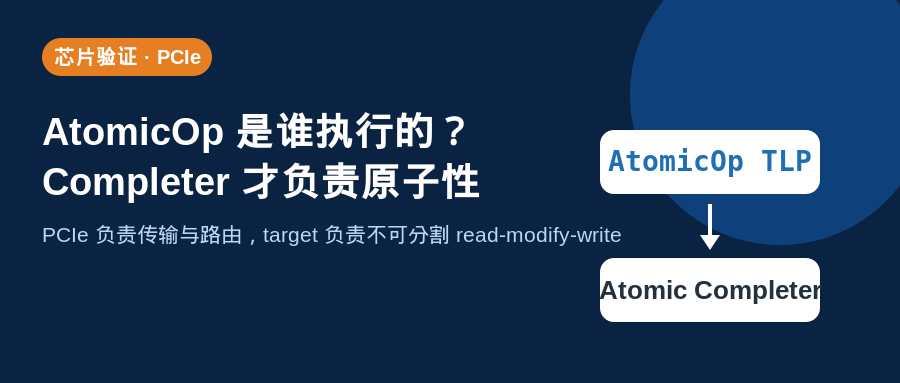

## [PCIE] AtomicOp 是谁执行的：PCIe 负责传输，Completer 负责原子性



---

### 导读

PCIe AtomicOp 很容易被理解成“PCIe 总线自己有原子运算器”。更准确的说法是，PCIe 定义 AtomicOp Request 的 transaction 语义，fabric 负责把 request 传到正确目标，真正执行不可分割 read-modify-write 的是 AtomicOp Completer。

这一区分对 bridge、request tracker 与 DV 很重要。能转发 AtomicOp，不等于能终结并执行 AtomicOp。

---

### 一、AtomicOp 传输的是什么

PCIe AtomicOp 包括 FetchAdd、Swap 与 Compare-and-Swap。它们不能被降级为普通 Memory Read 再加普通 Memory Write。

原因很直接。如果 read 与 write 之间允许另一个 requester 插入访问，原子语义就被破坏了。PCIe transport path 的职责，是把 AtomicOp 作为完整 transaction 保留下来。

---

### 二、谁负责什么

Requester 发起 AtomicOp Request。Link、Switch、Root Complex 或 bridge 负责接收、流控、route、capability 检查与 completion tracking。

AtomicOp Completer 才拥有目标 memory space，并真正执行 compare、add、swap 或内部 serialization。

```text
Requester → PCIe fabric → AtomicOp Completer
发起请求      传输和路由        执行原子 read-modify-write
```

如果一个 bridge 只做 pass-through，它不一定需要 atomic arithmetic logic。但它不能把 AtomicOp 拆分为普通 read/write，也不能把 request 错误送到 unsupported target。

---

### 三、什么时候 bridge 必须实现 atomic logic

如果 AtomicOp address 最终命中 bridge 后面的 local memory、register aperture 或 internal storage，bridge 或其下游 target 就是 Completer。

此时必须保证同一 atomic address 的 operation 不会被其他 request 插入。内部实现可以是 lock、reservation、serialization 或 dedicated atomic state machine，但结果必须是不可分割的。

如果 bridge 只是 route path，则主要验证 capability、route、backpressure、outstanding tracking 与 completion matching。

---

### 四、DV 应该分两层验证

第一层是 transport 与 routing。验证 AtomicOp capability、Requester Enable、address route、unsupported path、ID matching、backpressure 和 reset 后 stale completion。

第二层是 Completer atomic logic。验证 FetchAdd、Swap、CAS compare hit／miss、多 requester 同地址并发、AtomicOp 与 normal access 的竞争，以及 reset／timeout 中断路径。

最容易漏掉的是并发场景。单 requester 下，即使设计错误地把 AtomicOp 拆成 read/write，也可能看起来正确。必须让多个 requester 对同一 address 竞争，才能验证原子性是否真实存在。

---

### 五、总结

PCIe 支持 AtomicOp transaction，但不是每个 PCIe component 都需要实现 atomic engine。

> **只转发，保护 AtomicOp 语义。要终结，必须执行 AtomicOp 原子性。**

---

*本文以通用 PCIe AtomicOp 与 DV 验证语义整理。*
