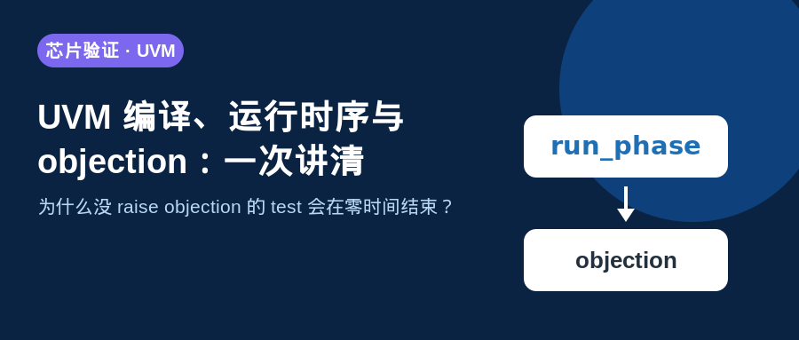
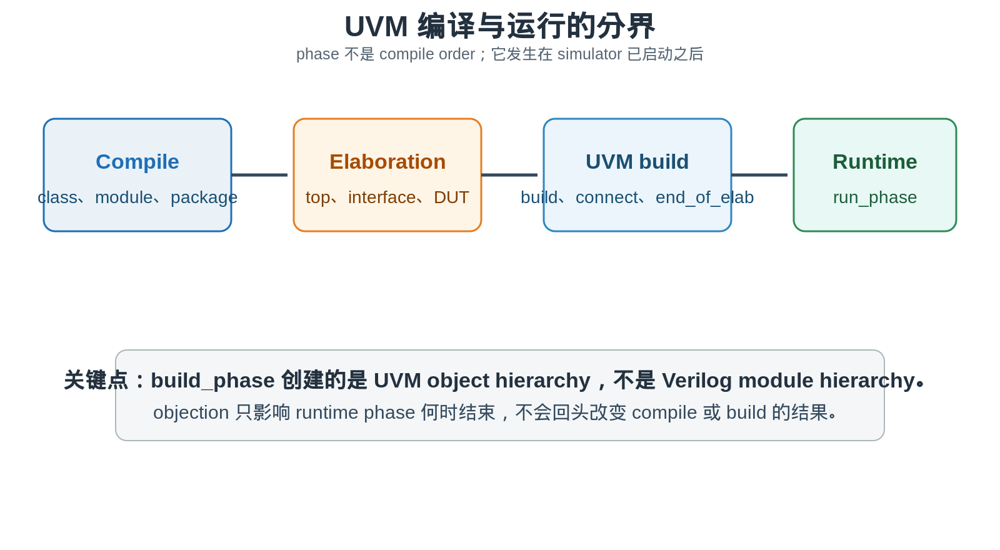
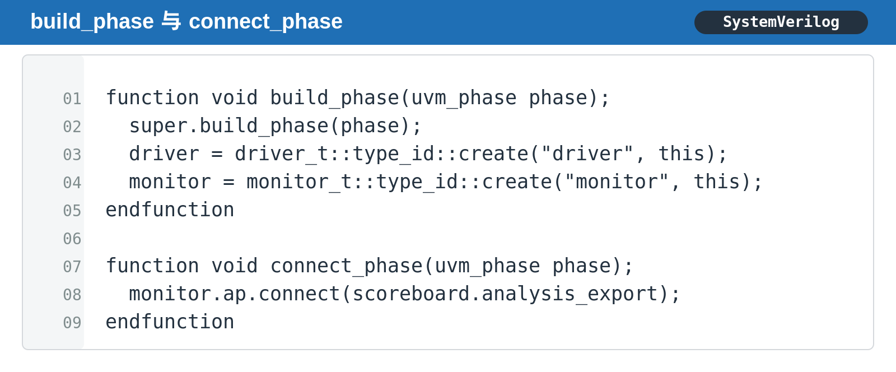
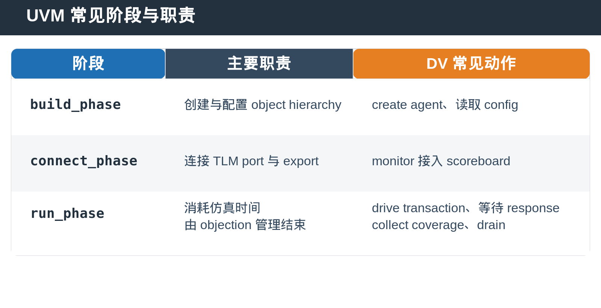
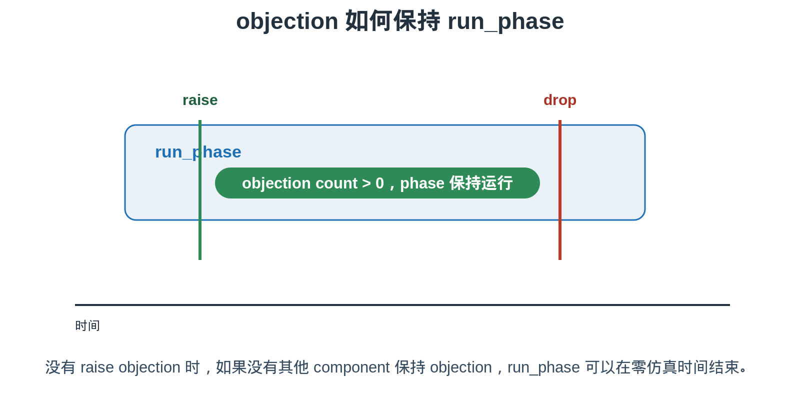
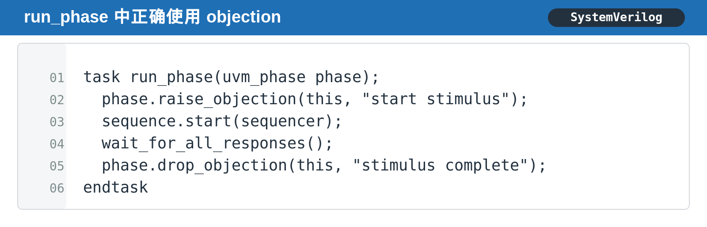
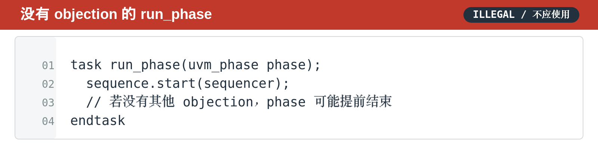

## [UVM] 编译、运行时序与 objection：一次讲清 phase 为什么会提前结束

---

### 导读

做 UVM bring-up 时，最容易遇到一种让人困惑的现象：log 已经打印了 build_phase，却还没看到预期 transaction，仿真就结束了。

很多人第一反应是“run_phase 没有执行”。实际更常见的原因是：run_phase 已经启动，但没有任何 objection 把 runtime phase 留住。要理解这个问题，必须先把 compile、elaboration、UVM phase 和 objection 放到同一条时间线上。

---

### 前置概念速查

compile 负责把 package、class、module 和 interface 编译成 simulator 可以加载的形式。elaboration 负责把 top、DUT、interface 等硬件结构展开。

UVM 的 build_phase、connect_phase 和 run_phase 则发生在 simulator 已经开始执行之后。它们管理的是 class-based verification environment，不会重新实例化 Verilog module。

---

### 一、build_phase 不是“编译阶段”

`build_phase` 的名字很容易让人误会。它不是 compiler build，而是 UVM component hierarchy 的 construction phase。

在这个阶段，environment 通常创建 agent、driver、monitor、scoreboard 等 object，并读取 configuration。这里创建的是 class object，不是 RTL instance。

`connect_phase` 紧随其后。它的重点不是再创建 component，而是连接 analysis port、export、FIFO 或其他 TLM connection。若 monitor 没有在这里接入 scoreboard，后续即使 bus 上有 transaction，scoreboard 也收不到。

---

### 二、为什么 run_phase 才开始“真正跑起来”

run_phase 是 time-consuming phase。driver 在这里等待 clock、发送 transaction，monitor 在这里采样 interface，sequence 在这里产生 stimulus。

这也是 UVM phase 中最关键的分界：build_phase 和 connect_phase 可以在零仿真时间完成，run_phase 则必须通过 event、clock 或 delay 推进 simulation time。

如果一个 test 在 build_phase 中完成了大量 log 输出，但 run_phase 没有保留 objection，仿真并不会因为“环境已经建立”而自动等待 stimulus。

---

### 三、objection 到底在控制什么

objection 不是启动 run_phase 的开关。phase scheduler 会启动 run_phase。

objection 控制的是：当所有 participant 都不再反对结束时，runtime phase 是否可以结束。`raise_objection` 把 objection count 增加，`drop_objection` 把 count 减少。只有 count 回到零，并且没有其他 component 持有 objection 时，phase 才能继续结束流程。

一个常见而可靠的模式是：test 或 virtual sequence 在开始 stimulus 前 raise，在最后一个 response、coverage 或 drain condition 完成后 drop。

---

### 四、没有 objection 时为什么会“零时间结束”

下面这种 run_phase 并不一定有语法错误，但它没有明确告诉 scheduler：“这段 test 还没有完成。”

如果没有其他 component raise objection，scheduler 可能在 delta cycle 内就看到 objection count 为零，于是允许 run_phase 结束。外部表现通常是：仿真正常退出，没有 fatal，但 waveform 几乎没有有效 transaction。

这类问题特别容易发生在刚搭建 testbench 时。driver、monitor 都已创建，sequence 也写了，却因为 test 没有管理 objection，整个 runtime 过早结束。

---

### 五、objection 应该由谁管理

最常见的 owner 是 test。因为 test 最清楚本次场景什么时候开始、什么时候满足完成条件。

对于复杂 virtual sequence，也可以由 sequence 持有 objection。但 ownership 必须清晰。不要让多个地方无约束地 raise 和 drop，否则一旦某条 error path 漏掉 drop，simulation 会一直挂住。

一个实用原则是：**谁定义 test completion condition，谁管理 objection。**

completion condition 不应只写成“sequence 返回”。若 response 仍在路上、scoreboard 仍有 outstanding transaction，过早 drop 会掩盖真正的 bug。

---

### 六、DV 中应覆盖的几个时序边界

**build 与 connect 完整性。** 验证所有 monitor 的 analysis port 都连接到预期 consumer。若某个 connection 漏掉，run_phase 即使活着，scoreboard 仍可能沉默。

**objection 正常路径。** sequence 启动、response 完成、scoreboard 清空后，objection 应恰好 drop 一次，phase 可以自然结束。

**error path。** 注入 timeout、protocol error 或 sequence abort，确认 cleanup path 仍会 drop objection，避免 regression hang。

**drain 行为。** 最后一个 stimulus 结束不等于 verification 完成。若还有 delayed response、analysis FIFO 或 coverage sampling，应把 drain condition 纳入 completion policy。

---

### 七、总结

compile 决定代码能否进入 simulator。elaboration 决定硬件结构如何展开。UVM build 与 connect phase 决定 verification object 怎样创建和连接。run_phase 才真正消耗仿真时间。

objection 的职责不是“让 run_phase 开始”，而是阻止 runtime phase 在工作尚未完成时结束。

> **判断口诀：环境创建看 build，连接关系看 connect，时间推进看 run，结束时机看 objection。**

---

*本文基于通用 UVM phase 语义与 DV testbench 实践整理。*
