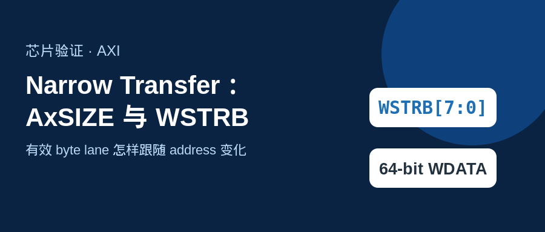
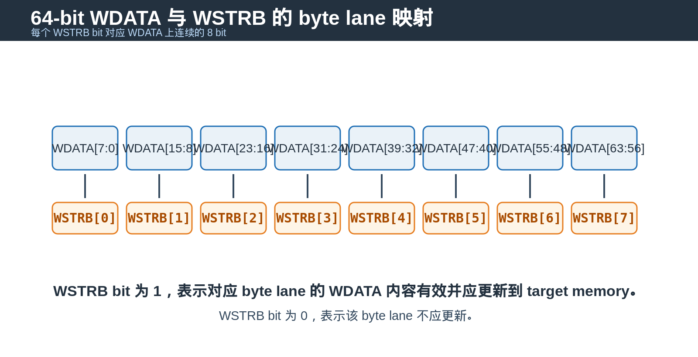
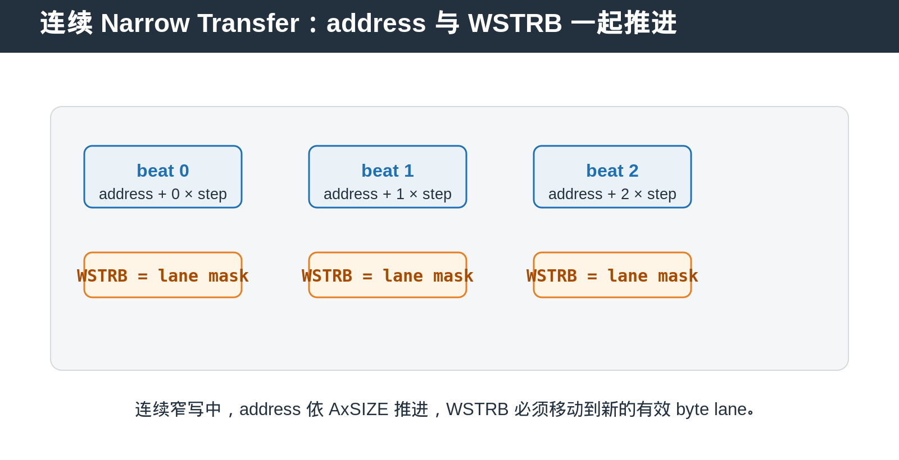

## [AXI] Narrow Transfer：AxSIZE、address 与 WSTRB 怎样共同决定有效 byte lane

---

### 导读

bus data width 很宽，不代表每一笔 AXI write 都必须写满整个 data bus。实际系统中经常只更新一个 byte、halfword 或某个寄存器字段。

这类访问通常称为 Narrow Transfer。理解它的关键不是只看 `WSTRB`，而是同时看 `AxSIZE`、address alignment、burst address progression 与 byte lane mask。

---

### 前置概念速查

`WDATA` 是 write data bus。一个 **byte lane** 是 WDATA 上连续的 8 bit 数据通道。`WSTRB[n]` 对应第 `n` 个 byte lane，表示该 lane 是否应更新 target memory。

`AxSIZE` 描述每拍 transfer 的有效 byte 数。Narrow Transfer 指 transfer size 小于 bus data width 的访问，不等同于 unaligned transfer。

因此，`AxSIZE` 决定访问粒度，address 决定数据落在哪组 lane，`WSTRB` 决定当前 write beat 哪些 lane 真正写入。

---

### 一、Narrow Transfer 不只是 WSTRB

严格来说，Narrow Transfer 的 transfer size 由 `AxSIZE` 定义。它说明每个 beat 有多少有效 byte。

`WSTRB` 只存在于 write data channel。它进一步说明当前 `WDATA` bus 上哪些 byte lane 含有有效写数据。read transfer 没有 `WSTRB`，read 的有效 byte 范围由 address、`AxSIZE` 和 target behavior 决定。

因此，`AxSIZE` 决定“本次访问的粒度”，`WSTRB` 决定“当前 write beat 哪些 lane 真正更新”。

---

### 二、64-bit WDATA 上的 WSTRB 关系

对于 64-bit data bus，`WDATA` 有 8 个 byte lane，因此 `WSTRB` 也有 8 bit。

每个 `WSTRB[n]` 对应 `WDATA[(8×n)+7:8×n]`。当该 strobe bit 为 1，对应 byte lane 的数据有效并应写入 target memory。为 0 时，该 byte lane 不应被更新。

这就是 sparse write 的基础。master 可以只更新一个 byte lane，而不覆盖同一个 bus word 中的其他 byte。

---

### 三、连续 Narrow Transfer 中，strobe 不能固定不动

当 INCR burst 连续进行 narrow write 时，address 会按 `AxSIZE` 推进。随着 address 低位变化，有效数据所在的 byte lane 也会改变。

因此，连续 narrow transfer 中不能只在第一拍计算一次 `WSTRB`，然后在所有 beat 复用。每一拍都必须根据当前 address、transfer size 与 data placement 产生对应的 lane mask。

这也是 narrow write 能被 bridge、memory controller 或 merge buffer 合并的基础：系统能明确知道每一拍更新了哪几个 byte，而不会误覆盖相邻有效数据。

---

### 四、FIXED、INCR burst 下的 Narrow Transfer

FIXED burst 中，bus address 不变，因此有效 byte lane 通常保持在同一组 lane。它适合固定地址的 FIFO data port 或 peripheral register access。

INCR burst 中，address 按 bytes per beat 推进，lane mask 通常也会随 address alignment 变化。memory access 中最常见的 narrow transfer 就属于这一类。

如果一个 target 只支持 full-width access，bridge 可能需要把 narrow write 转换为 read-modify-write 或 byte-enable write。这个转换必须保护未被 `WSTRB` 选中的 byte。

---

### 五、DV 验证应检查什么

第一，确认 `AxSIZE` 与每拍有效 byte 数一致。

第二，确认 `WSTRB` 只断言包含有效数据的 byte lane。无效 lane 即使 `WDATA` 上有值，也不能更新 target memory。

第三，连续 INCR narrow write 中，确认 address progression 与 strobe lane progression 一致。

第四，确认 partial write 后，未被 strobe 选中的 byte 保持旧值。read-after-write 是最有效的检查方式之一。

第五，覆盖不同 alignment、不同 size、backpressure、burst last beat 与 reset 中断场景。

---

### 六、总结

Narrow Transfer 的重点不是“少传一些数据”，而是精确描述哪些 byte 有效、这些 byte 位于 data bus 的哪个 lane，以及连续 burst 时它们怎样随 address 移动。

> **判断口诀：AxSIZE 决定访问粒度，address 决定 lane 位置，WSTRB 决定哪些 byte 真正更新。**

---

*本文以通用 AXI write semantics 与 DV 验证场景整理。*
