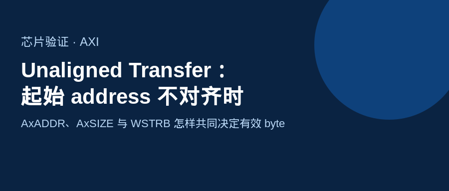
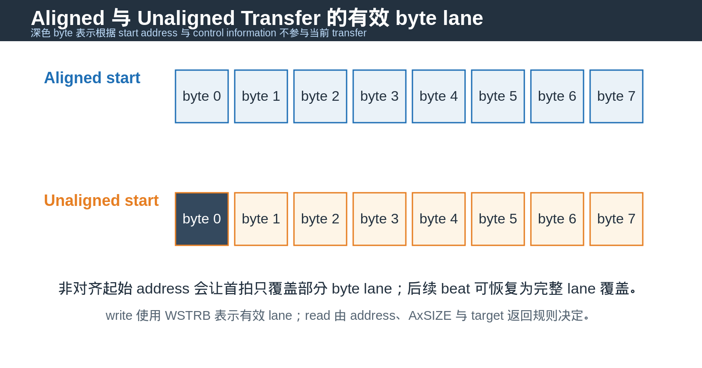
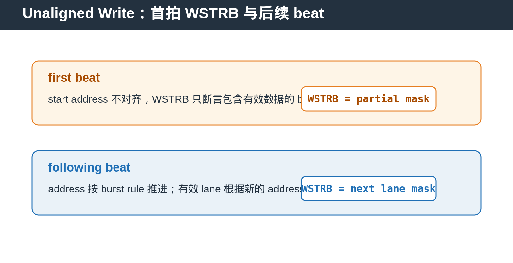

## [AXI] Unaligned Transfer：起始 address 不对齐时，数据到底落在哪些 byte lane

---

### 导读

通常每个 AXI transfer 都按 transfer size 对齐。例如 32-bit transfer 常见于 4-byte aligned address。

但 AXI 也允许从非对齐 start address 发起 transfer。此时最容易出错的不是 address 本身，而是首拍有效 byte、`WSTRB`、burst address progression 与 target memory update 是否仍然一致。

---

### 一、什么是 Unaligned Transfer

Unaligned Transfer 指 start address 不是本次 transfer size 的自然对齐地址。

例如一个 4-byte transfer 从 address offset 不是 4-byte boundary 的位置开始。`AxADDR` 仍然携带真实的 start address，不需要人为把它伪装成另一个对齐地址。

非对齐不表示协议不清楚数据位置。address、`AxSIZE` 与 burst control 共同决定有效数据的位置。

---

### 二、Write path：WSTRB 指出哪些 byte 真正更新

`WSTRB` 只存在于 AXI write data channel。每个 bit 对应 `WDATA` 上的一个 byte lane。

当 strobe bit 为 1，对应 byte lane 的数据有效并应更新 target memory。为 0 时，即使 `WDATA` 上有值，该 lane 也不能覆盖原有 memory 内容。

因此，Narrow Transfer 与 Unaligned Write 都需要检查 `WSTRB`。但它们不是同一个概念：`AxSIZE` 描述访问粒度，`WSTRB` 描述当前 write beat 哪些 lane 被真正写入。

---

### 三、首拍通常最特殊

在 unaligned burst 中，首拍常只覆盖部分 byte lane。后续 beat 的 address 按 `AxBURST` 与 `AxSIZE` 推进，有效 lane 也必须根据新 address 重新计算。

不能只在第一拍计算 `WSTRB` 并在后续 beat 复用。特别是在 INCR burst 中，address 低位变化会导致有效 byte lane 发生移动。

---

### 四、Read path 没有 WSTRB

read transfer 没有 `WSTRB`。manager 使用 address 和 `AxSIZE` 描述它需要的数据范围，target 返回的数据如何放置在 read data bus 上需要遵守 AXI data alignment 规则。

所以 DV 中不要把 write 的 `WSTRB` checker 直接套到 read path。read path 应检查 address、size、beat progression、`RLAST` 与返回数据的 byte mapping。

---

### 五、为什么 bridge 与 memory controller 特别关心它

对 full-width memory interface，unaligned write 可能需要 partial byte-enable write，或在不支持 byte-enable 的内部 storage 中执行 read-modify-write。

这里最重要的要求是：未被 `WSTRB` 选中的 byte 必须保持旧值。一个很有效的验证方法是先写入已知 pattern，再发 partial write，最后 read back 整个 word 检查相邻 byte 没有被误改。

---

### 六、DV 检查点

覆盖不同 start address alignment 与不同 `AxSIZE`。

覆盖首拍 partial mask、后续 beat lane shift、最后一拍 partial update。

覆盖 INCR burst、FIXED burst、backpressure、reset 中断与 read-after-write。

覆盖 memory byte preservation：任何 `WSTRB` 为 0 的 lane 都不能在 write 后变化。

---

### 总结

Unaligned Transfer 的核心不是“地址不整齐”，而是确保 address、transfer size、byte lane 与 write strobe 始终描述同一组有效数据。

> **判断口诀：start address 决定从哪里开始，AxSIZE 决定访问多少 byte，WSTRB 决定 write beat 中哪些 byte 真正更新。**

---

*本文以通用 AXI unaligned transfer 与 DV 场景整理。*
