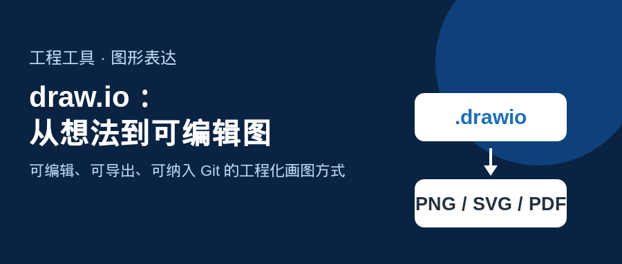
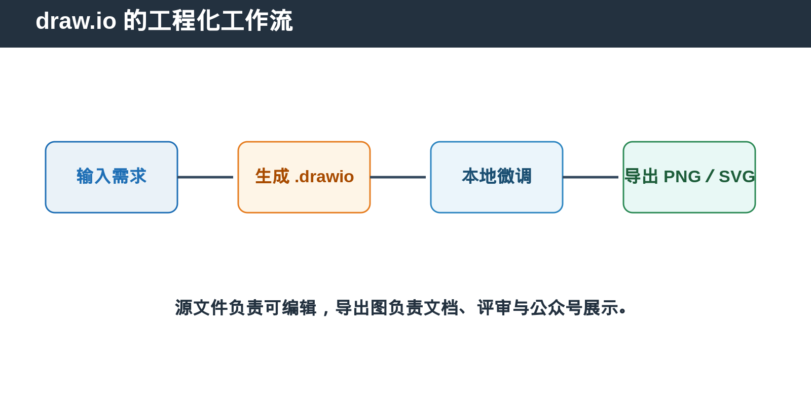
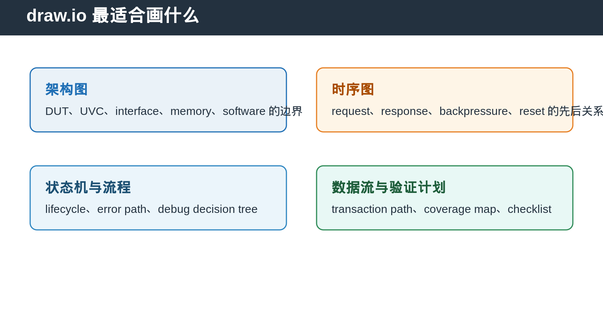

## [日常问题] draw.io：从想法到可编辑图的工程化方法

---

### 导读

很多工程图的问题不在于不会画，而在于图散落在聊天记录、截图和临时白板里。过几周再看，没人知道它的源文件在哪里，也没人敢改。

draw.io 的价值，是把“图”当作和代码一样可保存、可修改、可评审的工程资产。

---

### 一、draw.io 是什么

draw.io 是 diagram 工具，用于创建架构图、流程图、时序图、状态机和数据流图。它可以把图保存为可编辑的 `.drawio` 源文件。

对工程团队来说，重点是文件可控。`.drawio` 源文件可以和 Markdown、testplan、verification checklist 放在同一个 Git repository 中。PNG、SVG 或 PDF 是发布产物，`.drawio` 则是后续修改的源文件。

---

### 二、它适合画哪些图

draw.io 最适合表达“元素之间的关系”，例如组件连接、状态转换、数据流、请求生命周期和调试决策。

在 DV 中，最常见的实际用途包括：

- DUT、agent、monitor、scoreboard 与 reference model 的架构图。
- AXI、PCIe、APB 等 interface 的 request／response 时序图。
- reset、flush、error recovery、outstanding request 的 lifecycle 图。
- regression 执行流程、debug decision tree、coverage closure checklist。

---

### 三、draw.io 有什么优点

第一，**源图可编辑**。不要只保存截图。需求变了、信号变了、模块边界变了，都可以打开 `.drawio` 修改，而不是重新画一张。

第二，**导出格式灵活**。同一张源图可以导出 PNG 用于公众号和 Markdown，导出 SVG 用于高分辨率文档，导出 PDF 用于评审材料。

第三，**适合 Git 管理**。推荐把 `.drawio` 与导出的 PNG 一起提交。review 时读者直接看 PNG，维护者需要修改时打开 `.drawio`。

第四，**适合工程环境**。图可以作为 repository asset 管理，也可以在需要时导出成适合文档、评审或公众号的图片。

---

### 四、怎么开始使用

如果本机已经能打开 draw.io Desktop，就不需要重复安装。

Windows 通常使用安装程序版本。macOS 使用 Desktop app。Linux 可按团队环境选择 AppImage、Deb／RPM 或系统包管理方式。安装后确认应用能新建空白 diagram，并能保存为 `.drawio`。

对自动化导出场景，还应确认命令行可用。常见形式是：`drawio -x -f png -o output.png input.drawio`。它把可编辑源图导出为 PNG，适合在发布文章或生成文档时使用。

---

### 五、几个实用操作

**场景一：画 verification architecture。**

先画 DUT，再放 interface、agent、monitor、scoreboard 和 reference model。箭头只表示一种语义，例如 transaction、analysis data 或 configuration，不要让一条线同时承担多种含义。

**场景二：画协议时序。**

横向表示时间，纵向表示 component。先画 handshake 条件，再补充 stall、timeout、error path。不要先堆很多信号名，否则读者看不出因果关系。

**场景三：把自然语言变成图。**

先写清楚四件事：有哪些 node、谁连接谁、箭头代表什么、异常路径怎么走。然后生成初稿，再在 draw.io 中调整颜色、间距、文字和 routing。

**场景四：导出给公众号。**

发布版使用 PNG。保持大字号，避免浅色字体和过密文字。源图保留 `.drawio`，PNG 只负责展示。

---

### 六、画图时最常见的坑

不要把所有信息塞进一张图。架构图回答“谁和谁相连”，时序图回答“先后发生什么”，状态机回答“状态怎么切换”。三个问题最好用三张图。

不要只靠颜色表达语义。颜色应有图例，箭头、线型和标签也要能独立说明关系。

不要导出后才发现文字太小。发布图应先按最终阅读场景检查。公众号图片通常需要比 IDE 截图更大的字体。

---

### 七、总结

draw.io 不是单纯的画图工具，而是一种把工程知识变成可维护资产的方法。

> **`.drawio` 是源文件，PNG／SVG／PDF 是发布文件；先保证可编辑，再保证好看。**

---

*本文以 draw.io 的通用工作流与 DV 工程实践整理。*

复杂图的可编辑源文件可从以下 GitHub 目录获取：

https://github.com/daxuxuxu/wechat_airtual/tree/main/7_16/drawio_local
