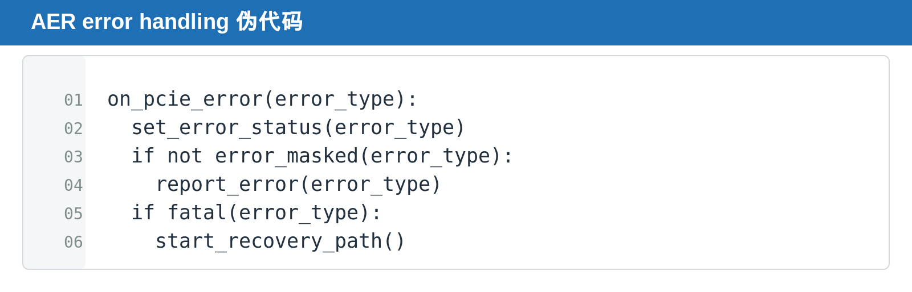

## [PCIe] AER：PCIe Function 怎样记录、屏蔽和上报错误

---

### 导读

PCIe error 最危险的情况不是报错本身，而是硬件记录的 state、software 看到的 message 和真正需要的 recovery action 三者不一致。AER 的价值正是把“发生了什么”“是否上报”“严重到什么程度”拆开管理。

本文解释 Correctable、Non-Fatal、Fatal 与 error logging，并把它们落到 Function scope 的验证方法。

---

### 前置概念速查

AER 是 Advanced Error Reporting。它把 PCIe error 分类、记录、屏蔽和上报，使 software 能区分可恢复问题与需要恢复的严重问题。

---

### 一、AER 解决的不是“有没有报错”，而是“错误能不能被软件理解”

PCIe fabric 中的错误并不总是同一种性质。有些错误可被链路层恢复，有些错误会让单笔 request 失败，还有些错误意味着 Function 或 link 已经不再可信。

如果硬件只给 software 一个笼统的 error interrupt，driver 无法知道是否需要 retry、reset Function、重新训练 link，还是只记录一次日志。AER 把错误拆成 status、mask、severity 与 reporting path，使错误从一个瞬时 event 变成可诊断、可恢复、可追踪的状态。

因此，AER 的概念边界是：它不负责修复所有错误，而是提供足够准确的错误语义，让 hardware policy 与 software recovery 能协同工作。

### 二、错误不只是一个 interrupt

Correctable、Non-Fatal 与 Fatal 表示不同严重程度。status 记录发生过什么，mask 决定哪些 error 被屏蔽，severity 决定 error 的处理等级。

---

### 三、Function scope 的 error state

AER capability 与 error register 属于 Function Configuration Space。多 Function device 中，一个 Function 的 error reporting 不应污染其他 Function。

---

### 四、DV 应覆盖什么

覆盖 error injection、mask/unmask、severity、first error、repeated error、status clear、reset/FLR 后清理与 error message 路径。

### 五、status、mask 与 severity 不能混为一谈

status 回答“发生过什么错误”。mask 回答“这个错误是否需要对 software 可见”。severity 回答“若上报，它属于可恢复问题还是需要更强恢复动作的问题”。

一个常见错误是只检查 error message 有没有发出，却没有检查 status 是否被记录、mask 后是否仍然保留内部状态、clear 后是否能再次捕获同类错误。

### 六、DV 的实战顺序

先注入单一 error，确认 status 与 severity。再打开 mask，确认上报行为改变但设计没有丢失必要状态。最后连续注入多种 error，验证 first error、repeated error、reset/FLR cleanup 与 Function isolation。

### 七、为什么 mask 不应等于忽略 error

mask 的作用是控制软件可见的 error reporting，不代表硬件可以忘记该 error 对内部 state 的影响。例如某些 protocol violation 即使被 mask，也可能要求 request abort、queue cleanup 或 transaction recovery。

验证时应把“是否报告”和“是否记录”分开检查。被 mask 的 error 可能不触发外部 message，但 status、counter 或 debug log 是否保留，要依据设计的 error policy 明确验证。

### 八、Function isolation 的意义

multi-Function device 中，AER register、mask 和 severity 通常属于 Function scope。一个 Function 的 malformed request 不应让另一个 Function 的 status 被置位，也不应让另一个 Function 的 traffic 被无故阻断。

这类问题很适合用并发 error injection 验证：同时给两个 Function 制造不同 error，确认 report、status clear、reset 和 recovery 都保持独立。

---

### 总结

AER 不是单一 interrupt，而是一套 error state machine。验证必须同时确认 detection、record、mask、severity、report、clear 和 reset cleanup，缺任何一环都会让 software debug 失去可信度。
