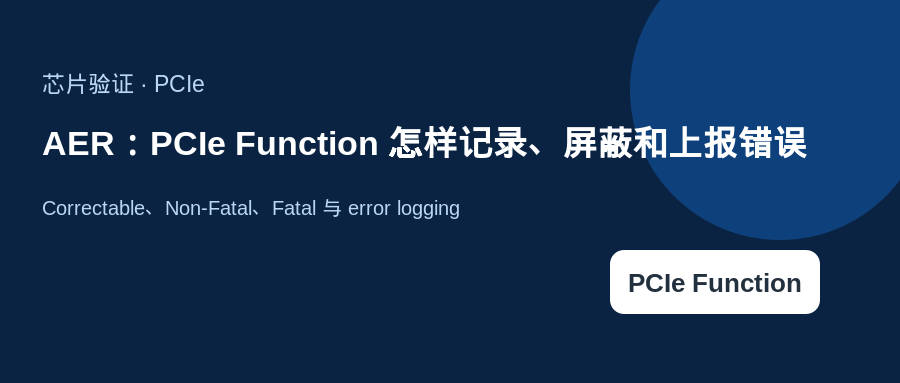
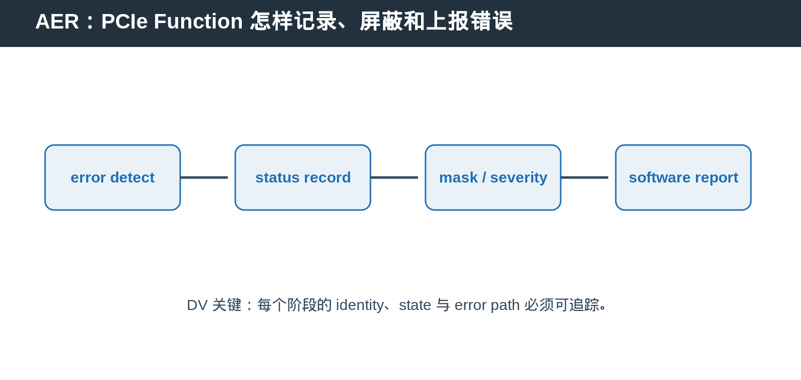

## [PCIe] AER：PCIe Function 怎样记录、屏蔽和上报错误

---

### 导读

本文介绍 Correctable、Non-Fatal、Fatal 与 error logging。

---

### 前置概念速查

AER 是 Advanced Error Reporting。它把 PCIe error 分类、记录、屏蔽和上报，使 software 能区分可恢复问题与需要恢复的严重问题。

---

### 一、错误不只是一个 interrupt

Correctable、Non-Fatal 与 Fatal 表示不同严重程度。status 记录发生过什么，mask 决定哪些 error 被屏蔽，severity 决定 error 的处理等级。

---

### 二、Function scope 的 error state

AER capability 与 error register 属于 Function Configuration Space。多 Function device 中，一个 Function 的 error reporting 不应污染其他 Function。

---

### 三、DV 应覆盖什么

覆盖 error injection、mask/unmask、severity、first error、repeated error、status clear、reset/FLR 后清理与 error message 路径。

---

### 总结

PCIe Function 相关能力的难点，不只是 capability bit，而是 capability、control、transaction state 与 reset/error path 是否一致。
