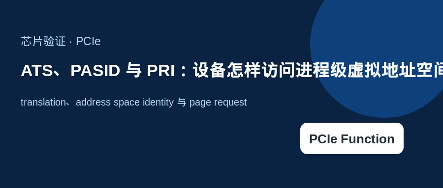
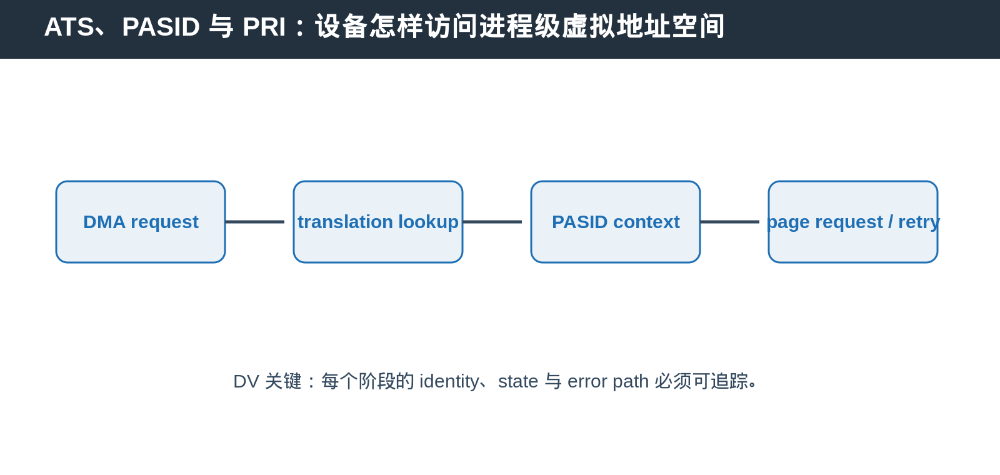
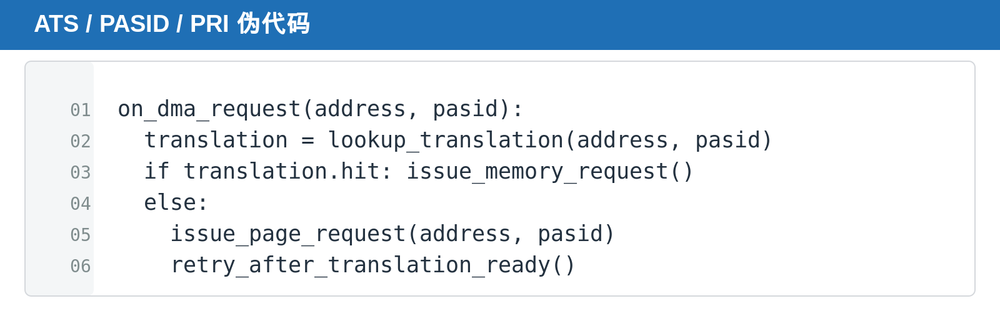

## [PCIe] ATS、PASID 与 PRI：设备怎样访问进程级虚拟地址空间

---

### 导读

本文介绍 translation、address space identity 与 page request。

---

### 前置概念速查

ATS 让 device 请求 address translation。PASID 用于标识 process address space。PRI 用于在 translation 缺失时发起 page request。

---

### 一、为什么 device 需要虚拟地址语义

高性能 accelerator 或 DMA engine 需要与 software process 的地址空间协作。仅使用固定 physical address 会限制隔离、共享与虚拟化能力。

---

### 二、三个能力如何配合

PASID 先说明请求属于哪个 address space。ATS 用于获取 translation。PRI 在 page 不存在或 translation 无法完成时通知 software 处理。

---

### 三、DV 应覆盖什么

覆盖 capability enable、PASID matching、translation hit/miss、invalidations、page request、retry、reset/FLR 与 error reporting。

### 四、三个能力分别解决什么

PASID 先回答“这个 request 属于哪个 process address space”。ATS 再回答“这个 virtual address 对应什么 translation”。PRI 则处理 translation 不可用、page 尚未准备好的情况。

把这三个机制混在一起会让 debug 很困难。更好的做法是按 request lifecycle 建模：带 PASID 的 request 发出，translation hit 则继续 memory access，translation miss 则进入 page request 或 retry path。

### 五、DV 的高价值组合

覆盖相同 virtual address、不同 PASID；translation hit 后 invalidation；page request 后 retry；以及 reset/FLR 发生在 translation outstanding 期间的 cleanup。重点不是只看 request 发出，而是确认 translation state 不会跨 process 或跨 reset 泄漏。

---

### 总结

PCIe Function 相关能力的难点，不只是 capability bit，而是 capability、control、transaction state 与 reset/error path 是否一致。
