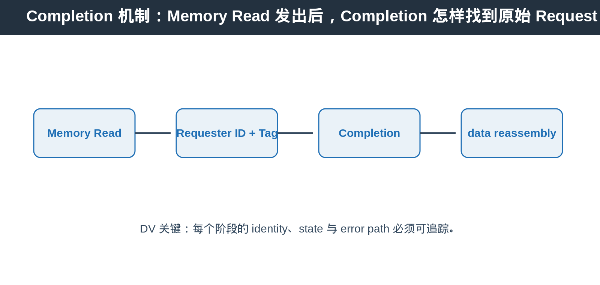
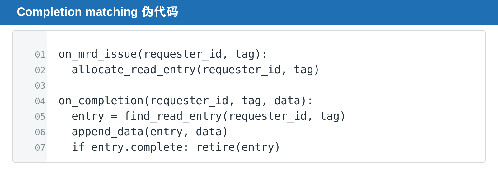

## [PCIe] Completion 机制：Memory Read 发出后，Completion 怎样找到原始 Request

---

### 导读

Memory Read 看起来像一笔 request，实际上它把“什么时候拿到数据”的责任留给了 Completion path。只要 Completion matching 有一处状态错位，最常见的结果不是立即 protocol fatal，而是 data 被交给错误 request、tag 不能 reuse 或最终 timeout。

本文从一笔 MRd 的生命周期出发，解释 Requester ID、Tag、Byte Count、Lower Address 与 completion split 如何共同完成 read response 的重组。

---

### 前置概念速查

Memory Read 是 Non-Posted Request。Requester 发送 MRd 后必须等待 Completion。Requester ID 与 Tag 用于把 Completion 匹配回原始 Request。

---

### 一、先理解“请求完成”和“数据返回”不是同一件事

在普通软件函数里，调用 read 往往意味着“立刻得到数据”。PCIe Memory Read 不是这样。Requester 先把“我需要这个地址的数据”的 request 放进 fabric，目标端何时处理、何时返回、一次返回多少 data，都可能晚于 request 发出的时刻。

因此 PCIe 把 read 分成两段：MRd 表示需求，Completion 表示结果。这个拆分让 fabric 可以同时服务很多 request，也让 long-latency memory、switch、bridge 与不同 target 能并发工作。

Completion 机制解决的是 **asynchronous read response** 问题。Tag、Requester ID、Byte Count 和 Lower Address 并不是额外负担，而是让多个未完成 read 在同一条 path 上并存、并在之后重新归属的“回执信息”。

### 二、为什么一笔 Read 不一定只返回一笔 Completion

read request 可能因为 payload boundary、target response 或 implementation 约束被拆成多个 Completion with Data。Requester 必须按 Tag、Byte Count、Lower Address 与 data ordering 重新组装。

---

### 三、Tag 是 request 的身份凭证

同一个 Requester 可以同时发出多笔 MRd。Tag 让多个 outstanding read 可以并发，Completion 返回时才能准确找到等待它的 request entry。

---

### 四、DV 应覆盖什么

覆盖 completion split、out-of-order completion、unknown Tag、duplicate completion、Completion Timeout、reset 后 stale completion 与 tag reuse。

### 五、为什么 Completion matching 容易出错

Completion 不是只靠一个 Tag 就能验证完整。Requester ID、Tag、请求长度、已接收 byte 数和最后一个 completion 的边界需要共同构成 request tracker 的状态。

当一个 request 被拆成多个 Completion 时，checker 应持续累积 data 与 byte count。只有所有预期 byte 都返回后，read entry 才能 retire。过早 retire 会让后续 Completion 变成 unknown response；过晚 retire 则会阻塞 tag reuse。

### 六、Debug 时先看什么

先看 request issue 时是否正确记录 Requester ID 与 Tag。再看 Completion 返回的 Tag 是否匹配、Byte Count 是否递减、Lower Address 是否与当前 payload 位置一致。最后检查 timeout 或 reset 后是否仍有旧 Completion 返回。

### 七、为什么 split Completion 不能只用一个计数器处理

一个 read request 可能跨越多个 payload fragment。每个 Completion 返回的数据量不一定相同，最后一个 Completion 也不一定在时间上紧接前一个。

因此 checker 不能只维护“还差几个 Completion”。它至少要知道 request 的原始 byte range、当前已接收 byte 数、下一个 expected data position，以及该 entry 是否仍属于当前 reset epoch。只有这些状态同时一致，才能确认 data reassembly 正确。

对 bridge 或 requester tracker 来说，Completion path 往往还会与其他 request 交错。一个 Tag matching 成功，并不代表 byte placement 一定成功。Byte Count、Lower Address 与 payload length 的组合才决定本次 Completion 是否覆盖了正确范围。

### 八、常见错误现象

**过早 retire** 会让后续 fragment 变成 unknown Completion。波形上通常表现为 first Completion 到来后 entry 被释放，第二个 Completion 返回时已经找不到 matching tag。

**过晚 retire** 则会占住 tag 或 internal request resource，导致新的 MRd 无法发出，最后表现为 throughput 下降或 timeout。

**reset 后误匹配** 最危险。旧 Completion 使用的 Tag 可能与 reset 后新 request 相同，若 tracker 没有清理或 epoch 机制，数据会进入错误 request，scoreboard 看到的是难以复现的数据错位。

---

### 总结

Completion 的难点不在“收到了 response”，而在“确认它属于哪一笔 request、还缺多少 data、何时可以安全 retire”。任何 request tracker 都应把 matching、split、timeout 和 reset cleanup 当作同一个 lifecycle 问题。
