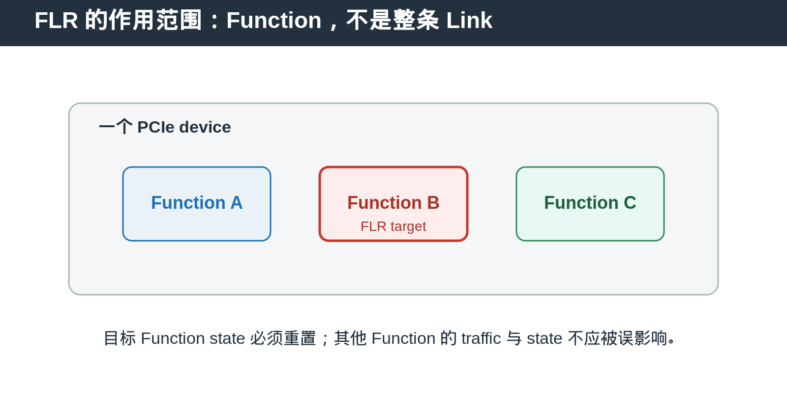
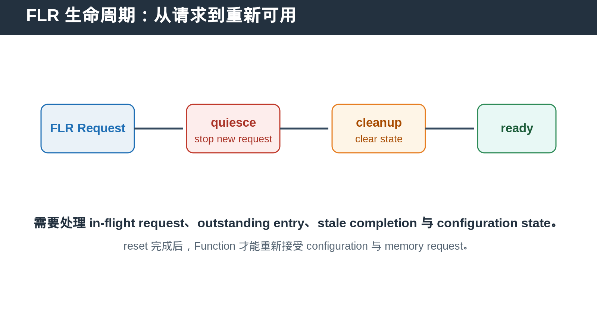

## [PCIe] Function Level Reset：为什么只复位一个 Function 仍然很复杂

---

### 导读

“只复位一个 Function”听起来比 reset 整个 device 简单得多，但实际上更难。

因为 FLR 不能只清几个 register。它必须终止或清理目标 Function 的 in-flight activity，又不能误伤同一 device 内其他 Function 的 traffic、state 和 interrupt。

---

### 前置概念速查

PCIe device 可以包含多个 Function。每个 Function 有自己的 Configuration Space、Capability state、BAR aperture 和 request identity。

Function Level Reset，FLR，是以单个 Function 为作用范围的 reset mechanism。它和 Hot Reset、Fundamental Reset 不同，后两者通常影响更大的 link 或 device 范围。

FLR 的目标不是让所有东西都停下来，而是让指定 Function 回到可重新配置、可重新发起 transaction 的干净状态。

---

### 一、FLR 到底复位谁

FLR 的作用单位是 Function。若同一 device 同时暴露多个 Function，针对其中一个 Function 的 FLR 不应让其他 Function 的 memory request、interrupt 或 configuration access 无故停止。

这就是 FLR 的难点：reset domain 可能共享部分硬件资源，但 externally visible behavior 必须保持 Function isolation。

---

### 二、FLR 不是简单地把寄存器清零

当 FLR 到来时，目标 Function 可能仍然有 outstanding request、正在等待 Completion、正在产生 MSI-X interrupt，或者正在执行 DMA transaction。

如果只清 local register，而没有处理这些 in-flight state，reset 后可能出现 stale completion、旧 interrupt、queue entry 泄漏或 ID reuse 误匹配。

因此，FLR 通常需要先 quiesce 新 request，再清理 tracking state，最后恢复 Function 的可用状态。

---

### 三、哪些 state 通常需要关注

首先是 request tracking state。例如 outstanding entry、tag mapping、completion waiting state 和内部 queue。

其次是 configuration-visible state。BAR decode、MSI/MSI-X enable、capability control、power-related control 等在 reset 前后应符合规范与设计定义。

最后是 datapath state。若 Function 有 DMA engine、command queue 或 write buffer，FLR 后不能让 reset 前数据继续以新 Function state 的身份完成。

---

### 四、stale completion 为什么危险

最典型的 bug 是：Function 在 reset 前发出 Memory Read，FLR 后同一个 tag 或 internal entry 被重新分配，新 request 又开始运行。随后旧 Completion 返回，tracker 错把它匹配到 reset 后的新 request。

这种错误通常不会立刻表现为 protocol fatal，而会表现为 data corruption、scoreboard mismatch 或偶发 timeout。

因此 FLR DV 必须覆盖：reset 前 request 未完成、reset 后立刻重新发 request、随后注入旧 Completion 的组合。

---

### 五、DV 验证应覆盖什么

确认 FLR 只影响 target Function。其他 Function 应继续完成自己的 transaction，并保持 configuration access 正常。

确认 FLR 时新 request 被正确阻止或按设计规则处理。

确认 outstanding request、queue、completion mapping、interrupt pending state 不会泄漏到 reset 后。

确认 reset 完成后 target Function 可以重新配置，并重新接受 memory request。

确认 error path、timeout、MSI-X、BAR access 与 FLR 并发时不会出现 deadlock。

---

### 六、总结

FLR 的核心不是“复位一个寄存器集合”，而是“只清理一个 Function 的所有外部可见活动，同时保护其他 Function 不被影响”。

> **判断口诀：FLR 要清 target Function 的状态，也要隔离其他 Function 的状态。**

---

*本文以通用 PCIe Function Level Reset 与 DV 场景整理。*
