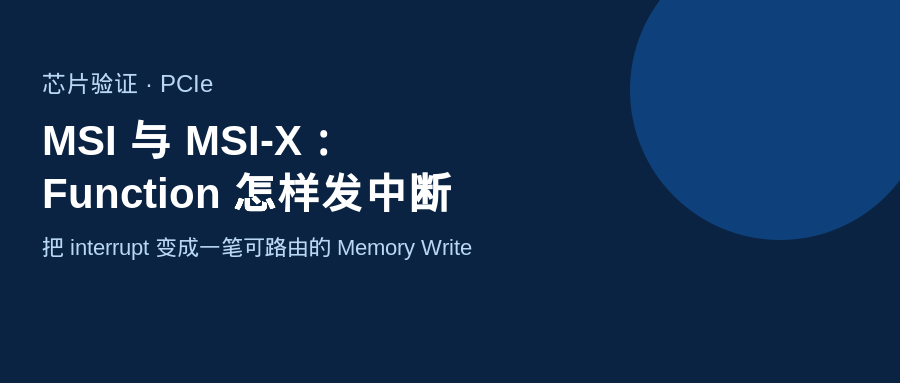
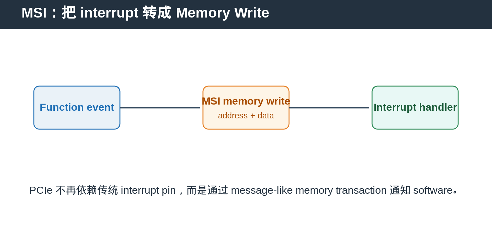
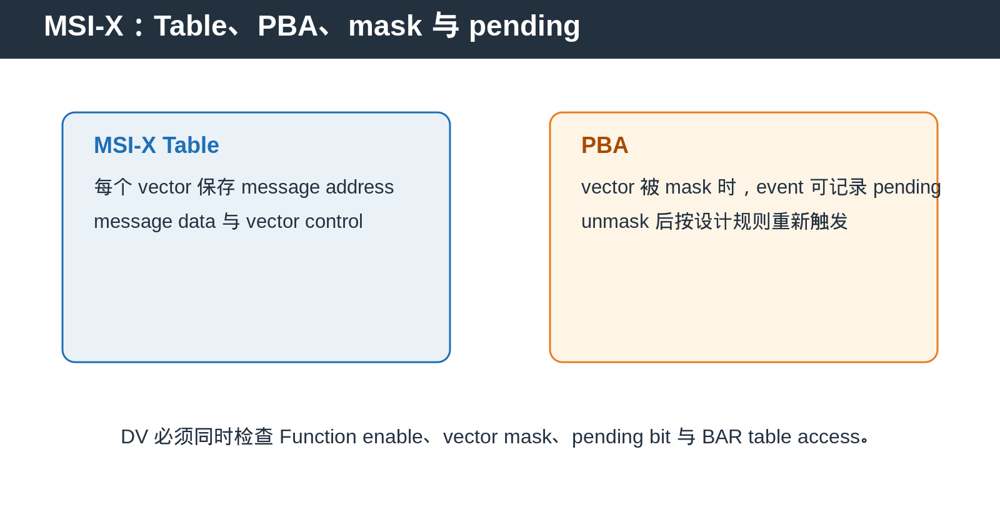

## [PCIe] MSI 与 MSI-X：一个 PCIe Function 怎样把中断变成 Memory Write

---

### 导读

传统 interrupt pin 只能表达“有中断”这件事，但现代 PCIe Function 往往有多个 queue、多个 error source 和多个 software handler。

MSI 与 MSI-X 的思路是把 interrupt 变成一笔可路由的 Memory Write。这样中断不再依赖共享 pin，而能携带 Function、vector 和 software routing 信息。

---

### 前置概念速查

MSI，Message Signaled Interrupt，是 Function 通过 memory write 通知 software 的机制。

MSI-X 是 MSI 的扩展。它支持更多独立 vector，每个 vector 都可以有自己的 message address、message data 和 mask control。

MSI／MSI-X capability 位于 Function Configuration Space。software 发现 capability、配置 address/data、enable Function 或 vector 后，Function 才能发出 interrupt message。

---

### 一、MSI 为什么是一笔 Memory Write

当 Function 内部 event 发生，例如 DMA 完成、queue 有新数据或 error 被检测到，Function 不需要拉高传统 interrupt pin。

它根据 software 配置好的 message address 与 message data，发起一笔 memory write。Root Complex 将这笔 write 路由到对应的 interrupt handler。

这使多个 Function 或多个 queue 可以使用不同 message data，software 也能区分 interrupt 来源。

---

### 二、MSI 与 MSI-X 的差别

MSI 可以支持多个 vector，但它们通常共享 address，vector 选择主要体现在 message data。

MSI-X 则让每个 vector 拥有独立 table entry。不同 vector 可以写往不同 address，独立 mask，也能对应不同 CPU 或 software handler。

因此，MSI-X 更适合多 queue、high-throughput 和 virtualization 场景。

---

### 三、MSI-X Table 与 PBA

MSI-X Table 保存每个 vector 的 message address、message data 与 vector control。它通常通过 Function 的 BAR aperture 暴露给 software 配置。

PBA，Pending Bit Array，用于记录被 mask 时发生的 interrupt event。它避免 event 在 mask 期间被静默丢失。

所以 MSI-X DV 不能只验证“有没有发出 write”。还必须验证 table entry、Function mask、vector mask 与 pending state 的组合行为。

---

### 四、Function isolation 与 FLR

MSI/MSI-X state 是 Function scope。一个 Function 的 enable、mask、table entry 或 pending bit 不应误影响其他 Function。

FLR 到来时，target Function 的 interrupt-related state 如何清理或恢复，需要与 reset specification 保持一致。特别是 reset 前已经 pending 的 event，不能在 reset 后以错误的 Function state 继续触发。

---

### 五、DV 验证点

确认 capability advertise、enable 与 disable 行为一致。

确认 software 配置的 address/data 会被正确用于 MSI write。

确认 Function mask、vector mask、PBA pending 与 unmask 后行为正确。

确认 MSI-X Table 通过 BAR access 配置时 address decode、byte enable 和 vector boundary 正确。

确认 reset、FLR、error path 和多 Function 并发时 interrupt resource 不串扰。

---

### 六、总结

MSI 把中断变成一笔 Memory Write。MSI-X 则把这件事扩展为多个可独立配置、独立 mask 的 vector。

> **判断口诀：Capability 决定能否支持，Control 决定能否发出，Table 决定写到哪里，PBA 记录被 mask 的事件。**

---

*本文以通用 PCIe MSI／MSI-X 与 DV 验证场景整理。*
