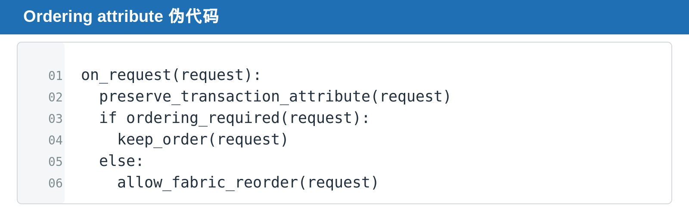

## [PCIe] Ordering Rules：Relaxed Ordering 为什么会改变请求完成顺序

---

### 导读

性能优化常常要求 transaction 能并发甚至完成顺序变化，但软件和硬件又依赖某些关键顺序。Ordering Rules 就是在吞吐与可观察顺序之间划边界。

本文从 transaction attribute、ordering domain 与 bridge state 保存出发，解释 Relaxed Ordering 为什么会改变完成顺序，又为什么不能变成任意乱序。

---

### 前置概念速查

PCIe transaction 不一定严格按发出顺序完成。ordering rule 定义不同 request 之间哪些先后关系必须保留，哪些可以为了性能被放宽。

---

### 一、为什么 PCIe 不保证所有 transaction 按发出顺序完成

PCIe 是 packet-based fabric，不是一根所有 device 共享、严格排队的总线。不同 request 可能走向不同 target，经过不同 bridge buffer，或等待不同类型的 response。

如果协议要求所有 request 都严格串行，最快的 request 也必须等待最慢的 request，吞吐会迅速下降。Ordering Rules 的作用是明确：哪些先后关系是 software 可观察、必须保护的；哪些 request 没有依赖，可以为了性能并发或重排。

Relaxed Ordering 不是关闭顺序规则，而是在 transaction attribute 明确允许时，把“不必要的等待”从 fabric 中移除。

### 二、默认顺序与 Relaxed Ordering

默认 ordering 保护特定观察顺序。Relaxed Ordering 允许 fabric 或 completer 在满足规则的前提下提高并发和吞吐。它不是任意乱序许可。

---

### 三、为什么 bridge 必须保留 attribute

bridge、switch 或 request tracker 若丢失 transaction attribute，可能把本可重排的 request 错误串行化，或把必须保持顺序的 request 错误重排。

---

### 四、DV 应覆盖什么

覆盖 attribute preserve、same address read/write、different requester、completion reorder、reset 前后 ordering state 和 Relaxed Ordering enable/disable。

### 五、Relaxed Ordering 不是任意乱序

Relaxed Ordering 允许 transaction 在满足协议约束的前提下提高并发，但不意味着 bridge 可以忽略 address dependency、completion matching 或 transaction attribute。

最常见的实现问题是 route 或 request tracker 只保存 address、ID、tag，却没有保存 ordering attribute。这样 request 穿过 bridge 后可能被错误串行化，或错误重排。

### 六、DV 应如何制造压力

让多个 requester 同时对不同 address 发 request，再混入同 address 的 read/write。分别比较 default ordering 与 Relaxed Ordering path，确认 attribute 全程保持，且 completion 返回顺序符合允许范围。

### 七、性能与顺序为什么天然冲突

如果所有 transaction 都严格按发出顺序执行，fabric 实现最容易理解，但会让一个慢 target 或长 latency request 阻塞后续本可独立完成的 request。

Relaxed Ordering 的价值在于让不相关 transaction 有机会绕开等待，从而提高并发。代价是 requester、bridge 和 checker 都不能再用“先发的一定先完成”作为隐含假设。

### 八、DV 建模建议

scoreboard 不应默认使用单一 FIFO 来匹配所有 response。对于允许 reorder 的路径，应以 Requester ID、Tag、address range 和 transaction attribute 建立 request entry。

同时要保留一个“不可重排”的 reference path。这样当同一 address、同一 dependency chain 或 attribute 不允许放宽时，checker 能证明设计没有把性能优化扩大成协议违规。

---

### 总结

Ordering 的验证重点不是要求所有 request 都按顺序完成，而是证明每一笔 request 的 attribute 被保留，只有协议允许的路径发生 reorder，不允许的 dependency 从未被打破。
