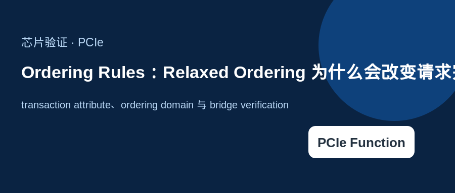
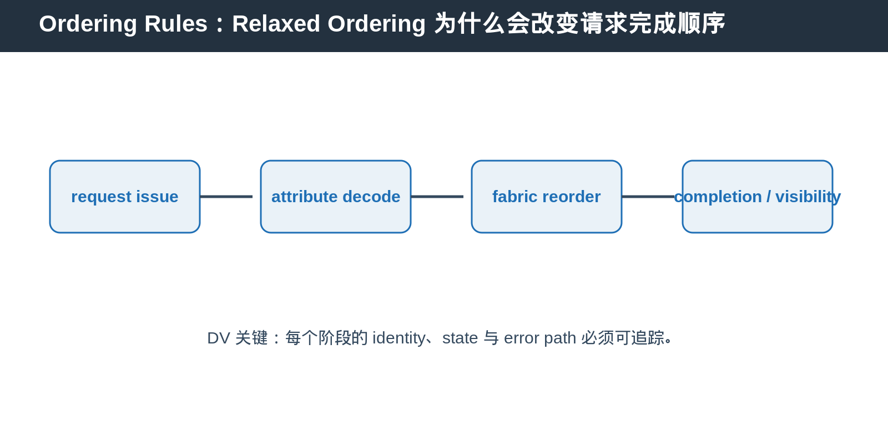

## [PCIe] Ordering Rules：Relaxed Ordering 为什么会改变请求完成顺序

---

### 导读

本文介绍 transaction attribute、ordering domain 与 bridge verification。

---

### 前置概念速查

PCIe transaction 不一定严格按发出顺序完成。ordering rule 定义不同 request 之间哪些先后关系必须保留，哪些可以为了性能被放宽。

---

### 一、默认顺序与 Relaxed Ordering

默认 ordering 保护特定观察顺序。Relaxed Ordering 允许 fabric 或 completer 在满足规则的前提下提高并发和吞吐。它不是任意乱序许可。

---

### 二、为什么 bridge 必须保留 attribute

bridge、switch 或 request tracker 若丢失 transaction attribute，可能把本可重排的 request 错误串行化，或把必须保持顺序的 request 错误重排。

---

### 三、DV 应覆盖什么

覆盖 attribute preserve、same address read/write、different requester、completion reorder、reset 前后 ordering state 和 Relaxed Ordering enable/disable。

---

### 总结

PCIe Function 相关能力的难点，不只是 capability bit，而是 capability、control、transaction state 与 reset/error path 是否一致。
