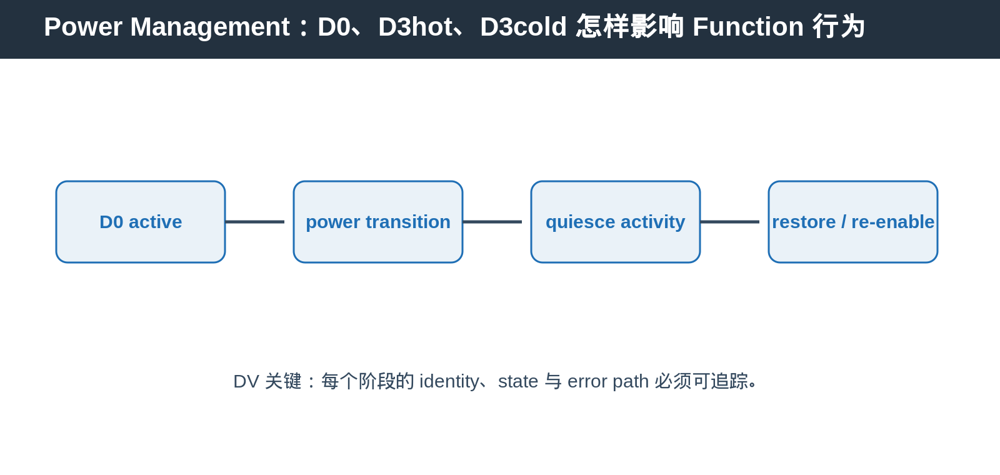
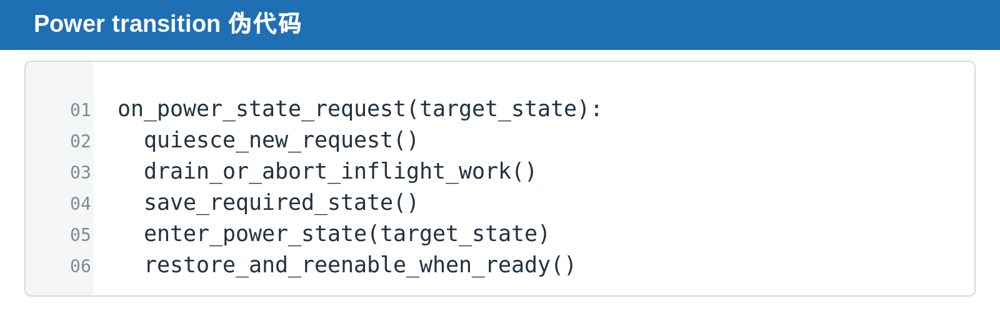

## [PCIe] Power Management：D0、D3hot、D3cold 怎样影响 Function 行为

---

### 导读

进入低功耗状态看似只是把 Function 从 active 切到 inactive，但对 request、interrupt、configuration access 和 software-visible state 都会产生连锁影响。最难的阶段不是进入 D-state，而是 transition window 里谁还能访问、谁必须等待、哪些 state 要恢复。

本文介绍 Function power state、configuration 与 request visibility，并说明 power management 与 reset 为什么不能混为一谈。

---

### 前置概念速查

PCIe power state 描述 Function 的可用程度。D0 通常表示 active state，D3hot 与 D3cold 表示更深的低功耗状态。

---

### 一、Power Management 的本质是改变 Function 的服务承诺

Function 处于 D0 时，software 与 fabric 通常可以期待它接受 request、产生 response、处理 interrupt。进入更深 power state 后，这种服务承诺会改变：有些 request 不再接受，有些 event 需要延迟，有些 state 必须保存或重新建立。

所以 power management 不是单纯的 clock gate 或省电控制。它是在 software、PCIe fabric 与 Function 之间重新定义“此时这个 Function 还能做什么”。

这也是 power transition 难以验证的原因：最终 power state 正确并不足够，transition 前后 transaction、interrupt、configuration 与 error state 的可见性也必须一致。

### 二、Power transition 不只是省电

Function 进入低功耗状态后，memory request、interrupt、configuration behavior 和 software visibility 都可能变化。power state transition 必须有明确的 quiesce 与 restore 规则。

---

### 三、Power state 与 reset 的区别

reset 关注 state initialization。power management 关注 activity reduction 与恢复。两者可能组合出现，但不能把一种语义当作另一种。

---

### 四、DV 应覆盖什么

覆盖 D-state transition、memory decode、MSI/MSI-X、PME、in-flight request、wake up、restore sequence 与 error path。

### 五、Power transition 的关键是 quiesce

进入低功耗状态前，Function 必须对新 request 建立明确的处理规则，并处理已经开始的 transaction。否则 transition 后可能留下 outstanding entry、未完成 DMA、pending interrupt 或不可恢复的 completion state。

恢复时也不能只把 power state 改回 active。需要确认 configuration、BAR decode、interrupt、queue 和 datapath 何时重新可用。

### 六、DV 的观察点

除了检查最终 power state，还应检查 transition 窗口。特别是 memory request、MSI-X、error event 与 FLR 同时发生时，设计是否能避免 deadlock、stale state 与重复上报。

### 七、进入低功耗前，哪些事情必须收尾

Function 不能在仍有未定义处理规则的 transaction 时突然进入低功耗。设计需要明确：新的 request 是被 backpressure、被拒绝，还是允许进入但延后处理；已有 request 是 drain、abort，还是记录为 reset-like cleanup。

interrupt 也是容易遗漏的部分。若 event 在 transition window 发生，设计必须规定它是立即发出、记录 pending，还是在恢复后重新触发。没有明确 policy 时，软件可能丢失关键事件。

### 八、恢复路径比进入路径更容易漏验证

很多测试只检查 D-state 已经改变，却没有验证恢复后 Function 是否真的重新可用。恢复 sequence 应覆盖 configuration access、BAR decode、memory request、interrupt、queue state 与 error reporting。

尤其在 power transition 与 FLR 连续发生时，不能假设任一方会自动修复另一方遗留的 state。DV 应把两个 lifecycle 交叉组合，检查最终 state 是否可预测且无泄漏。

---

### 总结

Power management 的正确性取决于 transition lifecycle：先 quiesce，再处理 in-flight work，之后保存或清理必要 state，最后在 restore 条件满足时重新 enable。只检查最终 D-state 不足以证明设计正确。
