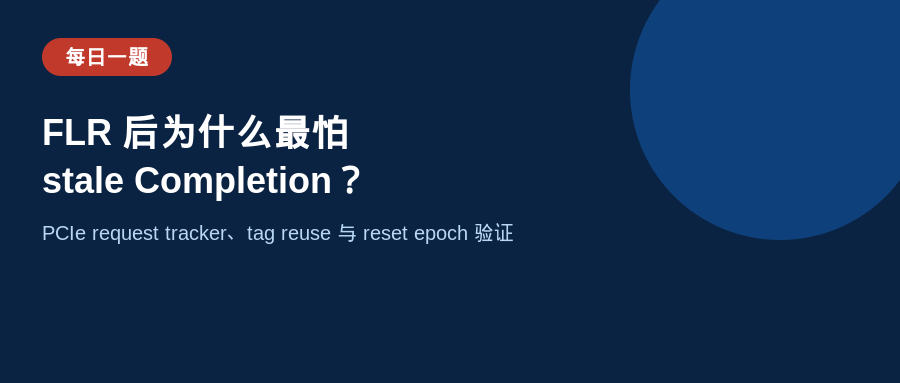
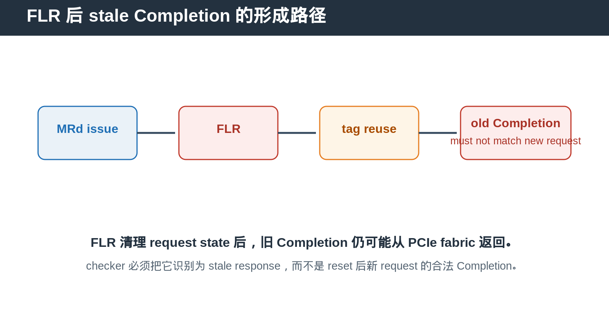
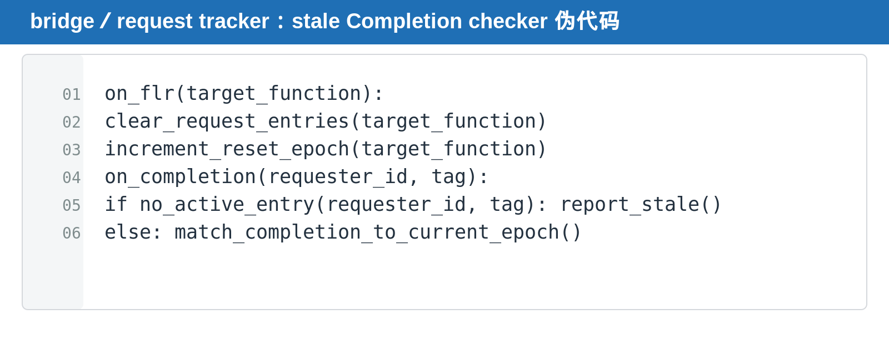

## [每日一题][PCIe] FLR 后为什么最怕 stale Completion？如何验证？

---

### 题目

一个 PCIe Function 在 FLR 前发出 Memory Read。FLR 后，Function 重新可用，并且新的 Memory Read 可能复用旧 request 的 Tag 或内部 tracking resource。

如果 reset 前的 Completion 在 FLR 后才返回，设计和 checker 应如何处理？为什么这是一个高风险 bug？

---

### 基础概念

FLR 只复位 target Function。它需要清理该 Function 的 outstanding request、completion mapping、queue state 和 interrupt-related state。

但 FLR 不能让已经进入 PCIe fabric 的旧 request 或旧 Completion 立刻从物理世界消失。旧 Completion 仍可能在 reset 完成后返回。

因此，reset 后的 request tracker 不能仅凭 Requester ID 与 Tag 判断 Completion 合法，还必须确保它属于当前 Function state，而不是旧 epoch。

---

### 标准回答

FLR 到来时，target Function 必须停止接受或按定义处理新 request，并清理旧 request 的 tracking entry。

FLR 完成后，新 request 可以重新发出，但旧 Completion 如果返回，不能匹配到新 request。否则可能把 reset 前的数据错误交给 reset 后的新 transaction，形成 data corruption。

最直接的 checker 策略是：FLR 时清空 target Function 的 active request map。Completion 返回时，如果找不到当前 active entry，就报 stale Completion 或 unexpected Completion。

在更复杂的 request tracker 中，可以引入 reset epoch。每次 FLR 后递增 epoch，request entry 记录其创建 epoch。Completion 只能匹配同一 epoch 的 active entry。

---

### NBIF／HPHOST 类验证方法

在 NBIF／HPHOST 类 bridge 或 request tracker 验证中，不需要依赖具体内部 signal 名，也能按 transaction lifecycle 建模。

第一步，在发出 Memory Read 时记录 Function identity、Requester ID、Tag、request type 和当前 reset epoch。

第二步，在 FLR 时删除或标记 target Function 的 outstanding entry，并确认其他 Function 的 entry 不受影响。

第三步，FLR 后立刻对同一 Function 发起新 request，刻意制造 tag 或 internal resource reuse。

第四步，延迟注入 reset 前 request 的 Completion。checker 必须报 stale，而不是把它当成新 request 的 response。

第五步，确认 reset 后的新 request 仍能收到自己的合法 Completion，证明 reset cleanup 没有把 Function 永久阻塞。

---

### 面试追问

**如果旧 Completion 和新 request 使用同一个 Tag，单靠 Tag matching 为什么不够？**

因为 Tag 是有限资源，FLR 后可能被重新分配。只看 Tag 会把不同时代的 transaction 混在一起。

**FLR 时能不能等待所有旧 Completion 返回后再结束 reset？**

设计可以有自己的 quiesce 规则，但 verification 不能假设 fabric 一定会在 reset 窗口内把所有旧 Completion 送完。stale path 必须可处理。

**其他 Function 应该怎样表现？**

其他 Function 的 outstanding request、interrupt 和 memory access 应继续按正常规则运行。FLR 的隔离性是核心验证点。

---

### DV 检查点

- FLR 前 OT 非零。
- FLR 后 target Function request map 清空。
- 同 device 的其他 Function entry 保持。
- reset 后 tag／resource reuse。
- old Completion injection。
- stale Completion report。
- reset 后新 request 正常完成。
- FLR 与 error、timeout、MSI-X pending 并发。

---

### 延伸阅读

完整 FLR 基础文章：

https://github.com/daxuxuxu/wechat_airtual/tree/main/7_16/pcie_flr

---

### 今日结论

> **FLR 清的是 Function 的当前 request state，不会自动抹掉 PCIe fabric 中已经在路上的旧 Completion。**

> **验证的关键是：旧 Completion 必须被识别为 stale，新 request 必须仍能正常完成。**
