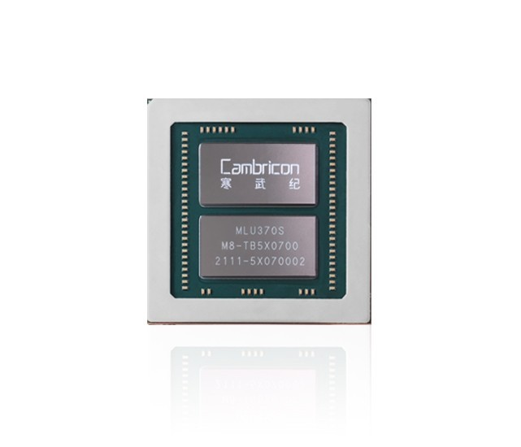
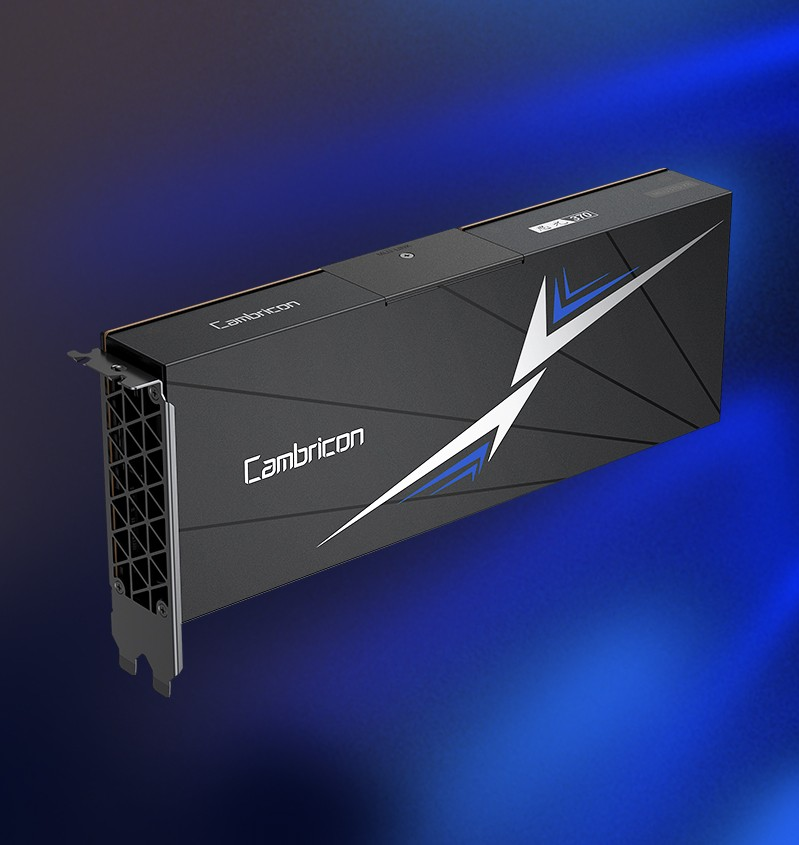
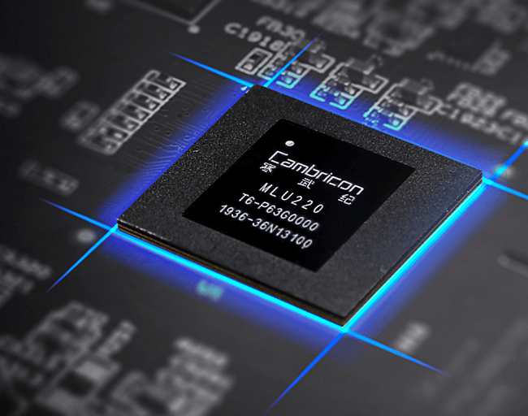
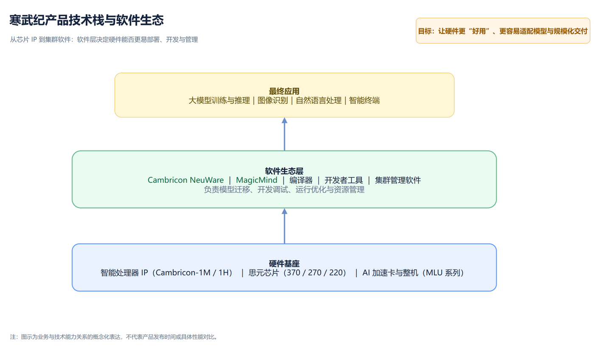
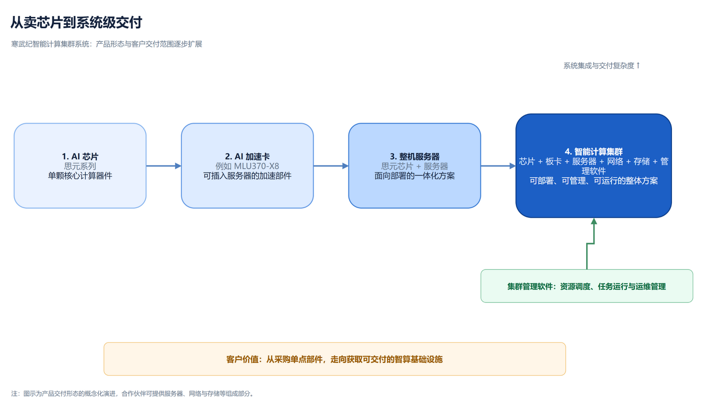
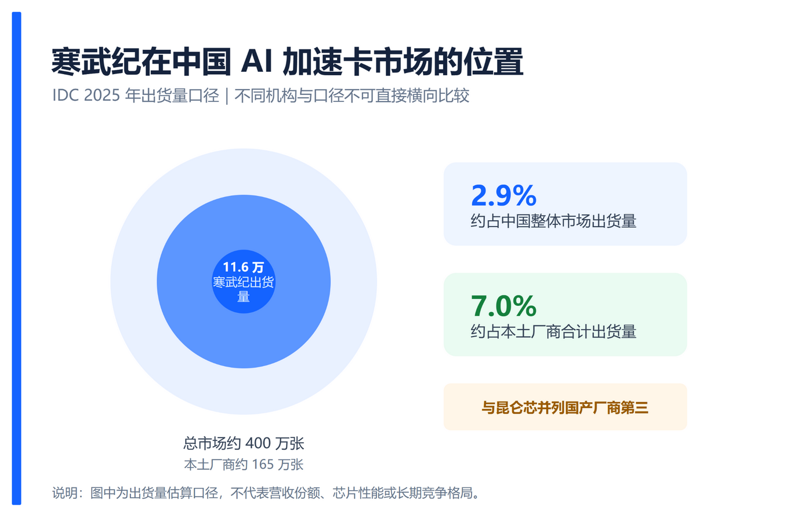
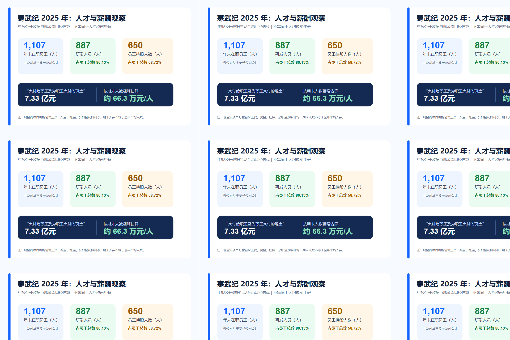

## 寒武纪公司画像：业务结构、经营表现与发展约束

> 当大模型把算力推到聚光灯下，寒武纪成了中国 AI 芯片行业里最受关注的名字之一。它一边承载“国产算力”的期待，一边面对产品交付、客户集中、生态建设等现实考题。
>
> 市场热度也在同步升温：截至 2026 年 7 月 17 日收盘，寒武纪报 1,190.58 元/股，当日下跌 6.93%，总市值约 7,480 亿元；而 52 周价格区间约为 389.32—1,620.00 元/股，波动十分显著。股价和市值会随交易日变化，本文只将其作为观察资本市场关注度的一个切片，不构成任何投资建议。
>
> 下面从公司定位、财务、产品、市场、人才与治理等维度，看看寒武纪到底站在什么位置。

---

### 核心结论

中科寒武纪科技股份有限公司，股票代码 `688256`。

2025 年，公司首次实现全年盈利。这一经营拐点让市场重新审视这家以 AI 芯片为核心的公司：它究竟卖什么？在市场中处于什么位置？高研发投入和高薪酬背后，又说明了什么？

---

### 一、公司定位与行业形象

寒武纪成立于 2016 年，2020 年登陆科创板。它不是传统 CPU 厂商，也不是做消费级显卡的公司，而是面向云服务器、数据中心、边缘设备和智能终端，提供人工智能核心计算芯片及配套软件平台的企业。

公司的官方愿景是：**让机器更好地理解和服务人类。**

从公众认知看，寒武纪大致有几层标签：

- **国产 AI 算力的重要参与者**：在大模型和智算中心快速建设的背景下，是本土 AI 芯片企业的重要代表；
- **研发密集型 Fabless 芯片设计公司**：公司聚焦芯片设计与销售，晶圆制造、封装测试等环节委托合作伙伴完成；
- **不仅卖硬件，也建设软件生态**：芯片、板卡、服务器之外，还持续投入编译器、推理平台、软件工具链与集群管理；
- **资本市场高度关注的科技公司**：产品迭代、订单、客户、供应链与交付能力都常成为业内话题。

2025 年，公司还入选“2025 福布斯中国人工智能科技企业 TOP 50”“2025 福布斯中国创新力企业 50 强”等榜单。榜单和奖项体现了外部机构对技术影响力与创新能力的阶段性评价，但并不等同于长期竞争力的最终结论。

---

### 二、经营表现：2025 年首次实现全年盈利

寒武纪 2025 年财报的核心数据如下。

| 指标 | 2025 年 | 同比变化 |
| --- | ---: | ---: |
| 营业收入 | 64.97 亿元 | +453.21% |
| 归母净利润 | 20.59 亿元 | 扭亏为盈 |
| 扣非归母净利润 | 17.70 亿元 | 扭亏为盈 |
| 研发投入 | 11.69 亿元 | +9.03% |
| 研发投入占营收比例 | 17.99% | — |

与 2024 年相比，2025 年公司收入大幅增长并实现扭亏为盈，这是其上市以来首次全年盈利。

这至少说明三件事：

1. 公司 2025 年的商业化规模出现了明显跃升；
2. 收入增速远高于研发投入增速，使研发投入占营收的比例明显下降；
3. 扭亏为盈是重要拐点，但长期盈利能力仍要继续观察客户复购、产品迭代和交付稳定性。

从收入结构看，2025 年公司业务高度聚焦云端产品线：

| 业务线 | 2025 年收入 |
| --- | ---: |
| 云端产品线 | 约 64.76 亿元 |
| 边缘产品线 | 约 339.39 万元 |
| IP 授权及软件 | 约 228.87 万元 |

云端产品线收入占总营收超过 99%，显示 2025 年的增长主要由数据中心和云端 AI 算力需求拉动。

---

### 三、业务与产品体系：芯片、软件与系统解决方案

如果用一句话概括，寒武纪卖的是：

> **面向云、边、端 AI 任务的芯片、板卡、服务器、软件平台和集群解决方案。**

#### 1. 云端产品线：智能芯片、加速卡与智能整机

云端产品线包括云端智能芯片、智能加速卡和智能整机服务器。较有代表性的产品包括思元 270 系列、思元 370 系列，以及 MLU370-S4/S8、MLU370-X4、MLU370-X8 等加速卡。

其中：

- `MLU370-X8` 面向中高端训练场景；
- `MLU370-S4/S8` 面向高密度云端推理部署；
- 这类产品服务于大模型训练与推理、图像识别、自然语言处理等高算力任务。

#### 2. 边缘产品线：边缘智能芯片与模组

边缘计算强调在靠近数据产生的位置完成计算，例如工厂、零售门店、摄像头、机器人和智能设备。

寒武纪的边缘产品包括思元 220 系列、`MLU220-SOM` 智能模组与 `MLU220-M.2` 边缘智能加速卡，面向智慧金融、智慧工厂、智能机器人和智慧零售等场景。公司披露，思元 220 自发布以来累计销量已突破百万片。

#### 3. IP 授权与基础软件平台

寒武纪早期的一种产品形态，是将智能处理器 IP 授权给客户使用，例如 `Cambricon-1M`、`Cambricon-1H`。此外，公司还建设了 `Cambricon NeuWare`、`MagicMind` 等软件平台与工具链。

AI 芯片的竞争不只看参数。模型是否容易迁移、开发者是否容易调试、软件是否能持续适配新的开源模型、集群是否容易管理，都会影响产品能否规模化落地。因此，软件生态是寒武纪未来竞争力的重要组成部分。

#### 4. 智能计算集群系统：系统级交付能力

智能计算集群系统是将公司自研板卡或整机，与合作伙伴提供的服务器、网络、存储设备相结合，再配合集群管理软件形成的整体方案。

可以简单理解为：

- **卖板卡**：提供单个 AI 加速部件；
- **卖整机**：提供搭载 AI 芯片的服务器；
- **卖集群**：提供可部署、可管理、可运行的智算基础设施。

这也是寒武纪从单一芯片产品向系统级解决方案延伸的重要方向。

---

### 四、市场地位：本土 AI 加速卡厂商梯队与份额空间

谈 AI 芯片市占率，首先要明确统计口径。

不同机构可能按 AI 加速卡、云端 AI 加速器、销售额或出货量统计。本文以下数据统一采用 IDC 2025 年中国 AI 加速卡市场的**出货量口径**，不能与营收或性能排名直接混用。

| IDC 2025 年中国 AI 加速卡市场数据 | 数值 |
| --- | ---: |
| 中国市场 AI 加速卡总出货量 | 约 400 万张 |
| 本土厂商合计出货量 | 约 165 万张 |
| 本土厂商合计份额 | 约 41% |
| 寒武纪出货量 | 约 11.6 万张 |
| 寒武纪占整体市场的约数 | 约 2.9% |
| 寒武纪占本土出货量的约数 | 约 7.0% |

根据公开转述的 IDC 数据，寒武纪与昆仑芯均约出货 11.6 万张，并列国产厂商第三。这表明公司已进入本土 AI 加速卡厂商的重要梯队，但整体份额仍有提升空间；产品迭代、供给能力、软件生态、客户导入和大规模交付能力，将共同决定其后续位置。

---

### 五、人才结构与薪酬投入：研发密集型组织特征

截至 2025 年末，寒武纪母公司及主要子公司在职员工合计 **1,107 人**；研发团队为 **887 人**，研发人员占员工总数 **80.13%**。研发人员中，硕士及以上学历占比超过 **80.95%**。

员工结构也印证了公司将研发作为主要投入方向。

年报披露，2025 年“支付给职工及为职工支付的现金”为 **7.33 亿元**。如以期末在职员工数做简单估算：

$$
\frac{7.33\text{亿元}}{1107\text{人}} \approx 66.3\text{万元/人}
$$

也就是说，按现金流口径粗略计算，人均对应约 **66.3 万元/年**。这只是薪酬与福利总支出的粗略观察，并不等于人均税前年薪，原因包括：

- “支付给职工及为职工支付的现金”可能包含工资、奖金、社保、公积金、福利和代缴项目等；
- 年末员工数不等于全年平均员工数；
- 不同岗位、城市与职级间的收入差异很大；
- 现金流口径无法完整反映股权激励价值。

因此，这个口径更适合观察公司对人才的现金投入强度，而不适合直接比较具体岗位的年薪水平。

公司还披露，截至报告期末员工持股人数为 **650 人**，约占员工总数 **58.72%**。对于高研发密度的芯片企业而言，股权激励是吸引和绑定核心技术人才的重要方式。

---

### 六、公司治理与管理层：创始技术团队延续与董事会换届

截至 2025 年年报披露时，寒武纪的核心管理层仍以创始团队和技术背景深厚的高管为主。董事长、总经理、核心技术人员 **陈天石** 是公司法定代表人，拥有中国科学技术大学计算机软件与理论博士学历；年报显示，他曾在中国科学院计算技术研究所担任研究员、博士生导师，2016 年创立寒武纪。

围绕产品、技术与经营执行，几位较受关注的管理层成员包括：

- **刘少礼**：董事、副总经理、核心技术人员；中国科学院计算技术研究所计算机系统结构博士，2016 年作为创始团队成员加入寒武纪；
- **王在**：职工代表董事、副总经理；中国科学技术大学计算机应用技术博士，曾从事交易系统、银行电子银行系统及科研工作，2016 年加入寒武纪；
- **叶淏尹**：董事、副总经理、财务负责人、董事会秘书；北京大学西方经济学硕士，2019 年加入公司，负责财务与董事会秘书相关职责；
- **陈帅、刘毅、张尧**：均任副总经理及核心技术人员，分别具有计算机系统结构、微电子及芯片设计相关背景。

这套组合大致呈现出“**创始人负责技术与总体经营，技术高管覆盖芯片研发，财务与董事会秘书负责资本市场和治理衔接**”的特点。对智能芯片公司而言，管理层是否能把技术路线、供应链协同与大客户交付串成闭环，往往比单一产品发布更影响长期执行力。

#### 董事会与高级管理人员变动

2025 年，公司完成第三届董事会及高级管理人员换届。年报披露，**吕红兵、王秀丽**两位独立董事因换届届满离任；**李寿双、刘思义**于 2025 年 11 月当选为新一届独立董事。与此同时，2025 年 11 月 27 日职工代表大会选举王在担任第三届董事会职工代表董事；11 月 28 日，公司提名委员会审议通过总经理、副总经理、财务负责人和董事会秘书的聘任事项。

因此，这次变动更接近于董事会任期届满后的常规治理更新：独立董事结构调整、职工代表董事依法产生，而陈天石、刘少礼、王在、叶淏尹等核心经营与技术管理成员继续在新一届任期内任职。文章以 2025 年年报为信息截点，后续人事安排仍应以公司在交易所披露的最新公告为准。

---

### 七、投资与经营观察：积极因素与主要约束

一家公司的画像不能只看高光数据，也要看它所面临的约束。

#### 积极因素

**国产算力的稀缺参与者。** 随着大模型训练与推理需求持续增长，本土 AI 算力供给的重要性提高，寒武纪处于产业关注中心。

**产品开始经历规模化部署验证。** 年报披露，公司产品已在运营商、金融、互联网等重点行业规模化部署，并通过客户严苛环境的验证；这比单一订单更能反映产品稳定性与交付能力的阶段性进展。

#### 主要约束

**客户集中度较高。** 年报显示，前五名客户销售额为 **57.60 亿元**，占年度销售总额 **88.66%**。其中除第三大客户外，其余四家为当年新增客户。客户突破是积极信号，但收入稳定性也会受到核心客户采购节奏的影响。

**存货规模较高。** 截至 2025 年末，公司存货账面余额约 **53.33 亿元**。提前备货可能服务于交付需求和供应链安全；但若下游需求变化、产品迭代加快或交付节奏放缓，也会带来库存管理和减值压力。

**收入来源仍较集中。** 边缘产品线、IP 授权及软件业务未来能否形成更有规模的收入，仍值得跟踪。

**芯片竞争不只是硬件竞争。** AI 芯片需要同时面对模型适配、软件工具链、开发者生态、系统稳定性、供给能力和长期服务能力的考验。产品“可用”之后，能否“好用、易用、规模化交付”，往往才是更难的部分。

更客观的评价或许是：

> 寒武纪已经完成了从“技术型公司”向“规模化商业化公司”的重要一步；但要成为长期稳定的 AI 算力平台型企业，仍需要在客户结构、产品迭代、软件生态与交付能力上持续证明自己。

---

### 八、结语：长期竞争力仍待持续验证

寒武纪 2025 年完成了从持续研发投入到规模化商业化验证的重要跨越。

但一家 AI 芯片公司真正的长期价值，不应只用某一年的收入、利润或市场热度来衡量。更关键的问题是：

- 它能否把阶段性的云端突破，转化为持续的客户复购和更均衡的业务结构？
- 它能否在模型快速迭代和批量部署压力下，持续提升软硬件协同与服务体验？
- 它能否从“国产替代”的市场期待，走向真正稳定的产品竞争力？

这些问题，答案可能不在今天的财报里，而在未来几年一轮轮产品迭代和交付验证中。

---

### 留言话题

想继续聊寒武纪的哪个问题？

- **下一篇想看：** 华为昇腾、海光、昆仑芯、沐曦、摩尔线程，谁更有机会？
- **商业化怎么看：** 寒武纪 2025 年扭亏，更多来自产品竞争力、交付节奏，还是行业景气？
- **最想深挖：** 软件生态、客户集中、存货管理，还是智算集群系统交付？
- **一线观察：** 有在寒武纪工作的朋友吗？欢迎在不涉及个人隐私和公司保密信息的前提下，分享一线体验。

欢迎在留言区留下你的判断，也欢迎补充你实际接触过的寒武纪产品、软件生态或交付体验。

---

### 数据来源与配图说明

1. 财务、业务、员工、高层团队、人员变动与风险相关数据：中科寒武纪科技股份有限公司《2025 年年度报告》及年度报告摘要，公告日期 2026 年 3 月 12—13 日。
2. 公司定位、产品线、思元 370 与思元 220 图片：寒武纪官网产品页面。
3. 市占率部分：IDC 2025 年中国 AI 加速卡市场相关公开数据，采用出货量口径；不等同于销售额、性能排名或长期市场格局。
4. 股价与市值数据：富途牛牛公开行情页面，数据截点为 2026 年 7 月 17 日收盘；总市值为行情页面所示口径，后续会随股价及总股本变化。
5. 本文中的财务、市场、人员与业务架构图均为基于公开数据自行制作，并同时保留可编辑的 `.drawio` 源文件；文中 PNG 均由对应的 draw.io 源文件直接导出。产品图源自寒武纪官网，仅用于本文资料归档和图文编辑参考。正式商业转载前，请向版权方确认授权范围。

### 参考资料

- [寒武纪 2025 年年度报告摘要（上海证券报）](https://paper.cnstock.com/html/2026-03/13/content_2188077.htm)
- [寒武纪 2025 年年度报告（巨潮资讯）](https://dataclouds.cninfo.com.cn/shgonggao/hsomarket/2026/20260312/05ca784762a7401b9ed371d917e436dc.PDF)
- [寒武纪官网](https://www.cambricon.com/)
- [思元 370 系列](https://www.cambricon.com/index.php?m=content&c=index&a=lists&catid=360)
- [思元 220 系列](https://www.cambricon.com/index.php?m=content&c=index&a=lists&catid=55)
- [IDC 2025 中国人工智能加速卡市场份额页面](https://my.idc.com/getdoc.jsp?containerId=CHC54360326&pageType=PRINTFRIENDLY)
- [寒武纪行情与市值（富途牛牛）](https://www.futunn.com/stock/688256-SH)
