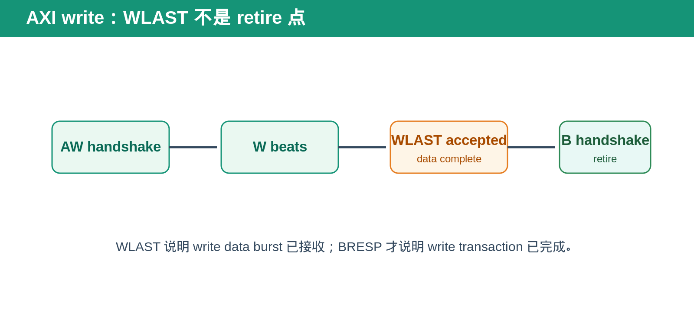
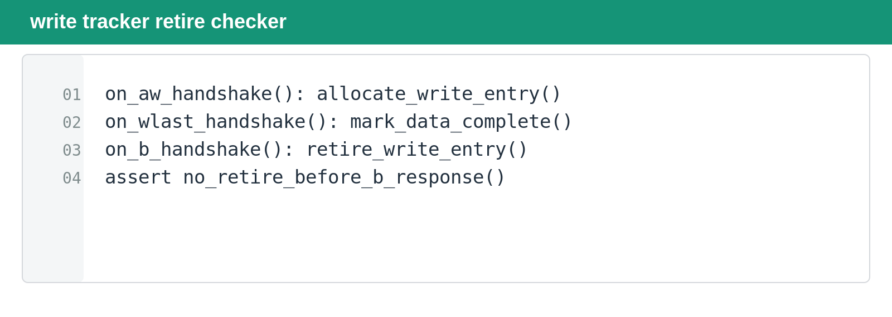

## [每日一题][AXI] WLAST 到了，为什么 write transaction 还不能 retire？

---

### 题目

AXI write burst 的最后一拍 data 已经完成 `WVALID && WREADY && WLAST` handshake。为什么 request tracker 仍然不能立即 retire 这笔 write transaction？

---

### 基础概念

AXI write transaction 由三个独立通道组成：AW 负责 write address，W 负责 write data，B 负责 write response。

`WLAST` 表示当前 W channel beat 是这笔 burst 的最后一个 data beat。它只说明 write data 已经发送完成，不说明 target 已经完成 write、也不说明 response 已经返回。

`BVALID && BREADY` handshake 才是 write response 被接收的时刻。对需要追踪完整 transaction 的 bridge、scoreboard 或 request tracker 来说，这才是更安全的 retire 点。

---

### 标准回答

write transaction 的 entry 应在 address handshake 时 allocate。收到 WLAST handshake 后，entry 可以标记为 data complete，但不能 retire。

因为 target 仍可能在处理 write data，或者需要在内部完成 address/data merge、error check、memory update 后才产生 `BRESP`。

如果 tracker 在 WLAST 时 retire，后续 B response 返回时会找不到对应 transaction。更严重的情况是 internal resource 已被复用，旧 response 可能被错误归属到新 write。

---

### Bridge／request tracker 验证方法

第一步，在 AW handshake 时建立 write entry，并记录 burst 的 data beat expectation。

第二步，W channel 每拍递减剩余 beat。只有 WLAST handshake 后才标记 data complete。

第三步，B response 返回前，entry 必须继续存在。即使此时 tracker 满、backpressure 或 reset 即将到来，也不能把 write 当作已完成。

第四步，BVALID/BREADY handshake 后，检查 response identity 与 write entry 匹配，再 retire entry。

---

### 面试追问

**如果 AW 和 W 独立到达，什么时候开始占用 tracker？**

通常在 AW handshake 时 allocate，因为 address transaction 已被接收。W data 可以后到，但必须能与该 write request 正确关联。

**WLAST 到了，但 B response 被延迟，tracker 可以释放 data buffer 吗？**

这取决于实现，但 request 的 transaction identity 和 response matching state 不能丢。数据 buffer 是否可提前释放，与 write entry 是否 retire 是两件事。

**reset 在 WLAST 与 B response 之间发生怎么办？**

target Function 或 bridge 必须按 reset policy 清理 write state。reset 后返回的旧 B response 不能误匹配到新 write request。

---

### DV 检查点

- AW 先到、W 先到、AW/W 同拍到。
- multi-beat burst 的 WLAST 位置。
- WLAST 后延迟 B response。
- `BRESP` error path。
- WLAST 与 backpressure。
- reset／flush 发生在 WLAST 与 B response 之间。
- 同周期新的 AW handshake 与旧 B handshake。

---

### 延伸阅读

完整 Burst Transfer 文章：

https://github.com/daxuxuxu/wechat_airtual/tree/main/7_15/axi_burst_transfer

完整 Outstanding／Backpressure 文章：

https://github.com/daxuxuxu/wechat_airtual/tree/main/7_15/axi_outstanding_backpressure

---

### 今日结论

> **WLAST 表示 write data complete，B handshake 才表示 write transaction complete。**
