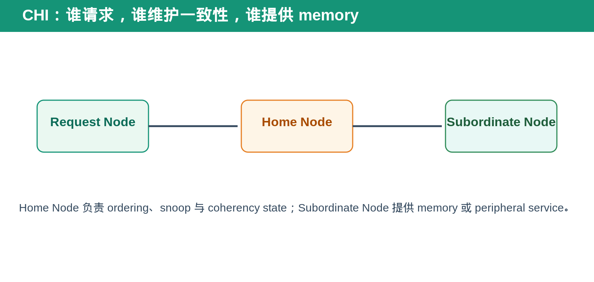
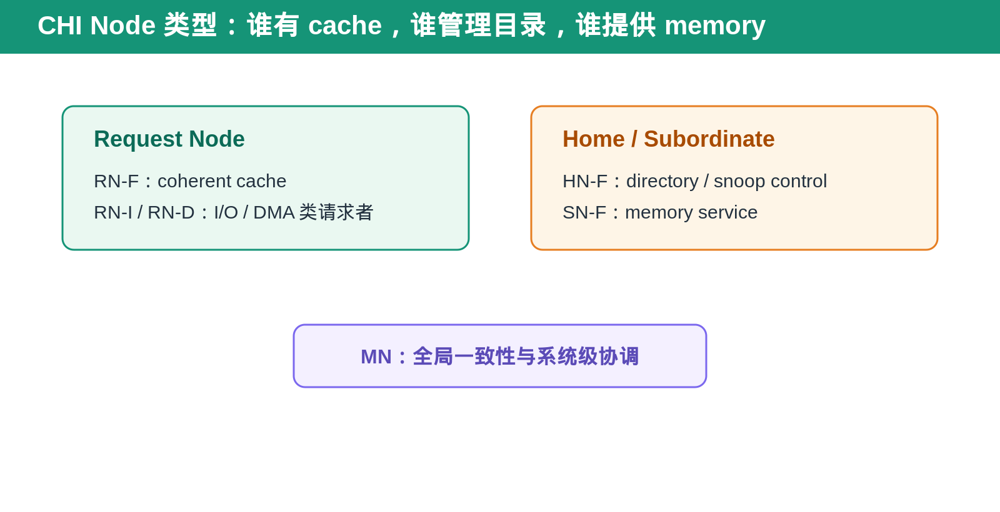
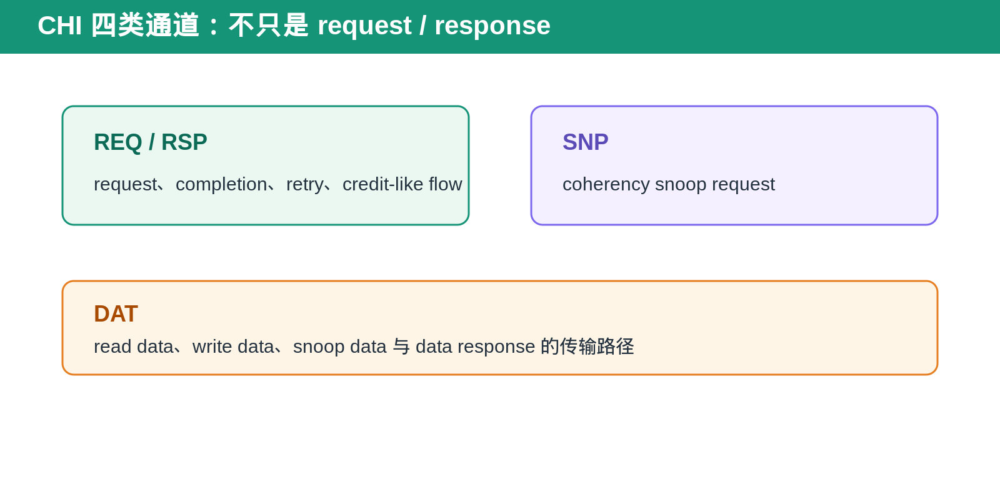
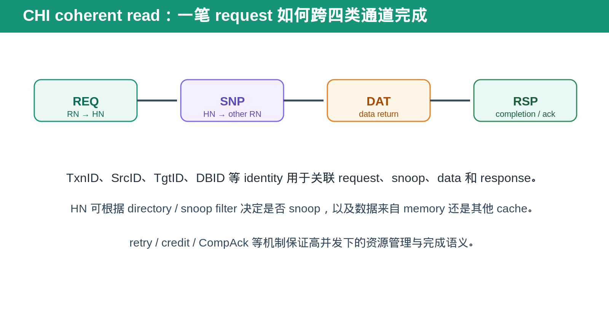

## [AXI] AMBA CHI：为什么一致性互连不再只是读写通道

---

### 导读

AXI 很擅长描述 master 和 slave 之间的读写 transaction。但当多个 processor cache、accelerator cache、memory controller 同时访问同一份数据时，问题不再只是“谁发 request、谁回 response”。

系统还必须回答：谁拥有最新 cache line？谁需要被 snoop？谁决定 request 的顺序？这就是 CHI 需要解决的问题。

---

### 前置概念速查

CHI 是 AMBA 5 中面向 scalable coherent interconnect 的协议。它用于让多个 coherent requester 共享 memory，并保持 cache coherence。

Request Node，RN，发起 coherent request。Home Node，HN，维护地址相关的 coherency、ordering 与 snoop 决策。Subordinate Node，SN，通常提供 memory 或 peripheral service。

---

### 一、Node 不只是名称不同，cache capability 也不同

CHI 中常见的 RN-F 是带 coherent cache 的 Request Node。它可能持有 cache line，因此 Home Node 需要在其他 requester 访问同一地址时考虑 snoop。

RN-I 或 RN-D 更接近 I/O、DMA 或非缓存 request 发起者。它们通常不作为普通 coherent cache 的持有者，但仍可能通过 CHI 访问 coherent memory system。

HN-F 通常维护 directory 或 snoop filter 相关状态，用于判断某个 address 是否需要 snoop、snoop 应发给谁。SN-F 则更接近最终提供 memory service 的节点。系统还可以有 MN 一类节点参与更高层的一致性协调。

### 二、为什么 AXI 不足以单独解决 cache coherence

AXI 可以传输读写，但它不会天然知道某个 cache line 是否已经被另一个 requester 修改或持有。

如果多个 cache 都能保留同一地址的数据，仅靠普通 read/write 无法保证其中一个 requester 写完后，其他 cache 不再使用旧数据。CHI 在 interconnect 层加入 coherence transaction，让系统能主动询问、失效或获取其他 cache 的状态。

---

### 三、CHI 的四类通道

CHI 不只把流量分成 request 和 response。它使用 REQ、RSP、SNP、DAT 四类通道，把 request、completion、snoop 和 data transfer 解耦。

先用一句人话理解：REQ 是“我要做什么”，SNP 是“其他 cache 手里有没有这份数据”，DAT 是“数据本身怎么走”，RSP 是“这件事最后怎样收尾”。

#### REQ：发起一笔 coherent request

REQ 是 Request Node 告诉 system “我要读、写、获取或修改这个 cache line”的通道。它携带 transaction 的意图、address、属性与 identity。

它像去图书馆柜台提出请求：你要哪本书、以什么方式拿、这次请求属于谁，都先在 REQ 中说明。

#### SNP：向其他 cache 询问状态

SNP 是 HN 发给其他 coherent cache 的 snoop request。它不是普通读写，而是在问：“你手里有没有这个 cache line？是不是最新的？需要 clean、invalidate 还是把 data 交出来？”

它像管理员向其他读者确认：这本书是否被借走、手里的版本是否更新、是否要先归还或作废旧副本。

#### DAT：真正传输数据

DAT 承担 write data、read data、snoop data 和相关 data response。REQ 只说明需求，DAT 才负责把 cache line 或 write payload 真正搬到目标位置。

DAT 可以来自 memory，也可以来自另一个 cache。这个“数据从哪来”的差异正是 coherent interconnect 比普通 AXI 路径更复杂的地方。

#### RSP：告诉系统 transaction 进行到哪一步

RSP 负责携带 completion、retry、snoop response、acknowledgement 等控制结果。它不一定带 data，但它决定 requester 是否需要重试、HN 是否能释放 state、transaction 是否真正完成。

这种拆分使 snoop、response 和 data 可以独立流动，适合高并发 coherent system。

---

### 四、TxnID、SrcID、TgtID 与 DBID 为什么重要

一笔 coherent transaction 不会只在一个 channel 中出现。REQ 可能触发 SNP，snoop 又可能返回 DAT 或 RSP，最终 request 还需要 completion acknowledgement。

因此 CHI 使用多种 identity 把这些片段关联起来。TxnID 用于 transaction 关联，SrcID/TgtID 用于源和目标节点标识，DBID 常用于 write data 或 data buffer 生命周期相关的关联。

DV 不能只按 address matching。高并发下，同一 address 可以同时有多个 request；必须把 identity、channel、transaction state 和 data ownership 一起建模。

### 五、一次 coherent read 可能发生什么

RN 发起 read REQ 后，HN 不一定直接访问 memory。HN 可能先查看 directory 或 snoop filter：如果其他 RN 持有更新后的 cache line，就发 SNP；如果数据在 memory，则向 SN 获取数据；如果资源暂时不足，可能返回 retry 类响应。

数据返回后，RSP 还可能负责 completion、acknowledgement 或 transaction state 的收尾。CHI 的复杂性正来自这些 channel 可以并行和交错，而不是严格单线顺序执行。

### 六、Home Node 为什么是关键

Home Node 可以理解成某个 address range 的“协调者”。它知道 request 应该去 memory、去哪个 cache，还是先发 snoop。

当一个 RN 想读某个 cache line，HN 可能直接从 memory 返回，也可能先向另一个 cache 发 snoop，确认对方是否持有更新数据。

当一个 RN 想写某个 cache line，HN 可能需要让其他 cache invalid 或 clean，避免多个 cache 同时保留不一致的副本。

---

### 七、credit、retry 与完成确认

CHI 为了在高并发下避免资源耗尽，会使用 credit 或类似资源管理概念限制 channel transaction。request 没有资源时，不应被静默丢失；协议可以通过 retry / retry acknowledgement 等机制让 requester 在合适时机重新尝试。

write transaction 也不只是“data 发完就结束”。data buffer、DBID、completion response、CompAck 等状态必须按协议顺序完成。DV 中常见的 bug 是 data 已到但 state 未释放，或 response 已到但 data ownership 未正确收尾。

### 八、DV 中最重要的是 transaction lifecycle

CHI 验证不应只看单一 channel handshake。一个 coherent request 往往横跨 REQ、SNP、RSP、DAT 多个通道。

DV 需要追踪 request identity、address、snoop target、data source、response order 和最终 cache state。特别是 retry、snoop data、cache line eviction、reset 和 outstanding transaction 并发时，单通道 checker 很难发现问题。

建议把每笔 transaction 建模为 lifecycle：REQ allocate、HN decision、optional snoop、DAT/RSP completion、state retire。

---

### 九、常见验证场景

- 两个 RN 同时访问同一 cache line。
- 一个 RN read，另一个 RN write。
- dirty cache line 被另一个 RN 请求。
- snoop response 延迟或 data 延迟。
- retry 后重新发 request。
- HN mapping 或 snoop filter hit/miss。
- reset 发生在 snoop 或 DAT 返回期间。

---

### 十、总结

CHI 的核心不是增加更多 channel，而是把 cache coherence 变成 interconnect 可管理的 transaction。

> **AXI 解决读写传输，CHI 还要解决谁持有数据、谁必须被 snoop、谁拥有最新 cache line。**

---

*本文根据 Arm 公开的 AMBA CHI 概念资料与通用 coherent interconnect 验证方法整理。*
