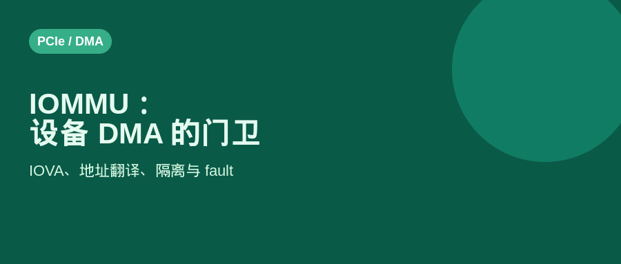
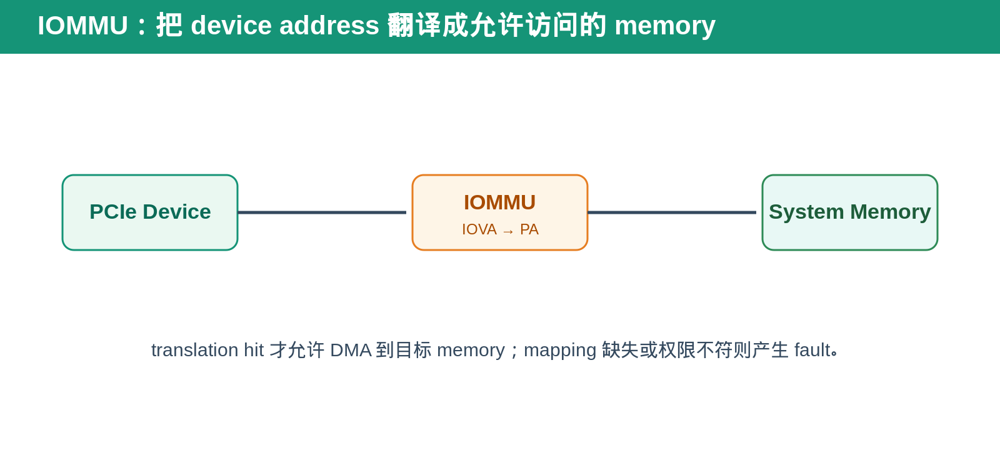
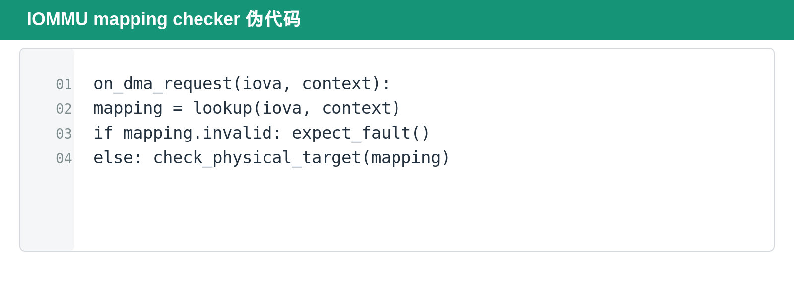

## [PCIe] IOMMU：设备 DMA 为什么也需要地址翻译与隔离

---

### 导读

CPU 程序不能随意访问任意 physical memory。现代系统通过 virtual memory、page table 和 permission 保护不同 process。

但 PCIe device 的 DMA request 也是 memory access。如果 device 可以直接相信任何地址，它就可能访问不属于自己的内存。IOMMU 的作用，就是把设备的 DMA 请求也纳入地址翻译与权限控制体系。

---

### 前置概念速查

CPU virtual address 是 software 使用的地址。physical address 是实际 memory location。device address 或 IOVA，I/O virtual address，是 device 发起 DMA 时使用、并由 IOMMU 翻译的地址。

IOMMU 可以理解成 device side 的 memory management unit。它根据 device context、page table 和 permission，把 IOVA 翻译成允许访问的 physical address，或者在 mapping 无效时产生 fault。

---

### 一、为什么 DMA 也需要隔离

没有 IOMMU 时，device DMA 往往直接使用 physical address。这样性能路径简单，但 isolation 很弱：错误 DMA、恶意 device 或错误 context 都可能覆盖不属于它的 memory。

有了 IOMMU 后，device 不再天然拥有所有 memory 的访问权。每个 device 或 virtual interface 只能访问 software 映射给它的 IOVA range。

这对 virtualization 尤其重要。多个 VM 或 process 共用同一 device 时，IOMMU 防止一个 workload 的 DMA 落到另一个 workload 的 memory。

---

### 二、IOVA、mapping 与 context

一笔 DMA request 至少需要回答三件事：它访问哪个 IOVA，它属于哪个 device/interface context，它是否具有 read/write permission。

IOMMU lookup 成功后，request 被翻译到正确 physical page。lookup 失败、permission 不符或 mapping 已失效时，request 不应继续访问 memory，而应进入 fault handling path。

不同 context 可以使用相同 IOVA，但映射到不同 physical address。这正是 IOMMU 支持 process isolation 和 virtualization 的关键。

---

### 三、IOMMU 与 ATS、PASID、PRI 的关系

IOMMU 是整体地址翻译和隔离机制。ATS 允许 device 请求 translation。PASID 表示 request 所属的 address space。PRI 用于 translation 暂时不可用时向 software 发起 page request。

可以把它们理解成：IOMMU 管规则，PASID 标识“谁在访问”，ATS 帮 device 获取 translation，PRI 处理“页还没准备好”的情况。

不是所有系统都会同时启用这些能力，但一旦使用，DV 必须把 context identity、translation cache、invalidation、retry 和 reset cleanup 放在同一条 lifecycle 中验证。

---

### 四、DV 验证方法

首先覆盖 mapping hit：给定 IOVA 和 context，DMA 必须落到预期 physical target。

其次覆盖 mapping miss 与 permission fault：request 不应穿透到 memory，fault status 或 error path 应正确产生。

再覆盖相同 IOVA、不同 context。它们必须映射到各自独立的 physical page，不能因 address 相同而错误共享 translation。

最后覆盖 mapping invalidation、page remap、ATS cache stale、reset／FLR 与 DMA outstanding 并发。很多 IOMMU bug 不是翻译公式错，而是旧 mapping 在不该继续使用时仍被 cache 命中。

---

### 五、常见错误

**只按 IOVA matching，不保存 context。** 这会让不同 VM 或 process 的相同 address 发生串扰。

**invalidation 后仍使用旧 translation。** 这会让 DMA 落到已经被重新分配的 page。

**fault 后仍发出 memory request。** 这会破坏 IOMMU isolation 的根本目的。

**reset 时只清 request queue，不清 translation state。** reset 后新 workload 可能继承旧 workload 的 mapping。

---

### 六、总结

IOMMU 不是让 device “更会访问内存”，而是让 device **只能访问被允许的内存**。

> **IOVA 表示 device 想访问哪里，context 表示谁在访问，IOMMU 决定它最终能不能到达 physical memory。**

---

*本文以通用 PCIe DMA、IOMMU 与 DV 验证场景整理。*
