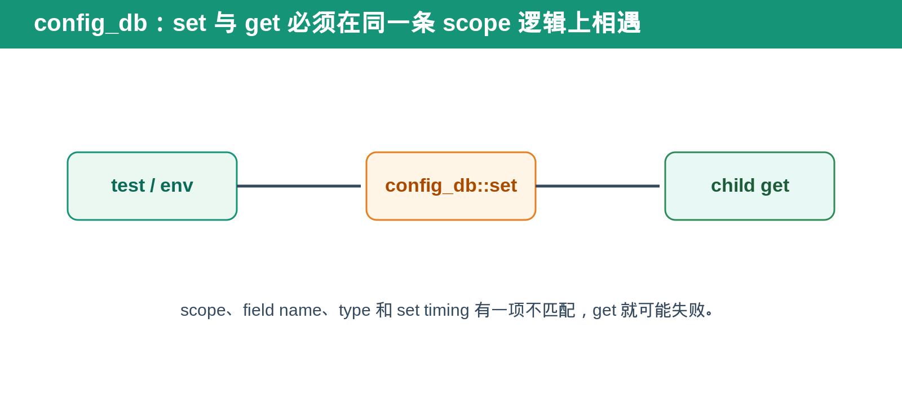
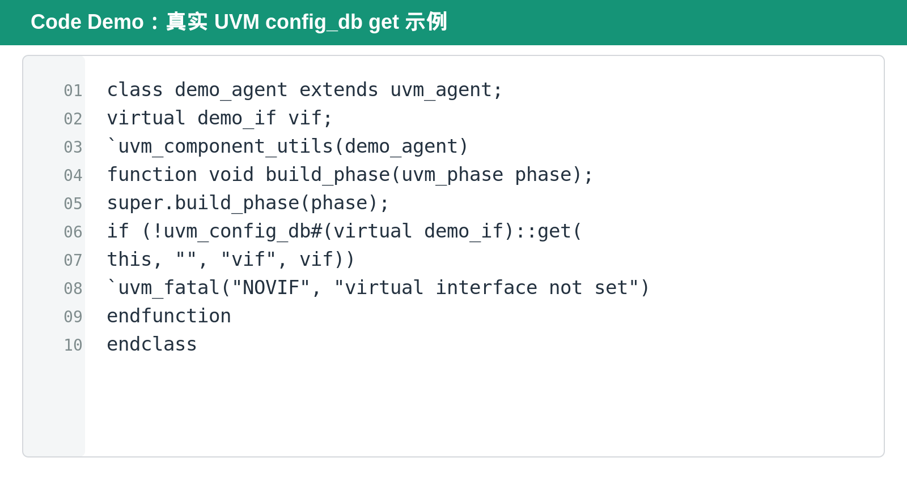

## [每日一题][UVM] 为什么 `uvm_config_db::get()` 会返回 0？

---

### 题目

test 中已经调用了 `uvm_config_db::set()`，为什么 child component 的 `uvm_config_db::get()` 仍然返回 0？

---

### 基础概念

`uvm_config_db` 是 UVM 中按 hierarchy scope 存取配置的机制。它不是全局 dictionary：set 的 context、instance path、field name 和 type 都会影响 get 是否能找到正确值。

`get()` 返回 0 的含义通常不是“value 为零”，而是“没有找到匹配的 configuration resource”。

---

### 标准回答

最常见原因有四类：scope 不匹配、field name 不匹配、type 不匹配、set timing 太晚。

scope 不匹配时，test set 的路径没有覆盖 child get 的 hierarchy。field name 不匹配时，set 和 get 使用了不同字符串。type 不匹配时，例如 set 的是 object handle，get 却用 scalar type，resource 不会匹配。

timing 也很重要。child 通常在 build_phase 中 get configuration。如果 set 发生在 child build 之后，get 已经错过了配置注入时机。

---

### Bridge／request tracker 类验证方法

在复杂 verification environment 中，config_db 常用于传递 virtual interface、agent enable、timeout、outstanding limit、scoreboard policy 等配置。

最稳妥的方式是让 test 或 env 在 build 前设置 config object，再由 child 在自己的 build_phase 中 get。不要把大量独立 scalar config 散落在不同 hierarchy scope，否则 debug 时很难确认某个 component 最终拿到的是哪一份配置。

对于 request tracker 类 component，建议把 limit、timeout、error policy 组合成一个 config object。这样 child 只 get 一次，验证也能检查 object 内容是否完整。

---

### 面试追问

**为什么不在 `new()` 中 get config？**

`new()` 是 object construction，不是 UVM build callback。此时 hierarchy 和 config propagation 可能尚未准备好。更常见且更稳定的位置是 build_phase。

**set 的 instance path 写 `*` 可以吗？**

可以用于广泛匹配，但 scope 过宽会让多个 component 意外拿到同一配置。面试中应说明：wildcard 方便，但不利于 isolation 和 debug。

**config_db 和 factory 都能改变 environment，区别是什么？**

factory 改的是“创建哪种类型的 object”。config_db 改的是“已创建 object 使用什么参数或资源”。

---

### DV 检查点

- set/get 的 scope 覆盖关系。
- field name 一致性。
- type 一致性。
- set 是否发生在 child build 之前。
- wildcard 是否意外覆盖其他 component。
- virtual interface 是否成功传到 driver／monitor。
- config object 是否在 reset 或 test reuse 时被错误复用。

---

### Code Demo

下面是一个真实的 UVM `build_phase` 示例。它在 component hierarchy 已建立后获取 virtual interface；若 scope、field name、type 或 set timing 有问题，`get()` 会返回 0 并触发 fatal。

---

### 今日结论

> **`get()` 返回 0，先查 scope、field、type、timing；不要先怀疑 UVM 本身。**

---

### 延伸阅读

完整 UVM configuration timing 文章：

https://github.com/daxuxuxu/wechat_airtual/tree/main/7_9/uvm_new_config_timing
