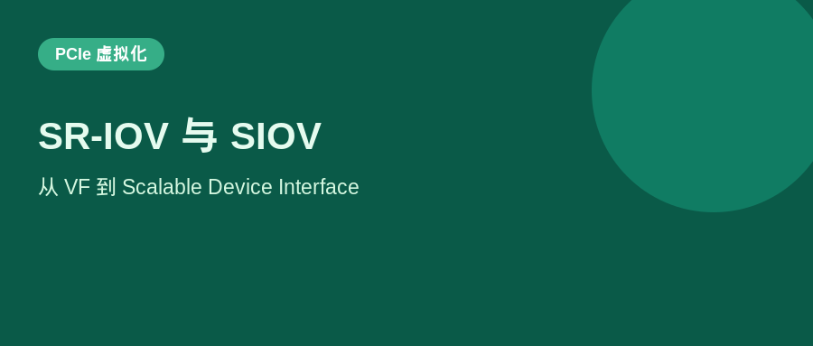
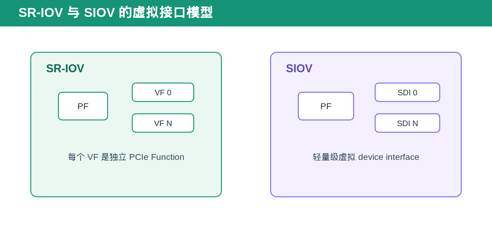
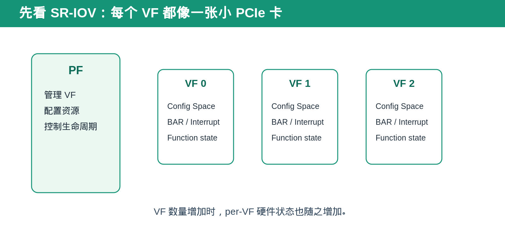
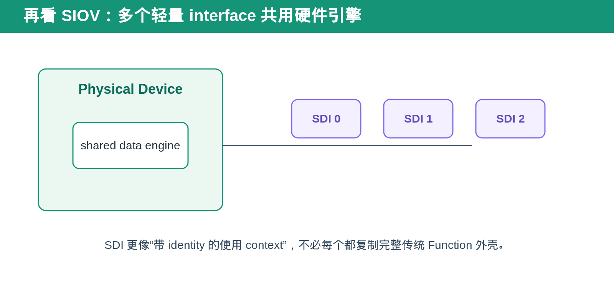
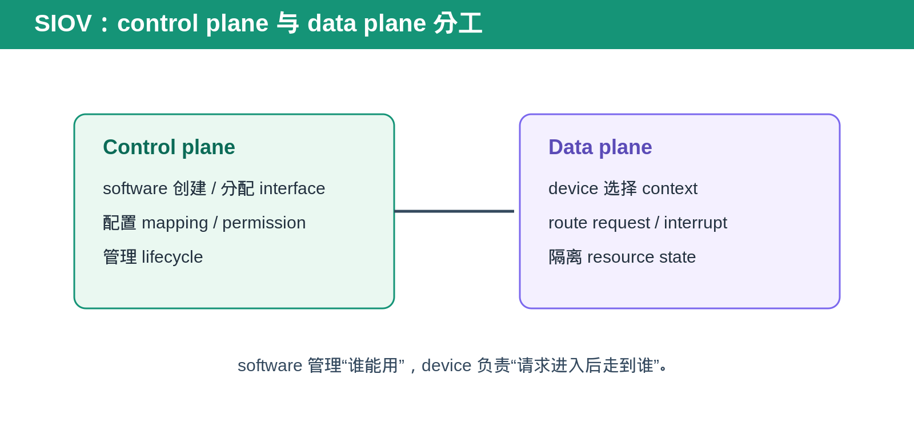
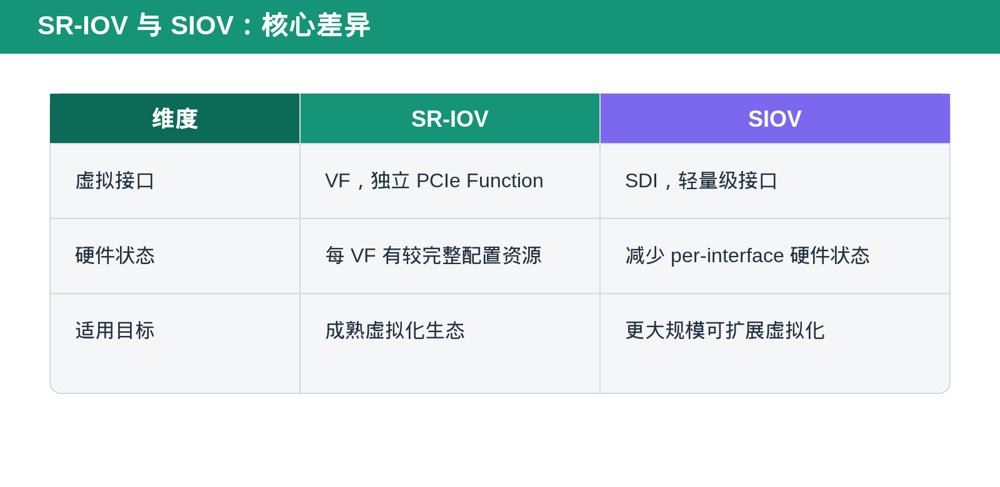
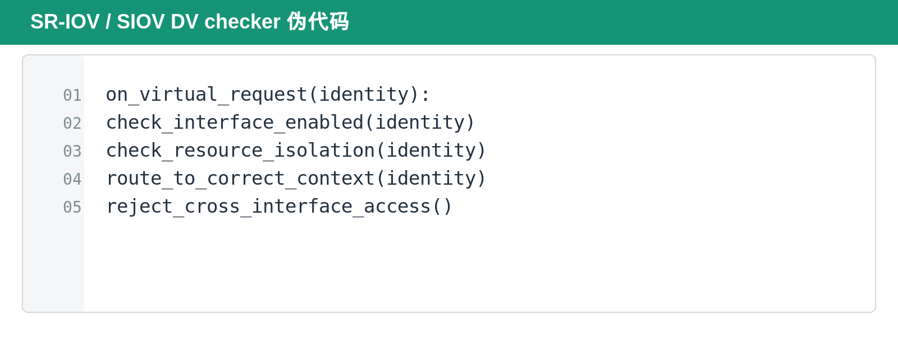

## [PCIe] SR-IOV 与 SIOV：从 VF 到 Scalable Device Interface

---

### 导读

SR-IOV 让一块 PCIe device 通过 PF 与 VF 向多个 VM 提供接近原生的 I/O 能力。但当虚拟接口数量继续增加时，每个 VF 都拥有独立 Configuration Space、BAR、MSI-X 等硬件状态，会让实现规模和软件枚举成本变高。

SIOV 的目标不是否定 SR-IOV，而是把虚拟化接口做得更轻量、更可扩展。

---

### 先用一句人话讲清楚

SR-IOV 的做法是：**把一块大设备切成很多个“小 PCIe Function”给不同 VM 用。**

SIOV 的做法是：**不再给每个使用者都造一套完整的小 Function 外壳，而是给它一个更轻量的“使用身份”和 context。**

可以把 SR-IOV 想成一栋楼里给每个租户配一套独立小公寓，门牌、钥匙、水表、电表都单独准备。SIOV 更像共享一栋大楼的核心设施，但给每个租户独立门禁、房间号和资源额度。

### 前置概念速查

PF 是管理 physical device 的 Function。VF 是 SR-IOV 中由 PF 创建的 Virtual Function，VF 对 software 看起来像独立 PCIe Function。

SIOV 使用 Scalable Device Interface，SDI，表示轻量级虚拟 device interface。它的目标是减少每个虚拟接口都复制完整 PCIe Function 状态的成本。

两者共同解决的是 I/O virtualization，但 software model、硬件状态和 scalability 取舍不同。

---

### 一、SR-IOV：每个 VF 都像一个 PCIe Function

SR-IOV 的优势是 software 模型成熟。PF 负责 VF enable、resource provisioning 和管理面控制；每个 VF 有独立 identity、configuration view、BAR slice 和 interrupt resource。

这种模型容易被现有 hypervisor、driver 和 VM 理解，因为 VF 的行为接近普通 PCIe Function。

代价是每增加一个 VF，硬件往往需要维护更多 per-VF state。对于需要非常大量虚拟接口的 device，这种复制成本会成为 scalability 限制。

---

### 二、SIOV：把虚拟接口变得更轻

SIOV 的核心思路是使用 SDI 作为虚拟接口，而不是让每个接口都复制成完整传统 PCIe Function。

更多 control plane 工作由 virtualization software 与 PF 配合完成，device 更专注于高频 data path 的 context selection、request routing 和 resource isolation。

这使 SIOV 更适合大规模 virtualization 场景。但它也要求 software、IOMMU 和 device 对 interface identity、context 和 page-level resource 管理有更紧密的协作。

---

### 三、SDI／ADI：轻量接口和完整 Function 的区别

SR-IOV 的 VF 对 software 来说很像独立 PCIe Function。它通常有自己的 Configuration Space view、BAR resource、interrupt resource 和 Function identity。

SIOV 则把虚拟接口做得更轻。PCI-SIG 公开资料使用 Scalable Device Interface，SDI，描述这种轻量接口；在相关生态中也常见 Assignable Device Interface，ADI，作为可分配接口的术语。

重点不是换一个名字，而是减少每个虚拟接口都复制传统 Function 硬件结构的成本。SIOV 不要求每个 interface 都维护完整的 per-Function Configuration Space、BAR 和 MSI-X Table。这样 device 可以支持远多于传统 VF 模型的虚拟 context。

### 四、RID、BDF 与 control plane 的变化

传统 SR-IOV 软件模型高度依赖 BDF。OS 枚举 PF 和 VF，driver 使用 Function Configuration Space、BAR 和 MSI-X Table 配置每个 VF。

SIOV 的数据路径更强调 lightweight interface identity。device 需要用唯一的 routing identity 或 context identity 把 request、interrupt、memory mapping 和 permission 关联到正确虚拟接口，但不必让每个 interface 都表现为完整传统 BDF Function。

这使 control plane 与 data plane 分工更清晰：virtualization software 管理 interface lifecycle、resource assignment 和 mapping；device 在高频路径中只根据 context identity 做快速选择、隔离与执行。

### 五、为什么 SIOV 常和 PASID、page table、IOMMU 一起出现

当虚拟接口数量很大时，单纯给每个 interface 分配固定 BAR slice 不够灵活。更可扩展的方式是让 request 带有 address-space context，并由 page table 或 IOMMU 参与地址转换和权限检查。

PASID 可以表示 request 属于哪个 process 或 virtual address space。SIOV interface identity 与 PASID、page mapping 配合后，device 能在共享硬件上为不同 workload 提供独立 address translation 和 resource context。

这不表示所有 SIOV implementation 都使用完全相同的 translation path，但验证时必须把 interface identity、address space identity、mapping lifecycle 与 invalidation 看作一个整体。

### 六、两者的核心差异

SR-IOV 侧重“虚拟接口像真实 Function”。SIOV 侧重“虚拟接口足够轻量，能扩展到更多 context”。

这不是简单的新旧替换关系。选择哪种方式取决于 software ecosystem、virtual interface 数量、hardware state cost、interrupt model 与 address translation 需求。

---

### 七、Interrupt、reset 与 interface lifecycle

SR-IOV 的 VF 通常使用熟悉的 Function capability、MSI-X Table 和 FLR 语义。SIOV 为了减少 per-interface 硬件状态，interrupt delivery 与 reset lifecycle 更依赖 software/device 协作。

验证时不能假设“disable interface”只等于停止新 request。还要确认旧 request、pending interrupt、translation cache、page mapping 和 context state 是否被正确清理。否则 interface 被重新分配后，旧 workload 的 state 可能泄漏到新 workload。

### 八、DV 中最重要的不是枚举，而是隔离

SR-IOV 验证通常重点检查 VF enable、BDF／Routing ID、BAR slice、MSI-X、FLR 和 PF/VF isolation。

SIOV 验证则更强调 interface identity、context mapping、resource isolation、request route、translation state 与 software-managed control plane。

无论是哪种模型，核心问题都是同一个：一个 virtual interface 的 request、interrupt、memory access 或 error state 不能泄漏到另一个 interface。

---

### 九、验证场景建议

覆盖 interface enable／disable、并发 request、resource quota、reset／FLR、interrupt isolation 和 error recovery。

对 SR-IOV，重点观察 PF 配置改变后 VF visibility 与 BAR route 是否同步变化。

对 SIOV，重点观察相同 address、不同 interface context 是否被正确隔离，以及 context invalidation、retry 或 reset 后的 state cleanup。

更口语化地说，SR-IOV 的验证重点是“每个 VF 像不像一张独立小卡”。SIOV 的验证重点是“每个 context 虽然没有完整小卡外壳，但会不会拿错别人的资源、地址空间、interrupt 或旧状态”。

---

### 十、总结

SR-IOV 用完整 VF 提供成熟的软件兼容性。SIOV 用轻量 SDI 面向更大规模的虚拟接口。

> **SR-IOV 强调“像一个 Function”，SIOV 强调“像一个可扩展 context”。**

---

*本文根据 PCI-SIG 公开的 SIOV 概念资料与通用 PCIe 虚拟化验证方法整理。*
