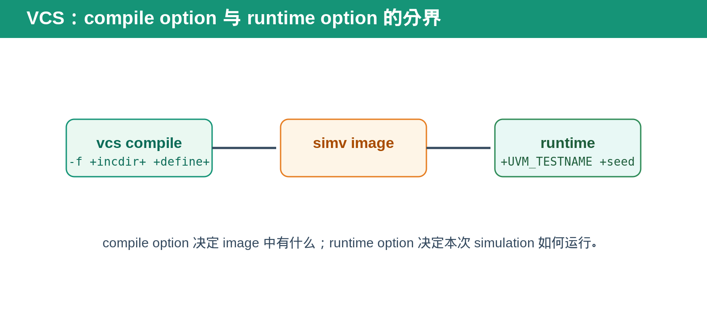
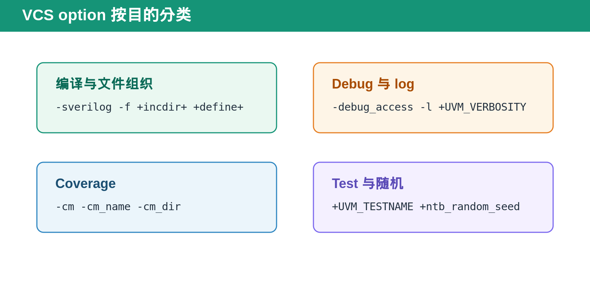
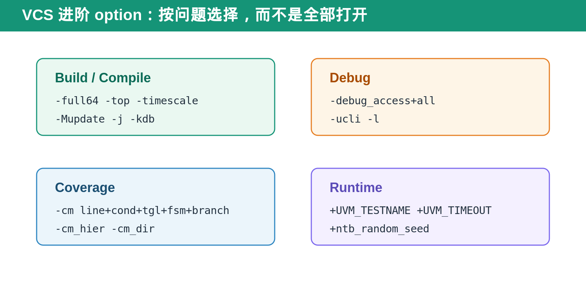
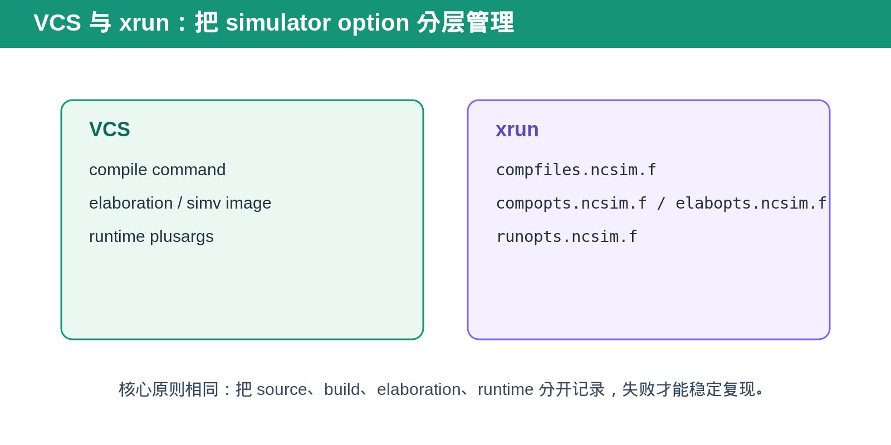

## [日常问题] VCS 常用命令与 Option：把 compile、debug、coverage 和 runtime 分开理解

---

### 导读

VCS command line 很容易越写越长，最后变成没人敢碰的一串 option。

真正高效的使用方式不是背所有 flag，而是先分清：哪些 option 决定 simulation image 里有什么，哪些 option 只影响本次 runtime，哪些 option 是为 debug 和 coverage 服务。

---

### 前置概念速查

`vcs` 通常负责 compile 和 build simulation image。`simv` 是 build 后运行的 simulation executable。

compile option 会影响 source file、include path、macro define、debug database 和 coverage instrumentation。runtime option 则影响 test、seed、verbosity、log 和部分 test behavior。

---

### 一、编译与文件组织

`-sverilog` 用于启用 SystemVerilog 解析。`-f` 用于读取 filelist。`+incdir+` 用于加入 include directory。`+define+` 用于在编译前传入 macro define。

这几个 option 最容易出问题的地方是“编译 image 与 source 环境不一致”。例如 filelist 漏了 package，include directory 没有加入，或 macro define 在不同 regression build 中不一致。

建议把 source list、include path 和 compile define 放入可追踪的 filelist 或 build configuration，不要只依赖 shell history。

---

### 二、Debug 与 log

`-debug_access` 用于保留 debug 所需的访问能力。`-l` 用于把 compile 或 runtime log 写入指定文件。

runtime 中常见的 UVM option 包括 `+UVM_TESTNAME` 和 `+UVM_VERBOSITY`。前者选择 test，后者控制 UVM message 输出级别。

debug 的目标不是“开越多越好”。过多 debug access 会增加 compile time、image size 和 runtime overhead。应按 waveform、backtrace、signal visibility 的实际需要选择。

---

### 三、Coverage

`-cm` 用于开启指定 coverage 类型。`-cm_name` 用于标识本次 run。`-cm_dir` 用于指定 coverage database 的保存位置。

coverage option 最重要的是保证不同 seed、不同 test 和不同 regression job 的数据库不会互相覆盖。merge 前还要确认 compile-time instrumentation 一致，否则 coverage result 没有可比性。

---

### 四、Test 与随机

`+UVM_TESTNAME` 用来选择 test。`+ntb_random_seed` 用于控制随机 seed，使问题可复现。

发现随机 failure 时，第一步应该记录 test name、seed、compile define、runtime plusarg 和 simulator version。只保存一个 seed 不足以稳定复现，因为 build option 变化也可能改变 randomization path。

---

### 五、更多 compile option

`-full64` 常用于 64-bit simulation build。`-top` 可明确 top module，避免 filelist 中存在多个候选 top 时产生歧义。`-timescale` 用于统一或指定 simulation time unit／precision。

`-Mupdate` 用于 incremental compile 场景，减少未变化 source 的重复编译。`-j` 用于并行 build，适合 source file 较多的环境。`-kdb` 用于生成供 debug tool 使用的知识数据库。

这些 option 的共同特点是影响 build image。它们应该与 filelist、define、source revision 一起记录，否则同一个 test／seed 在不同 image 上可能无法复现。

### 六、更多 debug 与 coverage option

`-debug_access+all` 会保留较完整的 debug access，但通常会增加 build 和 runtime cost。实际使用时应按 debug 需求选择合适 access，而不是所有 regression 都默认开最大等级。

coverage 常见的组合包括 line、condition、toggle、FSM、branch 和 assertion。`-cm_hier` 用于指定 coverage hierarchy，避免无关 block 进入统计；`-cm_dir` 用于隔离每次 run 的 coverage database。

### 七、runtime option 的边界

`+UVM_TIMEOUT` 可用于给 test 设置 runtime timeout。`+UVM_MAX_QUIT_COUNT` 可限制 UVM error 达到阈值后的行为。`+ntb_random_seed` 保证随机场景可复现。

这些 plusarg 不会把缺失的 module、macro 或 coverage instrumentation 加进 image。遇到问题时，先判断它是 compile-time 问题还是 runtime 问题，再选择正确类型的 option。

### 八、常用 option 的使用原则

第一，compile option 与 runtime option 分开维护。

第二，debug、coverage、performance build 分开定义，避免所有 regression 默认开启最大 debug。

第三，所有可影响行为的 macro define、plusarg、seed 都写入 log 或 run metadata。

第四，出现 failure 时，优先重现同一 image、同一 test、同一 seed、同一 plusarg，再开始改代码。

### 九、xrun：把 compile、elaboration 与 run 放在同一套命令框架

Xcelium 的 `xrun` 可以把 compile、elaboration 和 simulation run 放在一次 invocation 中完成，也可以通过 option file 将它们分层管理。

在大型 environment 中，推荐将 source file list、compile option、elaboration option、runtime option 分开放入独立 `.f` 文件。常见命名方式包括 `compfiles.ncsim.f`、`compopts.ncsim.f`、`elabopts.ncsim.f` 和 `runopts.ncsim.f`。

这样做的好处是：改 test 或 seed 不需要碰 compile file list；改 debug access 不需要修改 runtime option；定位 failure 时可以准确知道是 source/build/elaboration 还是 run setting 变化。

### 十、xrun 常见操作方向

`-f` 用于读取 option/file list。`-sv` 或相应语言 option 用于启用 SystemVerilog。`-uvm` 用于启用 UVM 相关环境。`-access +rwc` 常用于增加 debug visibility。`-gui` 用于图形调试。coverage 相关 option 用于 instrumentation 和 coverage database。

runtime 中依然需要明确 test、seed、log、timeout 和 UVM verbosity。不同 Xcelium 版本或团队封装脚本对具体 option 名称可能不同，因此应优先查看项目提供的 `compopts`、`elabopts` 和 `runopts` 文件，而不是复制别人的长命令。

### 十一、VCS 与 xrun 的共同 debug 原则

不管使用 VCS 还是 xrun，复现 failure 都要固定四类输入：source/build revision、compile/elaboration option、test/seed、runtime plusarg 或 run option。

只固定 seed 而不固定 build option，或只保留 log 而不保留 option file，都会让复杂 DV failure 难以稳定复现。

---

### 六、总结

VCS option 可以按四类记忆：编译组织、debug/log、coverage、test/random。

> **compile option 决定 image 有什么，runtime option 决定这次 run 怎么跑。**

---

*本文以通用 VCS／UVM 使用习惯整理。不同版本和团队封装脚本可能对具体 option 组合有额外要求。*
