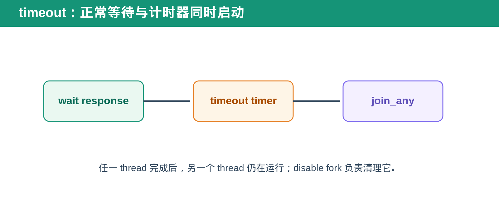
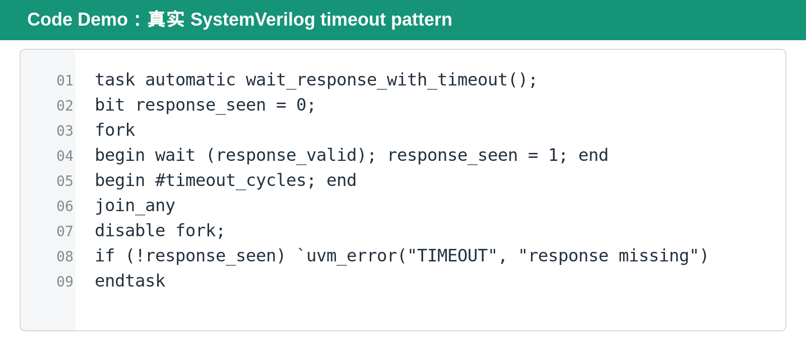

## [每日一题][SV] 为什么 `join_any` 后还要 `disable fork`？

---

### 题目

SystemVerilog 中实现 timeout 时，常见写法是 `fork...join_any`。为什么任一 thread 结束后，还必须紧跟 `disable fork`？

---

### 基础概念

`fork...join_any` 会同时启动多个 child process，但只要其中任意一个 process 完成，父线程就会继续执行。

关键点是：**父线程继续，不代表其他 child process 自动停止。**

timeout pattern 通常同时启动“等待正常 response”和“等待 timeout”两个 thread。谁先完成，决定本次 operation 成功还是 timeout。

---

### 标准回答

如果 response 先到，timeout thread 仍可能继续计时。若不停止它，之后它可能在完全无关的 transaction 中触发 timeout action。

如果 timeout 先到，等待 response 的 thread 也仍可能继续等待。后续某个迟到 response 可能意外修改旧变量、打印误导 log，甚至影响下一笔 transaction。

`disable fork` 的作用就是清理当前 fork block 中仍未完成的 child process，确保本次 transaction 的 timeout 资源不会泄漏到后续流程。

---

### Bridge／request tracker 类验证方法

在 request tracker 或 driver 验证中，timeout 往往围绕 request/response lifecycle。正常 thread 等待 response identity matching，timeout thread 等待 bounded time。

response 到来后，应取消 timeout thread。timeout 到来后，应取消 response wait thread，并把对应 request entry 标记为 timeout 或进入 recovery path。

如果不清理残留 thread，最典型的 bug 是：前一笔 request 的 timeout thread 在后一笔 request 期间触发，导致错误 report 被归因到错误 transaction。

---

### 面试追问

**`join` 能代替 `join_any` 吗？**

不能用于普通 timeout pattern。`join` 会等待 response thread 和 timeout thread 都结束，即使 response 已到，仍会等完整 timeout 时间。

**`disable fork` 会停止所有 fork 吗？**

它作用于当前 process scope 中可见的 fork block。复杂 environment 中应使用命名 fork block 或清晰的 process scope，避免误杀无关 thread。

**什么时候需要 `wait fork`？**

当使用 `join_none` 启动 background process，且后续需要明确等待它们收尾时，可用 `wait fork`。它解决的是“等待剩余 thread”，不是 timeout cleanup。

---

### DV 检查点

- response 先到，timeout thread 必须被取消。
- timeout 先到，response wait thread 必须被取消。
- back-to-back request 不应受到前一笔残留 thread 影响。
- reset 时 timeout process 是否正确结束。
- 多 outstanding request 时，每笔 request 的 timeout scope 是否独立。

---

### Code Demo

#### 代码解释

第 3 至 5 行启动两个并行 thread。第 4 行等待 `response_valid`，成功时把 `response_seen` 置为 1。第 5 行只负责计时，不直接修改 transaction state。

第 6 行的 `join_any` 让任一 thread 完成后继续执行。第 7 行的 `disable fork` 是关键：它停止尚未完成的另一条 thread，防止 timeout 或 response wait 泄漏到下一笔 transaction。

第 8 行根据 `response_seen` 区分成功与 timeout。因为残留 thread 已被清理，这个判断只属于当前 transaction。

---

### 今日结论

> **`join_any` 只决定谁先结束；`disable fork` 才负责清理谁还在运行。**

---

### 延伸阅读

SystemVerilog task／function 与时序控制文章：

https://github.com/daxuxuxu/wechat_airtual/tree/main/7_13/systemverilog_task_function
