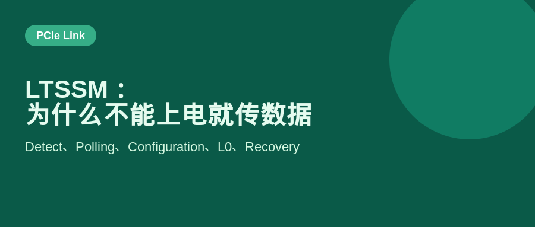
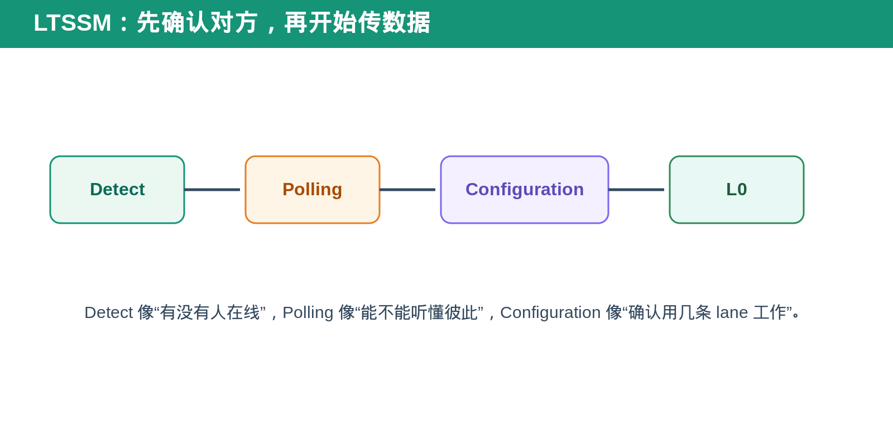
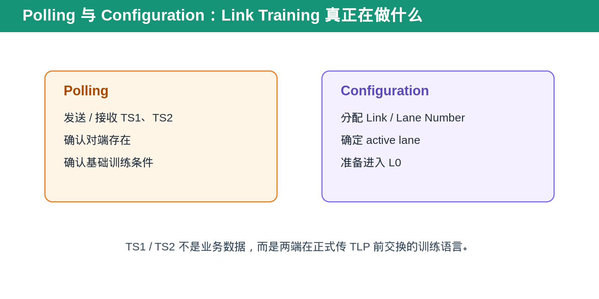
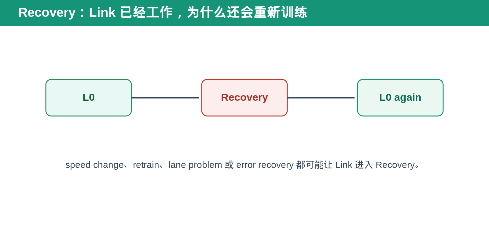

## [PCIe] LTSSM：PCIe Link 为什么不是上电就能直接传数据

---

### 导读

把两块 PCIe device 插在一起，不代表它们马上就能稳定传 TLP。

两端要先确认对方真的存在，确认 receiver 能听懂发出的训练序列，确认哪几条 lane 可用，再决定 link 已经进入正常工作状态。LTSSM 就是管理这整套过程的状态机。

---

### 前置概念速查

LTSSM 是 Link Training and Status State Machine。它不是 software state，也不是 transaction layer 的 queue state，而是 PCIe link 从上电、训练、正常工作、低功耗、恢复到 reset 的状态机。

`L0` 是正常传输 TLP 的 active state。Detect、Polling、Configuration 是进入 L0 前的训练步骤。Recovery 是 link 已经工作后重新训练或恢复的路径。

**Link** 是两个 PCIe port 之间建立起来的逻辑连接。**Lane** 是组成 link 的一条高速差分传输通道；x1、x4、x8、x16 表示 link 使用的 lane 数量。

**L0** 是 link 正常工作状态。只有进入 L0，Transaction Layer 的 TLP 才能可靠传输。可以把 L0 理解成“电话已经接通，双方开始正式说业务”。

**L0s** 和 **L1** 是 link power management 相关的低功耗状态。L0s 通常是较浅的省电状态，退出较快；L1 更深，恢复到正常传输通常需要更多时间。它们不等于 link 掉线，而是 link 暂时降低功耗。

**TS1 / TS2** 是 Training Sequence Ordered Set。它们是 link training 时两端交换的训练信息，不是 Memory Read、Memory Write 等业务 TLP。

**Recovery** 表示已经工作过的 link 需要重新训练。它可能由 retrain、speed change、lane 问题或 error recovery 引起。Recovery 成功后通常重新进入 L0。

**Hot Reset** 是影响下游 link／hierarchy 的 reset 机制。它与 Function Level Reset 不同，FLR 只针对一个 Function，而 Hot Reset 更接近对 link 下游设备重新建立工作状态。

---

### 一、为什么不能一上电就传 TLP

PCIe 是高速 serial link。两端即使物理相连，也可能面临 lane 没检测到、极性或信号质量不稳定、lane 数量不一致、speed 不匹配或训练 sequence 未同步等问题。

如果上电后直接传业务 TLP，接收端可能根本无法确定 bit、symbol、lane 和 link identity。LTSSM 的意义是先建立一个可信的传输基础，再让 transaction layer 开始工作。

可以把它想成两个人先确认“电话接通了”“听得懂对方语言”“知道谁在说话”，最后才开始正式讨论业务。

---

### 二、Detect：先确认对端是否存在

Detect 是 link bring-up 的起点。发送端通过 receiver detect 等机制确认对端 receiver 是否存在。

如果没有检测到对端，link 不应该继续假装正常训练。它会停留、重试或按状态机规则返回相应路径。

DV 中，Detect 相关场景常包括 endpoint 不存在、lane 不完整、link disable、reset 后重新检测和 hot-plug 类变化。

---

### 三、Polling 与 Configuration：两端怎样“对上暗号”

Polling 阶段会交换 TS1、TS2 等训练 ordered set。它们不是业务 payload，而是两端确认 link training 条件的“握手语言”。

Configuration 阶段进一步完成 link/lane number 等训练信息的协商，确定哪些 lane 作为 active lane，准备进入正常工作状态。

简单说，Polling 是“我听得到你吗”，Configuration 是“我们最终按几条 lane、怎样编号、怎样连接来工作”。

---

### 四、L0：真正开始传 transaction 的状态

只有 link 进入 L0 后，TLP 才能按正常路径传输。

这时上层看到的 MRd、MWr、Completion、Configuration Request 才有可靠的物理与数据链路基础。若 LTSSM 没到 L0，transaction layer 的 timeout、Completion missing 或 request stall 往往只是表面现象，根因可能在 link training。

---

### 五、Recovery：为什么已经 Link Up 还会重新训练

L0 不代表 link 永远稳定。speed change、retrain、lane 问题、某些 error recovery 或 power-related transition 都可能让 LTSSM 从 L0 进入 Recovery。

Recovery 不是简单“掉线重连”。它的目标是重新建立可工作的 link 条件，并在成功后回到 L0。DV 需要确认进入 Recovery 时未完成 transaction 如何处理、恢复后是否出现 stale state、link width/speed 是否符合预期。

---

### 六、DV 验证应该看什么

首先检查关键 state sequence：Detect、Polling、Configuration、L0、Recovery 的转换是否符合设计预期。

其次检查异常条件：对端不存在、训练超时、lane down、link retrain、Hot Reset、link disable、speed change。

最后把 LTSSM 与 transaction behavior 联动：L0 前不应错误发业务 traffic，L0 到 Recovery 的切换不应留下不可恢复的 request state，Recovery 回到 L0 后 traffic 是否能重新正常完成。

---

### 七、总结

LTSSM 的作用是让 PCIe link 从“物理连上”变成“可以可靠传 transaction”。

> **Detect 确认对端，Polling 确认训练，Configuration 确认连接方式，L0 才是真正开始传 TLP。**

---

*本文根据 PCI-SIG 公开的 LTSSM FAQ 与通用 PCIe link verification 场景整理。*
