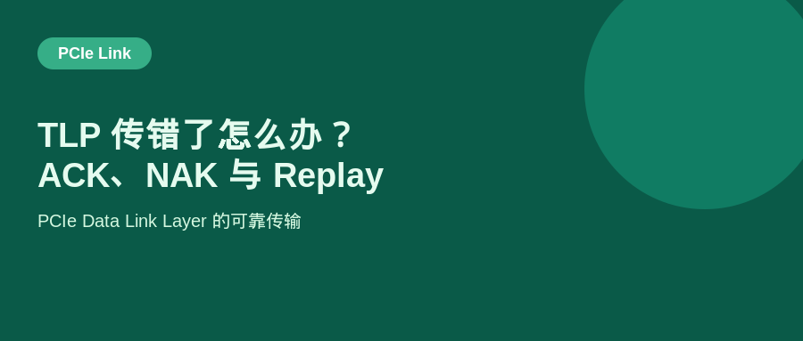
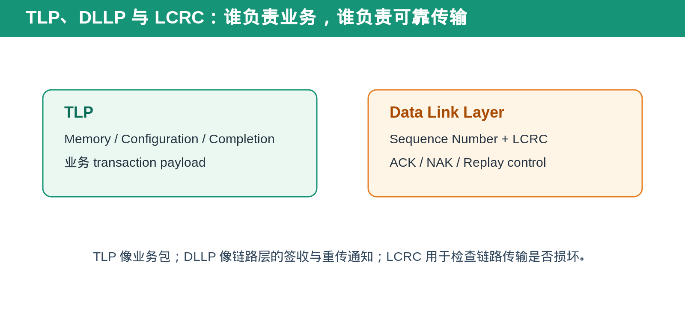
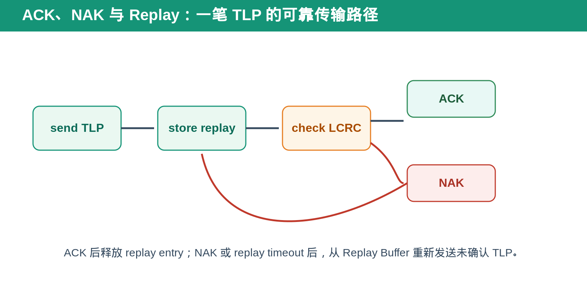
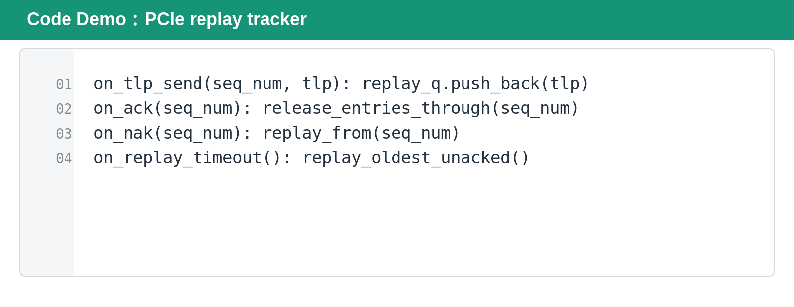

## [PCIe] TLP 传错了怎么办？ACK、NAK 与 Replay 怎么把数据拉回来

---

### 导读

高速 PCIe link 不可能假设每个 bit 永远正确。信号干扰、瞬时 error 或 receiver 检查失败都可能让一笔 TLP 传坏。

PCIe 不需要让上层软件重新发 request。Data Link Layer 会用 Sequence Number、LCRC、ACK、NAK 和 Replay Buffer 在链路内部完成检测与重传。

---

### 前置概念速查

TLP 是 Transaction Layer Packet，承载 Memory Read、Memory Write、Configuration、Completion 等业务 transaction。

DLLP 是 Data Link Layer Packet，用于链路层控制，例如 ACK、NAK 与 Flow Control 信息。LCRC 是附在 TLP 上的链路校验，用来检测传输过程中是否损坏。

Sequence Number 让 sender 和 receiver 知道“这是第几笔可重传 TLP”。Replay Buffer 则保存尚未被 ACK 确认的 TLP。

---

### 一、先用人话理解 Replay

可以把 TLP 想成寄出的包裹。sender 不会一寄出就把底稿扔掉，而是先放进 Replay Buffer。

receiver 检查包裹是否完整。正确就回 ACK，sender 才能删除底稿。发现损坏就回 NAK，sender 从指定位置重新寄。若等太久没收到确认，也会按照 replay timeout 规则重新处理。

---

### 二、ACK、NAK 与 Replay Buffer 分别做什么

ACK 表示 receiver 已正确接收某个 sequence number 之前的 TLP。sender 收到 ACK 后，可以释放对应 replay entry。

NAK 表示 receiver 检测到 sequence error 或 LCRC error，sender 不能再假设后续 TLP 已被可靠接收，需要从指定 sequence point 重传。

Replay Buffer 的作用是保存“还没被确认”的 TLP。它不是普通 transaction queue，而是 link reliability 的恢复材料。

---

### 三、为什么这件事要放在 Data Link Layer

上层 Transaction Layer 只关心“我要读什么、写什么、Completion 是否匹配”。它不应该因为一条 link 上偶发 bit error 就重建业务 transaction。

Data Link Layer 把这种局部可靠性问题屏蔽掉：上层仍然看到同一笔 TLP，链路层在底下完成检查、确认和 replay。

这也是为什么 replay 与 Completion 不一样。Replay 是 link-level retry；Completion 是 Non-Posted Request 的 transaction-level response。

---

### 四、DV 验证应覆盖什么

覆盖 LCRC error、NAK、ACK 延迟、ACK 丢失、replay timeout、duplicate TLP 和 reset 时 replay state cleanup。

需要确认重传不会改变 transaction 内容、sequence order 或 identity。receiver 也不能把 replay TLP 当成一笔新的业务 transaction 重复执行。

如果 reset／link recovery 发生，Replay Buffer 中未确认的状态必须按 link policy 清理或重新初始化，不能在恢复后错误匹配旧 sequence。

---

### Code Demo

#### 代码解释

第一行在发送 TLP 时把它放入 replay queue。第二行收到 ACK 后释放已经确认的 entry。第三行收到 NAK 后从指定 sequence number 开始重传。第四行处理长时间未确认的 timeout path。

这个 demo 直接对应前文的因果链：**发送后先保留，收到 ACK 才释放，收到 NAK 或 timeout 才 replay。**

---

### 五、总结

PCIe 的可靠传输不是靠上层重发业务 request，而是靠 Data Link Layer 在本地处理错误。

> **TLP 负责业务，DLLP 负责确认；ACK 释放 replay state，NAK 触发重传。**

---

### 延伸阅读

PCIe Flow Control 文章：

https://github.com/daxuxuxu/wechat_airtual/tree/main/7_4/pcie_fc

PCIe LTSSM 文章：

https://github.com/daxuxuxu/wechat_airtual/tree/main/7_21/pcie_ltssm
