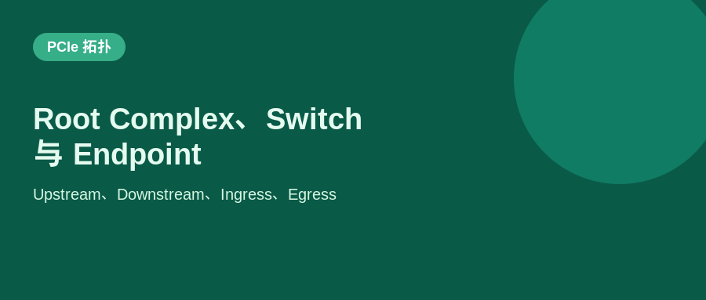
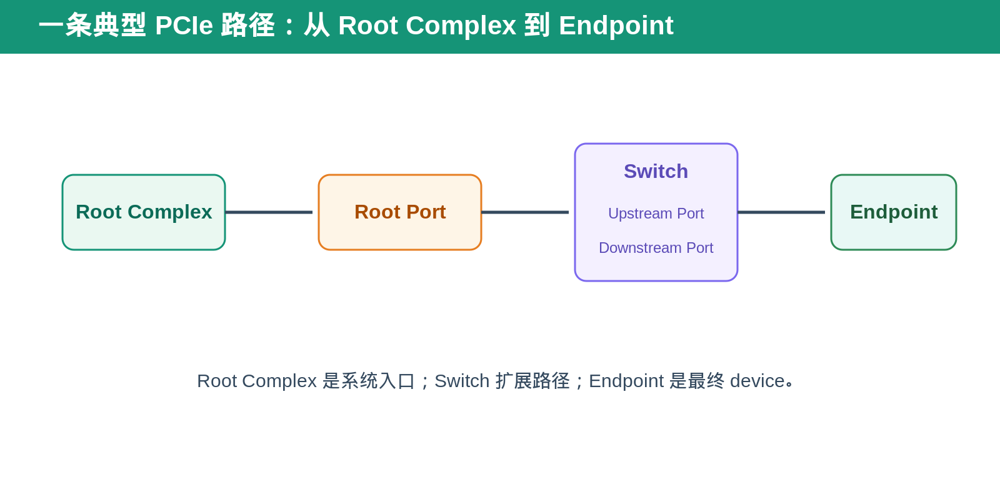
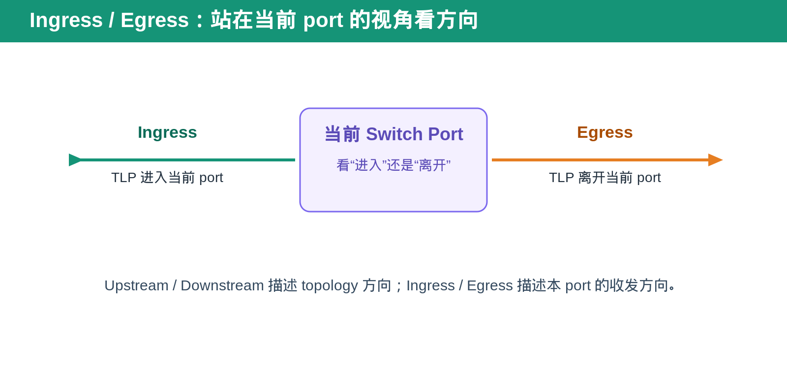

## [PCIe] Root Complex、Endpoint、Switch、Upstream／Downstream 到底是什么

---

### 导读

PCIe 图里经常出现 RC、EP、US、DS、Ingress、Egress。它们看起来都是“方向”，但实际上描述的是不同层次的概念。

最容易混淆的是：Upstream／Downstream 是 topology 方向，Ingress／Egress 是站在当前 port 的收发方向。把这两个视角分开，PCIe routing 图就会清楚很多。

---

### 前置概念速查

Root Complex，RC，是 CPU／memory system 与 PCIe hierarchy 的连接入口。Endpoint，EP，是最终提供功能的 device，例如 NIC、GPU、NVMe controller。

Switch 用来扩展 PCIe fanout。它有一个 Upstream Port 面向 Root Complex，多个 Downstream Port 面向 Endpoint 或下一级 Switch。

---

### 一、Root Complex：PCIe hierarchy 的起点

可以把 Root Complex 理解成 CPU world 和 PCIe world 的入口。software 发起 configuration access、memory access 或 DMA 相关操作时，最终都需要经过 Root Complex 进入 PCIe fabric。

Root Port 是 Root Complex 对外暴露的一条具体 PCIe link。一个 Root Complex 可以有多个 Root Port，每个 Root Port 都可以连接 Endpoint 或 Switch。

---

### 二、Endpoint：真正干活的 PCIe device

Endpoint 是 PCIe hierarchy 的叶子节点。它通常拥有 BAR、Capability、DMA engine、MSI/MSI-X、Function state 等资源。

Endpoint 可以是单 Function，也可以是 multi-Function device。它不负责把 traffic 再转发给更下游的 PCIe device；它通常就是 transaction 的最终 consumer 或 producer。

---

### 三、Switch：PCIe 的路口

Switch 的作用类似交通枢纽。它把一条上游 link 扩展成多条下游 link，并根据 bus number、address、routing rule 或 transaction type 把 TLP 送到正确 port。

Upstream Port，USP，是 Switch 面向 Root Complex 的 port。Downstream Port，DSP，是 Switch 面向 Endpoint 或下一层 Switch 的 port。

从 Root Complex 往 device 方向看，是 downstream。反过来从 device 回到 Root Complex，是 upstream。

---

### 四、Ingress 与 Egress：站在 port 内部看方向

Ingress 和 Egress 不是固定指向 Root Complex 或 Endpoint，而是站在“当前 port”的视角。

一个 TLP 进入当前 port，叫 ingress。一个 TLP 从当前 port 离开，叫 egress。

例如，对 Switch Downstream Port 而言，来自 Upstream Port 的 request 进入该 DSP，是 DSP ingress；DSP 把 request 送往 Endpoint，则是 DSP egress。

同一笔 Completion 回来时方向会反过来：从 Endpoint 进入 DSP 是 ingress，从 DSP 送回 USP 是 egress。

---

### 五、为什么方向概念对 DV 很重要

很多 PCIe bug 不在 TLP 格式，而在 route direction 错误。例如 request 进入错误 Downstream Port、Completion 返回错误 Upstream Port、Configuration Request 没有按 hierarchy route、或者 ingress filter 错误放行了不该接收的 TLP。

DV 中建议按 port 建立 transaction monitor。每笔 TLP 至少记录 ingress port、egress port、transaction type、Requester ID、Completer ID 和最终 route result。

这样发生 route miss、unexpected Completion 或 malformed forwarding 时，log 能直接回答：这笔 TLP 从哪里来，经过哪个 port，本应去哪里，实际又被送到了哪里。

---

### 六、常见验证场景

- RC 直接连接 EP。
- RC → Switch → 多个 EP。
- 多级 Switch。
- MRd／MWr 的 request 与 Completion 反向路径。
- Type 0／Type 1 Configuration Request。
- Downstream route miss。
- Upstream Completion route。
- link disable、Hot Reset、port reset 后的 route recovery。

---

### 七、总结

Root Complex 是入口，Endpoint 是最终 device，Switch 是扩展和转发节点。

> **Upstream／Downstream 看 topology，Ingress／Egress 看当前 port 的收发方向。**

---

*本文以通用 PCIe hierarchy、port routing 与 DV 场景整理。*
