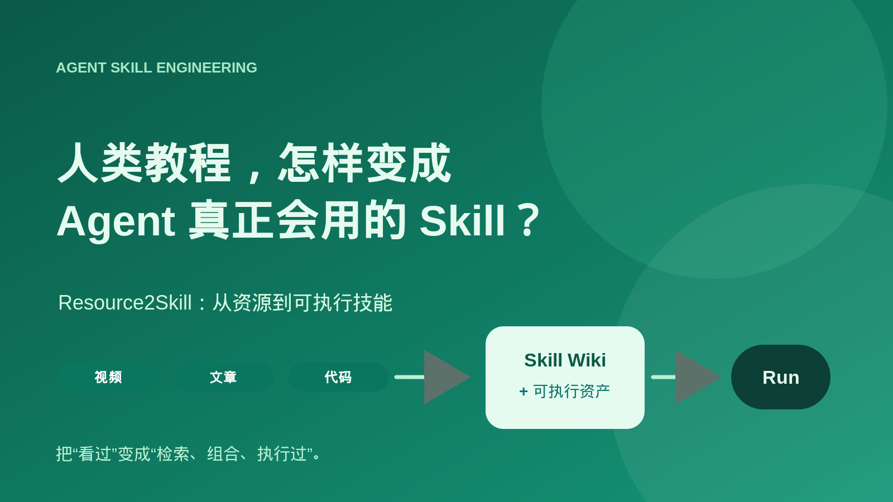
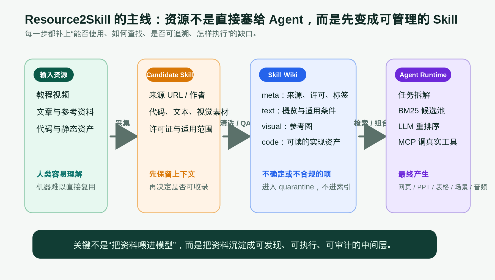
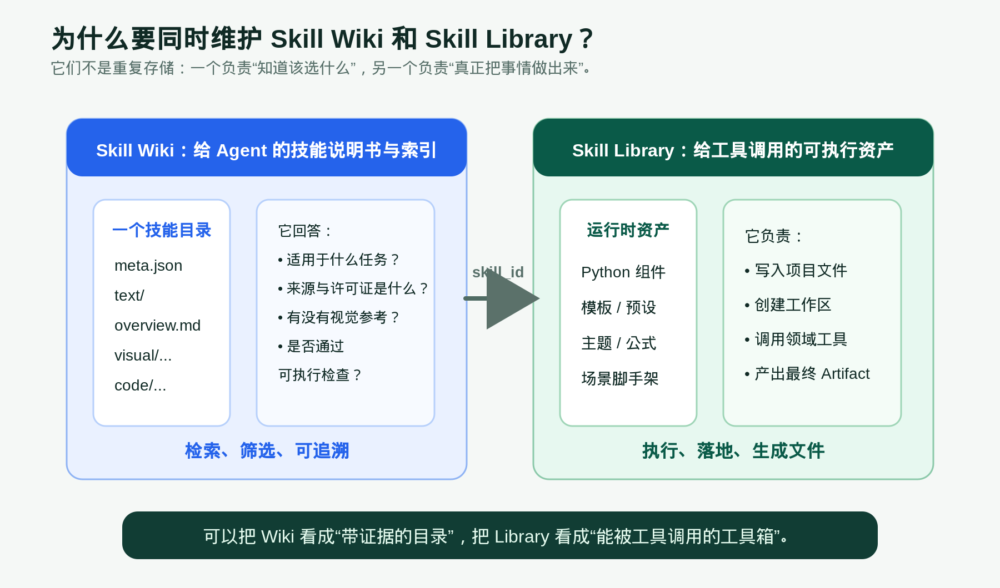
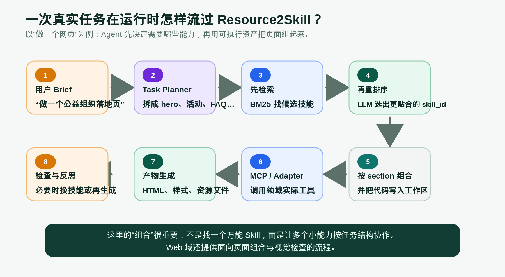
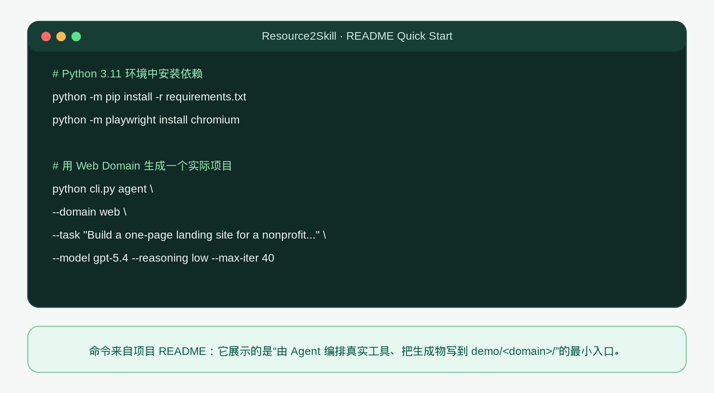

# [AI Agent] 人类教程，怎样变成 Agent 真正会用的 Skill？Resource2Skill 到底做了什么

## 导读

最近看 Agent 相关项目时，经常会遇到一种“看上去很会、实际上很难复用”的资源：一段讲得很好的视频、一个审美不错的网页、几页完整的 PPT，或者一份能跑的开源脚本。人能从里面学到方法，但 Agent 很难仅凭一条链接稳定地把这个方法拿出来、判断能不能用、再组合到新任务中。

Microsoft 开源的 Resource2Skill 想解决的，就是这段鸿沟。它不把 Skill 理解成一条很长的 prompt，而是把人类创作的多模态资源整理成一份可以被 Agent 检索、追溯、组合并通过真实工具执行的“技能包”。

它的目标不是让模型“看过更多资料”，而是让模型在需要做网页、PPT、Excel、Blender 场景或音频时，能够回答三个更工程化的问题：该选哪个能力？这个能力来自哪里、能不能用？选完之后到底怎样落地成文件？

## 前置概念速查

- Resource：视频教程、文章、参考素材、代码等人类已经创造出来的资源。它们有价值，但格式、质量和许可证往往并不统一。

- Skill：不是一段“请你帮我做”的自然语言提示，而是一份带有适用范围、来源、文本说明、视觉参考和可执行资产的可复用能力。

- Skill Wiki：技能的可查询目录。它让 Agent 知道某个 Skill 是什么、从哪里来、适合什么任务、有没有通过执行检查。

- Skill Library：真正用于运行时的资产库。它存放组件、模板、预设、公式或场景脚手架，让 Agent 能把选择结果写进项目、交给领域工具执行。

## 一、它解决的不是“知识不够”，而是“知识不能直接工作”

假设你把一个网页教程链接交给 Agent，并要求它做一个相同风格的页面。Agent 也许能读到文字，甚至能概括出“深色背景、卡片布局、带动画”。但真正开始生成时，问题才出现：页面究竟由哪些 section 组成？每个 section 能否独立复用？参考代码的许可证是什么？素材、代码和截图之间如何对应？如果要和另一个页面组件拼在一起，CSS 会不会冲突？

这就是“资源”和“可执行 Skill”的差异。

原始资源是为人服务的。视频依赖人眼观察和上下文理解；文章可能只讲原则不带代码；代码也许能运行，却没有说明适用边界。Agent 要稳定复用它，至少需要把资源拆成机器可操作的几个部分：来源证据、结构化描述、可检索标签、视觉线索、可执行资产，以及结果检查方式。

Resource2Skill 把这件事做成了一条明确流水线。项目 README 中把输入概括为 tutorial videos、reference artifacts、articles 和 code；输出则是可由软件工具执行的 Skill，用来生成网页、演示文稿、工作簿、三维场景和音频。这个定位很重要：它不是一个“帮你总结视频”的工具，而是把资源变成 Agent runtime 能消费的中间层。

## 二、从资源到 Skill，中间多了一道很关键的“治理层”

Resource2Skill 的源码里把最初采集到的内容称为 CandidateSkill。这个候选对象不会马上进入技能库，而是携带资源类型、来源 URL、频道或作者、许可证、文本概览、代码、视觉素材、适用范围和标签等信息，随后进入 wash pipeline。

这个“清洗”听起来有点抽象，换成更直白的话就是：先把一个来源不一、结构不一的资源整理成统一目录，再判断它是否值得被 Agent 使用。

项目里的 CandidateSkill 会先经过许可证门槛。许可证未知，或被标记为 blocked 的候选项会被放进 `_quarantine`，不会进入正常索引。这一点很工程化：模型觉得“有用”不等于系统应该“允许复用”。对于公开视频等来源，仓库也会保留待审状态，而不是把它直接伪装成已经验证、可自由使用的资产。

接着，清洗过程会把文本、代码和视觉素材归档到每个 Skill 自己的目录，并生成元数据。对于带可执行代码的 Skill，系统还会根据声明的 entrypoint 做结构和执行质量检查；缺少必要签名、代码无法解析或入口无法解析的项会被隔离。另一方面，代码被保留下来不等于它已经通过执行验证：元数据中的 `exec_ok` 用来表达验证状态，使用者应该把“未验证”和“验证通过”当成不同等级的证据。

这层治理的价值，是让后面的 Agent 不必重新猜测“这个东西有没有出处、能否调用、风险在哪里”。在真正的团队工程里，这往往比多找十个漂亮 demo 更重要。

## 三、Skill Wiki 和 Skill Library，分别回答“选什么”与“怎么做”

很多人第一次看这个项目时，会把 `skills_wiki` 和 `skills_library` 当成两份重复数据。其实它们的职责非常不同。

Skill Wiki 更像一本“带证据的技能目录”。一个 Skill 目录可以包含 `meta.json`、文本概览、视觉参考和代码资产。元数据里记录了技能名称、来源、许可证、标签、分类、模态信息以及 `exec_ok` 等状态。这样 Agent 在检索时不是只看到一串相似关键词，而是有机会知道：这项能力适合哪类任务、资源从哪里来、有没有视觉参考、是否已经通过某种执行检查。

Skill Library 则更像真正给工具用的工具箱。以仓库里的不同 domain 为例，Excel 域可以有格式预设、图表模板、公式和工作簿脚手架；Blender 域可以有材质预设、灯光 rig 和场景模板。它们不是解释“如何做”的文档，而是“可以直接被 Adapter 或 MCP server 取走并写入目标工作区”的资产。

把两者拆开后，系统的责任边界清楚了：Wiki 管发现、筛选和可追溯；Library 管执行、落地和文件生成。一个 `skill_id` 把两边关联起来，Agent 先在 Wiki 中决定选谁，再让运行时从对应的资产中完成实际操作。

## 四、运行时不是一次检索，而是一条“拆解—筛选—组合—执行”的链路

以网页任务为例，用户给出的通常是一段 brief：“做一个公益组织落地页，要有项目介绍、影响力、捐赠档位、FAQ 和页脚。”这不是一个单点技能，而是多个页面 section 和多个设计决策的组合。

Resource2Skill 的 task planner 先把任务拆开；在 Web 域中，检索流程先用 BM25 从技能目录中建立候选池，再通过 LLM rerank 选出更贴合当前 section 的 skill。先做词项检索，再做语义判断，是一个很实用的折中：前者速度快、可控，后者负责解决“关键词像但用途不一样”或者“任务表达与技能名称不完全一致”的问题。

选出的不是一句描述，而是 skill_id。运行时根据 skill_id 读取对应的文本、视觉或代码资产，初始化工作区、写入组件文件，再通过领域 Adapter 或 MCP server 调用真实的软件能力。Web 域还提供按照页面 schema 组合 section、必要时替换不合适 section、并进行视觉检查的流程。

所以它的核心思路不是“找一个万能 Skill 把整件事做完”，而是让多个细粒度能力围绕任务结构协作。这个思路很像软件工程中的组件化：小能力边界清楚，组合关系由当前任务决定。

## 五、从这个项目里，能学到哪些 Agent Skill 工程方法

第一，Skill 的最小单元不应该只有 prompt。至少还需要适用范围、输入输出约束、来源和许可证、可执行入口，以及检查结果。没有这些信息，所谓“技能库”很容易退化成不可维护的提示词收藏夹。

第二，检索质量不只取决于 embedding 或模型大小。资源先被整理成什么样的 metadata，能否按领域分类，是否能区分 verified、unverified 与 quarantined，往往直接决定 Agent 会不会选错、会不会误用。

第三，组合比单一能力更值得投入。页面、PPT、表格、三维场景都不是一个函数调用能完成的结果。把任务拆成可替换的 section，再让每个 section 选择匹配的 Skill，能让系统更容易定位失败点，也更容易替换某个来源或组件。

第四，最终质量需要回到真实产物。一个 Skill 的文字说明写得再漂亮，也不能证明它能成功写出项目文件、调用工具或得到正确画面。Resource2Skill 在 Wiki 中记录执行状态，并在 Web 域里加入页面组合与视觉检查，这种“生成后再看产物”的思路比只评估模型回答更接近真实 Agent。

当然，它也不是把所有问题一键解决。资源抽取可能损失原始上下文，开源许可证的判断需要持续维护，不同 Skill 拼在一起仍然会有样式、命名或依赖冲突，视觉检查也不能代替业务正确性测试。它提供的是一条可工程化的基础管线，而不是“所有资源自动变成完美能力”的魔法。

## 六、怎样快速跑起来：一个真实的 Web Domain 示例

下面这段命令来自 Resource2Skill README 的 Quick Start 思路：先安装核心依赖和 Web 域需要的 Chromium，再让 Agent 处理一个网页 brief。为了聚焦机制，任务内容做了缩写；完整可复制版本保存在本文同目录的 `snippets/resource2skill_web_run.sh`。

### 代码解释

`python cli.py agent` 是进入 Agent runtime 的命令。它不是只调用一次模型，而是让 runtime 在指定 domain 中完成任务规划、Skill 选择和工具执行。

`--domain web` 选择 Web 域。不同 domain 对应不同的能力边界和系统依赖；README 列出的域包括 Web、PowerPoint、Excel、Blender 和 REAPER-style audio。Web 域需要 Playwright 的 Chromium，PPT 域需要 LibreOffice，音频和 Blender 也有各自额外依赖，因此不能把“安装 requirements”理解为所有 domain 都已经可用。

`--task` 是用户 brief。它应该描述真正想得到的 artifact，而不只是丢几个视觉关键词。任务越明确，planner 越容易拆出需要的 section，检索与重排序也越容易找到适配的 Skill。

`--model`、`--reasoning` 和 `--max-iter` 控制本次运行使用的模型、推理级别与迭代上限。README 中还要求先复制并填写 `.env`，配置相应的模型服务凭据；缺少这一步，CLI 不会凭空拥有可用模型。

README 说明生成文件会进入 `demo/<domain>/`。因此一次运行的成功不应该只看终端是否结束，还要检查产物目录：页面是否真的被写出、资源是否完整、渲染后是否符合 brief。对团队使用来说，这也正是把生成结果纳入版本管理和回归检查的起点。

## 总结

Resource2Skill 最值得关注的地方，不是它支持了多少个软件 domain，而是它把“人类创造的资源”与“Agent 可以稳定执行的能力”之间，补上了一个明确的 Skill 中间层。

这条中间层包含资源采集、许可证与质量门槛、结构化 Wiki、检索与重排序、可执行资产、工具调用和产物检查。把这些环节串起来之后，Agent 才不只是“看过教程”，而是真的能在新任务里找到、组合并运行从教程中沉淀出来的能力。

## 延伸阅读

- 项目仓库：https://github.com/microsoft/Resource2Skill

- Project Page：https://microsoft.github.io/Resource2Skill/

- 论文：https://arxiv.org/abs/2606.29538

- 数据集：https://huggingface.co/datasets/microsoft/RESOURCE2SKILL
