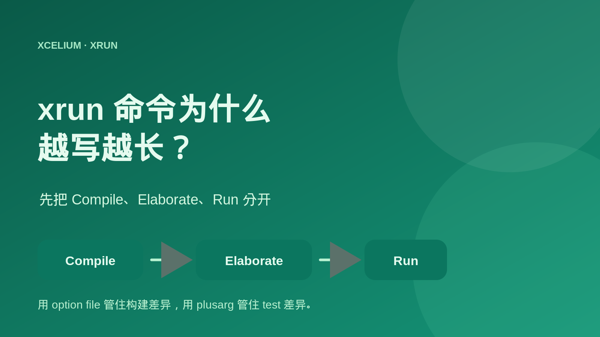
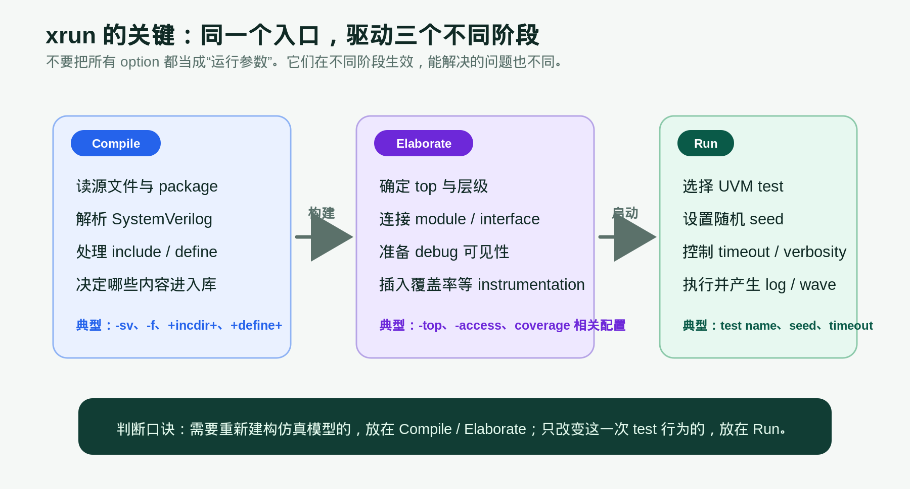
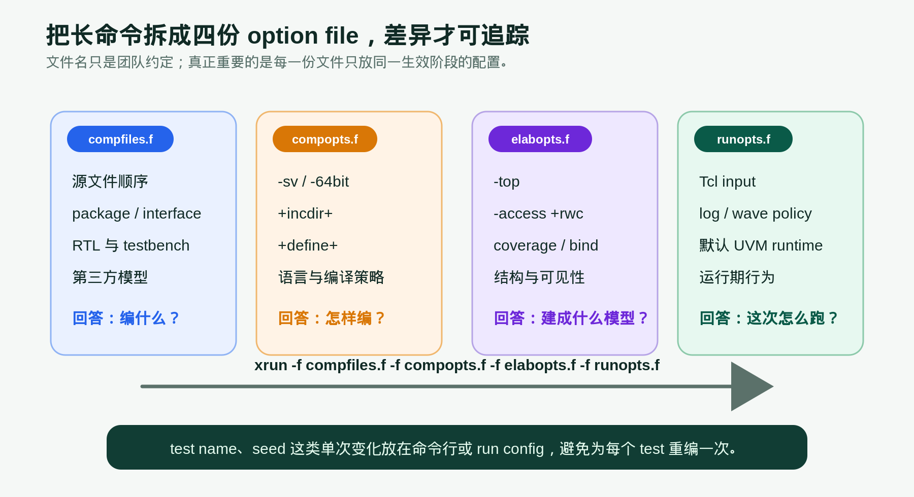
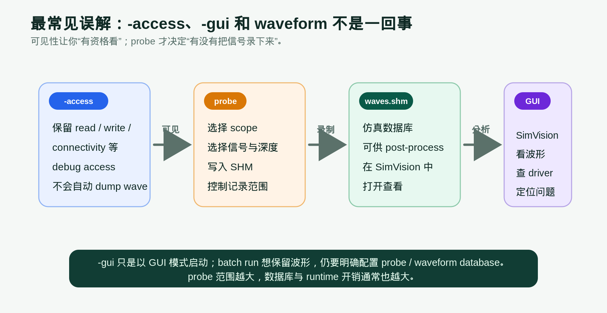
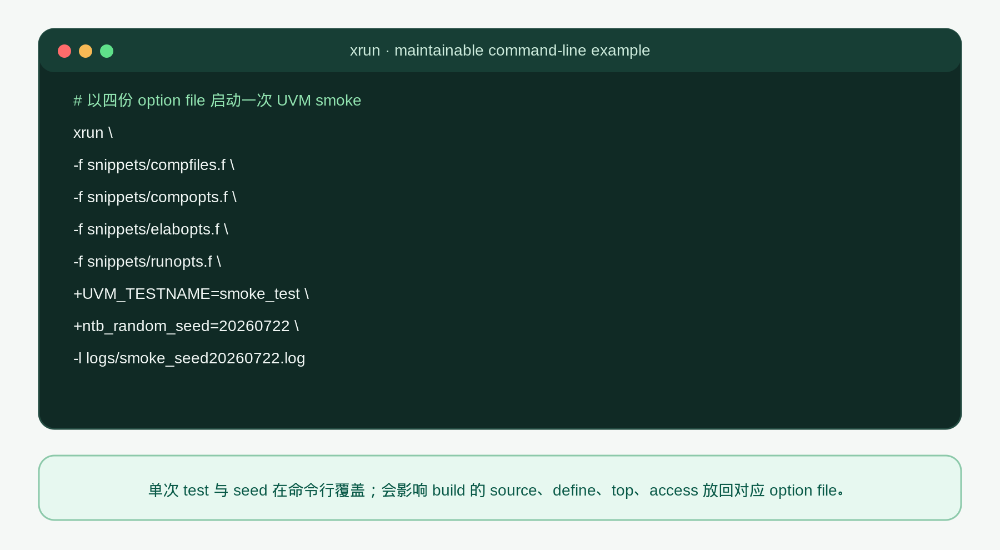
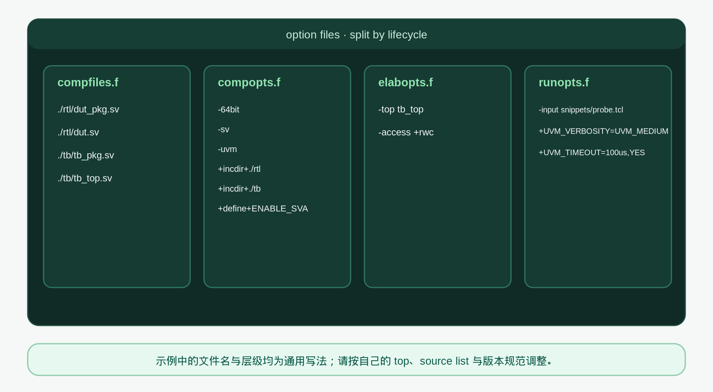

# [仿真] xrun 命令为什么越写越长？先把 Compile、Elaborate、Run 分开

## 导读

写 xrun 命令最容易走到一个状态：最初只有 `xrun -f filelist.f`，后来加上 UVM、debug、coverage、波形、seed、test name，最后变成一整行谁都不敢改的命令。

真正的问题通常不是 option 太多，而是把不同阶段的 option 混在了一起。比如，`+UVM_TESTNAME` 只是告诉本次 run 选哪个 test；它不能补回编译时漏掉的 package。`-access +rwc` 解决的是 debug visibility；它也不等于已经记录了 waveform。

xrun 是 Xcelium 的统一入口。它可以把 compile、elaborate 与 simulation run 串在一次 invocation 中完成。理解这三个阶段的边界，再把配置拆进几份 option file，长命令就会从“不可碰的黑盒”变成可维护的构建配置。

## 前置概念速查

- Compile：读取 RTL、testbench、package、interface 等源文件，处理 SystemVerilog、include path 与 macro define。

- Elaborate：确定 top、建立层级、连接实例与 interface，并准备 debug access、coverage instrumentation 等需要挂在仿真模型上的能力。

- Run：用已经建立好的模型执行本次测试，选择 UVM test、random seed、timeout、verbosity、Tcl 输入脚本和日志策略。

- Option file：通过 `-f` 读取的参数文件。它不是固定格式的“官方四件套”，而是团队把不同生命周期的配置拆开的管理方式。

## 一、先把 xrun 看成流程驱动器，而不是“一条编译命令”

从命令行看，xrun 像是一次性执行：给它 source、option、test 和 seed，它就开始仿真。但从问题定位角度看，这次执行经历了三个完全不同的阶段。

Compile 阶段决定“系统里有哪些源码”。`-sv`、`-f`、`+incdir+`、`+define+` 这类配置影响解析与编译。这里出错时，现象通常是 package 找不到、类型不匹配、宏分支不一致、interface 没有被正确编入。换一个 `+UVM_TESTNAME` 或 seed 并不能修复它，因为模型还没有建出来。

Elaborate 阶段决定“这些源码被建成什么仿真模型”。top 选择、层级连接、bind、debug access、某些 coverage 配置都属于这一层。比如 source file 都已经编过，但 top 写错、port 连接不对，或没有在正确的构建阶段打开 access，问题会在这里暴露。

Run 阶段才是“这一次怎么测”。test name、seed、UVM verbosity、timeout、Tcl control script、日志文件等都应该尽量保持在运行期。这样同一份 build 可以跑很多 test 和 seed，不需要因为切一个 sequence 策略就重新编译。

一句话记忆：**源码与结构决定模型，test 与 seed 决定本次模型怎么跑。**

## 二、为什么推荐把 option 分成 compfiles、compopts、elabopts、runopts

文件名可以不同，重点是职责必须稳定。下面是一种常见的分法。

`compfiles.f` 只关心 source 的组织：RTL、package、interface、testbench、模型库的顺序。它回答的是“到底编哪些文件”。有 package 依赖时，文件顺序尤其重要；把它和 test seed 放在一起，只会让 review 与排错都变困难。

`compopts.f` 放语言和编译策略，例如 `+incdir+`、`+define+` 以及统一的语言环境选项。它回答的是“这些 source 怎样被编译”。对 DV 来说，define 差异必须被当成 build identity 的一部分记录下来；同一个 seed 在不同 define 下不一定走同一条随机路径。

`elabopts.f` 放 top、access、bind、coverage instrumentation 等模型构建相关配置。它回答的是“要建成哪个层级、保留什么可见性”。这份文件是 debug build 与 lean regression build 最容易产生差异的地方。

`runopts.f` 放默认 runtime policy，例如 Tcl input、默认 verbosity、timeout 或波形策略。它回答的是“本次运行的默认行为”。真正会频繁变化的 `+UVM_TESTNAME` 和 `+ntb_random_seed`，仍建议从命令行或 regression configuration 传入，避免修改共享文件。

这样拆分后，看到一个 failure 可以按阶段提问：是 source list 变了？define 变了？elaboration 改了？还是仅仅 test、seed 和 runtime plusarg 不同？问题的搜索空间会小很多。

## 三、`-access`、`-gui` 与 waveform：三个词，三件不同的事

Debug 场景最常见的误解是：“我已经加了 `-access +rwc`，为什么没有波形？”因为 `-access` 的主要作用是保留调试需要的访问能力；它让 simulator 在需要时可以读取、写入或追踪更多设计对象，但它本身不等于“把所有信号 dump 到数据库”。

要得到 waveform，还需要 probe policy。probe 要明确记录哪个 scope、哪些信号、记录多深，并把结果写进 SHM database。scope 开得越大、深度越深，波形数据库和 runtime 开销通常也越大。因此比较稳妥的实践是：smoke 默认只采集关键层级，debug rerun 再扩大范围，而不是每个 regression job 都打开最大范围。

`-gui` 又是另一件事。它让 xrun 以图形调试模式启动，通常会进入 SimVision 一类的调试界面；但 batch run 是否留下可复查的波形，仍然取决于是否配置了相应的 probe / database 生成策略。

可以把三者记成一条链：`-access` 决定看不看得到，`probe` 决定记不记录，waveform database 决定之后有没有东西可打开，GUI 负责把已有信息呈现出来。

## 四、一个可维护的 UVM 启动方式

下面的命令展示了一个通用 UVM smoke run：source、build policy、elaboration policy、runtime policy 分别从独立 option file 读取；test name 和 seed 作为这一次运行的输入从命令行覆盖。

对应的四份 option file 如下。完整文本保存在本文同目录的 `snippets/` 中，目的是展示配置分层；请把 source list、top name、define 与 timeout 替换成自己环境的实际值。

### 代码解释

`-f snippets/compfiles.f` 只读取 source list。这里不应该混入 UVM test name 或随机 seed，否则每次 test variation 都会修改 build 输入。

`-f snippets/compopts.f` 放 `+incdir+` 与 `+define+`。它们影响预处理和编译结果，属于 build identity。一次失败要稳定复现，除了 seed，还要记录这份文件及其引用的 revision。

`-f snippets/elabopts.f` 中的 `-top tb_top` 指明顶层，`-access +rwc` 为常见 debug access 需求保留可见性。真实项目的 top 可能不止一个，access 级别也会按性能与 debug 需求分档，因此不要不加区分地让所有 regression 都开最大 access。

`-f snippets/runopts.f` 把 runtime 的默认行为集中起来。示例中的 `-input` 读取 Tcl 脚本，脚本用 `probe` 产生 SHM waveform；`+UVM_VERBOSITY` 与 `+UVM_TIMEOUT` 则是运行期 UVM policy。不同 Xcelium 版本和团队封装对 waveform、coverage 的具体参数会有差异，应优先采用项目已经验证的 run policy。

最后两项 `+UVM_TESTNAME=smoke_test` 与 `+ntb_random_seed=20260722` 特意留在命令行。它们代表单次 run 的选择与随机输入，最适合由 regression scheduler、Make target 或 CI job 传入，并写进 log file 名称或 run metadata。

## 五、DV 中怎样用这套分层快速定位 failure

第一步，先固定 build identity：source revision、`compfiles.f`、`compopts.f`、`elabopts.f`、simulator version。遇到 compile 或 elaboration failure 时，先检查这部分；不要先怀疑 test 和 seed。

第二步，固定 runtime identity：test name、seed、`runopts.f`、plusarg、timeout 和输入 Tcl。出现随机 failure 时，“只保存一个 seed”通常不够，因为 runtime plusarg、define 或 access policy 的变化都可能改变行为或可观察性。

第三步，按代价选择 debug 档位。普通 regression 使用较轻的 runtime policy；需要定位时，再选择带更高 access、关键 scope probe 和 GUI 的 debug build。把“为了这一次 debug”打开的 option 明确记录下来，后续别人才能准确复现相同视图。

第四步，coverage 不要当作纯 runtime 开关。许多 coverage 能力需要在模型建构时就插入 instrumentation，因此 coverage build 与 non-coverage build 应明确区分。merge coverage 前，也应确保各 run 的 instrumentation policy 可以比较。

## 总结

xrun 的命令变长并不可怕，可怕的是 option 没有生命周期边界。

把 compile、elaborate、run 分开后，source、define、top、debug access、test、seed 和 waveform policy 都有了明确归属。再用 option file 保存共享配置，用命令行保存单次 variation，仿真构建会更容易 review，随机 failure 也更容易复现。

最实用的口诀是：**build 相关的差异进入 compfiles / compopts / elabopts；test 与 seed 这样的单次差异留在 run。**

## 延伸阅读

- Cadence Xcelium 产品页：https://www.cadence.com/en_US/home/tools/system-design-and-verification/simulation-and-testbench-verification/xcelium-simulator.html

- xrun 本文的全部示例文件：`7_22/xrun_useful_cmd/snippets/`
