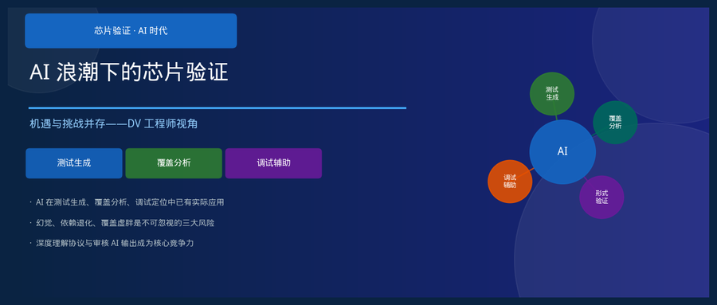
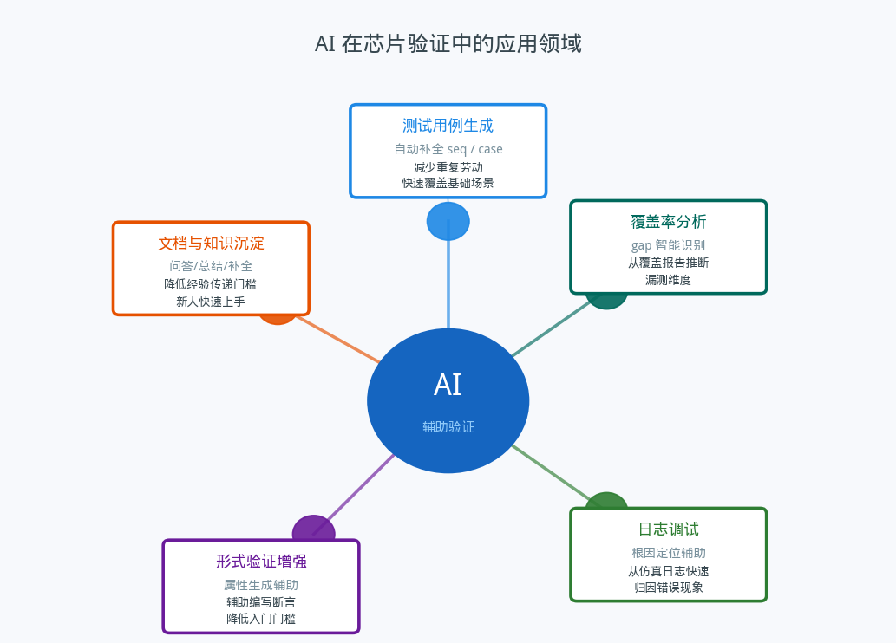
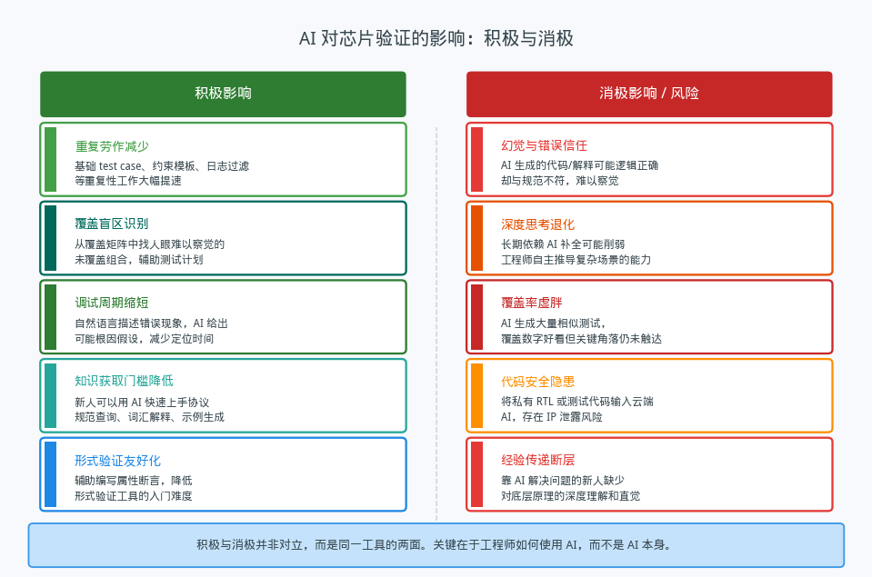
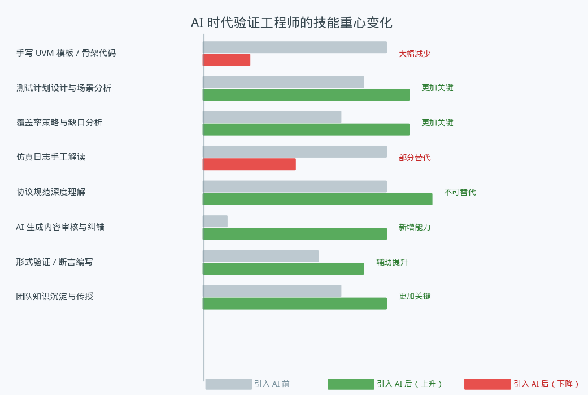

## AI 浪潮下的芯片验证：机遇与挑战并存

---

### 导读

最近在用 AI 辅助写测试序列，感觉效率提升明显，但某次它生成的一段约束逻辑看起来完全正确，跑通了仿真，后来才发现它对某个边界条件的理解和规范定义有偏差——测试通过了，但测的不是该测的东西。这件事让我开始认真思考：AI 究竟给验证这个行业带来了什么，哪些是真实的改变，哪些是需要警惕的陷阱？

---

### 一、AI 已经在做什么

在芯片验证领域，AI 的渗透是悄然发生的，不是某一天突然出现，而是一点一点替换掉了流程中那些枯燥重复的环节。

**测试用例生成**是最先被感知到的方向。给出接口描述和约束条件，AI 可以在几秒内生成一批覆盖常规场景的测试序列骨架。这些代码不一定直接可用，但作为起点比从空白开始要省力很多。重复性强、结构规律的部分——比如覆盖功能点的基础 case、寄存器读写的回环测试——AI 的发挥空间很大。

**覆盖率分析辅助**是另一个落地场景。传统上，从覆盖率报告里找出"真正有意义的漏测点"需要经验积累。AI 可以帮助从大量的 cross coverage 矩阵中识别出人眼容易忽略的组合维度，提出补充测试计划的建议。

**调试辅助**方面，将仿真日志的关键片段和错误现象描述给 AI，它往往能给出几条合理的根因假设，起到"多一个人帮你想"的效果，而不必等待有经验的同事有空来 review。

**形式验证和文档**也在这个范围内。AI 可以辅助编写 SVA 断言的初稿，帮助解释协议规范中晦涩的描述，或者把验证计划中的口述内容整理成结构化文档。

---

### 二、积极影响：效率的真实提升

**重复劳动的减少**是最直接的收益。芯片验证工作里，有相当一部分是结构高度相似的机械性工作：按照固有模式写约束、搭 UVM 组件骨架、过滤日志里的关键字。这些工作本身并不需要太多创造性思维，却要消耗大量时间。AI 在这里的价值不是"替代"，而是"接管"——把工程师从这些事情里解放出来，去做真正需要判断力的部分。

**覆盖盲区的发现**是一个更有深度的收益。覆盖率驱动的验证在理论上很完善，但实践中"知道自己不知道什么"一直是难题。AI 在分析大规模覆盖矩阵时有一定的模式识别优势，可以提示工程师某些组合维度从未被测试过。这不替代工程师的判断，而是提供一个额外的视角。

**知识获取门槛的降低**对团队的长期发展有重要意义。新人加入团队后，用 AI 查询协议规范、理解工具用法、理解验证方法论，学习曲线会明显变短。这让团队在人员配置上有了更大的弹性。

---

### 三、消极影响：不能视而不见的风险

积极影响说起来很顺，但消极面同样是真实的，而且往往更隐蔽。

**AI 幻觉与错误信任**是最核心的风险。语言模型生成的内容在语法和逻辑上往往流畅，但可能在对协议规范的理解上存在偏差。这种偏差不会在代码语法检查中被捕获，只有在对比规范原文或者遇到实际硬件行为时才会暴露。更危险的是，AI 给出错误答案时通常不会表现出任何不确定性——它就是那么自信地给你一个错的结果。验证工作的本质是"证伪"，而 AI 的幻觉让这个过程多了一层隐患。

**深度思考能力的退化**是一个慢性风险，短期内感知不明显。当工程师习惯于把问题丢给 AI、接受第一个看起来合理的答案时，自主推理复杂场景的能力会在不知不觉中弱化。这种退化在面对 AI 无法处理的全新问题时才会显现——那正是最需要深度思考的时候。

**覆盖率虚胖**是一个容易被忽视的结构性问题。AI 生成大量测试用例并不等于测试质量的提升。数量多、相似度高的测试在覆盖率数字上看起来亮眼，但对于真正关键的角落场景——比如状态机边界、多主体并发竞争、协议异常处理——这些"填充型"测试的贡献几乎为零。覆盖率数字好看，但芯片里的 bug 未必被找到。

**代码安全隐患**在工程实践中经常被低估。将含有私有 RTL 或验证代码的片段输入云端 AI，就意味着将核心 IP 暴露给第三方服务。对于商业芯片项目来说，这是一个不得不在效率和安全之间做权衡的现实问题。

**经验传递断层**是一个团队层面的长期隐患。当新人都依赖 AI 解决问题时，他们积累的是"结果"，而不是"过程"。那些在解决问题过程中形成的直觉、对系统全局的理解、对异常模式的敏感度，这些隐性知识在 AI 辅助的工作模式下很难自然沉淀。

---

### 四、验证工程师的技能重心正在迁移

这张图呈现的是一个迁移，不是一个替代。

减少的部分是那些结构性、重复性强的工作：手写模板、骨架代码、日志过滤。这些工作的减少是真实的，也是正常的——工具总是在替代那些机械性劳动。

增加的部分则是那些需要真正判断力的能力：测试计划的设计与场景分析、覆盖率策略的制定、协议规范的深度理解，以及一项以前不存在的新能力——**对 AI 生成内容的审核与纠错**。后者本质上要求工程师不仅懂正确答案是什么，还要能识别出"看起来正确但实际错误"的模式。这比单纯地知道答案要求更高。

形式验证和知识沉淀的重要性也在上升。AI 降低了形式验证的入门门槛，但制定有效的断言属性、理解反例、判断覆盖策略的合理性，这些仍然需要人来完成。知识沉淀的责任则更重了——如果团队的经验只靠 AI 调用，而不沉淀成可传承的文档和方法，这个团队在面对 AI 不擅长的问题时会非常脆弱。

---

### 五、一个工具，两种用法

AI 对验证工程师的影响，最终取决于工程师如何与它相处。

把 AI 当成一个"快速出草稿、人来最终审核"的协作者，它能显著提升效率，同时逼迫工程师对每个生成结果都保持主动的判断。这种模式下，AI 的幻觉会被人的审核过滤掉，深度思考的能力也在审核过程中持续练习。

把 AI 当成一个"输入问题、接受答案"的神谕，短期内会感觉效率飙升，长期则是一场慢性的能力退化。当某一天需要解决 AI 也不会的问题时，会发现自己的直觉和底层理解已经生锈了。

验证工作的核心价值一直是"发现设计中的错误"，这件事需要怀疑精神、严密逻辑和对规范的深度理解。AI 可以加速这个过程中的很多环节，但它无法替代这种根本性的能力。保持这种能力，才是在 AI 时代做好验证工程师的前提。

---

*本文从验证工程师的视角出发，讨论 AI 辅助工具对行业的现实影响，不针对具体工具或平台，观点基于实际使用体验和行业趋势的综合判断。*
