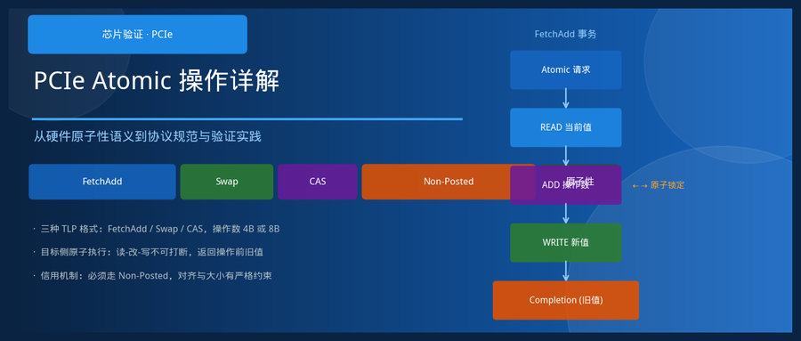
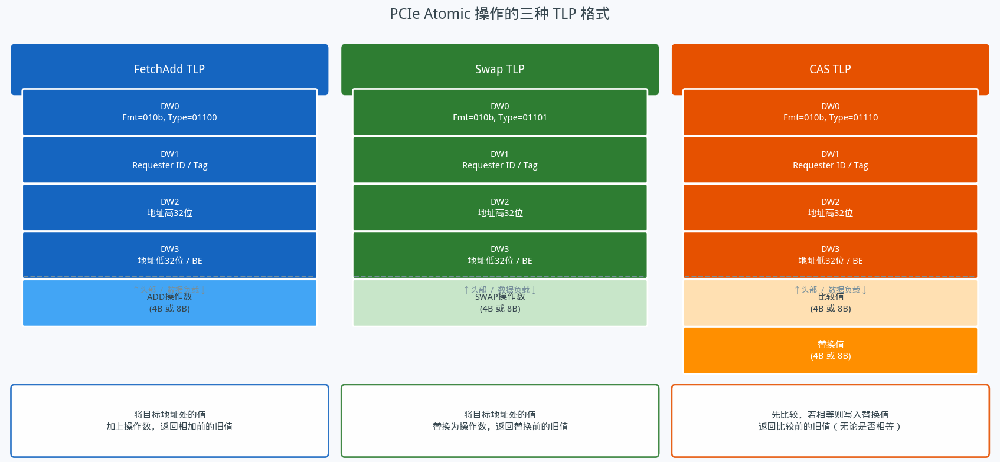
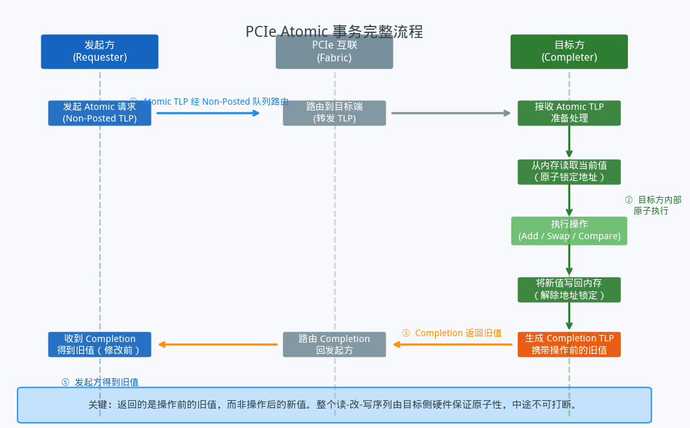
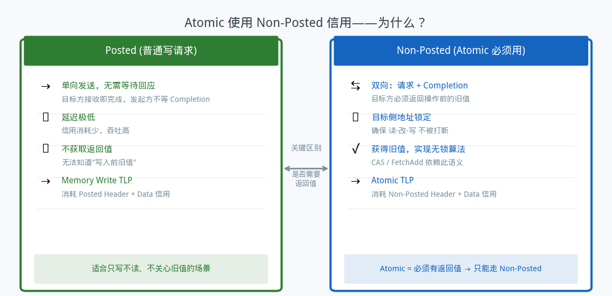
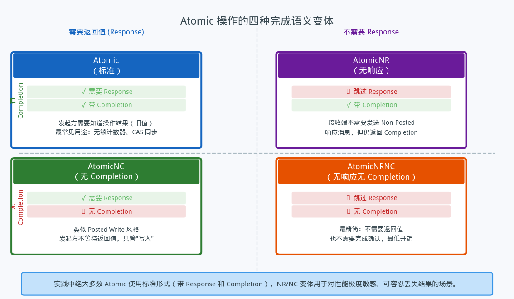

## PCIe Atomic 操作详解——硬件原子性从规范到验证

---

### 导读

今天被问到：为什么 PCIe 要在协议层面专门定义 Atomic 操作？CPU 里不是已经有 LOCK 前缀指令了吗？我楞了一下，仔细想了想，发现这个问题很有代表性——它触到了总线协议设计中一个非常根本的矛盾：软件世界依赖原子语义，但硬件互联天然是分布式的。于是搜了一圈资料，整理成这篇文章，分享给大家。

---

### 一、为什么需要硬件层面的原子操作

先从最朴素的场景说起。多个处理器核心，或者多张 PCIe 设备，同时向同一块共享内存发起读-改-写。如果没有同步机制，两个核心可能同时读到旧值、各自加一、再各自写回——结果是两次加法只生效了一次。

软件层面的解决方案是自旋锁或互斥锁。但锁本身也需要靠原子操作来实现——"测试并设置"（Test-and-Set）或"比较并交换"（Compare-and-Swap）这类指令，在单颗芯片内由 CPU 的总线锁信号保证原子性，问题不大。

真正的挑战出现在设备侧。当一张 PCIe 加速卡需要独立地对系统内存中的共享变量做无锁操作时，它没有 CPU 的 LOCK 指令可用。它只能发送 TLP 报文。而普通的读请求和写请求之间，任何其他主设备都可以在总线上插入自己的访问。"先读、再改、再写"这三步，根本无法保证中间不被打断。

这就是为什么 PCIe 规范需要在协议层面定义原子操作：让目标侧（通常是内存控制器或 Root Complex 内的逻辑）在收到 Atomic TLP 之后，将整个读-改-写序列作为一个不可分割的单元来执行，任何其他对同一地址的访问都必须等待这个序列完成。原子性由硬件保证，软件无需自旋、无需加锁。

---

### 二、PCIe 定义的三种 Atomic TLP

PCIe 规范定义了三类 Atomic 操作，分别对应三种常见的无锁算法原语。

**FetchAdd（取回并加）**：发起方在 TLP 的数据负载中携带一个操作数，目标侧将该操作数加到目标地址当前值上，然后把加法前的旧值通过 Completion TLP 返回给发起方。典型用途是无锁计数器——多个设备各自递增同一计数器，每次都能拿到自己"占用"的那个槽位编号。

**Swap（原子交换）**：发起方携带一个新值，目标侧将目标地址的当前值替换为新值，返回替换前的旧值。语义上类似"无条件写入，但顺带告诉我旧值是什么"。

**CAS（比较并交换）**：这是三类中最复杂的一种。数据负载里同时携带两个值：一个"比较值"和一个"替换值"。目标侧读出当前值后先与比较值做比对——若相等，则将替换值写入；若不相等，则保持原值不变。无论是否发生写入，目标侧都将操作前的旧值通过 Completion 返回。这个"返回旧值"的设计让发起方可以判断比较是否成功，从而实现经典的 CAS 循环（若失败则重试）。

三种操作共同遵循一条设计原则：**返回的永远是操作前的旧值**，而不是操作后的新值。这一语义选择不是偶然的。如果返回新值，发起方需要自己做一次减法才能还原旧值；而返回旧值，则天然支持"我需要知道我改了什么"这一最常见的使用模式。

---

### 三、操作数大小与地址对齐的约束——为什么不能随意

FetchAdd 和 Swap 的操作数可以是 4 字节或 8 字节，CAS 因为需要同时携带比较值和替换值，数据负载是单个操作数的两倍（8 字节或 16 字节）。为什么只有这两种尺寸？

原因在于硬件实现的自然性。4 字节和 8 字节恰好对应 32 位和 64 位整数，是绝大多数无锁算法操作的基本粒度。更小（如 1 字节或 2 字节）的原子操作在实际系统中几乎没有使用场景，而更大的操作数则会让目标侧的锁定粒度过粗，影响其他访问的并发性。

地址对齐的要求同样严格：操作数必须自然对齐，即 4 字节操作数的起始地址必须是 4 的倍数，8 字节操作数的起始地址必须是 8 的倍数。这并非规范的任意规定，而是底层物理内存的现实：大多数内存控制器在硬件上已经对对齐地址做了原子保证（一个对齐的 64 位访问在单个总线周期内完成），而非对齐访问则可能被内存控制器拆成两次，原子性就无从谈起。

还有一点关键限制：Atomic TLP 永远不能被拆分。普通的写请求在超出某个传输边界时，协议允许将其分解为多个子事务；但 Atomic 操作整体性地描述一次不可分割的内存操作，一旦被拆成两段，目标侧就无法在一次锁定内完成，原子性保证彻底崩溃。因此规范要求 Atomic TLP 不跨边界、不拆分，必须以整体形式送达目标。

---

### 四、完整事务流程——目标侧如何保证原子性

一次 Atomic 事务的完整生命周期如上图所示。发起方构造 Atomic TLP 并发送出去；报文经由 PCIe 互联路由到目标侧（通常是系统内存控制器）；目标侧收到报文后，**原子地锁定目标地址**，执行读-改-写的完整序列，然后将操作前的旧值打包进 Completion TLP，返回给发起方。

"锁定"这个词很关键。在整个操作执行期间，任何其他对该地址的访问都必须等待。这个锁由目标侧硬件持有，对总线上的其他主设备完全透明——它们只会感受到自己的访问被延迟，并不知道背后发生了什么。这正是硬件原子性的精髓：把互斥的责任从软件转移到硬件，把不可见的竞争变成了有序的等待。

---

### 五、为什么 Atomic 必须走 Non-Posted 信用通道

PCIe 的流控机制将 TLP 分为三类：Posted（无需等待响应的写）、Non-Posted（需要等待响应的读和某些写）、Completion（响应报文本身）。每类 TLP 消耗各自独立的信用额度。

普通内存写请求走 Posted 通道：发起方发出去就完事了，不等任何回应，吞吐量极高。但 Atomic 操作必须走 Non-Posted 通道，原因只有一个——**它必须拿回返回值**。

没有 Completion，发起方就无从得知旧值，CAS 无法判断是否成功，FetchAdd 拿不到自己的计数器槽位。Non-Posted 通道设计上就是为"发出请求，等待响应"这个模式服务的，Atomic 的语义天然契合。代价是需要消耗 Non-Posted 的头部和数据信用，并且在等待 Completion 期间占用发起方的 Tag（事务标识符）资源。

---

### 六、四种完成语义变体——NR 与 NC 的含义

规范为 Atomic 操作定义了四种完成语义的组合，对应不同的使用场景需求。

标准形式（最常用）：发起方既需要 Response（非发布响应），也需要 Completion（携带旧值的完成报文）。无锁计数器、CAS 同步等场景都属于这一类。

NR（No Response）变体：省去了 Non-Posted 响应消息，但仍然会有 Completion。这在某些简化实现中有用，可以减少中间层的握手开销，但仍能拿到旧值。

NC（No Completion）变体：没有 Completion，类似于 Posted 写的风格——发起方不等返回值，只关心操作是否被执行。适合那些"我只需要原子修改，不在乎旧值"的场景，例如原子清零某个标志位。

NRNC（无响应无 Completion）：最精简的形式，完全不需要任何回应。开销最低，但也意味着发起方放弃了所有反馈，只适用于对性能极度敏感、可容忍信息丢失的极端场景。

实践中绝大多数 Atomic 使用标准形式，NR/NC 变体是为特殊的性能权衡准备的选项。

---

### 七、验证中值得关注的几个测试维度

做 PCIe Atomic 验证时，有几个维度是必须覆盖的，原因都藏在上面的规范分析里。

**对齐与大小的边界**：刚好合法的 4B/8B 操作数、刚好不对齐的地址，这两类边界情况最容易暴露实现细节的差异。CAS 的操作数是两倍大小，验证时需要额外确认报文长度字段的计算正确。

**旧值的正确性**：FetchAdd 和 Swap 的 Completion 必须携带操作前的旧值，而不是操作后的新值。验证时需要在发送请求之前先记录目标地址的当前值，与 Completion 返回的值做比对。CAS 在比较失败时仍然返回旧值，这个"失败路径"往往容易被遗漏。

**不可拆分性**：验证时需要构造一个目标地址位于某个传输边界附近的 Atomic 请求，确认实现不会将其拆分为两个子事务。拆分意味着原子性保证彻底失效，是严重的正确性问题。

**NR/NC 覆盖**：四种变体的 Completion 行为各不相同，每种都需要独立验证。特别是 NC 变体不产生 Completion，如果误产生则是协议违规；NRNC 变体则需要确认双侧都没有等待对方的握手消息。

**信用消耗路径**：确认 Atomic TLP 走了正确的 Non-Posted 信用通道，而不是被错误地归入 Posted 队列。这个问题在仿真中很难从功能层面发现，但会在信用计算上留下痕迹。

---

### 八、总结

PCIe Atomic 操作的设计逻辑一以贯之：把"原子"的含义从 CPU 内核扩展到了整个互联拓扑。三种操作类型（FetchAdd、Swap、CAS）覆盖了无锁编程的核心原语；返回旧值的统一语义让调用方可以推断操作结果；Non-Posted 信用通道是语义上的必然；不可拆分的约束则是物理正确性的底线。

理解了"为什么"，规范里那些看似繁琐的约束自然就有了落脚点。下次再看到 Atomic 相关的协议行为，希望这篇文章能帮你快速定位到对应的设计动机。

---

*文章基于 PCIe Base Specification 4.0 相关章节整理，结合实际验证场景分析。*
