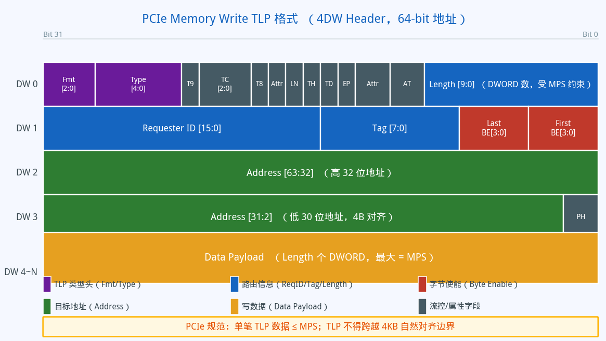
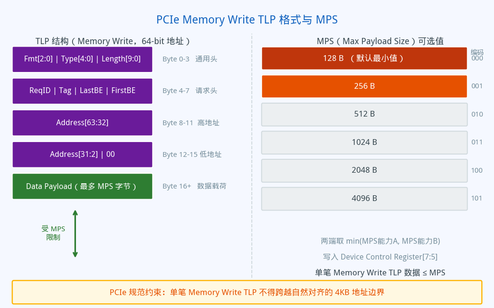
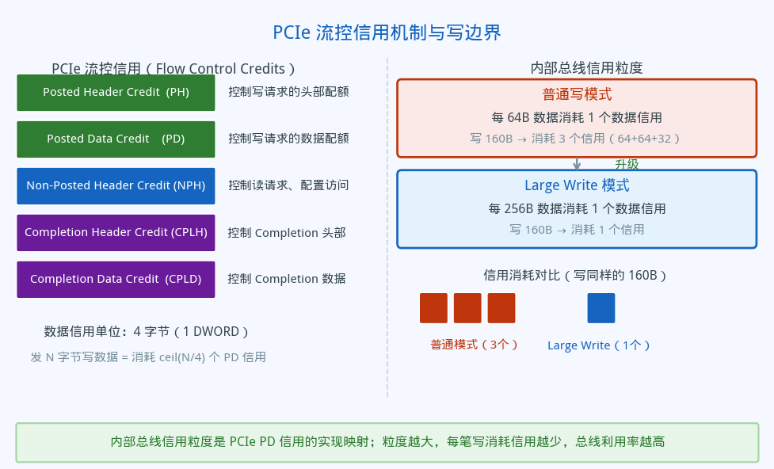
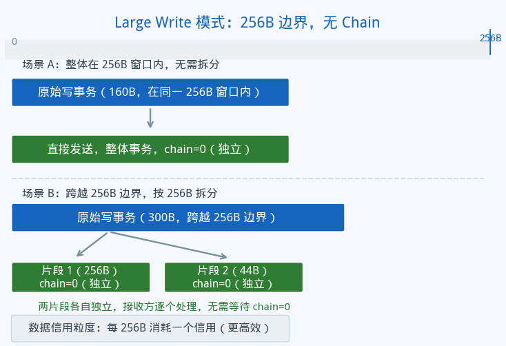
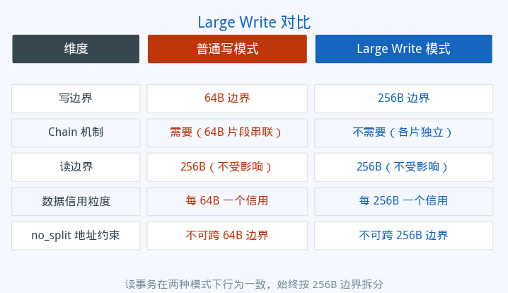
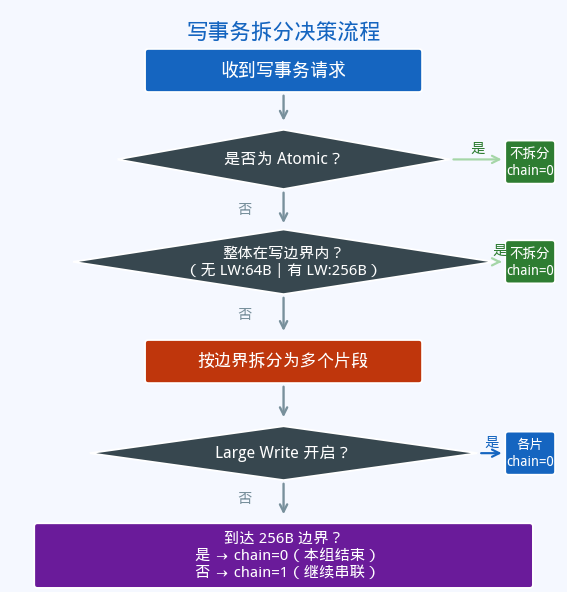
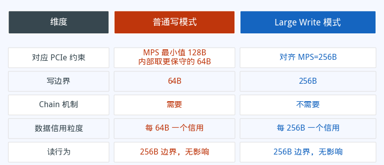

# 写事务的边界与拆分：Large Write 背后的 PCIe 规范

## 从 TLP、MPS 到内部总线写机制

*芯片验证 · PCIe · 总线协议 · 写事务*

---

**摘要**：一笔写事务为什么不能随意大？为什么超过某个边界就必须拆分？为什么拆出的碎片需要用 chain 位串联起来？这些问题的答案根植于 PCIe 规范——TLP 格式、MPS 协商、流控信用、4KB 边界规则。Large Write 特性正是在这套规范框架下，把内部写事务的粒度从 64B 提升到 256B，从而减少拆分次数、降低信用消耗、提高总线效率。本文从 PCIe 规范出发，把整个机制串讲一遍。

---

## 零、PCIe 规范的基础约束

在理解大写事务拆分之前，需要先建立三个 PCIe 规范概念。

**TLP（Transaction Layer Packet）** 是 PCIe 的最小传输单元。一笔内存写操作对应一个 Memory Write TLP，由头部和数据载荷两部分组成。头部携带地址、长度、请求者 ID 等控制信息；数据载荷就是实际写入的字节。

**MPS（Max Payload Size）** 是 PCIe 规范定义的关键参数，限制单个 TLP 数据载荷的最大字节数。MPS 在链路枚举阶段协商，取链路两端 MPS 能力的最小值，写入设备控制寄存器（Device Control Register[7:5]），可选值从 128B 到 4096B。单笔 Memory Write TLP 的数据量不得超过 MPS。

**4KB 边界规则**：PCIe 规范明确要求，任何单笔 Memory Write TLP 不得跨越自然对齐的 4KB 地址边界。一笔跨越 4KB 边界的写请求必须拆成两笔。

---

## 一、流控信用：写为什么要先申请空间

PCIe 使用信用（Credit）机制进行流量控制。接收方在链路初始化时向发送方通告自己有多少缓冲信用，发送方每发出一笔事务就消耗对应的信用，等到接收方处理完并释放信用后才能继续发送。

与写事务直接相关的是两类信用：Posted Header Credit（PH，控制写请求的数量）和 Posted Data Credit（PD，控制写请求的数据量）。数据信用的最小单位是 4 字节（1 DWORD）。

信用粒度对效率影响极大：内部总线每次传输消耗一个数据信用，粒度越细，同样的数据量需要消耗更多的信用事务；粒度越粗，同样的数据量消耗的信用越少，总线利用率越高。这正是 Large Write 从 64B 升级到 256B 粒度带来的核心收益。

---

## 二、普通写模式：64B 边界 + Chain 串联

在不启用 Large Write 的情况下，内部总线写事务的边界是 **64B**。一笔原始写事务如果跨越了 64B 边界，就必须在边界处拆分。

拆出的多个片段通过 **chain 位**串联：

- 非最后片段：chain=1，告诉接收方"这笔写还没结束，继续等"
- 最后片段：chain=0，接收方将本次 chain 链内所有片段合并，视为一次完整写

这个设计来自 PCIe TLP 的组包逻辑：一笔超出 MPS 的写必须拆成多个 TLP，接收端在重组时需要知道哪些 TLP 属于同一笔逻辑写。chain 机制就是内部总线对这个"同组标记"的实现。

但 chain 有一个强约束：**所有 chain=1 的片段必须落在同一个 256B 窗口内**。到达 256B 边界时，chain 必须置 0，下一组重新开始。这对应了 PCIe 规范中 MPS=256B 时的拆分粒度——超过 256B 的写必须分组，每组独立处理。

每发送 64B 数据消耗一个数据信用，写 160B 数据需要消耗 3 个信用。

---

## 三、Large Write 模式：256B 边界，去掉 Chain

启用 Large Write 后，写事务的边界从 64B 扩展到 **256B**，直接对齐 MPS=256B 的 TLP 载荷大小。

在 256B 窗口内的写事务整体发送，chain=0，无需串联。跨越 256B 边界时在边界处拆开，每个片段独立，各自 chain=0，接收方逐个处理。

去掉 chain=1 意味着：接收端不再需要维护"等待下一片"的中间状态，每笔收到的写请求都是完整的。这大幅简化了接收端的实现，也消除了因 chain 状态机引入的延迟和错误风险。

信用粒度同步从 64B 升为 **256B**，写同样的 160B 数据只需消耗 1 个数据信用，而不是之前的 3 个。信用消耗频率下降，相同的信用池能支撑更高的写带宽。

---

## 四、读事务不受影响

PCIe 读事务（Memory Read TLP）只携带地址和长度，没有数据载荷，不受 MPS 约束。读的对应约束是 MRRS（Max Read Request Size，最大读请求大小）和 RCB（Read Completion Boundary，读完成边界）。

内部总线的读事务始终按 **256B 边界**拆分，无论 Large Write 是否开启，行为完全一致。Large Write 这个名字已经明确：它只影响写，读不在讨论范围内。

---

## 五、普通模式 vs Large Write 模式：一眼看差异

两种模式的分水岭是写边界：64B 还是 256B。边界决定了拆分粒度，拆分粒度决定了 chain 机制是否存在，也决定了信用消耗的效率。

从 PCIe 规范视角看，Large Write 模式让内部总线的写粒度与 MPS=256B 的 TLP 载荷大小对齐，减少了从 PCIe TLP 到内部总线事务之间的"不必要的二次拆分"，是内部实现对规范能力的更充分利用。

---

## 六、拆分决策的完整流程

Atomic 操作不受边界约束，整体发送。普通写事务先判断是否在写边界内（64B 或 256B），在边界内整体发送；超出边界进入拆分逻辑：Large Write 开启时各片段独立，否则逐片判断是否到达 256B 窗口边界来决定 chain 值。

---

## 七、Large Write 的限制与注意事项

Large Write 不是没有代价的，启用前有四点需要清楚。

**硬件能力是前提。** Large Write 需要链路两端同时支持才能开启。如果接收端不具备这个能力，只能回退到普通写模式，写边界和信用粒度都回到 64B。这意味着在异构系统中，Large Write 的覆盖面受制于能力最弱的那一端。

**no_split 模式下地址约束变严了。** 普通写模式的 no_split 约束是"事务地址不得跨越 64B 边界"，启用 Large Write 后变成"不得跨越 256B 边界"。表面上限制变宽松了（从 64B 变成 256B），但实际上 256B 对齐比 64B 对齐更难满足，会压缩随机地址测试的可选空间，降低边界附近的地址覆盖率。如果验证序列没有针对性地补充 256B 边界附近的地址场景，这部分覆盖空白很容易被忽视。

**小写事务的信用效率可能反而变差。** 信用粒度从 64B 升到 256B，意味着接收端要为每笔写事务预留 256B 的缓冲配额，哪怕实际写入只有几十字节。在写事务普遍偏小（远小于 256B）的场景下，Large Write 不仅无法节省信用，反而会让接收端的缓冲利用率下降，因为大量配额被"锁住"却没有被充分使用。

**与 MPS 的耦合。** Large Write 把内部写事务的粒度对齐到 256B，但最终到了 PCIe TLP 层，单笔 TLP 的数据量仍不能超过链路协商的 MPS。如果 MPS=128B（默认最小值），256B 的内部写事务到了 TLP 层还是要再次拆分，Large Write 带来的拆分次数减少优势在此场景下大打折扣。只有当 MPS≥256B 时，两层粒度才能对齐，Large Write 才能完整发挥作用。

## 八、实际验证中的关键测试点

以下测试点来自对验证环境的代码分析，涵盖了 Large Write 功能正确性的核心检查面。

**测试点一：拆分边界的正确性**

核心要验证的是：写事务在边界处能否被正确切割。需要覆盖三类地址场景——事务地址恰好落在边界上、事务起始地址在边界之前但大小超过边界、事务整体在边界内不需拆分。两种模式下分别用 64B 边界（普通模式）和 256B 边界（Large Write 模式）作为切割点，每个场景都应跑出覆盖率。普通模式下还要验证拆出的各片段 chain 值是否正确：中间片段 chain=1，最后片段 chain=0，且在 256B 窗口结束处 chain 必须重置。

**测试点二：信用计数的正确性**

信用验证分两个维度：动态检查和静态检查。动态检查指在仿真过程中实时监控信用计数，要求信用不能出现下溢（released - taken 不能为负）；静态检查指在测试结束时验证所有信用都已完整归还，即 released - taken 等于初始信用总量。Large Write 模式下，每笔写消耗的数据信用数量变为 256B 对应的份额，需要确认信用消耗逻辑随模式切换正确更新，不能出现仍按 64B 计算的情况。

**测试点三：信用耗尽场景（is_blocked）**

当可用信用降至零时，发送方必须停止发送并进入阻塞等待。需要验证：阻塞状态能被正确识别、阻塞期间没有新的写事务被发出、待接收方释放信用后发送能正确恢复。Large Write 模式下信用粒度更大，每笔写消耗更多信用，信用池更容易被快速耗尽，这个场景在 Large Write 模式下尤为重要。

**测试点四：no_split 模式与边界约束的一致性**

no_split 模式要求事务地址不得跨越写边界，在普通模式是 64B，在 Large Write 模式是 256B。验证时需要确认约束随模式变化正确生效：Large Write 开启后，原来仅需不跨 64B 的地址限制变为不跨 256B，如果随机地址生成器没有跟随模式更新约束，就会出现非法地址的写事务漏掉拆分逻辑。

**测试点五：Atomic 操作不受拆分逻辑影响**

Atomic 操作（如 FetchAdd、Swap、CAS）在任何模式下都不拆分，整体发送，chain=0。需要验证在 Large Write 模式下 Atomic 操作的行为没有因为拆分逻辑的变化而受到影响，Atomic 的原子性得到保证。

**测试点六：地址边界附近的随机覆盖**

验证框架通过 `boundary_addr_rate` 这样的参数来控制地址生成时落在边界附近的概率。对于 Large Write，需要专门确保 256B 边界处的写流量被充分覆盖——包括跨边界的写（需拆分）和恰好到达边界的写（不拆分，chain=0）。这两类场景在普通模式下对应 64B 边界，切换到 Large Write 后对应 256B 边界，如果没有针对性的测试点，256B 边界的分支很可能处于覆盖盲区。

## 九、总结

Large Write 的本质是一次内部总线写粒度的升级，但它的根源在 PCIe 规范中：

MPS 决定了单个 TLP 能携带多少数据；信用机制决定了发送方每次消耗多少缓冲配额；4KB 边界规则和 MPS 共同决定了写事务需要在哪里拆分。内部总线的 64B/256B 边界，是对这些规范约束的具体实现选择。

普通写模式选 64B，粒度细、chain 复杂、信用消耗多；Large Write 模式选 256B，粒度与 MPS 对齐、无 chain、信用高效。两者都合规，但后者在 MPS=256B 的场景下更充分地利用了 PCIe 规范允许的能力上限。

