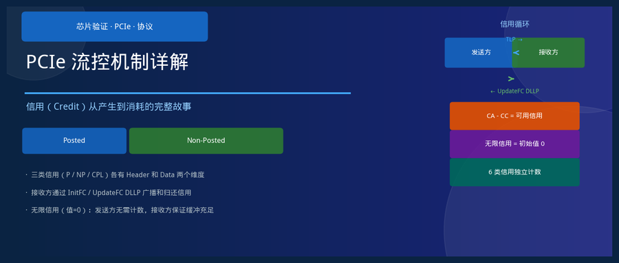
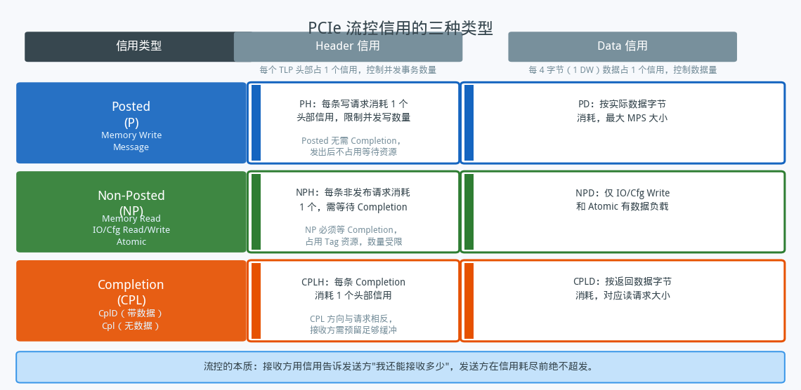
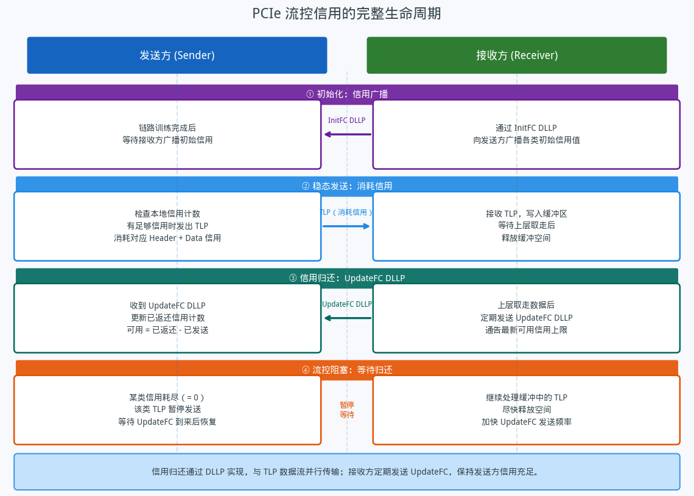
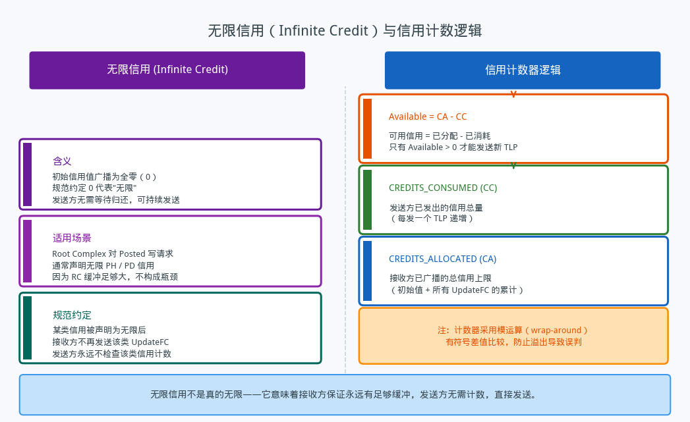

## PCIe 流控机制详解——信用从产生到消耗的完整故事

---

### 导读

有一次在分析仿真日志时发现发送方停了很久、没有发出任何 TLP，一开始以为是设计 bug，后来才发现是流控信用耗尽导致的——接收方缓冲还没有释放，发送方只能等。这件事让我重新认真看了一遍 PCIe 流控规范。信用机制听起来简单，背后的细节却很有意思。这篇文章把整个信用生命周期捋一遍，希望对碰到类似问题的人有帮助。

---

### 一、为什么 PCIe 需要流控

PCIe 是一个点对点的串行总线，链路两端的发送方和接收方之间没有共享总线的仲裁机制。接收方有有限的缓冲区，一旦发送方发送过快、接收方来不及处理，数据就会丢失。

早期的并行总线可以用硬件握手信号（比如 ready/valid）来做实时背压。PCIe 在高速串行链路上不能这样做——往返延迟使得实时握手不现实。于是规范引入了**信用（Credit）**机制：接收方提前告诉发送方自己还能接收多少，发送方在信用范围内自由发送，超出后等待。这是一种基于预告的流控，而不是基于反馈的流控，本质上是把"能接收多少"这个信息提前传递出去，消除了实时握手的延迟代价。

---

### 二、三类信用，每类两个维度

PCIe 规范把 TLP 分成三大类，每类对应一套独立的信用体系：

**Posted（P）**：单向发送、无需等待回应的事务。内存写请求和消息属于这一类。Posted 发出后，发送方不等任何 Completion，因此它不会占用 Tag 等待资源。

**Non-Posted（NP）**：需要等待 Completion 的事务。内存读请求、IO/配置空间读写、Atomic 操作都属于这一类。Non-Posted 的发送方必须保留 Tag，等待目标方完成处理后通过 Completion 返回结果。

**Completion（CPL）**：专门用于响应 Non-Posted 请求的事务类型，方向与原始请求相反。

这三类事务各自有两个信用维度：**Header 信用**和 **Data 信用**。Header 信用以 TLP 为单位——发送一个 TLP 头部消耗一个 Header 信用，用于控制并发事务的数量；Data 信用以 4 字节（1 DW）为单位，用于控制实际数据量，与接收缓冲的容量直接对应。

这样，六种信用（PH/PD、NPH/NPD、CPLH/CPLD）独立运作。某一类信用耗尽，只会阻塞该类事务，不影响其他类别的发送。这个设计让不同优先级、不同方向的事务之间互不干扰。

---

### 三、信用的完整生命周期

**初始化阶段**：链路训练完成后，双方进入流控初始化序列。接收方通过特殊的链路层数据包（DLLP）向发送方广播六类信用的初始值。这个过程需要确认握手，完成后双方才能开始正式的 TLP 传输。初始信用值直接反映接收方在启动时刻能提供的缓冲容量。

**稳态发送阶段**：发送方维护两个计数器：已发送（consumed）和已授权（allocated）。每次发送 TLP 之前，先检查目标信用类型的 available = allocated - consumed 是否大于零。有信用就发，发完计数；没有信用就等。

**信用归还阶段**：接收方的缓冲区在上层取走数据后会被释放。每当可用缓冲增加，接收方就通过 UpdateFC DLLP 向发送方通告最新的 allocated 上限。发送方收到后更新本地的 allocated 计数，重新计算 available，若有信用可用则恢复发送。

**流控阻塞阶段**：当某类信用 available 降为零，发送方停止发送该类 TLP，直到收到新的 UpdateFC 为止。这是设计正常行为，不是故障——仿真中看到发送方静默一段时间，首先应该排查流控是否为原因。

UpdateFC DLLP 的发送频率直接影响总线利用率。接收方应当尽快发送 UpdateFC，规范也规定了最大允许的归还延迟，超出会被视为错误。

---

### 四、无限信用与信用计数逻辑

PCIe 规范规定，如果某类信用的初始广播值为全零，表示该类信用是**无限（Infinite）**的。发送方收到初始值为零的信用后，将其视为"无须检查、随时可发"，不维护该类计数器，接收方也不需要再发 UpdateFC。

无限信用并不是真的没有限制——它的含义是接收方向发送方做出承诺：对这类事务，我的缓冲永远够用，你不需要担心，尽管发。实践中，Root Complex 对下行的 Posted 写通常声明无限 PH 和 PD 信用，因为系统内存侧的缓冲资源充裕，不会构成瓶颈。

信用计数器在实现上有一个值得注意的细节：计数器是有限位宽的，会发生溢出（wrap-around）。规范要求用有符号差值来判断 available 的大小，而不是直接比较绝对值，这样即使计数器绕回也能正确判断是否还有可用信用。如果实现用无符号比较，一旦计数器绕回就会产生误判，导致发送方在明明有信用的情况下停止发送，或者在无信用时继续发送。

---

### 五、验证中的几个关注维度

流控机制在仿真中相对难以直接观察，但它是很多"奇怪的发送停顿"背后的真正原因。以下几个维度在验证时值得重点关注：

**初始化完整性**：六类信用的 InitFC 序列必须全部完成，且确认握手正确。任何一类初始化未完成，对应类型的 TLP 发送都会被阻塞。边界情况是某类信用初始值为零（无限信用），需确认发送方正确识别并跳过该类信用检查。

**信用计算正确性**：在发送方视角，每次消耗信用后的 available 计算必须正确。Counter wrap-around 场景是容易出错的点——刻意构造信用计数器接近边界的场景，验证有符号比较逻辑是否正确。

**UpdateFC 的及时性**：接收方在缓冲释放后延迟多久才发送 UpdateFC？延迟过大会导致发送方长时间等待，影响带宽。验证时可以测量从缓冲释放到 UpdateFC 发出之间的延迟，对照规范允许的最大值。

**各类信用独立性**：某一类信用耗尽时，其他类别的 TLP 不应受到影响。构造单一类型信用耗尽的场景，观察其他类型是否继续正常传输。

**无限信用场景**：验证接收方正确广播零值、发送方正确识别无限信用并不发送该类 UpdateFC。若实现错误地发送了对无限信用的 UpdateFC，或者发送方错误地等待一个永远不会到来的信用归还，都会产生协议违规或活锁。

---

### 六、总结

PCIe 流控的设计思路是一套精妙的预告机制：接收方不是在快撑满时才叫停发送方，而是提前告知容量，让发送方在安全范围内自由发。三类事务、六种信用独立计数，让不同流量之间互不干扰。InitFC 广播初始值，UpdateFC 持续归还，计数器 wrap-around 用有符号差值处理——这些细节加在一起，构成了一个在高速串行链路上既高效又健壮的流控体系。

下次在仿真中看到发送方莫名其妙停止发送，先看看是不是流控等在那里——大概率是的。

---

*本文基于 PCIe Base Specification 4.0 流控相关章节整理，结合验证实践分析。*
