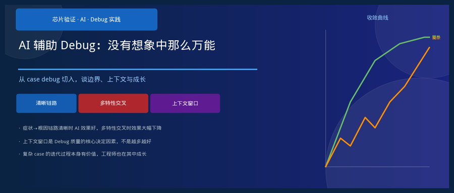
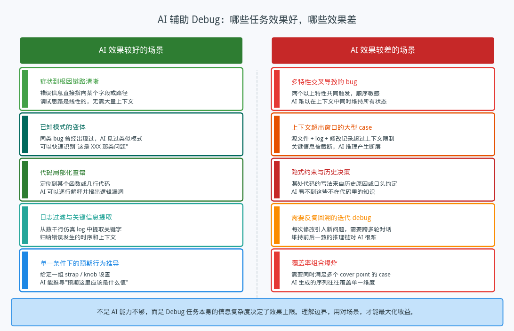
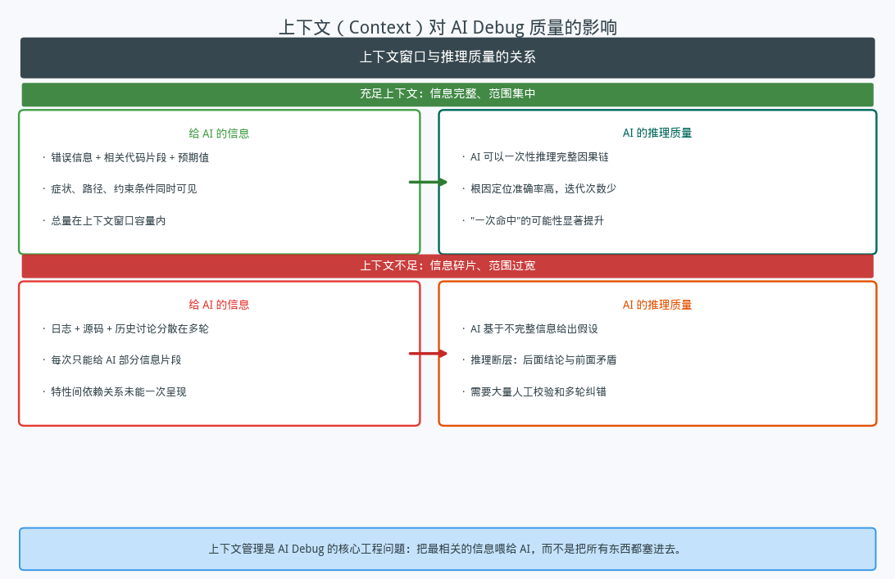
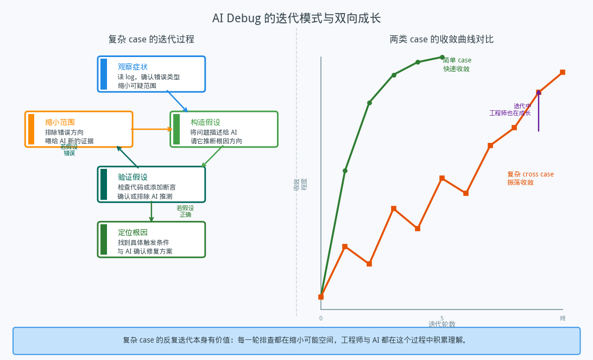

## AI 辅助 Debug：没有想象中那么万能

---

### 导读

最近有段时间在用 AI 辅助做 case debug，体验是两极分化的。有些 case，把错误信息和相关代码丢进去，AI 几分钟就给出了清晰的根因和修改方向，省了我至少半天时间。但也有些 case，反反复复跑了十几轮对话，AI 不停地改变推断方向，有时候前一轮刚确认的结论，后一轮又被自己推翻了——最终还是得靠自己系统地拆解。

这篇文章想把这段经历整理出来，谈谈 AI 在 DV debug 这件事上究竟能做什么、不能做什么，以及上下文这个东西为什么那么关键。

---

### 一、AI 擅长的和不擅长的

把这几个月用 AI debug 的体验归纳一下，大致有个规律：**任务的信息复杂度决定了 AI 的效果上限**。

效果好的情况，往往有一个共同特征：从错误到根因的链路是相对线性的。错误信息直接指向某个字段，代码局限在几个函数里，约束条件一目了然，AI 可以一次性看到症状、路径和预期值，然后给出准确的推断。这种情况下 AI 的速度和覆盖面远超手工查找，节省大量时间。

效果差的情况则相反：两个以上特性同时起作用，触发顺序敏感，每个特性单独看是对的，组合在一起才出问题。这类场景的信息分散在大量源文件、日志片段、历史改动记录里，很难一次性全部呈现给 AI。而 AI 在上下文不完整的情况下，推断的准确性会急剧下降——它会给出一个"看起来合理"的答案，但这个答案基于的前提可能已经和真实情况有偏差。

还有一类特别隐蔽的情况：某处代码的写法是基于历史约定或口头决策，这些知识根本不在代码里，AI 自然看不到。这种时候 AI 给的建议不是错的，只是没有考虑到这一层背景。

---

### 二、上下文是最关键的变量

用了一段时间之后，我开始意识到一个规律：**同一个 bug，给 AI 的信息组织方式不同，得到的结果差异极大**。

当问题范围集中、信息完整时——比如只涉及一个模块的一个逻辑分支，把相关错误信息、代码片段、预期行为一次性给出——AI 几乎每次都能给出准确的推断。它可以在这组信息里做完整的因果链推理，不需要多轮来回。

但当我把一个复杂 bug 的所有信息都塞进去时，情况反而更差。几千行日志、多个源文件、好几轮修改记录——超出了上下文窗口的部分会被截断，而被截断的偏偏可能是关键信息。更糟的是，AI 不会明确告诉你它"没看到"某部分，它仍然会自信地给出一个答案，只是这个答案基础不对。

这让我意识到，**上下文管理本身是一项工程工作**。不是把所有相关内容塞给 AI，而是要先自己做一轮筛选：哪些信息是这个问题的核心，哪些是背景噪音？把筛选过的信息以结构化的方式呈现，AI 的效果会明显好很多。这一步的质量，直接决定了 AI 输出的质量。

所谓"把 AI 用好"，相当程度上就是"把问题描述好"。而把问题描述好，本身就需要你对问题有一定理解——这是一个有趣的悖论。

---

### 三、迭代：振荡、回溯，以及成长

对于简单的 case，AI 的辅助曲线几乎是单调上升的：第一轮就指出方向，第二轮确认，第三轮修复，结束。

但复杂 case 的曲线完全不同。它更像一个振荡收敛的过程——往前走一步，可能因为某个假设被证伪而退回来，然后带着新的证据再往前走。我在这类 case 上跑过十几轮对话，每次都在缩小一点可能的范围，但路径是折线形的，不是直线。

起初这让我有点沮丧——感觉 AI 在"绕弯子"。后来换了一种理解方式：这个迭代过程本身是有价值的。每一轮排查都在用实验数据排除一个假设，缩小了问题空间。即使某一轮 AI 给的方向最后被证伪，这个验证本身也是有意义的。而且，在这个反复迭代的过程里，我对整个 bug 的理解也在加深——不只是最后的根因，而是整个系统在这组条件下的行为模式。

有时候，反复迭代之后，我突然意识到某个关键条件是自己一开始忽略了的，而不是 AI 的问题。这种"迭代带来顿悟"的时刻，对工程师来说是真实的成长，跟纯靠自己 debug 的感受很像，只是节奏不一样。

所以对复杂 case，更合理的心态不是"AI 能不能一次给出答案"，而是"AI 能不能在每一轮给出一个有意义的缩小"。大多数时候是可以的，只要你给的信息足够准确。

---

### 四、合理的期望

总结一下这段时间的体验，想给几个有实际意义的判断：

**不要期待 AI 替代系统性的 debug 思路。** 对于需要全局视角的 bug——多个特性交叉、触发条件苛刻、依赖隐式历史约定——AI 能帮你提速某些局部步骤，但整体的 debug 框架仍然需要人来搭建。AI 是个很好的"局部推理引擎"，但不是"全局调试者"。

**上下文质量比上下文数量重要得多。** 学会在给 AI 信息之前先自己筛选，是提升 AI debug 效率最直接的方法。把问题缩小到关键的几十行代码和几条关键日志，比把所有相关内容都塞进去效果好得多。

**振荡和回溯是正常现象，不是失败。** 复杂 bug 的迭代不是在浪费时间，每一轮都在积累理解。如果某轮 AI 的方向被证伪，把这个信息带到下一轮，而不是从头开始——迭代是连续的，不是重置的。

**AI 发展很快，但现在仍有清晰的边界。** 今天效果差的场景，未来可能随着上下文窗口扩大、推理能力提升而改善。但现阶段，理解边界比高估能力更实用——用在擅长的地方，避免在不擅长的地方过度依赖，才能把时间用在刀刃上。

---

*这篇文章基于实际使用 AI 辅助 DV debug 的经验整理，描述的都是概念层面的规律，不涉及具体工具或内部实现细节。*
