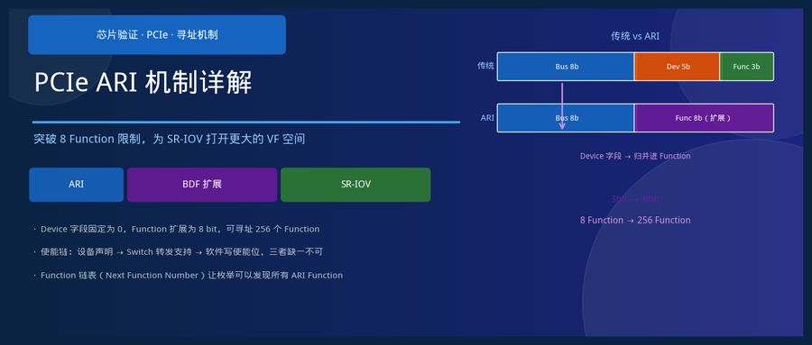
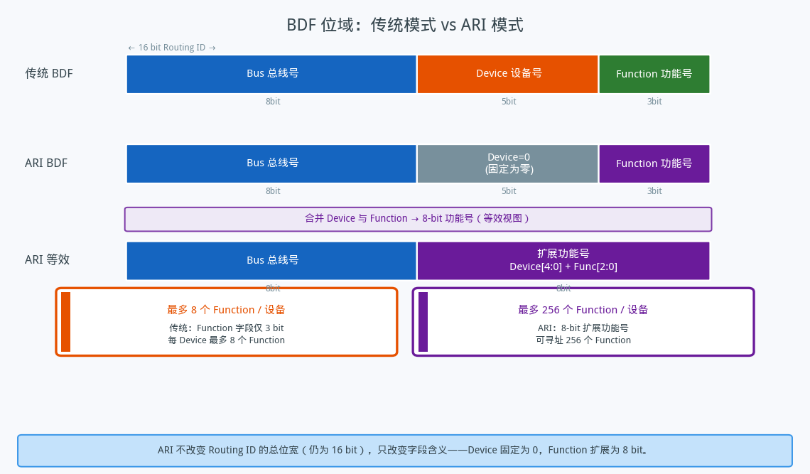
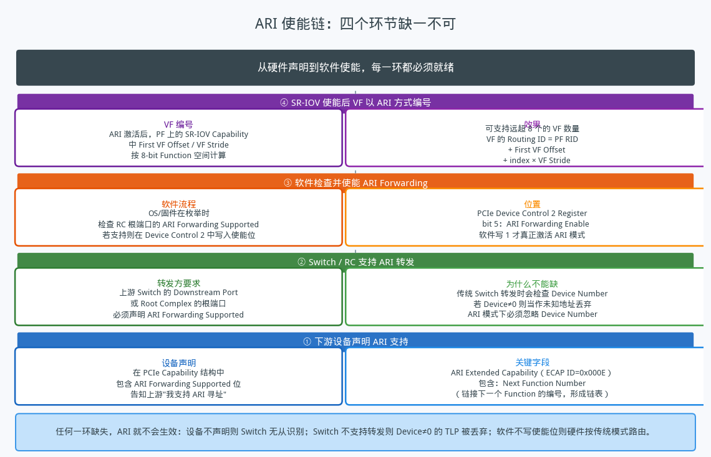
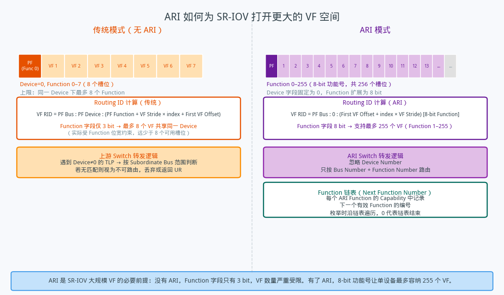

## PCIe ARI 机制详解——突破 8 Function 限制，为 SR-IOV 打开更大的 VF 空间

---

### 导读

有次翻一个设备的配置，发现它能暴露几十个 VF，但传统 PCIe 寻址里一个设备最多只有 8 个 Function——这两件事怎么同时成立？查了一下，答案是 ARI（Alternative Routing ID Interpretation）。这个机制大多数文章提一句就跳过了，但它是 SR-IOV 大规模 VF 的必要前提，值得单独讲清楚。

---

### 一、传统 BDF 的限制：为什么一个设备最多只有 8 个 Function

PCIe 用 **BDF（Bus:Device:Function）** 三元组标识总线上的每一个逻辑单元。这三个字段的位宽是固定的：Bus 占 8 bit，Device 占 5 bit，Function 占 3 bit，合计 16 bit 组成一个 Routing ID。

Function 字段只有 3 bit，所以同一个 Device 下最多只能有 8 个 Function（编号 0–7）。这对普通多功能设备完全够用——比如一张同时有存储控制器和网络控制器的复合卡，用两个 Function 就解决了。

但问题出在 SR-IOV 大规模部署的场景。一张数据中心级别的网卡如果要支持 64 个 VF，每个 VM 独占一个——而 Function 字段只有 3 bit，同一个 Device 下最多 8 个，根本放不下。就算跨多个 Device 编号，传统路由逻辑也不是为这种场景设计的。

3 bit 的 Function 字段，是 PCIe 在设计之初就埋下的容量约束。在 SR-IOV 大规模落地之前，这不是问题；在 SR-IOV 成为主流之后，它成了瓶颈。

---

### 二、ARI 的设计：重新分配 BDF 位宽

ARI 的解决思路非常直接：**不增加 Routing ID 的总位宽，只改变 Device 和 Function 字段的含义**。

在 ARI 模式下，Device 字段被固定为零，不再有意义；原本属于 Device 的 5 bit 和原本的 3 bit Function 合并成一个 8 bit 的扩展功能号。Bus 字段的 8 bit 保持不变。

从外部看，Routing ID 的 16 bit 格式完全没变——还是 Bus:Device:Function 的分区。但在 ARI 模式下，上游的路由逻辑忽略 Device 字段，只用 Bus 和 8 bit Function 做路由决策。这个 8 bit Function 字段可以表示 256 个不同的 Function，远超传统的 8 个。

为什么是合并而不是扩展？因为 PCIe 的物理链路和协议层已经把 Routing ID 固定为 16 bit，改变位宽意味着改变协议帧格式，会破坏所有现有设备的兼容性。在固定位宽内重新分配字段含义，是成本最低、兼容性最好的方案。

每个支持 ARI 的 Function 在自己的 Capability 结构中包含一个 **Next Function Number** 字段，指向同一设备中下一个有效 Function 的编号。这些指针把所有 Function 串成一个链表——枚举时沿链表遍历，遇到 Next Function Number 为 0 就结束。这个链表设计替代了传统枚举中对 Device Number 的遍历，让软件在不知道总数的情况下也能找到所有 Function。

---

### 三、ARI 的使能链：四个环节缺一不可

ARI 不是一个设备自己就能开启的功能，它需要整条链路上的多个角色协同配合，任何一个环节缺失，ARI 就不会生效。

**第一环：下游设备声明 ARI 支持。** 设备的 PCIe Extended Capability 中包含 ARI Capability（ECAP ID = 0x000E），其中包含 ARI Forwarding Supported 位。这是设备向上游声明"我支持 ARI 寻址"的方式，也是整个使能链的起点。

**第二环：Switch 的下行端口支持 ARI 转发。** 传统 Switch 在转发 TLP 时会检查 Routing ID 中的 Device Number——如果 Device≠0，按传统逻辑它会当作未知地址，丢弃或按其他规则处理。在 ARI 模式下，Switch 的下行端口必须忽略 Device Number，只用 Bus Number 判断是否转发到该端口。这需要 Switch 的 Downstream Port Capability 中声明 ARI Forwarding Supported，否则所有 Device≠0 的 VF 都会因为路由失败而不可达。

**第三环：Root Complex 的根端口允许 ARI 转发。** RC 侧的根端口同样需要在 Capability 中声明支持 ARI Forwarding。

**第四环：软件显式写入使能位。** 满足前三环之后，软件在枚举时需要检查根端口的 ARI Forwarding Supported 标志，确认支持后在 Device Control 2 Register 的 bit 5 写 1，激活 ARI Forwarding Enable。这一步是关键——即使所有硬件都准备就绪，如果软件没有写这个使能位，硬件仍然按传统模式路由。

这种"需要显式软件使能"的设计是 PCIe 的一贯风格。它保证了向后兼容：在老系统上，就算新设备声明了 ARI 支持，没有软件写使能位，行为也和传统设备完全一样，不会破坏已有的枚举逻辑。

---

### 四、ARI 与 SR-IOV：更大的 VF 空间

ARI 对 SR-IOV 的意义在于把 VF 的 Routing ID 计算空间从 3 bit 扩展到 8 bit。

在 SR-IOV 中，每个 VF 的 Routing ID 由 PF 的 Routing ID 加上一个偏移量计算得来：第一个 VF 的偏移是 First VF Offset，后续每个 VF 在前一个基础上加一个 VF Stride。这套计算依赖 Function 字段能容纳足够的数值范围。

传统模式下，Function 字段只有 3 bit，即使 VF Stride 为 1，也只能在同一个 Device 下顺序排列最多 8 个 Function，超出后需要跨 Device——而跨 Device 的路由在传统 Switch 上依赖 Subordinate Bus Range 的配置，不能直接用 Function 偏移计算。

ARI 模式下，Function 字段扩展到 8 bit，VF 的 Routing ID 可以在 0–255 范围内顺序排列，全部属于同一个"Device 0"（ARI 模式固定 Device=0），路由逻辑统一、简洁。一个 PF 可以派生出最多 255 个 VF（Function 1–255 留给 VF，Function 0 是 PF 自己），这就是数据中心级别网卡能支持几十上百个 VF 的底层依据。

---

### 五、验证中的几个关注点

ARI 涉及硬件声明、中间层转发和软件使能三个层面，在验证中每个层面都有对应的检查维度。

**Capability 结构的正确性**：每个支持 ARI 的 Function 是否正确声明 ARI Capability，Next Function Number 的链表结构是否正确形成闭环（最后一个 Function 的 Next Function Number 是否为 0）。

**ARI 使能位的影响**：在 ARI Forwarding Enable 未置起时，Device≠0 的 Function 是否按预期不可达；置起后，VF 的 Routing ID 是否按 8-bit Function 空间正确计算。

**Switch 转发逻辑**：需要覆盖 ARI 模式下 Device≠0 的 TLP 能否正确路由到目标端口；ARI 模式与传统模式的切换边界是否干净，不会把原本应该路由成功的 TLP 丢掉。

**VF 数量与 Function 空间边界**：当 VF 数量较多时，VF 的 Routing ID 是否超出 8-bit Function 字段的范围（255 是上限），超出是否有正确的截断和错误处理。

**枚举顺序**：软件枚举时沿 Next Function Number 链表遍历，是否在发现所有 Function 后正确停止，不会因为链表配置错误陷入无限循环或提前终止。

---

### 六、总结

ARI 的设计逻辑很简单，但影响深远。它不改变 PCIe 的物理层和数据帧格式，只重新解释了 BDF 中 Device 和 Function 字段的含义——把 5+3 bit 的两个字段合并成 8 bit 的统一功能号，把每设备最多 8 个 Function 的限制扩展到最多 256 个。

这个机制是 SR-IOV 大规模 VF 部署的必要前提，也是 PCIe 生态在不破坏向后兼容的前提下扩展容量的典型做法——协议层的规则改到最小，通过字段重解释获得足够大的扩展空间。

---

*本文基于 PCIe Base Specification 4.0 ARI 相关章节整理，适合对 PCIe 基础寻址有了解、想了解 ARI 工作原理的读者。*
