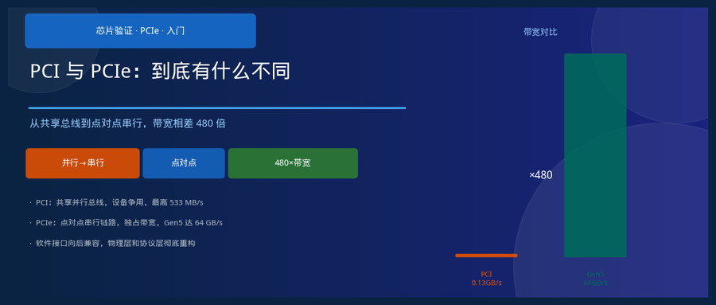
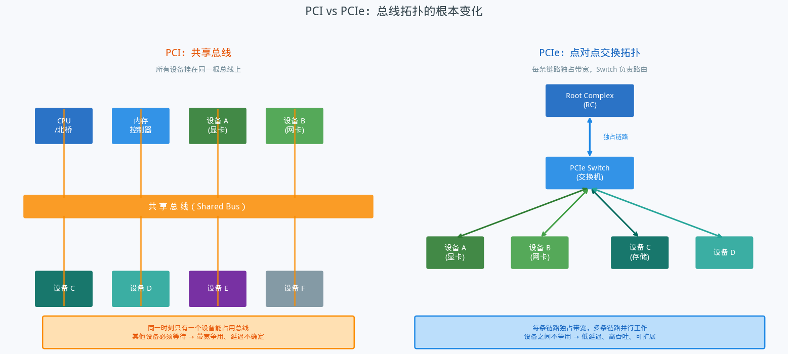
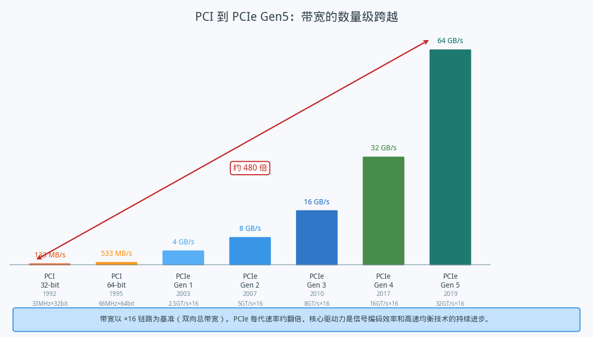
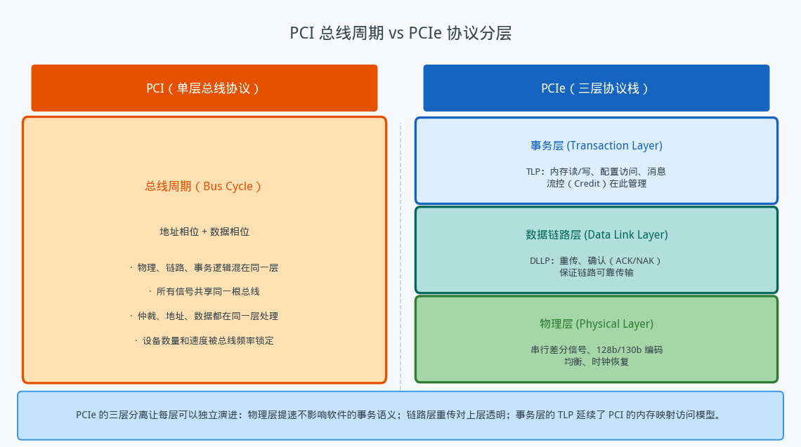

## PCI 与 PCIe：到底有什么不同

---

### 导读

工作中常被问到一个问题：PCI 和 PCIe 是什么关系，改名了还是真的不一样？听起来字母差不多，但背后其实是一次彻底的架构重构。这篇文章把两者的核心区别梳理一遍，尽量说得简单易懂。

---

### 一、从一条公路说起：共享总线 vs 点对点链路

要理解 PCI 和 PCIe 的区别，最直观的入口是拓扑结构。

**PCI 是一条共享的公路。** 所有设备——CPU、显卡、网卡、存储控制器——都挂在同一根物理总线上。任何一个设备想发送数据，必须先向总线仲裁器申请使用权，拿到许可之后独占总线，其他设备只能等。这就像一条只有单车道的公路，所有人共用，谁先占谁先走，其他人排队。

这种设计在 1990 年代完全够用——那时候设备数量少、速度慢，偶尔争一下总线无所谓。但随着 CPU 越来越快、外设越来越多，问题来了：设备多了，争用频繁；速度快了，等待不能接受；总线频率到了物理极限，想提速几乎不可能。

**PCIe 换成了高速立交桥体系。** 每条 PCIe 链路只连接两个端点（点对点），各自独占带宽，彼此互不干扰。需要连接更多设备时，引入 PCIe Switch 做路由——就像高速公路的互通立交，多条路可以同时跑车。Root Complex 是系统的核心节点，负责连接 CPU 和整个 PCIe 拓扑树。

这个拓扑变化不是小修小补，它直接决定了两者在可扩展性、延迟和带宽上的本质差距。

---

### 二、并行 vs 串行：另一个根本性的翻转

PCI 是**并行总线**：同一时刻，32 条（或 64 条）数据线同时传输数据，靠线宽取胜。听起来很直觉——更多线，更多数据，应该更快。

但并行总线有个物理难题：每根线的信号必须在同一时钟沿到达接收端，速度越快、线越长，各线之间的时序偏差（skew）越难控制。这是 PCI 频率提不上去的根本原因——33MHz 勉强，66MHz 已经很困难，再高就成本极高且不可靠。

PCIe 反其道而行之：**每条链路只用两对差分线（一对发、一对收），以极高的频率串行传输比特流**。差分信号抗干扰能力强，单对信号的时序控制远比几十根线同步容易，于是频率从 66MHz 跳到了几 GHz——Gen 1 就是 2.5 GHz，Gen 5 达到了 32 GHz。

代价是什么？串行传输需要额外的编码开销——早期 PCIe 用 8b/10b 编码（每 8 bit 数据需要 10 bit 传输），后来改用更高效的 128b/130b（Gen 3 开始），效率从 80% 提升到 98.5%。但即使有编码开销，串行方案的实际带宽也远超并行方案所能达到的上限。

---

### 三、带宽：数量级的跨越

数字最能说明问题。

PCI 32-bit 的峰值带宽是 133 MB/s（33MHz × 32bit / 8），64-bit 版本在 66MHz 下最高约 533 MB/s。这是 1990 年代能做到的极限。

PCIe Gen 1（2003 年）的单条链路（×1）双向各 250 MB/s，而 ×16 链路（16 条并行 Lane，每 Lane 一对差分线）的双向总带宽达到 4 GB/s。此后每代几乎翻倍：Gen 2 是 8 GB/s，Gen 3 是 16 GB/s，Gen 4 是 32 GB/s，Gen 5（2019 年发布）达到了 64 GB/s。

从 PCI 32-bit 到 PCIe Gen 5，**带宽相差约 480 倍**。这不是改进，是换了一个时代。

驱动这个增长的核心不是简单地"加线"，而是信号完整性技术和均衡算法的持续突破——让高频信号在铜走线上的衰减和失真能够被接收端准确还原。每一代 PCIe 标准的进步，很大程度上依赖这些底层技术的成熟。

---

### 四、协议层次：从"一锅端"到分层设计

PCI 的协议结构非常扁平。一次总线操作就是一个"总线周期"：地址相位告诉总线"我要访问哪里"，数据相位传输数据。物理电气特性、链路控制、数据含义全部混在一起，没有严格的分层边界。这种设计简单，但扩展性差——想升级任何一个方面，都要牵动整体。

PCIe 引入了**三层协议栈**，每层职责明确且可以独立演进：

**事务层（Transaction Layer）** 是最靠近软件的那层。它定义了 TLP（Transaction Layer Packet）——内存读写请求、配置访问、消息等都以 TLP 的形式传输。软件通过 TLP 与设备交互，完全不需要知道底层是什么频率、什么编码。这一层也管理流控信用，决定发送方什么时候可以发 TLP。

**数据链路层（Data Link Layer）** 负责链路可靠性。它给每个 TLP 加上序列号和 CRC 校验，接收方确认成功收到（ACK）或要求重传（NAK）。这层的重传机制对上层完全透明——事务层根本感知不到某个包曾经重传过。

**物理层（Physical Layer）** 处理实际的比特传输：差分信号驱动、编码（128b/130b）、时钟恢复、均衡。每代 PCIe 物理层都在这里做提速，但上面两层看到的接口没有变化。

这种分层带来了一个重要特性：**PCIe 的软件模型（MMIO、配置空间访问）与 PCI 高度兼容**。操作系统里大量 PCI 驱动代码可以直接在 PCIe 设备上运行，不需要修改。PCIe 保留了 PCI 的软件抽象，只替换了物理层和数据传输机制。

---

### 五、其他值得一提的改进

**热插拔（Hot Plug）更可靠**：PCIe 在协议层支持链路训练和协商，设备可以在系统运行时安全插入或拔出，链路会自动重新协商带宽和速度。PCI 虽然有热插拔规范，但实现难度大、可靠性差。

**错误处理更完善**：PCIe 定义了 AER（Advanced Error Reporting），设备可以主动上报可校正错误和不可校正错误，操作系统可以细粒度地处理硬件故障，而不是只能重启。PCI 的错误处理要粗糙得多。

**Lane 数量灵活**：PCIe 设备可以使用不同数量的 Lane（×1、×2、×4、×8、×16），链路速率按 Lane 数线性叠加。一个 ×16 插槽可以运行 ×1 的设备，反之则不行。这种灵活性让主板设计更经济，低带宽需求的设备不需要占用高带宽插槽。

---

### 六、总结

用一句话概括：**PCI 和 PCIe 的名字里虽然都有 PCI，但它们在物理层和协议层几乎是两套完全不同的设计，只在软件接口上保持了向后兼容**。

PCI 是 1990 年代的产物，共享并行总线，以总线频率为速度上限。PCIe 是 2000 年代初的重新设计，点对点串行链路，分层协议，每条 Lane 独占带宽，每代几乎翻倍。两者面向同一个目标——让 CPU 和外设高效通信——但走的路完全不同。

理解这个区别，是理解现代 PC 和服务器 I/O 架构的起点。

---

*本文以概念介绍为主，数据基于 PCI 2.2 规范和 PCIe Base Specification 5.0，带宽数字取 ×16 链路双向总带宽。*
