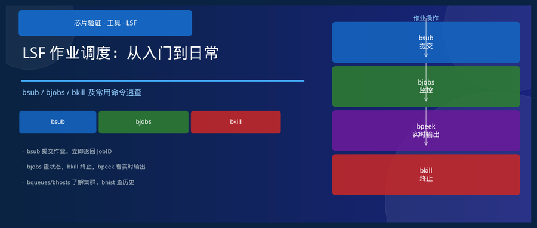
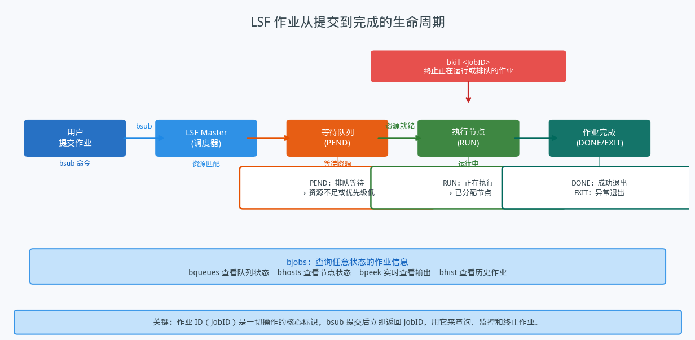
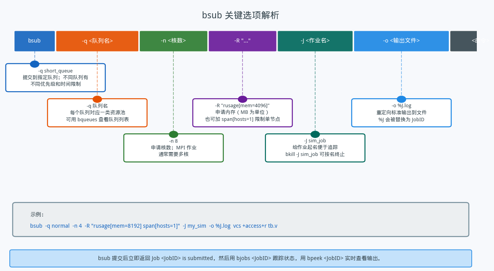
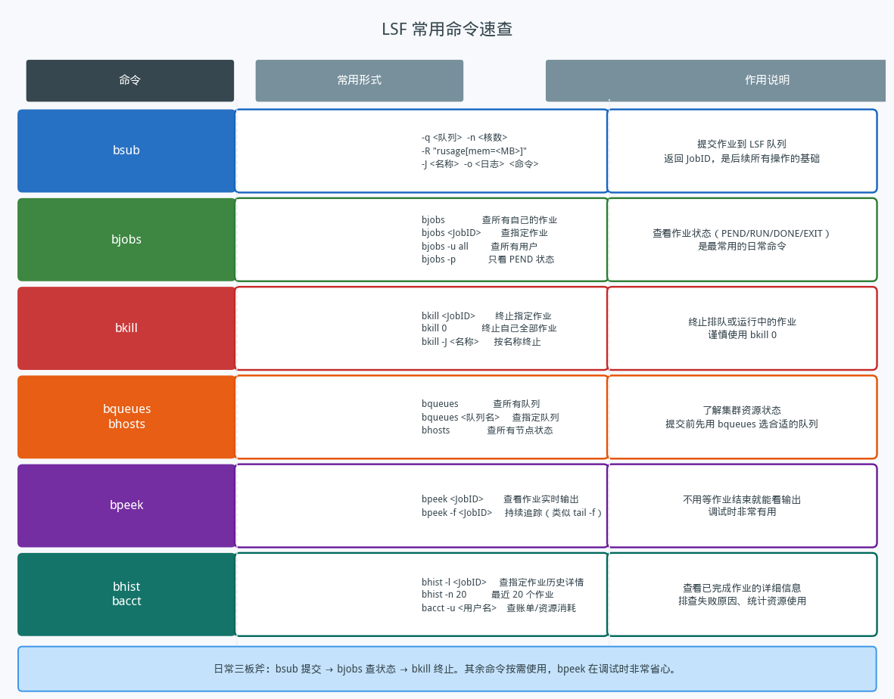

## LSF 作业调度：从入门到日常

---

### 导读

刚加入团队的时候，看着同事在终端里噼里啪啦一顿命令，仿真就悄悄跑起来了，自己完全不知道发生了什么。后来才知道那是 LSF——Load Sharing Facility，一个在 HPC 和芯片设计环境里无处不在的作业调度系统。这篇文章把我当初希望有人告诉我的那些东西整理出来，适合第一次接触 LSF 的同学。

---

### 一、LSF 是什么，为什么要用它

芯片验证的仿真通常跑在计算集群上，集群里有几十乃至几百台服务器。如果每个人都直接登录服务器跑任务，没有人统一管理，结果是有些机器被打爆，有些机器空着没人用，作业互相抢资源，谁也跑不快。

**LSF 是一个资源调度系统，它的核心工作是：让正确的作业在正确的时间跑在正确的机器上。** 用户把作业提交给 LSF，告诉它需要多少 CPU 核、多少内存、用哪个队列；LSF 统一看这些需求，找到有空余资源的节点，把作业调度上去。用户不用关心跑在哪台机器上，只需要提交和等结果。

作业在 LSF 里有几个关键状态：**PEND** 表示正在排队等待资源，**RUN** 表示已经分配到节点正在运行，**DONE** 是正常退出，**EXIT** 是异常退出。作业提交后立即获得一个唯一的 **JobID**，后续所有操作都用这个 ID 来识别。

---

### 二、bsub：提交作业

`bsub` 是和 LSF 打交道的第一步，也是最重要的命令。

一条完整的 `bsub` 命令通常包含以下几个部分：

**`-q <队列名>`**：指定把作业提交到哪个队列。不同队列有不同的资源池、优先级和运行时间限制。短任务用短队列可以更快拿到资源；长时间仿真要选对应的队列，否则会被超时强制终止。提交前用 `bqueues` 查看可用队列和当前状态。

**`-n <核数>`**：申请几个 CPU 核。对于串行仿真填 1，多线程或并行仿真按实际需要填写。不要随手申请很多核，申请了占着不用会影响其他人。

**`-R "rusage[mem=<MB>]"`**：申请内存，单位是 MB。如果仿真跑到一半因内存不足被杀，就是这里填少了。如果需要所有进程跑在同一台机器上（比如有共享内存通信），加 `span[hosts=1]`。

**`-J <作业名>`**：给作业起个有意义的名字，方便在 `bjobs` 的输出里快速定位。也可以用 `bkill -J <名字>` 按名字批量终止同类作业。

**`-o <输出文件>`**：把标准输出重定向到文件。`%J` 会被自动替换成 JobID，这样每次提交的日志文件名都不会冲突。不设置这个选项，输出默认发邮件，不方便查看。

提交之后，LSF 会立即返回一行 `Job <JobID> is submitted to queue <队列名>`。记下这个 JobID，后续操作都靠它。

---

### 三、bjobs：查看作业状态

`bjobs` 是日常用得最多的命令，用来查看作业当前在干什么。

直接输入 `bjobs` 不带参数，列出自己所有未完成的作业（PEND 和 RUN 状态）。加上 JobID 可以查看指定作业：`bjobs <JobID>`。

几个常用变体：

`bjobs -u all` 查看集群上所有用户的作业，可以感知整体负载情况，判断现在提交排队要等多久。

`bjobs -p` 只显示 PEND 状态的作业，并附上等待原因（Pending Reasons）——是在等资源、还是等优先级、还是依赖其他作业——帮助判断要等多久。

`bjobs -l <JobID>` 显示作业的详细信息，包括提交命令、分配的节点、资源使用情况、等待原因等，排查问题时非常有用。

---

### 四、bkill：终止作业

`bkill <JobID>` 终止指定作业，无论它是在排队还是在运行。作业被终止后状态变为 EXIT。

`bkill 0` 终止自己名下的所有作业，**谨慎使用**——如果同时跑着多个仿真，一条命令全部杀掉，很难区分哪些是真的想停的。

`bkill -J <作业名>` 按名字批量终止，适合配合 `-J` 选项为同类作业统一命名的场景。

---

### 五、其他常用命令

**bqueues**：查看队列的状态，包括每个队列当前有多少作业在跑、多少在排队、最大核数限制等。提交前先看一眼，选负载较轻的队列，等待时间会短一些。

**bhosts**：查看各个节点的状态——总核数、已分配核数、空闲核数。可以粗略判断集群整体有多繁忙。

**bpeek**：**调试时非常好用的命令**。`bpeek <JobID>` 可以在作业还在运行时就查看它的标准输出，不用等跑完再看日志。`bpeek -f <JobID>` 效果类似 `tail -f`，持续追踪输出，适合需要实时观察仿真进度的场景。

**bhist / bacct**：查看已完成或历史作业的信息。`bhist -l <JobID>` 可以看到作业从提交到结束的完整时间线，包括等待时间、运行时间、退出码等，排查 EXIT 作业的原因时很有帮助。`bacct` 可以查看资源消耗统计，对团队资源管理有参考价值。

---

### 六、几个实用习惯

**提交前估好资源需求**。申请过多资源会让自己的作业更难拿到（排队更久），也影响别人。如果不确定仿真需要多少内存，可以先在本地小规模跑一次，或者参考以前类似作业的 `bjobs -l` 记录。

**用 `-o` 保存日志，用 `%J` 区分文件**。仿真失败时，日志文件是定位问题的第一手资料。如果不指定输出文件，LSF 默认把输出发邮件，很不方便。养成 `-o %J.log` 的习惯，每次提交的日志文件自动以 JobID 命名，不会混淆。

**作业跑慢时先看 PEND 原因**。`bjobs -p` 会显示作业为什么还在等，最常见的原因是资源不足（等节点）或者优先级低。如果是优先级原因，换一个稍微空闲的队列重新提交可能更快。

**用 `-J` 给作业命名，便于管理**。在跑多个版本的仿真时，按功能命名（比如 `-J regr_block_a`、`-J sanity_check`）比任何时候都更体现价值——`bjobs` 一眼看出哪个是哪个，`bkill -J` 可以精准终止一组作业。

---

### 总结

LSF 的核心就是三件事：**bsub 提交、bjobs 查看、bkill 终止**。其余命令（bqueues、bhosts、bpeek、bhist）是这三板斧的配套工具，按需使用。

掌握这几条命令，加上养成良好的资源申请和日志保存习惯，就能在集群环境里高效地跑仿真了。

---

*本文以概念和命令用法介绍为主，具体选项和集群配置因环境不同可能有所差异，以所在团队的实际设置为准。*
