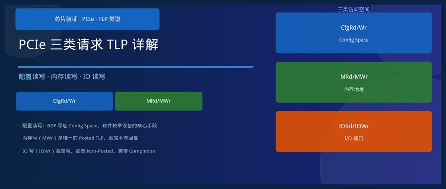
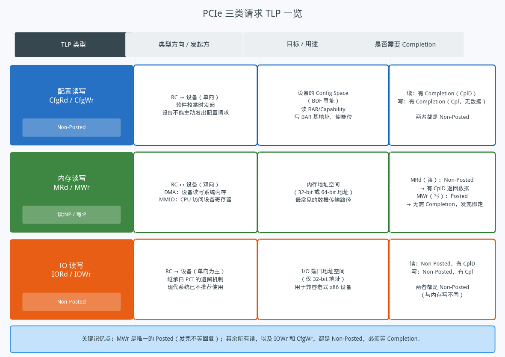
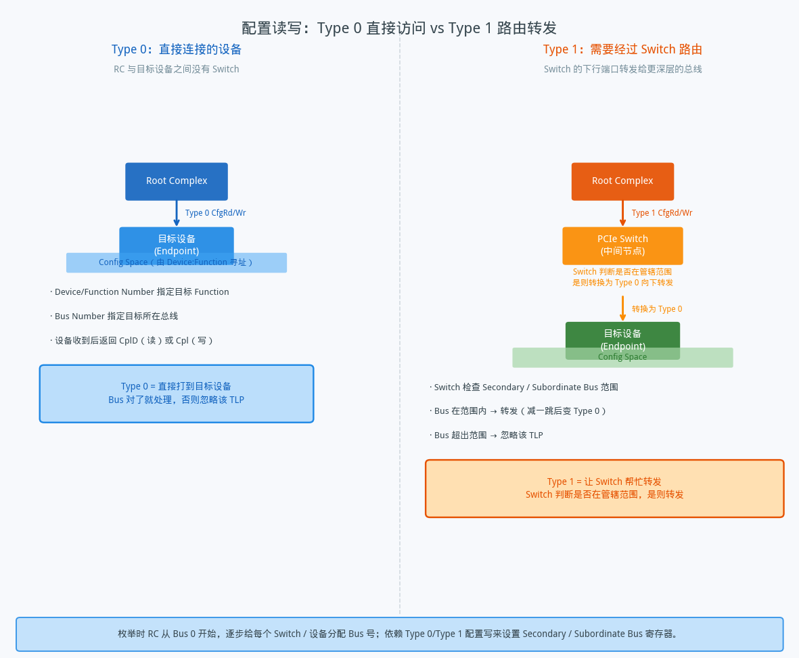
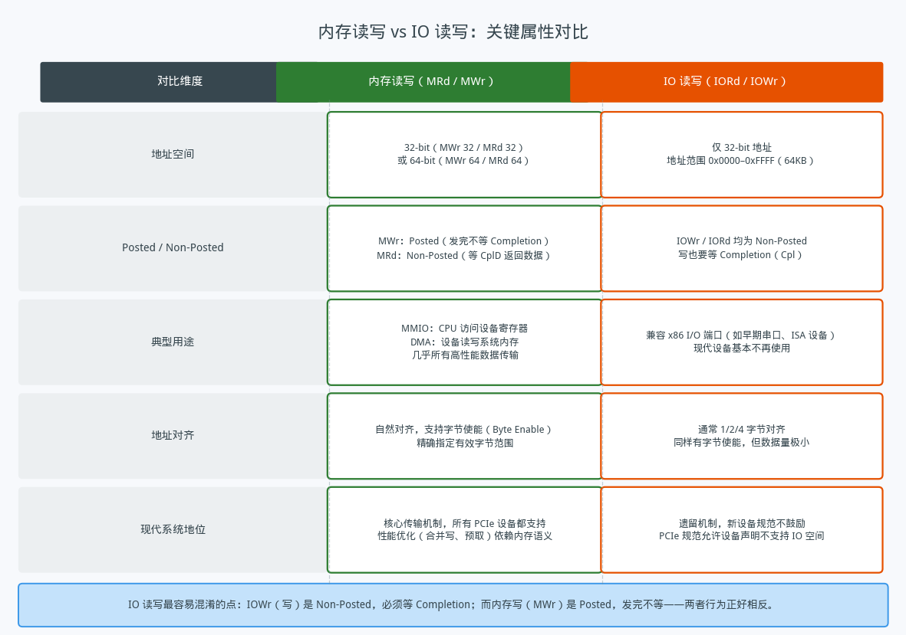

## PCIe 四类请求 TLP：CfgRd/Wr、MRd/MWr、IORd/IOWr、Msg

---

### 导读

PCIe 设备上线之后，软件和硬件之间的所有通信都依赖 TLP（Transaction Layer Packet）。TLP 有很多种，但从"读写什么"的角度来看，最核心的是四类：CfgRd/CfgWr（配置读写）、MRd/MWr（内存读写）、IORd/IOWr（IO 读写）、Msg/MsgD（消息）。搞清楚这四类的区别，就抓住了 PCIe 访问模型的主干。

---

### 一、四类 TLP 一览

四类请求 TLP 的关键区别可以从两个维度来记忆：**访问的是哪个地址空间**，以及**是否需要等待 Completion 回复**。

**CfgRd / CfgWr** 访问的是设备的 Config Space，由软件（操作系统或固件）在枚举阶段发起，目标用 BDF 三元组精确定位。CfgRd/CfgWr 全部是 Non-Posted——无论读还是写，都必须等 Completion 回来。写的 Completion 不带数据，只是确认"收到了"；读的 Completion 带回请求的寄存器值。

**MRd / MWr** 访问内存地址空间，是 PCIe 上最常见、最高性能的传输路径。MMIO（CPU 访问设备寄存器）和 DMA（设备读写系统内存）都走这条路。这里有个重要的不对称：**内存写（MWr）是 Posted**——发完不等回复，可以持续发；而内存读（MRd）是 Non-Posted，必须等 CplD 把数据带回来。

**IORd / IOWr** 是从 PCI 时代继承来的遗留机制，访问 x86 的 I/O 端口地址空间（最多 64KB）。现代 PCIe 设备几乎不再使用这种方式。它的特殊之处在于：**IOWr 也是 Non-Posted**，和 MWr 正好相反——即便是写操作，也要等 Completion 确认。

最容易记混的点在这里：**MWr 和 Msg/MsgD 是仅有的两类 Posted TLP**，其余所有写（IOWr、CfgWr）以及所有读，都是 Non-Posted。

---

### 二、CfgRd/CfgWr：Type 0 与 Type 1 的区别

CfgRd/CfgWr 内部还有两个变体，区别在于目标设备是否直接连在当前总线上。

**Type 0** 用于访问直接挂在目标 Bus 上的设备。TLP 到达目标总线后，总线上所有设备都会检查自己的 Device Number 是否匹配——匹配的那个接受请求，其他的忽略。这是"我知道你就在这条线上，直接喊你"。

**Type 1** 用于访问需要经过 Switch 才能到达的设备。RC 把 TLP 发给 Switch，Switch 检查 TLP 中的 Bus Number 是否落在自己管辖的 Secondary Bus 到 Subordinate Bus 范围内——如果是，就把 TLP 的类型从 Type 1 改为 Type 0，往下层转发；如果不是，就忽略这个 TLP。这是"我不确定你在哪，让 Switch 帮我问下去"。

这个机制是 PCIe 枚举的核心。枚举时，RC 从 Bus 0 开始，一边用配置写给每个 Switch 分配 Bus 范围（Secondary Bus / Subordinate Bus），一边用配置读探测每条总线上有什么设备。Type 0 和 Type 1 的交替使用，让 RC 得以在不提前知道拓扑的情况下，把整棵设备树完整地探索出来。

---

### 三、Msg / MsgD：消息 TLP

Msg/MsgD 是四类 TLP 里最"杂"的一类——它不对应任何固定的地址空间，而是用来在 RC 和设备之间传递各种控制和通知信号。

**Msg/MsgD 全部是 Posted**，不需要 Completion。这合乎逻辑：大多数消息是单向通知，发出去就完事了。Msg 不携带数据负载，MsgD 携带数据负载，用于需要附加信息的消息类型。

Msg 的路由方式比其他三类灵活得多。普通 TLP 靠地址或 BDF 找目标，Msg 则有多种路由模式：路由到 Root Complex（最常见）、按地址路由、按 Routing ID 路由、广播到所有设备，或只沿链路单向传递。具体路由方式写在 TLP 头部的路由字段里。

消息的用途覆盖了几个关键场景：

**中断通知**：在没有独立中断线的 PCIe 链路上，设备通过发送特定消息来模拟 INTx 中断的断言和取消（Assert_INTx / Deassert_INTx）。现代设备更多用 MSI/MSI-X，但 INTx 消息仍然是兼容路径。

**电源管理**：设备通过发送 PME（Power Management Event）消息通知 RC 自己需要唤醒；整个 PCIe 电源状态机的切换协议有相当一部分依赖 Msg TLP 完成。

**错误上报**：当设备检测到可校正或不可校正错误，通过 ERR_COR / ERR_NONFATAL / ERR_FATAL 消息上报给 RC，配合 AER Capability 实现精细的错误处理。

**其他**：热插拔事件通知、Attention Button 按下、厂商自定义消息（Vendor_Defined）等。

Msg 机制让 PCIe 不需要额外的边带信号线就能处理各种控制事件，**所有"通知"都走同一条串行链路，用 TLP 承载**——这是 PCIe 相比旧总线协议的一个重要设计改进。

### 四、MRd/MWr vs IORd/IOWr

MRd/MWr 和 IORd/IOWr 访问的是两个完全独立的地址空间，设计目的和使用场景也截然不同。

**MRd/MWr** 是现代 PCIe 的主干。地址空间可以是 32-bit 也可以是 64-bit，覆盖从几 GB 到几十 TB 的范围。MWr 的 Posted 特性让它可以持续发送而不等 Completion，配合流控信用机制，可以实现高吞吐的数据流。MMIO 寄存器访问、DMA 数据搬运、Peer-to-Peer 传输，全都走 MRd/MWr。

**IORd/IOWr** 的历史根源是 x86 处理器的 `in`/`out` 指令，对应的是端口寻址空间（最大 64KB，地址 0x0000 到 0xFFFF）。早期的 ISA 设备、串口、并口这些老外设都用端口访问。PCIe 保留了 IORd/IOWr 的支持是为了兼容这些设备，但现代系统中**建议设备通过 MMIO 暴露所有寄存器，不再依赖 IO 端口**。PCIe 规范甚至允许设备在 Config Space 中声明自己不支持 IO 空间访问。

IOWr 是 Non-Posted 这一点值得单独强调。历史上，x86 的 `out` 指令有强排序语义——写完之后调用者确信写已经到达设备，才会继续执行。Non-Posted 的等待正是为了提供这个保证。内存写则不同，MWr 是 Posted，写出去之后 CPU 不等确认，性能优先。这两种不同的语义选择，反映了两种截然不同的使用场景对一致性的不同要求。

---

### 五、总结

四类 TLP 的核心区别，用一组对比来收尾：

CfgRd/CfgWr 以 BDF 寻址 Config Space，由软件在枚举时使用，读写都是 Non-Posted。**Type 0 直接送达，Type 1 经 Switch 路由**——这两个变体是枚举机制的基础。

MRd/MWr 访问内存地址空间，是高性能数据传输的主路径。**MWr 是 Posted（唯一的 Posted 写），MRd 是 Non-Posted**——这个不对称是初学者最需要记牢的点。

IORd/IOWr 是兼容遗留设备的历史机制，**读写都是 Non-Posted**，地址空间只有 64KB，现代设备不再推荐使用。

Msg/MsgD 是无地址目标的通知通道，**全部 Posted**，承载中断、电源、错误等控制事件，路由方式灵活，让 PCIe 不需要额外边带信号就能处理所有控制流。

---

*本文基于 PCIe Base Specification 4.0 TLP 类型相关章节整理，适合对 PCIe 基础有了解、想理解不同访问类型区别的读者。*
