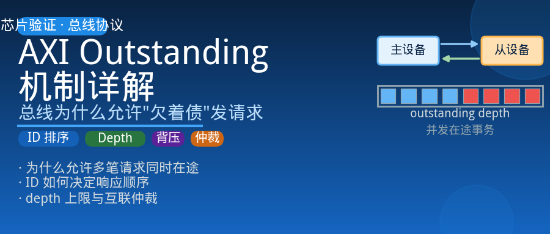
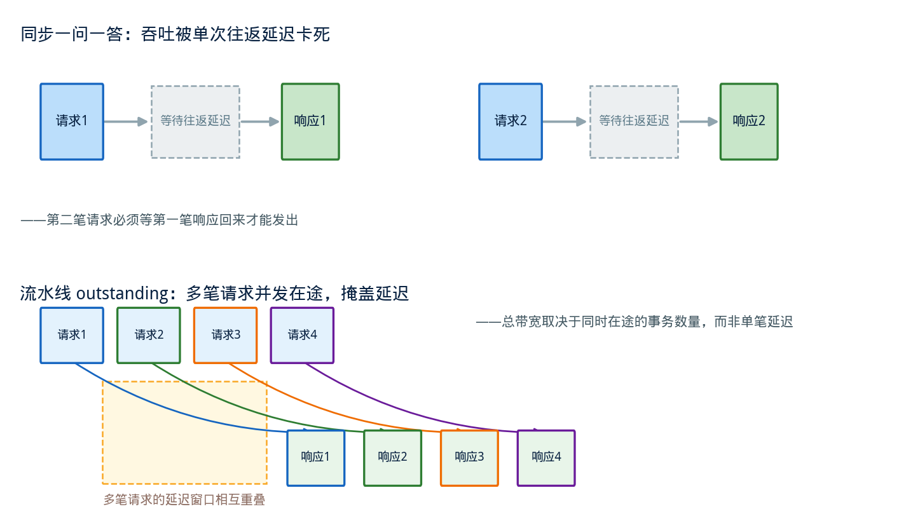
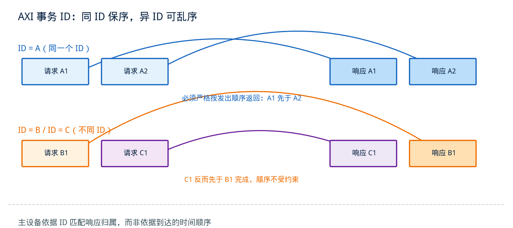
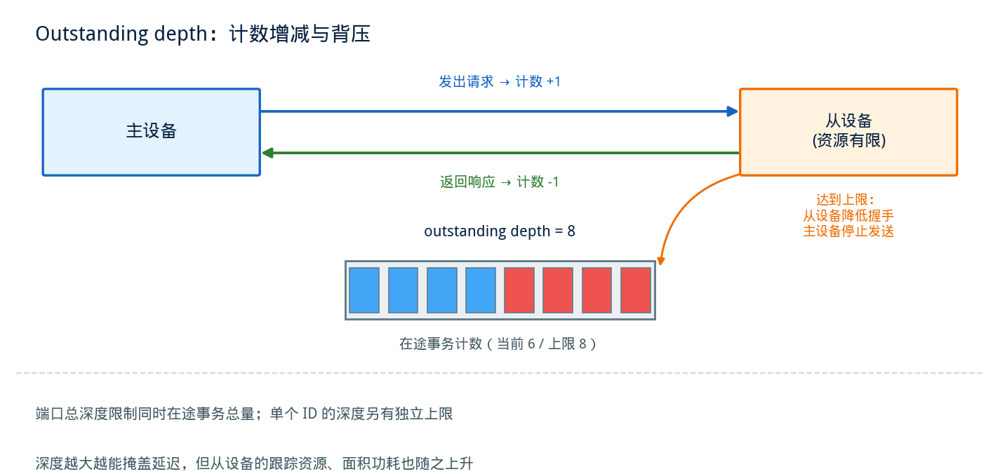
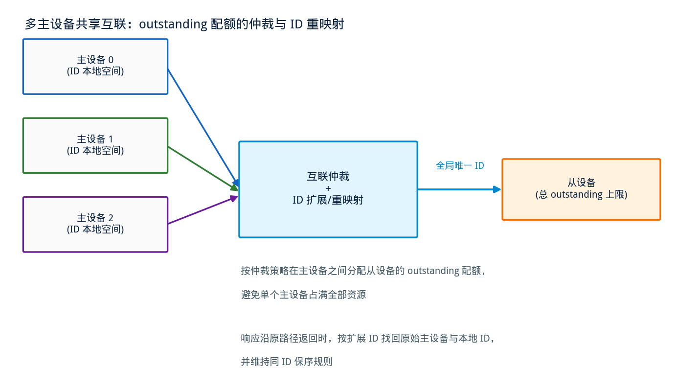

## AXI Outstanding 机制详解——总线为什么允许"欠着债"发请求

---

### 导读

最近在看一个总线互联模块的行为时，发现同一个主设备可以同时挂着好几笔还没收到回应的读写请求，响应回来的顺序还跟发出去的顺序不完全一致。一开始觉得奇怪：总线不应该是一问一答吗？后来把 AXI 规范里 outstanding 相关的章节完整看了一遍，才发现这是 AXI 高性能的核心机制之一。这篇文章把 outstanding 这件事从头到尾捋一遍。

---

### 一、为什么需要 outstanding：从"一问一答"到"流水线"

最朴素的总线协议是同步的一问一答：主设备发一个请求，等从设备处理完、拿到响应，才能发下一个请求。这种模型简单，但性能上有个致命问题——总线的有效吞吐完全被单次事务的往返延迟（round-trip latency）卡死。如果一次内存访问要经过多级互联、跨时钟域、甚至跨片访问，往返延迟可能是几十上百个周期，而每个周期总线上真正传输数据的时间可能只占很小一部分，其余时间都在"等回信"。

AXI 的解法是允许主设备在还没收到前一笔请求响应的情况下，继续发送新的请求。这就是 **outstanding**——字面意思是"未结清、悬而未决"，用在总线上，指的是已经发出去但还没收到响应的事务数量。主设备不必等一笔"账"结清，就可以继续开新的"账"，只要总线和从设备能够记账、认账。

这个设计把总线的吞吐从"单次延迟决定吞吐"变成了"并发事务数量决定吞吐"。只要能同时维持足够多笔在途事务，总带宽就能趋近于总线的物理位宽和频率上限，而不再受制于单笔事务的延迟。这也是为什么 AXI 会被设计成分离的地址、数据、响应通道，而不是像早期总线那样把地址和数据绑在一次握手里——通道分离之后，一个主设备可以在等待第一笔请求响应的同时，把地址通道用来发出第二笔、第三笔请求。

---

### 二、ID 是记账的凭证：谁的请求，谁认领响应

允许多笔请求同时在途，随之而来的问题是：响应回来的时候，怎么知道这个响应对应的是哪一笔请求？如果响应的顺序和请求发出的顺序不一致，仅凭"先进先出"是配不上号的。

AXI 用**事务 ID** 解决这个问题。每笔读写请求在地址通道上都带一个 ID 字段（写地址通道的 AWID，读地址通道的 ARID），从设备处理完之后，在响应里把同样的 ID 带回来（写响应通道的 BID，读数据通道的 RID）。主设备收到响应后，用 ID 去匹配自己发出去的哪一笔请求，而不依赖时间顺序。

ID 机制还带一条关键的排序规则：**同一个 ID 的多笔请求，响应必须按照请求发出的顺序返回；不同 ID 之间的请求，响应顺序没有约束，可以乱序完成**。这条规则的用意很实际——如果同一个主设备用同一个 ID 连续发出两笔写请求，软件通常期望它们是按程序顺序生效的（比如先写配置、再写使能位），所以同 ID 内部必须保序；但如果这两笔请求本来就用了不同 ID，说明发起者自己已经声明"这两笔之间没有顺序依赖"，总线和从设备就可以按照各自的处理速度自由调度，谁先完成就先返回谁的响应，从而获得更大的调度自由度和更高的吞吐。

这也是为什么在设计层面，"要不要给两笔访问用同一个 ID"本身就是一个需要认真对待的决策：用同一个 ID 是在向总线声明顺序依赖，用不同 ID 是在声明可以乱序，选错了会直接影响功能正确性或者性能。

---

### 三、outstanding depth：主设备和从设备各自能欠多少账

既然允许"欠账"，就必须有个上限，否则从设备的处理资源会被无限占用。这个上限就是 **outstanding depth**——某个 ID（或者整个端口）在任意时刻允许存在的、已发出但未响应的事务数量上限。

这个上限的来源主要在从设备一侧：从设备内部用来跟踪在途事务的资源（比如为每笔未完成事务保留的缓冲、状态记录）总是有限的。当在途事务数量达到这个上限，从设备就必须通过降低握手信号的方式让主设备停下来，等某些在途事务完成、腾出资源后再继续接收新请求。这和 PCIe 用信用限制发送方是同一个思路——提前声明容量、达到容量后背压，只不过 AXI 的背压是通过握手信号的组合逻辑实时完成的，不需要像 PCIe 那样用专门的控制报文来回通告。

outstanding depth 不是越大越好。深度越大，理论上能掩盖的延迟越多、吞吐上限越高，但代价是从设备需要为每一笔在途事务保留跟踪资源，深度越大，需要的缓冲和状态记录也越多，面积和功耗随之上升。系统设计时，outstanding depth 通常是根据目标带宽、典型访问延迟反推出来的一个折中值——只要深度足够掩盖住常见的访问延迟，再往上增加对性能的边际收益就很小了。

同一个 ID 的 outstanding 计数和整个端口的 outstanding 计数是两件事：端口总深度限制的是同时在途的事务总量，而单个 ID 的深度限制的是这一条"顺序链"上能同时挂多少笔请求。一个端口可能允许总共挂 16 笔在途事务，但同一个 ID 下同时只允许挂 2 笔——这种双重限制在支持多个独立数据流的设备里很常见。

---

### 四、写事务的 outstanding：地址、数据、响应的三方对账

写事务比读事务多一层复杂度，因为写操作涉及三个独立的通道：写地址通道、写数据通道、写响应通道，三者可以各自独立地流水推进。一个主设备可以先把好几笔写请求的地址都发出去，再补发对应的数据；从设备也可以先收完地址和数据、内部处理完，再统一返回响应。

这种解耦带来一个容易被忽略的正确性要求：**虽然地址和数据可以不同步推进，但同一个主设备发出的写数据，必须按照写地址发出的顺序、逐笔对应到写数据通道上**，不能跳着来。从设备没有办法凭空知道某一笔数据属于哪一笔地址（写数据通道本身不带 ID），只能依赖"先来的地址配先来的数据"这条隐含约定。如果主设备内部的调度逻辑打乱了这个顺序，从设备会把数据和地址错配，写错地方而不自知——这是验证写通路时最容易忽略、后果又最隐蔽的一类问题。

写响应（BRESP）则携带 BID，用来匹配是哪一笔写地址触发的这次响应，遵循前面提到的同 ID 保序、异 ID 可乱序的规则。一笔写事务只有在收到对应的写响应之后，才能认为真正完成、可以从 outstanding 计数里退出。

---

### 五、互联中的 outstanding：多主设备共享同一份从设备资源

实际系统里很少是一个主设备直接对一个从设备，更常见的是多个主设备通过互联（interconnect）共享访问同一组从设备。这时候 outstanding depth 的账要在两个层面同时算清楚。

第一层是从设备自身的总深度——不管请求来自哪个主设备，从设备能同时处理的在途事务总数是固定的，互联需要在这个总额度内，把配额在各个主设备之间做仲裁分配。第二层是每个主设备自己声明的 outstanding 能力——一个简单的外设可能一次只发一笔请求就停下等响应，而一个高带宽的数据搬运引擎可能同时打出十几笔请求。互联在转发请求的时候，既要遵守从设备的总容量上限，又要避免某一个"贪婪"的主设备把所有配额占满，导致其他主设备长时间拿不到服务。

由于不同主设备发出的请求会用到不同的 ID 编码空间，互联通常需要对 ID 做扩展或者重映射——把每个主设备的本地 ID 附加上主设备的身份信息，扩展成一个在互联内部全局唯一的 ID，这样从设备返回响应的时候，互联才能根据这个扩展后的 ID 准确地把响应路由回发起请求的那个主设备，同时不破坏"同 ID 保序"的规则。这个扩展和重映射的正确性，是多主设备系统里 outstanding 机制能够正常工作的前提。

---

### 六、验证中的几个关注维度

outstanding 机制横跨主设备、互联、从设备三方，验证时经常需要专门构造边界场景，靠日常功能测试很难自然覆盖到。以下几个维度值得重点关注：

**outstanding depth 边界**：构造让在途事务数量恰好达到、以及超过声明深度的场景，确认从设备正确地通过握手信号背压，主设备正确地停止发送新请求，而不是把请求丢弃或者踩踏还在处理中的事务。

**同 ID 保序、异 ID 乱序**：用同一个 ID 连续发出多笔请求，确认响应严格按发出顺序返回；用不同 ID 发出多笔请求，构造从设备故意乱序完成的场景，确认主设备侧的匹配逻辑不会因为响应顺序和发出顺序不一致而张冠李戴。

**写地址与写数据的顺序绑定**：在写数据通道故意让数据晚于地址很久才发出，或者让多笔写请求的数据以不同的相对速度推进，确认地址和数据始终按发出顺序一一对应，不会出现数据错配到错误地址的情况。

**ID 达到上限后被复用**：一个 ID 的前一笔事务尚未收到响应时，同一个 ID 是否被过早地用于发起新的请求——如果协议或者设计要求同一个 ID 在收到响应前不能重新分配，需要专门构造这种边界场景验证违规检测是否生效。

**互联中的仲裁公平性与 ID 重映射正确性**：多个主设备同时打满各自的 outstanding 配额时，观察互联的仲裁是否让某个主设备长期得不到服务；同时验证扩展后的全局 ID 在响应路径上能否被正确地映射回原始主设备和原始本地 ID。

---

### 七、总结

outstanding 机制的核心思想是把"总线吞吐受限于单次事务延迟"这个问题，转化成"总线吞吐取决于能同时维持多少笔在途事务"。AXI 用地址、数据、响应通道的分离让请求可以流水式地连续发出，用事务 ID 解决了乱序环境下响应如何认领的问题，再用 outstanding depth 给这套自由度划定一个由资源承受能力决定的上限。写事务因为多了一条独立的数据通道，还额外引入了地址与数据顺序绑定的隐含约定。到了多主设备共享互联的场景，这套机制还要叠加仲裁和 ID 重映射，才能在保证正确性的前提下把总线的并发能力真正兑现成带宽。

下次看到总线上同一个主设备名下挂着好几笔悬而未决的请求，不用觉得奇怪——这正是 AXI 用来换取带宽的设计选择。

---

*本文基于 AMBA AXI Protocol Specification 中事务标识（Transaction ID）与多重未完成事务（Multiple Outstanding Transactions）相关章节整理，结合总线互联验证实践分析。*
